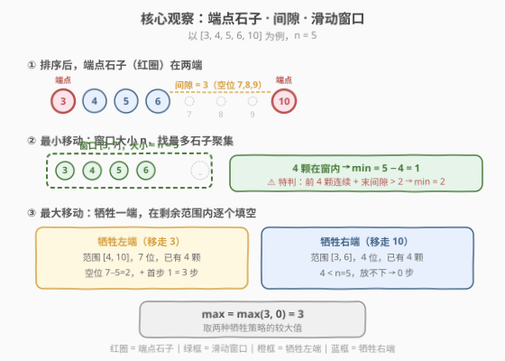
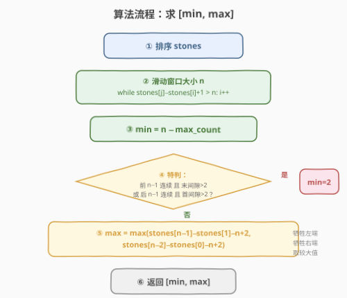
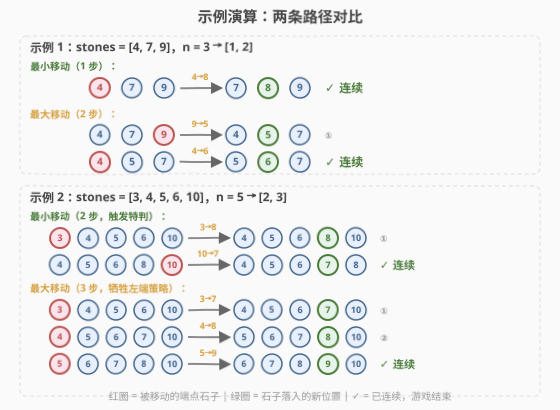

# LeetCode 移动石子直到连续 II 题解

## 1. 题目概述

- **标题 / 题号**：移动石子直到连续 II（#1040，medium）
- **链接**：https://leetcode.cn/problems/moving-stones-until-consecutive-ii/
- **难度**：中等
- **标签**：数组、排序、滑动窗口、贪心、数学

**题意**：在 X 轴上有一些不同位置的石子，给定整数数组 `stones` 表示石子位置。**端点石子**是位于最小或最大位置的石子。每个回合，你可以将一颗**端点石子**拿起并移动到一个**未占用的位置**，使得该石子**不再是一颗端点石子**。

> ⚠️ **关键约束**：移动后石子必须**不是端点**——即新位置必须严格在新最小值与新最大值之间。若 `stones = [1,2,5]`，你**无法**移动位置 5 的石子，因为无论移到 0 还是 3，它都仍然是端点。

当石子位置**连续**时游戏结束。返回 `[最小移动次数, 最大移动次数]`。

**示例 1**：

```text
输入：stones = [7,4,9]
输出：[1,2]
解释：
移动一次 4→8，得到 [7,8,9]，游戏结束。
或移动两次 9→5, 4→6，得到 [5,6,7]，游戏结束。
```

**示例 2**：

```text
输入：stones = [6,5,4,3,10]
输出：[2,3]
解释：
移动 3→8, 10→7，得到 [4,5,6,7,8]，游戏结束。
或移动 3→7, 4→8, 5→9，得到 [6,7,8,9,10]，游戏结束。
```

**约束**：

- $3 \leq \text{stones.length} \leq 10^4$
- $1 \leq \text{stones}[i] \leq 10^9$
- `stones` 的值各不相同

> 💡 **与 1033 题的区别**：1033 题恰好 3 颗石子，且端点石子可移到**任意**空位（含变为新端点）；本题 $n$ 颗石子，且移动后**不能**是端点，这一约束使最小/最大移动次数的分析更加精妙。

## 2. 解题思路

### 2.1 暴力思路

BFS 搜索所有状态：从初始排列出发，枚举每回合可移动的端点石子及其合法落点，直到石子连续。状态空间为 $\binom{10^9}{n}$ 级别，完全不可行。

> 💡 暴力法忽略了一个核心结构：**排序后，游戏的进程完全由两端的间隙驱动**。我们不关心每一步的具体移动，只需分析间隙的消长即可推出 min 和 max。

### 2.2 核心观察：端点、间隙与滑动窗口



排序后，设石子为 $a_0 < a_1 < \cdots < a_{n-1}$。每回合只能移动 $a_0$ 或 $a_{n-1}$（端点），将其放入内部空位。这引出两条独立的分析线：

**最小移动**：最终 $n$ 颗石子连续，占据某区间 $[x, x+n-1]$。我们要找**已有最多石子的长度为 $n$ 的窗口**，剩余 $n - \text{count}$ 颗需移入。用**滑动窗口**在排序数组上扫描即可。

**最大移动**：每次移动端点会"吃掉"一端的间隙，并在内部填一个空位。为最大化步数，应**牺牲一端**（选间隙较大的一端先移），在剩余范围内逐个填空。

> 💡 **为何排序是第一步？** 排序后端点就是首尾元素，间隙就是相邻元素之差，滑动窗口也依赖有序性。所有分析都建立在排序之上。

### 2.3 算法流程图



**最小移动**：

1. **滑动窗口**：双指针 $i, j$ 扫描排序后的 stones，维护窗口 $[\text{stones}[i], \text{stones}[j]]$ 大小 $\leq n$。窗口内石子数 $\text{count} = j - i + 1$，$\text{min\_moves} = \min(n - \text{count})$。
2. **特判**：当窗口内有 $n-1$ 颗石子（即 $\text{min\_moves} = 1$），但这 $n-1$ 颗在数组一端**连续**且与端点石子的**间隙 $> 2$** 时，端点石子无法一步填入窗口缺口（填入后仍为端点），需要 **2 步**。

**最大移动**：

$$\text{max\_moves} = \max\big(\text{stones}[n\text{-}1] - \text{stones}[1] - n + 2,\;\; \text{stones}[n\text{-}2] - \text{stones}[0] - n + 2\big)$$

即「牺牲左端后在 $[\text{stones}[1], \text{stones}[n\text{-}1]]$ 中的空位数 $+ 1$ 首步」与「牺牲右端后在 $[\text{stones}[0], \text{stones}[n\text{-}2]]$ 中的空位数 $+ 1$ 首步」取较大值。

> ⚠️ **特判条件详解**：设前 $n-1$ 颗连续（$\text{stones}[n\text{-}2] - \text{stones}[0] == n\text{-}2$）且末间隙 $> 2$（$\text{stones}[n\text{-}1] - \text{stones}[n\text{-}2] > 2$），或者后 $n-1$ 颗连续且首间隙 $> 2$。此时窗口含 $n-1$ 颗但缺的恰好是端点旁的位置——移端点过去后新位置仍为端点，违规。间隙 $\leq 2$ 时则存在另一个窗口使得缺口在内部，1 步即可。

### 2.4 示例演算



**示例 1** $[4,7,9]$，$n=3$：

| 路径 | 步骤 | 状态变化 | 说明 |
|------|------|---------|------|
| Min (1) | 4→8 | $[4,7,9] \to [7,8,9]$ | 4 是端点，移到 8（在 7 和 9 之间，非端点）|
| Max (2) | 9→5 | $[4,7,9] \to [4,5,7]$ | 9 是端点，移到 5（在 4 和 7 之间）|
|        | 4→6 | $[4,5,7] \to [5,6,7]$ | 4 是端点，移到 6（在 5 和 7 之间）|

- Min：滑动窗口 $[7,9]$ 含 2 颗，$\text{min} = 3-2 = 1$。特判不触发（前 2 颗 $[4,7]$ 不连续）。
- Max：$\max(9-7-3+2,\; 7-4-3+2) = \max(1, 2) = 2$。

**示例 2** $[3,4,5,6,10]$，$n=5$：

| 路径 | 步骤 | 状态变化 | 说明 |
|------|------|---------|------|
| Min (2) | 3→8 | $[3,4,5,6,10] \to [4,5,6,8,10]$ | 3 是端点，移到 8 |
|        | 10→7 | $[4,5,6,8,10] \to [4,5,6,7,8]$ | 10 是端点，移到 7 |
| Max (3) | 3→7 | $[3,4,5,6,10] \to [4,5,6,7,10]$ | 牺牲左端 3 |
|        | 4→8 | $[4,5,6,7,10] \to [5,6,7,8,10]$ | 新端点 4，移到 8 |
|        | 5→9 | $[5,6,7,8,10] \to [6,7,8,9,10]$ | 新端点 5，移到 9 |

- Min：窗口 $[3,7]$ 含 4 颗，$\text{min} = 5-4 = 1$。**特判触发**：前 4 颗 $[3,4,5,6]$ 连续（$6-3=3=n\text{-}2$），末间隙 $10-6=4 > 2$ → $\text{min} = 2$。
- Max：$\max(10-4-5+2,\; 6-3-5+2) = \max(3, 0) = 3$。牺牲右端时范围 $[3,6]$ 仅 4 位 $< n=5$，无法放入 → 0。

> 💡 **Min 为何需要 2 步？** 窗口 $[3,7]$ 缺位置 7，但 10 是端点——移到 7 后新最大值为 6，而 $7 > 6$ 仍为端点，违规。必须先移 3 腾出内部空位（3→8），再移 10 填入（10→7），共 2 步。

## 3. 参考代码

### C++

```cpp
class Solution {
public:
    vector<int> numMovesStonesII(vector<int>& stones) {
        sort(stones.begin(), stones.end());
        int n = stones.size();

        // 最小移动：滑动窗口找最大聚集
        int min_moves = n;
        int i = 0;
        for (int j = 0; j < n; j++) {
            while (stones[j] - stones[i] + 1 > n) {
                i++;
            }
            min_moves = min(min_moves, n - (j - i + 1));
        }

        // 特判：n-1 颗连续 + 间隙 > 2 → 端点无法一步填入
        if ((stones[n - 2] - stones[0] == n - 2 && stones[n - 1] - stones[n - 2] > 2) ||
            (stones[n - 1] - stones[1] == n - 2 && stones[1] - stones[0] > 2)) {
            min_moves = max(min_moves, 2);
        }

        // 最大移动：牺牲一端，取两种策略较大值
        int max_moves = max(stones[n - 1] - stones[1] - n + 2,
                            stones[n - 2] - stones[0] - n + 2);

        return {min_moves, max_moves};
    }
};
```

### Python

```python
from typing import List

class Solution:
    def numMovesStonesII(self, stones: List[int]) -> List[int]:
        stones.sort()
        n = len(stones)

        # 最小移动：滑动窗口找最大聚集
        min_moves = n
        i = 0
        for j in range(n):
            while stones[j] - stones[i] + 1 > n:
                i += 1
            min_moves = min(min_moves, n - (j - i + 1))

        # 特判：n-1 颗连续 + 间隙 > 2 → 端点无法一步填入
        if (stones[n - 2] - stones[0] == n - 2 and stones[n - 1] - stones[n - 2] > 2) or \
           (stones[n - 1] - stones[1] == n - 2 and stones[1] - stones[0] > 2):
            min_moves = max(min_moves, 2)

        # 最大移动：牺牲一端，取两种策略较大值
        max_moves = max(stones[n - 1] - stones[1] - n + 2,
                        stones[n - 2] - stones[0] - n + 2)

        return [min_moves, max_moves]
```

> 💡 **为何 `min_moves = max(min_moves, 2)` 而非直接 `= 2`？** 特判条件蕴含窗口含 $n-1$ 颗（即 $\text{min\_moves} \leq 1$），故 `max` 与直接赋值等价，但 `max` 更防御性——即使推理有误也不会把已 $\geq 2$ 的值错误缩小。

## 4. 复杂度分析

| 维度 | 复杂度 | 说明 |
|------|--------|------|
| 时间复杂度 | $O(n \log n)$ | 排序 $O(n \log n)$；滑动窗口双指针各至多移动 $n$ 次，$O(n)$；特判与 max 公式 $O(1)$ |
| 空间复杂度 | $O(\log n)$ | 排序的栈空间（C++ `sort` 为内省排序）；无额外数据结构 |

> 💡 **瓶颈在排序**：$n \leq 10^4$ 时 $n \log n \approx 10^4 \times 14 \approx 14$ 万次比较，轻松通过。滑动窗口部分为线性，不是瓶颈。

## 5. 扩展：最大移动公式的推导

为何 $\text{max\_moves} = \max(\text{stones}[n\text{-}1] - \text{stones}[1] - n + 2,\; \text{stones}[n\text{-}2] - \text{stones}[0] - n + 2)$？

**空位追踪**：设当前范围为 $[a_0, a_{n-1}]$，空位数 $E = (a_{n-1} - a_0 + 1) - n$。每次移动左端点 $a_0$，新范围变为 $[a_1, a_{n-1}]$，空位减少 $a_1 - a_0$（端点间隙被吃掉，移走的石子填入内部一个空位）。

**最大化策略**：为了让每步少减空位，首步应选间隙较小的一端移走，并在内部紧贴另一端放置（制造连续对）。此后每步都能减少恰好 1 个空位。

- **牺牲左端**：首步吃掉左间隙 $a_1 - a_0$，此后每步减 1。总步数 $= 1 + (E - (a_1 - a_0)) = 1 + (a_{n-1} - a_1 + 1 - n) = a_{n-1} - a_1 - n + 2$。
- **牺牲右端**：同理 $= a_{n-2} - a_0 - n + 2$。

取较大值即得公式。

> ⚠️ **当 $a_{n-2} - a_0 - n + 2 < 0$ 时取 0**：这意味着前 $n-1$ 颗已连续（范围 $n-1$ 位 $< n$），牺牲右端无法放入第 $n$ 颗。但实际公式恒 $\geq 0$（连续时 $= 0$，不连续时 $> 0$），无需额外 `max(0, ...)`。

## 6. 面试要点

1. **为什么最小移动用滑动窗口？**

   - 最终 $n$ 颗石子连续，占据某 $[x, x+n-1]$。在排序数组上用大小为 $n$ 的窗口扫描，窗口内已有石子最多的那个窗口，需移入的石子最少。$\text{min} = n - \max\_count$。

2. **特判何时触发？为什么间隙 $> 2$ 而非 $> 1$？**

   - 当 $n-1$ 颗在数组一端连续，且与端点石子的间隙 $> 2$ 时触发。间隙 $= 2$ 时存在另一个窗口使缺口在内部（如 $[1,2,3,5]$ 中窗口 $[2,5]$ 含 3 颗，移 1→4 合法）；间隙 $> 2$ 时端点移到缺口处仍为新端点，违规，需 2 步。

3. **最大移动公式的直觉是什么？**

   - 牺牲间隙较大的一端：首步移走该端点（吃掉间隙），放入内部；此后每步移新端点到内部空位，减 1 空位。总步数 $= 1 + \text{剩余空位数}$。两种牺牲策略取较大值。

4. **滑动窗口的 while 条件为何是 `stones[j] - stones[i] + 1 > n`？**

   - 窗口 $[\text{stones}[i], \text{stones}[j]]$ 的大小为 $\text{stones}[j] - \text{stones}[i] + 1$（含两端）。超过 $n$ 时右移 $i$ 收缩窗口，保证窗口最多覆盖 $n$ 个连续位置。

5. **如果题目改为「移动后可以是端点」呢？**

   - 退化为 1033 题的规则：端点可移到任意空位。此时 min 不需要特判（总能 1 步填入），max 变为总空位数 $E = \text{stones}[n\text{-}1] - \text{stones}[0] + 1 - n$（首步不浪费）。本题的难度正在于「非端点」约束。

## 同类练习题

| # | 题目 | 与本题的关联 |
|---|------|-------------|
| 1033 | [移动石子直到连续](https://leetcode.cn/problems/moving-stones-until-consecutive/)（[题解](../1001-1100/1033_移动石子直到连续.md)） | 本题的前身，3 颗石子 + 端点可移到任意空位，用间隙大小直接判定 min/max，是理解本题约束差异的基础 |
| 209 | [长度最小的子数组](https://leetcode.cn/problems/minimum-size-subarray-sum/)（[题解](../0201-0300/209_长度最小的子数组.md)） | 滑动窗口母题，本题 min 的双指针 `while` 收缩逻辑与其同源 |
| 76 | [最小覆盖子串](https://leetcode.cn/problems/minimum-window-substring/)（[题解](../0001-0100/76_最小覆盖子串.md)） | 滑动窗口 + 不变量维护，与本题「窗口大小固定为 $n$，最大化窗口内石子数」互为正反问题 |
| 475 | [供暖器](https://leetcode.cn/problems/heaters/) | 排序 + 双指针/二分，在数轴上为每个房屋找最近供暖器，与本题「排序后在数轴上分析间隙」思路相通 |
| 462 | [最少移动次数使数组元素相等 II](https://leetcode.cn/problems/minimum-moves-to-equal-array-elements-ii/) | 排序 + 中位数贪心，同为「排序后利用数轴结构求最少移动」的范式 |
