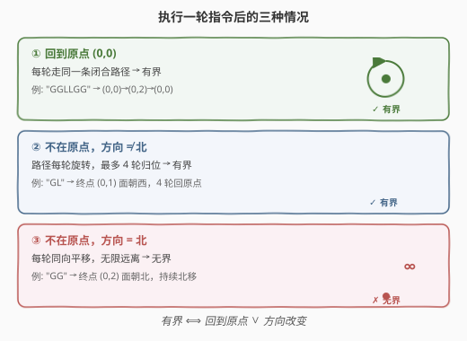
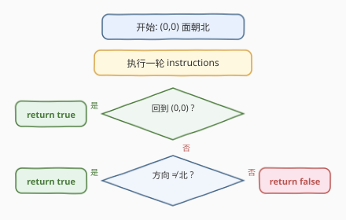
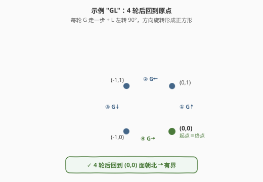

# 困于环中的机器人

- **题目名称**：困于环中的机器人
- **链接**：[1041. 困于环中的机器人](https://leetcode.cn/problems/robot-bounded-in-circle/)
- **难度**：中等
- **标签**：数学、模拟

## 1. 题目概述

在无限的平面上，机器人最初位于 $(0, 0)$ 处，面朝北方。机器人可以接收以下三条指令之一：

- `"G"`：直走 1 个单位
- `"L"`：左转 90 度
- `"R"`：右转 90 度

机器人按顺序执行指令 `instructions`，并**一直重复**它们。只有在平面中存在环使得机器人**永远无法离开**时，返回 `true`。

**示例 1**：

```text
输入：instructions = "GGLLGG"
输出：true
解释：机器人路径 (0,0)→(0,1)→(0,2)→左转→左转→(0,1)→(0,0)，回到原点。
```

**示例 2**：

```text
输入：instructions = "GG"
输出：false
解释：机器人一直朝北走，每轮移动 (0,2)，永不回头。
```

**示例 3**：

```text
输入：instructions = "GL"
输出：true
解释：第 1 轮结束于 (0,1) 面朝西；方向改变，4 轮后回到原点。
```

**约束条件**：

- $1 \leq \text{instructions.length} \leq 100$
- `instructions[i]` 仅包含 `'G'`、`'L'`、`'R'`

---

## 2. 解题思路

### 2.1 暴力思路：模拟多轮

最直觉的做法是模拟很多轮（比如 4 轮），看机器人是否回到原点。但问题在于：需要模拟几轮才够？如果机器人方向不变且持续平移，无论模拟多少轮都不会回到原点——暴力法无法确定终止条件。

### 2.2 核心观察：只需执行一轮指令

关键洞察是：**执行一轮指令后，机器人的状态（位置 + 方向）已经决定了它是否有界**。



三种情况：

1. **回到原点** $(0,0)$：每轮都走同一条闭合路径，显然有界。
2. **不在原点，但方向改变**（不再面朝北）：路径每轮旋转相同角度。由于只有 90° 转弯，方向变化必为 90° 的整数倍。**最多 4 轮**后方向回到北方，此时位移向量也旋转了 360°，总和为零——机器人回到原点。
3. **不在原点，且方向仍为北**：每轮都朝北平移相同向量，机器人**无限远离**原点，无界。

> 💡 **为什么方向改变时最多 4 轮归位？** 一轮指令后的方向变化是 90° 的整数倍（0°、±90°、180°）。若变化不为 0°，则 $\frac{360°}{|\Delta|} \leq 4$ 轮后方向回到北方。每轮的位移向量随方向同步旋转，旋转整数圈后位移之和为零。

### 2.3 算法流程图



### 2.4 示例演算

以 `"GL"` 为例，机器人每轮：先 `G` 走一步，再 `L` 左转 90°。第 1 轮后面朝西（方向改变），4 轮后回到原点：



| 轮次 | 起点 | 起始方向 | `G` 后位置 | `L` 后方向 | 终点 |
|------|------|---------|-----------|-----------|------|
| 1 | $(0,0)$ | 北 | $(0,1)$ | 西 | $(0,1)$，西 |
| 2 | $(0,1)$ | 西 | $(-1,1)$ | 南 | $(-1,1)$，南 |
| 3 | $(-1,1)$ | 南 | $(-1,0)$ | 东 | $(-1,0)$，东 |
| 4 | $(-1,0)$ | 东 | $(0,0)$ | 北 | $(0,0)$，北 |

第 4 轮结束，机器人回到 $(0,0)$ 面朝北 → **有界** ✅

> 💡 对比示例 2 `"GG"`：一轮后位置 $(0,2)$、方向仍为北。方向不变 + 偏离原点 → 每轮平移 $(0,2)$，无限远离 → **无界** ❌

---

## 3. 参考代码

### C++

```cpp
class Solution {
public:
    bool isRobotBounded(string instructions) {
        // 方向向量：北、东、南、西
        int dirs[4][2] = {{0, 1}, {1, 0}, {0, -1}, {-1, 0}};
        int x = 0, y = 0, d = 0;

        for (char c : instructions) {
            if (c == 'G') {
                x += dirs[d][0];
                y += dirs[d][1];
            } else if (c == 'L') {
                d = (d + 3) % 4; // 左转 = 逆时针 90°
            } else {
                d = (d + 1) % 4; // 右转 = 顺时针 90°
            }
        }

        return (x == 0 && y == 0) || d != 0;
    }
};
```

### Python

```python
class Solution:
    def isRobotBounded(self, instructions: str) -> bool:
        # 方向向量：北、东、南、西
        dirs = [(0, 1), (1, 0), (0, -1), (-1, 0)]
        x = y = d = 0

        for c in instructions:
            if c == 'G':
                x += dirs[d][0]
                y += dirs[d][1]
            elif c == 'L':
                d = (d + 3) % 4  # 左转 = 逆时针 90°
            else:  # 'R'
                d = (d + 1) % 4  # 右转 = 顺时针 90°

        return (x == 0 and y == 0) or d != 0
```

> 💡 **方向编码技巧**：用 `d ∈ {0,1,2,3}` 表示北东南西，左转 `(d+3)%4`（等价于 `d-1` 但避免负数），右转 `(d+1)%4`。四个方向构成循环，模 4 运算天然处理环绕。

---

## 4. 复杂度分析

| 维度 | 复杂度 | 说明 |
|------|--------|------|
| 时间复杂度 | $O(n)$ | 遍历一轮指令，$n$ 为 `instructions` 长度 |
| 空间复杂度 | $O(1)$ | 仅维护位置 $(x,y)$ 和方向 $d$ 三个变量 |

---

## 5. 面试要点

1. **为什么只需执行一轮指令就能判定？**
   - 一轮后的状态（位置 + 方向）完全决定了后续轨迹。若回到原点则闭合；若方向改变则路径旋转、有限轮内归位；若方向不变且偏离则无限远离。

2. **方向改变时为什么最多 4 轮归位？**
   - 方向变化是 90° 的整数倍。若变化 $\Delta \neq 0°$，则 $\frac{360°}{|\Delta|}$ 轮后方向回到北方（最多 4 轮）。每轮位移向量同步旋转，整数圈后位移之和为零。

3. **`L` 和 `R` 的方向计算如何实现？**
   - 用 `d ∈ {0,1,2,3}` 编码北东南西。左转 `d = (d+3)%4`，右转 `d = (d+1)%4`。模 4 运算天然处理环绕，无需 if-else。

4. **如果指令中没有 `G`（纯转弯）会怎样？**
   - 机器人始终在原点，`x==0 && y==0` 成立，返回 `true`。这是正确的——原地转圈当然有界。

5. **和 [657. 机器人能否返回原点](https://leetcode.cn/problems/robot-return-to-origin/) 的区别？**
   - 657 只执行一轮指令，判断是否回到原点。1041 是**无限重复**执行，需要利用方向变化的旋转性质来判断是否有界，思路更巧妙。

---

## 6. 同类练习题

- [657. 机器人能否返回原点](https://leetcode.cn/problems/robot-return-to-origin/)：只执行一轮，判断是否回到原点（本题的简化版）
- [874. 模拟行走机器人](https://leetcode.cn/problems/walking-robot-simulation/)：带障碍物的机器人模拟，方向编码相同
- [2069. 模拟行走机器人 II](https://leetcode.cn/problems/walking-robot-simulation-ii/)：带方向和位置的机器人模拟变体
