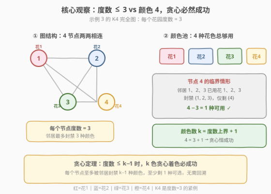
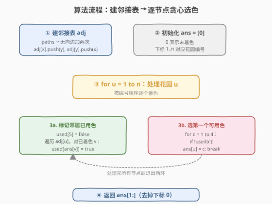
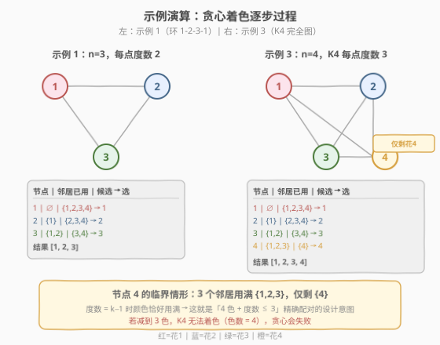

# 不邻接植花

- **题目名称**：不邻接植花
- **链接**：[1042. 不邻接植花](https://leetcode.cn/problems/flower-planting-with-no-adjacent/)
- **难度**：中等
- **标签**：图、贪心、贪心着色

## 1. 题目概述

有 `n` 个花园，按从 `1` 到 `n` 标记。另有数组 `paths`，其中 `paths[i] = [x_i, y_i]` 描述了花园 `x_i` 到花园 `y_i` 的**双向路径**。在每个花园中，你打算种下四种花之一（用 `1`、`2`、`3`、`4` 表示）。

需要为每个花园选择一种花，使得通过路径相连的**任何两个花园中的花的种类互不相同**。以数组形式返回**任一**可行方案 `answer`，其中 `answer[i]` 为第 `(i+1)` 个花园中种植的花的种类。

> ⚠️ **关键约束**：每个花园**最多**有 **3** 条路径可以进入或离开，即图中每个节点**度数 $\leq 3$**。这一约束是贪心可行的核心保证。

**示例 1**：

```text
输入：n = 3, paths = [[1,2],[2,3],[3,1]]
输出：[1,2,3]
解释：花园 1 和 2 花的种类不同，花园 2 和 3 不同，花园 3 和 1 不同。
     其他满足题意的答案有 [1,2,4]、[1,4,2]、[3,2,1]。
```

**示例 2**：

```text
输入：n = 4, paths = [[1,2],[3,4]]
输出：[1,2,1,2]
解释：1-2 相连需不同色，3-4 相连需不同色；{1,2} 与 {3,4} 互不相连，可复用颜色。
```

**示例 3**：

```text
输入：n = 4, paths = [[1,2],[2,3],[3,4],[4,1],[1,3],[2,4]]
输出：[1,2,3,4]
解释：四个花园两两相连（K4 完全图），每个花园度数 = 3，恰好需 4 种颜色。
```

**约束条件**：

- $1 \leq n \leq 10^4$
- $0 \leq \text{paths.length} \leq 2 \times 10^4$
- `paths[i].length == 2`
- $1 \leq x_i, y_i \leq n$，$x_i \neq y_i$
- 每个花园**最多**有 **3** 条路径可以进入或离开

---

## 2. 解题思路

### 2.1 暴力思路

最朴素的想法是回溯：对每个花园依次尝试 4 种花，遇到与已着色邻居冲突就剪枝，全部花园都合法时返回。最坏情况搜索 $4^n$ 种组合，$n = 10^4$ 时完全不可行。

> 💡 暴力法忽略了题目给出的**度数上界**这一结构性约束。度数 $\leq 3$ 意味着每个花园的邻居极少，4 种颜色绰绰有余，根本无需回溯。

### 2.2 核心观察：贪心着色（度数 $<$ 颜色数即可保证）



这是一道**图着色**问题：图为 $G = (V, E)$，$|V| = n$，节点是花园，边是路径，要用 4 种颜色给每个节点着色，使相邻节点颜色不同。

关键定理：**对任意图，用 $k$ 种颜色贪心着色（按任意顺序，每个节点选邻居未用的最小颜色），若每个节点度数 $\leq k - 1$，则必然成功**。

直觉非常简单：

- 处理某个节点 $u$ 时，它的邻居**最多 $k - 1$ 个**（本题 $k = 4$，邻居最多 3 个）。
- 每个邻居最多占用 1 种颜色，故被"封禁"的颜色**最多 $k - 1$ 种**。
- 总共有 $k$ 种颜色，所以**至少剩 1 种**可用。

于是无需回溯、无需搜索——**按 $1$ 到 $n$ 顺序遍历，每个花园从 $\{1,2,3,4\}$ 中挑一个邻居没用的颜色即可**。题目保证度数 $\leq 3$，故此贪心必然产出合法解。

> 💡 **识别信号**：题目出现「相邻不同 / 颜色数恰好 = 最大度数 + 1」的结构，且明确给出度数上界，几乎一定是**贪心着色**而非一般图着色（一般图着色是 NP-hard）。本题的颜色数 4 和度数上界 3 是精心配对的数字。

> ⚠️ **为何不要求邻居已全部着色？** 贪心着色中，处理 $u$ 时只需看**已着色**的邻居——未着色邻居此刻不占颜色，不影响 $u$ 的选择。等轮到它们时，它们会避开 $u$ 的颜色。这正是「按序贪心」可双向兼容的原因。

### 2.3 算法流程图



流程很直接：

1. **建邻接表**：把 `paths` 转成无向邻接表 `adj`，`adj[u]` 存 $u$ 的所有邻居。
2. **初始化答案**：`answer` 数组全 0（表示未着色）。
3. **逐节点贪心**：对 $u = 1 \dots n$：
   - 用一个长度 5 的 `used` 数组（下标 1-4）标记邻居已占的颜色。
   - 遍历 `adj[u]`，对每个已着色邻居 $v$，置 `used[answer[v]] = true`。
   - 从 $1$ 到 $4$ 找第一个 `used[c] == false` 的 $c$，赋 `answer[u] = c`。
4. 返回 `answer`。

### 2.4 示例演算



**示例 1**（$n = 3$，环 $1\!-\!2\!-\!3\!-\!1$，每点度数 2）：

| 节点 | 邻居已用色 | 候选 | 选取 |
|------|-----------|------|------|
| 1 | （无） | $\{1,2,3,4\}$ | 1 |
| 2 | {1} | $\{2,3,4\}$ | 2 |
| 3 | {1, 2} | $\{3,4\}$ | 3 |

结果 `[1,2,3]`。注意节点 3 的邻居 1 用色 1、邻居 2 用色 2，剩 $\{3,4\}$，任选 3 即可。

**示例 3**（$n = 4$，$K_4$ 完全图，每点度数 3）：

| 节点 | 邻居已用色 | 候选 | 选取 |
|------|-----------|------|------|
| 1 | （无） | $\{1,2,3,4\}$ | 1 |
| 2 | {1} | $\{2,3,4\}$ | 2 |
| 3 | {1, 2} | $\{3,4\}$ | 3 |
| 4 | {1, 2, 3} | $\{4\}$ | 4 |

结果 `[1,2,3,4]`。节点 4 的三个邻居恰好用掉 $\{1,2,3\}$，**只剩 4 一种**——这正是「度数 $= k-1$ 时颜色恰好用满」的临界情形，也说明为什么题目给 4 种颜色而非 3 种。

> 💡 **临界情形的启示**：若把颜色数减到 3，$K_4$ 将无法着色（$K_4$ 色数 $= 4$）。题目「度数 $\leq 3$ + 4 种颜色」是严格配对的设计：度数上界保证贪心可行，而 $K_4$ 表明该上界不可再放宽。

---

## 3. 参考代码

### C++

```cpp
class Solution {
public:
    vector<int> gardenNoAdj(int n, vector<vector<int>>& paths) {
        vector<vector<int>> adj(n + 1);
        for (auto& p : paths) {
            adj[p[0]].push_back(p[1]);
            adj[p[1]].push_back(p[0]);
        }

        vector<int> ans(n + 1, 0);
        for (int u = 1; u <= n; u++) {
            bool used[5] = {false};
            for (int v : adj[u]) {
                if (ans[v] != 0) {
                    used[ans[v]] = true;
                }
            }
            for (int c = 1; c <= 4; c++) {
                if (!used[c]) {
                    ans[u] = c;
                    break;
                }
            }
        }
        return vector<int>(ans.begin() + 1, ans.end());
    }
};
```

### Python

```python
class Solution:
    def gardenNoAdj(self, n: int, paths: List[List[int]]) -> List[int]:
        adj = [[] for _ in range(n + 1)]
        for x, y in paths:
            adj[x].append(y)
            adj[y].append(x)

        ans = [0] * (n + 1)
        for u in range(1, n + 1):
            used = [False] * 5
            for v in adj[u]:
                if ans[v] != 0:
                    used[ans[v]] = True
            for c in range(1, 5):
                if not used[c]:
                    ans[u] = c
                    break
        return ans[1:]
```

> ⚠️ **三个易错点**：
> 1. **`used` 数组长度取 5**：颜色编号 $1\!-\!4$，用下标 $1\!-\!4$ 直接索引避免减 1 的偏移错误，下标 0 留空不用。
> 2. **无向边要加两次**：`paths` 是双向路径，`adj[x].push_back(y)` 与 `adj[y].push_back(x)` 缺一不可。
> 3. **返回时去掉下标 0**：内部用 1-indexed 方便与题目花园编号对齐，返回前要 `ans[1:]` 或构造新数组剔除首元素。

---

## 4. 复杂度分析

| 维度 | 复杂度 | 说明 |
|------|--------|------|
| 时间复杂度 | $O(n + m)$ | 建邻接表遍历 `paths` 为 $O(m)$；每个节点遍历其邻居，所有节点的邻居总数 $= 2m$，总计 $O(n + m)$ |
| 空间复杂度 | $O(n + m)$ | 邻接表存 $2m$ 条边 + `ans`/`used` 的 $O(n)$ |

> 💡 由于每个节点度数 $\leq 3$，$m \leq 3n/2$，故 $O(n + m) = O(n)$，线性扫描即可通过 $n = 10^4$ 的规模。`used` 数组每个节点重置为 $O(4) = O(1)$，不构成瓶颈。

---

## 5. 扩展：贪心着色的正确性与色数上界

**为什么贪心必然成功？** 形式化证明：

设颜色数 $k = 4$，每个节点度数 $\leq 3 = k - 1$。按任意顺序着色，处理节点 $u$ 时，其邻居中**已着色**的不超过 $\deg(u) \leq k - 1$ 个，故至多封禁 $k - 1$ 种颜色。剩余颜色数 $\geq k - (k - 1) = 1$，故总有颜色可选。归纳可知所有节点都能着色，且无需回溯。

**更一般的定理（贪心着色上界）**：对任意图 $G$，按任意顺序贪心着色，所用颜色数 $\leq \Delta(G) + 1$，其中 $\Delta(G)$ 为最大度数。

- 本题 $\Delta \leq 3$，故贪心至多用 4 色，与题目给的 4 种颜色精确匹配。
- 这就是著名的 **Welsh-Powell 上界**（贪心着色色数 $\leq \Delta + 1$）。

**这个上界紧吗？** 紧。完全图 $K_{k}$ 的最大度数 $= k - 1$，色数恰好 $= k$，贪心（任意顺序）必然用满 $k$ 色。本题示例 3 就是 $K_4$，是上界的紧例。

> 💡 **与一般图着色的区别**：求任意图的最少颜色数（色数 $\chi(G)$）是 NP-hard。但本题不要求**最少**颜色，而是「给定 4 种颜色，判定能否合法着色」——配合度数 $\leq 3$ 的保证，贪心直接产出可行解，无需精确求 $\chi(G)$。若度数上界放宽（如 $\Delta \geq 4$），4 色可能不够，问题就退化为 NP-hard 的 $k$-着色判定，需回溯或更复杂算法。

> ⚠️ **顺序影响颜色数但不影响可行性**：贪心着色所用颜色数与节点处理顺序有关（如按度数降序的 Welsh-Powell 启发式可减少颜色数）。但本题颜色数固定为 4 且 $\Delta \leq 3$，**任意顺序都必然在 4 色内成功**，故直接按 $1 \dots n$ 的自然序最简单。

---

## 6. 面试要点

1. **为什么贪心可行而不需要回溯？**

   - 每个节点度数 $\leq 3$，处理它时已着色邻居至多封禁 3 种颜色，4 种颜色中至少剩 1 种可选。归纳地看，每个节点都能找到合法颜色，无需撤销重来。

2. **题目为什么强调「最多 3 条路径」？**

   - 这是贪心可行的**充要保证**：度数 $\leq 3 \Rightarrow \Delta + 1 \leq 4$，与 4 种颜色精确配对。若放宽到 $\Delta \leq 4$，4 色不一定够（如 $K_5$ 需 5 色），贪心可能失败，问题升为 NP-hard。

3. **处理节点 $u$ 时，未着色的邻居要考虑吗？**

   - 不用。未着色邻居此刻不占颜色，不影响 $u$ 的选择。等轮到它们时，它们会主动避开 $u$ 的颜色。这是「按序贪心」可双向兼容的关键——只需看已着色邻居即可。

4. **如果题目改成「求最少颜色数」呢？**

   - 退化为一般图着色，NP-hard。度数 $\leq 3$ 的图色数 $\leq 4$，但精确求 $\chi(G)$（2、3 还是 4）需更复杂判定（如判断是否二分图求 $\chi \leq 2$，或对 3-着色做回溯）。本题只需可行解，故贪心足矣。

5. **邻接表 vs 邻接矩阵如何选择？**

   - $n \leq 10^4$，邻接矩阵 $O(n^2) = 10^8$ 内存超限，必用邻接表。且度数 $\leq 3$，邻接表空间 $O(m) = O(n)$ 极省。

---

## 7. 同类练习题

- [785. 判断二分图](https://leetcode.cn/problems/is-bipartite/)（[题解](../0701-0800/785_判断二分图.md)）：$k = 2$ 的图着色判定，BFS/DFS 二着色，是本题颜色数降到 2 的特例
- [886. 可能的二分法](https://leetcode.cn/problems/possible-bipartition/)：二分图判定（2-着色），与 785 同构，只是建图方式不同（「不喜欢」关系建边）
- [207. 课程表](https://leetcode.cn/problems/course-schedule/)（[题解](../0201-0300/207_课程表.md)）：拓扑排序 / 环检测，图论基础，与本题同为「建邻接表 + 图上遍历」范式
- [133. 克隆图](https://leetcode.cn/problems/clone-graph/)（[题解](../0101-0200/133_克隆图.md)）：邻接表建图 + 哈希映射深拷贝，图论基础操作
- [802. 找到最终的安全状态](https://leetcode.cn/problems/find-eventual-safe-states/)（[题解](../0801-0900/802_找到最终的安全状态.md)）：图的反向拓扑 / 记忆化 DFS，进阶图论题，巩固图的多种遍历范式
