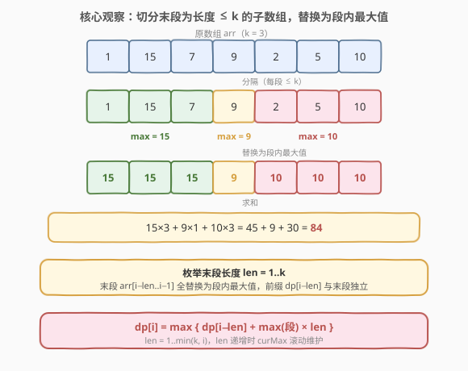
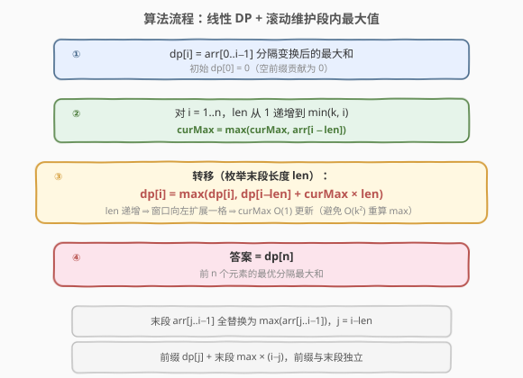
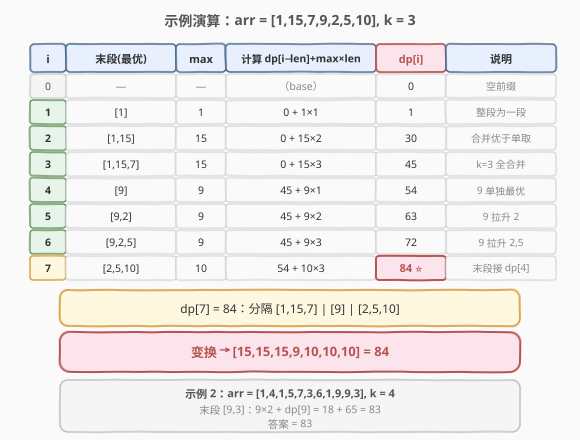

# 分隔数组以得到最大和

- **题目名称**：分隔数组以得到最大和
- **链接**：[1043. 分隔数组以得到最大和](https://leetcode.cn/problems/partition-array-for-maximum-sum/)
- **难度**：中等
- **标签**：数组、动态规划

## 1. 题目概述

给定一个整数数组 `arr` 和一个整数 `k`，请将数组**分隔**为若干**连续**子数组，要求每个子数组长度**最多为** `k`。分隔完成后，每个子数组中的**所有元素都变为该子数组中的最大值**。返回分隔变换后数组元素之和的**最大值**。

> 题目保证答案是一个 32 位整数。

**示例 1**：

```text
输入：arr = [1,15,7,9,2,5,10], k = 3
输出：84
解释：分隔为 [1,15,7] | [9] | [2,5,10]
      各段替换为最大值 → [15,15,15,9,10,10,10]
      总和 = 15×3 + 9 + 10×3 = 45 + 9 + 30 = 84
```

**示例 2**：

```text
输入：arr = [1,4,1,5,7,3,6,1,9,9,3], k = 4
输出：83
```

**示例 3**：

```text
输入：arr = [1], k = 1
输出：1
```

**约束条件**：

- $1 \leq \text{arr.length} \leq 500$
- $0 \leq \text{arr[i]} \leq 10^9$
- $1 \leq k \leq \text{arr.length}$

> 💡 **关键约束**：子数组必须**连续**且长度 **$\leq k$**——这意味着每个位置只可能与前 $k$ 个位置中的某个「断开」，状态转移只需回看 $k$ 步，这是 $O(nk)$ 复杂度的来源。

---

## 2. 解题思路

### 2.1 暴力思路：枚举所有分隔方案

最朴素的做法是枚举所有合法分隔方案：在每个位置选择「断开」或「不断开」，但要保证相邻两个断点之间的距离 $\leq k$。方案数随 $n$ 指数增长，$n = 500$ 时完全不可行。

退一步，注意到分隔具有**前缀独立性**：一旦确定了前 $i$ 个元素的最优分隔，后续的决策不会改变前 $i$ 个元素的贡献。这天然适合**线性 DP**。

### 2.2 核心观察：聚焦末段，枚举长度 1~k



破局点在于**聚焦「最后一段」**：设前 $i$ 个元素 `arr[0..i-1]` 的最优分隔最大和为 $\text{dp}[i]$。在任何一种合法分隔中，**最后一段**必然是 `arr[j..i-1]`（某个 $j$，长度 $i - j \leq k$），且这一段内所有元素都被替换为 $\max(\text{arr}[j..i-1])$。

于是前 $j$ 个元素 `arr[0..j-1]` 的最优分隔与最后一段**完全独立**——前缀贡献 $\text{dp}[j]$，末段贡献 $\max(\text{arr}[j..i-1]) \times (i - j)$。枚举所有合法的末段长度即可：

> **末段长度** $\text{len} = 1, 2, \ldots, \min(k, i)$，对应起点 $j = i - \text{len}$。

**状态定义**：

$$\text{dp}[i] = \text{arr}[0..i\!-\!1] \text{ 分隔变换后的最大元素和},\quad 0 \leq i \leq n$$

**状态转移**（枚举末段长度 $\text{len}$）：

$$\text{dp}[i] = \max_{1 \leq \text{len} \leq \min(k,\, i)} \Big\{\, \text{dp}[i - \text{len}] + \max(\text{arr}[i\!-\!\text{len}\,..\,i\!-\!1]) \times \text{len} \,\Big\}$$

**边界**：$\text{dp}[0] = 0$（空前缀，贡献为 0）。

**答案**：$\text{dp}[n]$（整个数组）。

> 💡 **为何不是区间 DP？** 与 [312. 戳气球](../0301-0400/312_戳气球.md) / [1039. 多边形三角剖分](1039_多边形三角剖分的最低得分.md) 不同，本题的「分隔」是**从左到右顺序切分**——每段的贡献只取决于该段自身的最大值，与前后的切分方式无关。因此只需一维前缀 DP，无需二维区间 DP。

### 2.3 算法流程图



**关键技巧——$O(1)$ 维护段内最大值**：对每个 $i$，若令 $\text{len}$ 从 $1$ 递增到 $k$，则末段窗口 `arr[i-len..i-1]` 每次**向左扩展一格**。维护一个滚动变量 $\text{curMax}$，每扩展一格就更新 $\text{curMax} = \max(\text{curMax}, \text{arr}[i - \text{len}])$，即可在 $O(1)$ 得到每个 $\text{len}$ 对应的段内最大值，避免重复扫描。

1. `dp[0..n]` 初始为 0，`dp[0] = 0`。
2. 对每个 `i = 1 … n`：
   - `curMax = 0`
   - 对 `len = 1 … min(k, i)`（即从 `i-1` 向左扩展）：
     - `curMax = max(curMax, arr[i - len])`
     - `dp[i] = max(dp[i], dp[i - len] + curMax × len)`
3. 返回 `dp[n]`。

> ⚠️ **朴素写法是 $O(nk^2)$**：若对每个 $\text{len}$ 都用一次循环求 $\max(\text{arr}[i\!-\!\text{len}\,..\,i\!-\!1])$，单次 $i$ 耗时 $O(k^2)$。用上述滚动 $\text{curMax}$ 技巧降到 $O(nk)$。

### 2.4 示例演算

以 `arr = [1,15,7,9,2,5,10]`，`k = 3` 为例逐位填写 `dp`：



| $i$ | 末段（最优） | 段内 max | 计算 $\text{dp}[i\!-\!\text{len}] + \text{max} \times \text{len}$ | $\text{dp}[i]$ | 说明 |
|-----|--------------|----------|---------------------------------------------------------------|----------------|------|
| 0 | — | — | — | 0 | 空前缀 |
| 1 | $[1]$ | 1 | $0 + 1 \times 1$ | 1 | 整段作为一段 |
| 2 | $[1,15]$ | 15 | $0 + 15 \times 2$ | 30 | 合并优于单取 15（$1+30$） |
| 3 | $[1,15,7]$ | 15 | $0 + 15 \times 3$ | 45 | $k=3$ 全合并最优 |
| 4 | $[9]$ | 9 | $45 + 9 \times 1$ | 54 | $9$ 单独一段接 $\text{dp}[3]$ |
| 5 | $[9,2]$ | 9 | $45 + 9 \times 2$ | 63 | $[9,2]$ 合并，$9$ 拉升 $2$ |
| 6 | $[9,2,5]$ | 9 | $45 + 9 \times 3$ | 72 | $[9,2,5]$ 全合并 |
| 7 | $[2,5,10]$ | 10 | $54 + 10 \times 3$ | **84** ⭐ | 末段接 $\text{dp}[4]$，$10$ 拉升 $2,5$ |

> 💡 **$i=7$ 的关键抉择**：候选末段为 $[2,5,10]$（$\text{len}=3$，$10\times3 + \text{dp}[4]=30+54=84$）、$[5,10]$（$\text{len}=2$，$10\times2 + \text{dp}[5]=20+63=83$）、$[10]$（$\text{len}=1$，$10+\text{dp}[6]=10+72=82$）。取最大 $84$——**让大值 $10$ 尽可能多地覆盖相邻小值**是本题贪心直觉的核心。

最终 $\text{dp}[7] = 84$，对应分隔 $[1,15,7] \mid [9] \mid [2,5,10]$，变换为 $[15,15,15,9,10,10,10]$。

> 💡 示例 2：`arr = [1,4,1,5,7,3,6,1,9,9,3]`，$k=4$。末段取 $[9,3]$（$\text{len}=2$，$9\times2 + \text{dp}[9]=18+65=83$）为最优，答案 $83$。

---

## 3. 参考代码

### C++

```cpp
class Solution {
  public:
    int maxSumAfterPartitioning(vector<int>& arr, int k) {
        int n = arr.size();
        vector<int> dp(n + 1, 0);
        for (int i = 1; i <= n; ++i) {
            int curMax = 0;
            for (int len = 1; len <= k && i - len >= 0; ++len) {
                curMax = max(curMax, arr[i - len]);
                dp[i] = max(dp[i], curMax * len + dp[i - len]);
            }
        }
        return dp[n];
    }
};
```

### Python

```python
class Solution:
    def maxSumAfterPartitioning(self, arr: List[int], k: int) -> int:
        n = len(arr)
        dp = [0] * (n + 1)
        for i in range(1, n + 1):
            cur_max = 0
            for length in range(1, min(k, i) + 1):
                cur_max = max(cur_max, arr[i - length])
                dp[i] = max(dp[i], cur_max * length + dp[i - length])
        return dp[n]
```

> ⚠️ **两个要点**：
> 1. **`len` 从 1 递增**而非从 `k` 递减：只有递增才能让窗口**逐格向左扩展**，`curMax` 滚动有效。若从 `k` 递减，每次窗口起点跳动，需重新求 $\max$，退化到 $O(nk^2)$。
> 2. **`i - len >= 0`**（C++）/ `min(k, i)`（Python）：保证末段起点不越界。当 $i \leq k$ 时末段可覆盖整个前缀。

---

## 4. 复杂度分析

| 维度 | 复杂度 | 说明 |
|------|--------|------|
| 时间复杂度 | $O(nk)$ | $n$ 个位置，每个位置枚举至多 $k$ 种末段长度，`curMax` 滚动更新 $O(1)$ |
| 空间复杂度 | $O(n)$ | 长度 $n+1$ 的 dp 数组 |

> 💡 本题 $n \leq 500$、$k \leq n$，故 $nk \leq 250000$，非常快。空间可滚动到 $O(k)$（只依赖前 $k$ 个 dp 值），但 $n$ 很小，$O(n)$ 足矣。

---

## 5. 扩展：滚动数组优化到 $O(k)$ 空间

转移 $\text{dp}[i]$ 只依赖 $\text{dp}[i-k\,..\,i-1]$ 这 $k$ 个值，可用长度 $k+1$ 的环形数组滚动。但需要同时维护「对应起点」的映射，可读性下降。鉴于 $n \leq 500$，**面试中直接写 $O(n)$ 空间的一维 DP 即可**，滚动优化仅在 $n$ 极大时才有意义。

### C++（滚动版，仅作参考）

```cpp
class Solution {
  public:
    int maxSumAfterPartitioning(vector<int>& arr, int k) {
        int n = arr.size();
        vector<int> dp(k + 1, 0);          // 环形缓冲，dp[i % (k+1)]
        for (int i = 1; i <= n; ++i) {
            int curMax = 0, best = 0;
            for (int len = 1; len <= k && i - len >= 0; ++len) {
                curMax = max(curMax, arr[i - len]);
                best = max(best, curMax * len + dp[(i - len) % (k + 1)]);
            }
            dp[i % (k + 1)] = best;
        }
        return dp[n % (k + 1)];
    }
};
```

> 💡 取模窗口大小为 $k+1$ 而非 $k$，是为了避免 `i % k == (i-k) % k` 的索引冲突——窗口需容纳 $k+1$ 个连续位置（$\text{dp}[i-k]$ 到 $\text{dp}[i]$）。

---

## 6. 面试要点

1. **状态如何定义？为什么以「前 $i$ 个元素」为状态？**

   - $\text{dp}[i]$ = `arr[0..i-1]` 分隔变换后的最大和。因为分隔是**从左到右顺序切分**，最后一段确定后，前缀 `arr[0..j-1]` 的最优分隔与末段独立——满足最优子结构与无后效性，一维前缀 DP 足矣。

2. **为什么要让 `len` 递增并维护 `curMax`？**

   - `len` 从 1 递增时，末段窗口 `arr[i-len..i-1]` 每次向左**扩展一格**，新加入的 `arr[i-len]` 与旧 `curMax` 取 max 即可，$O(1)$ 更新。若 `len` 递减或对每个 `len` 重新扫描求 max，会退化到 $O(nk^2)$。

3. **为什么不是区间 DP（如 312 戳气球）？**

   - 312 中「最后戳的气球」贡献依赖**两端邻居**，切分后左右子区间通过端点耦合，需二维区间 DP。而本题每段贡献只取决于**段内最大值**，段与段之间无耦合——前缀 DP 即可，复杂度从 $O(n^3)$ 降到 $O(nk)$。

4. **与 [410. 分割数组的最大值](../0401-0500/410_分割数组的最大值.md) 有何区别？**

   - **同**：都是「分隔数组为连续段」。
   - **异**：410 是**最小化最大段和**（每段和不变形），用**二分答案 + 贪心验证**；本题是**最大化变换后总和**（每段被最大值替换变形），用**线性 DP**。目标函数与是否变形决定了方法选择。

5. **贪心直觉「让大值多覆盖小值」对吗？能直接贪心吗？**

   - 直觉正确但不充分：大值向左覆盖受 $k$ 限制，且覆盖一段会**牺牲该段内可能更大的右侧值**（如 $[9,2,5]$ 用 9 覆盖，但 $[2,5,10]$ 用 10 覆盖更优，二者需在不同段）。局部贪心无法权衡跨段取舍，必须用 DP 枚举所有合法末段。

---

## 7. 同类练习题

- [410. 分割数组的最大值](https://leetcode.cn/problems/split-array-largest-sum/)（[题解](../0401-0500/410_分割数组的最大值.md)）：同为「分隔数组为连续段」，但目标是最小化最大段和（不变形），用二分答案 + 贪心验证，对比 DP 与二分的取舍
- [1011. 在 D 天内送达包裹的能力](https://leetcode.cn/problems/capacity-to-ship-packages-within-d-days/)（[题解](1011_在D天内送达包裹的能力.md)）：与 410 同模板的二分答案题，分隔 + 贪心验证，对比「不变形分隔」与本题「最大值替换变形」
- [132. 分割回文串 II](https://leetcode.cn/problems/palindrome-partitioning-ii/)（[题解](../0101-0200/132_分割回文串II.md)）：分隔数组 DP 的最小切割版，预处理回文表 + 一维 DP，对比「段内判定」与本题「段内取最大值」
- [139. 单词拆分](https://leetcode.cn/problems/word-break/)（[题解](../0101-0200/139_单词拆分.md)）：分隔 DP 的可行性版，`dp[i]` = 前 $i$ 字符能否拆，对比布尔 DP 与本题最值 DP
- [343. 整数拆分](https://leetcode.cn/problems/integer-break/)（[题解](../0301-0400/343_整数拆分.md)）：切分型 DP，将整数切为若干段使乘积最大，对比「切整数」与「切数组」的切分型 DP 框架
