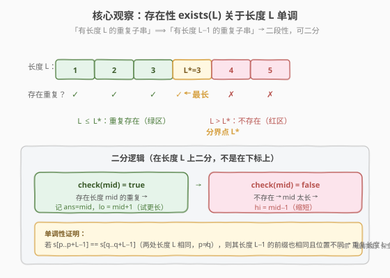
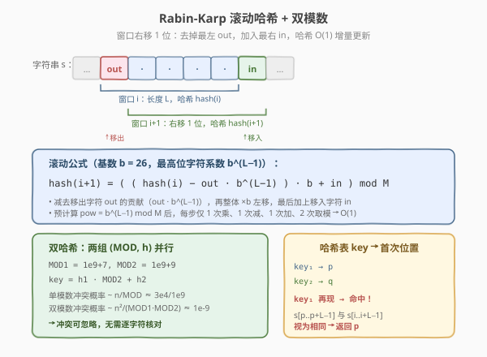
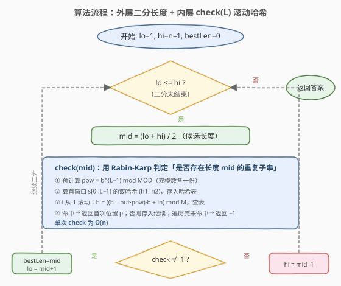
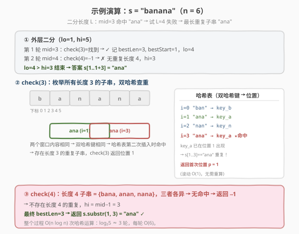

# LeetCode 最长重复子串 题解

## 1. 题目概述

- **标题 / 题号**：最长重复子串（#1044，hard）
- **链接**：https://leetcode.cn/problems/longest-duplicate-substring/
- **难度**：困难
- **标签**：字符串、二分查找、滚动哈希、Rabin-Karp、哈希表

**题意**：给定字符串 `s`，找出其中**出现至少两次**的最长子串（任意一个即可），返回该子串。若不存在重复子串，返回空字符串 `""`。

> ⚠️ 这里的「子串」指**连续**子串；「重复」指同一子串在**不同起始位置**出现两次及以上（位置不同，内容相同）。

**示例 1**：

```text
输入：s = "banana"
输出："ana"
解释："ana" 在位置 1（b-ana-nana）和位置 3（ban-ana-na）各出现一次，长度 3。
      不存在长度 4 的重复子串（"bana"/"anan"/"nana" 互不相同）。
```

**示例 2**：

```text
输入：s = "abcd"
输出：""
解释：所有字符互不相同，无任何重复子串。
```

**约束**：

- $2 \leq \text{s.length} \leq 3 \times 10^4$
- `s` 由小写英文字母组成

> 💡 本题是 [187. 重复的 DNA 序列](../0101-0200/187_重复的DNA序列.md) 的**泛化版**：187 的子串长度固定为 10、字符集恰为 4（2 bit 完美哈希无冲突）；本题子串长度**不固定**、字符集为 26（非 2 的幂，必须用带模数的 Rabin-Karp 并处理冲突）。解法是「**二分答案长度 $L$ + Rabin-Karp 滚动哈希判定**」的经典组合。

## 2. 解题思路

### 2.1 暴力思路

枚举所有子串起始位置对 $(i, j)$（$i \neq j$）与所有长度 $L$，逐字符比较 `s[i..i+L-1]` 与 `s[j..j+L-1]` 是否相等，记录最长者。

- 子串对数 $O(n^2)$，每对比较 $O(n)$，整体 $O(n^3)$。$n = 3 \times 10^4$ 时约 $2.7 \times 10^{13}$ 次操作，完全不可行。

> 💡 暴力法忽略了两个关键结构：① 「存在长度 $L$ 的重复」对 $L$ 单调，可二分；② 相邻窗口的哈希可 $O(1)$ 增量更新，不必每次重算。抓住这两点即可降到 $O(n \log n)$。

### 2.2 核心观察：二分答案 + Rabin-Karp 滚动哈希



**第一步：二分答案长度 $L$。**

定义 $\text{exists}(L)$ =「是否存在长度恰为 $L$ 的重复子串」。关键性质是**单调性**：

$$\text{exists}(L) = \text{true} \;\Longrightarrow\; \text{exists}(L-1) = \text{true}$$

> 证明：若 `s[p..p+L-1] == s[q..q+L-1]`（$p \neq q$），则它们长度 $L-1$ 的**前缀** `s[p..p+L-2]` 与 `s[q..q+L-2]` 也相等且位置不同 → 长度 $L-1$ 的重复必存在。

于是 $\text{exists}(L)$ 呈「小 $L$ 为真、大 $L$ 为假」的二段性，存在唯一分界点 $L^*$（最长重复子串长度）。在 $[1, n-1]$ 上二分：$\text{check}(mid)$ 为真则记答案并试更长（$lo = mid+1$），为假则缩短（$hi = mid-1$）。

> ⚠️ **上界取 $n-1$ 而非 $n$**：长度为 $n$ 的子串在长 $n$ 的串里只出现一次（整个串本身），不可能重复。最长可能重复长度为 $n-1$（如 `s = "aa"` 重复 `"a"` 长 $1 = n-1$；`s = "aaa"` 重复 `"aa"` 长 $2 = n-1$）。

**第二步：Rabin-Karp 滚动哈希实现 $\text{check}(L)$。**



对长度 $L$ 的窗口，把子串看作一个 **基数 $b = 26$ 的整数**（字符 `a..z` 映射 $0..25$），最高位字符系数为 $b^{L-1}$：

$$\text{hash}(i) = \big(v[i] \cdot b^{L-1} + v[i+1] \cdot b^{L-2} + \cdots + v[i+L-1]\big) \bmod M$$

窗口右移一位（从起始 $i$ 到 $i+1$）时，去掉最左字符 $v[i]$（系数 $b^{L-1}$），加入最右新字符 $v[i+L]$：

$$\text{hash}(i+1) = \Big(\big(\text{hash}(i) - v[i] \cdot b^{L-1}\big) \cdot b + v[i+L]\Big) \bmod M$$

预计算 $\text{pow} = b^{L-1} \bmod M$ 后，每步仅一次乘、一次减、一次加、两次取模 → **$O(1)$ 增量更新**。把每个窗口的双哈希键存入哈希表，键第二次出现即命中重复。

> 💡 **为何要双模数？** 字符集 26 非 2 的幂，无法像 187 那样用位掩码做无冲突的完美哈希；带模数的哈希存在冲突。单模数（如 $10^9+7$）下，$n = 3 \times 10^4$ 个窗口的冲突概率约 $\tfrac{n}{M} \approx 3 \times 10^{-5}$，看似极小但 LeetCode 存在**针对性反哈希用例**。用**双质数模数** $(M_1, M_2) = (10^9+7,\; 10^9+9)$ 并行计算，键为 $h_1 \cdot M_2 + h_2$，冲突概率降到 $\sim \tfrac{n^2}{M_1 M_2} \approx 10^{-9}$，可忽略，无需逐字符核对。

### 2.3 算法流程图



外层在长度 $L$ 上二分（$O(\log n)$ 轮），每轮调 $\text{check}(L)$：预计算 $\text{pow}$ → 算首窗口双哈希入表 → 滚动遍历每个窗口查表 → 命中返回首次位置，遍历完未命中返回 $-1$。单次 $\text{check}$ 为 $O(n)$，整体 $O(n \log n)$。

### 2.4 示例演算



以 `s = "banana"`、$n = 6$ 为例，二分区间 $[1, 5]$：

- **第 1 轮** $mid = 3$：$\text{check}(3)$ 枚举长度 3 子串 `"ban"(0)`、`"ana"(1)`、`"nan"(2)`、`"ana"(3)`。`"ana"` 在位置 1 入表，位置 3 再次出现 → **双哈希键命中**，返回首次位置 $1$。记 $\text{bestLen}=3, \text{bestStart}=1$，$lo = 4$。
- **第 2 轮** $mid = 4$：长度 4 子串 `"bana"`、`"anan"`、`"nana"` 互不相同 → 无命中，返回 $-1$，$hi = 3$。
- $lo = 4 > hi = 3$，结束。返回 `s.substr(1, 3) = "ana"`。✓

> 💡 **哈希「回环」**：位置 3 的 `"ana"` 与位置 1 内容完全相同，滚动后双哈希键自然相等——这正是「相同子串 → 相同哈希」的体现。双哈希键相同即可判定重复，无需 $O(L)$ 逐字符比对。

## 3. 参考代码

### C++

```cpp
class Solution {
  public:
    string longestDupSubstring(string s) {
        int n = s.size();
        int bestLen = 0, bestStart = 0;
        int lo = 1, hi = n - 1;
        while (lo <= hi) {
            int mid = lo + (hi - lo) / 2;
            int start = check(s, mid);
            if (start != -1) {        // 存在长度为 mid 的重复子串
                bestLen = mid;
                bestStart = start;
                lo = mid + 1;         // 尝试更长
            } else {
                hi = mid - 1;         // 不存在，缩短
            }
        }
        return s.substr(bestStart, bestLen);
    }

  private:
    static const long long MOD1 = 1000000007LL;
    static const long long MOD2 = 1000000009LL;
    static const long long BASE = 26LL;

    // 判断是否存在长度为 L 的重复子串，存在则返回首次起始下标，否则 -1
    int check(const string& s, int L) {
        int n = s.size();
        if (L == 0) return 0;
        // 预计算 BASE^(L-1) mod MOD（双模数各一份）
        long long pow1 = 1, pow2 = 1;
        for (int i = 0; i < L - 1; i++) {
            pow1 = pow1 * BASE % MOD1;
            pow2 = pow2 * BASE % MOD2;
        }
        // 第一个窗口 s[0..L-1] 的双哈希
        long long h1 = 0, h2 = 0;
        for (int i = 0; i < L; i++) {
            int v = s[i] - 'a';
            h1 = (h1 * BASE + v) % MOD1;
            h2 = (h2 * BASE + v) % MOD2;
        }
        // key = h1 * MOD2 + h2 编码成单个 long long（h1 < MOD1 < MOD2，不溢出）
        unordered_map<long long, int> seen;
        seen[h1 * MOD2 + h2] = 0;
        for (int i = 1; i + L <= n; i++) {
            int out = s[i - 1] - 'a';      // 移出字符
            int in  = s[i + L - 1] - 'a';  // 移入字符
            h1 = ((h1 - out * pow1 % MOD1 + MOD1) * BASE + in) % MOD1;
            h2 = ((h2 - out * pow2 % MOD2 + MOD2) * BASE + in) % MOD2;
            long long key = h1 * MOD2 + h2;
            if (seen.count(key)) {
                return seen[key];          // 双哈希命中，冲突概率 ~1/1e18
            }
            seen[key] = i;
        }
        return -1;
    }
};
```

### Python

```python
class Solution:
    def longestDupSubstring(self, s: str) -> str:
        MOD1, MOD2, BASE = 1000000007, 1000000009, 26

        def check(L: int) -> int:
            if L == 0:
                return 0
            n = len(s)
            pow1 = pow2 = 1
            for _ in range(L - 1):
                pow1 = pow1 * BASE % MOD1
                pow2 = pow2 * BASE % MOD2
            h1 = h2 = 0
            for i in range(L):
                v = ord(s[i]) - 97
                h1 = (h1 * BASE + v) % MOD1
                h2 = (h2 * BASE + v) % MOD2
            seen = {h1 * MOD2 + h2: 0}
            for i in range(1, n - L + 1):
                out = ord(s[i - 1]) - 97
                in_ = ord(s[i + L - 1]) - 97
                h1 = ((h1 - out * pow1) * BASE + in_) % MOD1
                h2 = ((h2 - out * pow2) * BASE + in_) % MOD2
                key = h1 * MOD2 + h2
                if key in seen:
                    return seen[key]
                seen[key] = i
            return -1

        n = len(s)
        lo, hi = 1, n - 1
        best_len, best_start = 0, 0
        while lo <= hi:
            mid = (lo + hi) // 2
            start = check(mid)
            if start != -1:
                best_len, best_start = mid, start
                lo = mid + 1
            else:
                hi = mid - 1
        return s[best_start:best_start + best_len]
```

> 💡 两版骨架一致：外层二分长度，内层 `check(L)` 用双模数滚动哈希。`key = h1 * MOD2 + h2` 把双哈希压缩成单个整数键（$h_1 < M_1 < M_2$，故 $h_1 M_2 + h_2 < M_1 M_2 \approx 10^{18}$，C++ `long long` 不溢出）。Python 的 `%` 对负数返回非负，无需像 C++ 那样 `+ MOD` 补正。

> ⚠️ **C++ 易错点**：`out * pow1 % MOD1` 可能大于 `h1`，相减为负，必须 `+ MOD1` 再取模，否则哈希错乱。`pow1` 用 `L-1` 次循环计算（$b^{L-1}$），不是 $b^L$——减去的是最高位字符 $v[i]$ 的贡献 $v[i] \cdot b^{L-1}$。

## 4. 复杂度分析

| 维度 | 复杂度 | 说明 |
|------|--------|------|
| 时间复杂度 | $O(n \log n)$ | 二分 $O(\log n)$ 轮，每轮 `check` 滚动遍历 $n - L + 1$ 个窗口、每窗 $O(1)$，共 $O(n)$；预计算 $\text{pow}$ 每轮 $O(L) \le O(n)$ |
| 空间复杂度 | $O(n)$ | `check` 内哈希表最多存 $n - L + 1$ 个键值对 |
| 哈希冲突 | 概率 $\sim 10^{-9}$ | 双质数模数 $(10^9+7,\; 10^9+9)$，冲突概率约 $\tfrac{n^2}{M_1 M_2}$，可忽略 |

> 💡 $n = 3 \times 10^4$，$\log_2 n \approx 15$，总哈希运算约 $15 \times 3 \times 10^4 \approx 4.5 \times 10^5$ 次，远低于时限。瓶颈在滚动遍历的常数（双哈希每步两次取模），C++ 轻松通过；Python 需注意常数，本实现已用整数运算避免大对象开销。

## 5. 扩展：哈希冲突与防御策略

### 5.1 为何不用单模数或自然溢出？

两种「省事」写法在 LeetCode 1044 上都可能被针对性用例击穿：

| 方案 | 实现 | 风险 |
|------|------|------|
| 自然溢出 | `unsigned long long`，依赖 $2^{64}$ 自动取模 | 攻击者可构造使 $b^k \equiv 1 \pmod{2^{64}}$ 的串，让不同子串哈希全部相等 → TLE 或 WA |
| 单质数模数 | $M = 10^9+7$，单哈希 | $n = 3 \times 10^4$ 时冲突概率 $\sim 3 \times 10^{-5}$，针对性用例可触发 WA |

**双质数模数**把冲突概率平方级降低（$\sim 10^{-9}$），且两模数独立，攻击者难以同时构造对两个模数都冲突的串，是最稳妥且实现简洁的方案。

### 5.2 更严谨：命中后逐字符核对

若追求**绝对正确**（零冲突），可在双哈希命中后加一步 $O(L)$ 的逐字符比对，确认两子串真的相同再返回。这样即使哈希冲突也不会误判，最坏退化为 $O(nL)$，但期望仍为 $O(n \log n)$（冲突极罕见）。本实现因双哈希冲突概率已可忽略而省略此步——面试中提到这一「可选核对」即可体现严谨性。

### 5.3 与后缀数组的关系

本题的**理论最优解**是后缀数组 + LCP（最长公共前缀）数组：构造后缀数组 $O(n)$ 或 $O(n \log n)$，则最长重复子串 = $\max(\text{LCP}[i])$，整体 $O(n)$ 或 $O(n \log n)$，且**无哈希冲突**。但后缀数组实现复杂、常数大，面试中「二分 + 滚动哈希」更易书写、易讲解，是首选；后缀数组作为「进阶提及」即可加分。

## 6. 面试要点

1. **为什么能二分？单调性怎么证？**

   > 若存在长度 $L$ 的重复（两处相同子串 $p, q$），则其长度 $L-1$ 的前缀也相同且位置不同 → 长度 $L-1$ 的重复必存在。故 $\text{exists}(L)$ 单调，呈「真→假」二段性，可二分找分界点 $L^*$。

2. **滚动哈希的公式怎么推？为什么要预计算 `pow`？**

   > $\text{hash}(i+1) = ((\text{hash}(i) - v[i] \cdot b^{L-1}) \cdot b + v[i+L]) \bmod M$。最高位字符系数是 $b^{L-1}$，减去它的贡献后整体 $\times b$ 左移，再补最低位新字符。预计算 $\text{pow} = b^{L-1} \bmod M$ 是为了 $O(1)$ 取出「移出字符」的贡献，否则每步都要重算 $b^{L-1}$。

3. **为什么用双模数？单模数不行吗？**

   > 单模数存在哈希冲突，LeetCode 1044 有针对性反哈希用例（针对 $2^{64}$ 自然溢出和单个固定质数）。双质数模数把冲突概率降到 $\sim 10^{-9}$，且难以被同时攻击，是最稳妥的简洁方案。若要绝对正确，可在命中后加 $O(L)$ 逐字符核对。

4. **二分的上下界为什么是 $1$ 和 $n-1$？**

   > 下界 $1$：长度 $0$ 的子串无意义（空串不算重复）。上界 $n-1$：长度 $n$ 的子串在长 $n$ 的串中只出现一次（整个串），不可能重复；最长可能重复长度为 $n-1$（如 `"aa"` 重复 `"a"`）。

5. **如果所有字符都互不相同（如 `"abcd"`），算法行为如何？**

   > $\text{check}(1)$ 枚举单个字符也无重复 → 返回 $-1$，二分全程未命中，$\text{bestLen}$ 保持 $0$，最终返回 `""`。无需特判，二分自然处理。若 $n > 26$，由鸽巢原理必有重复字符，$\text{check}(1)$ 必为真，可作为快速 sanity check。

## 同类练习题

| # | 题目 | 与本题的关联 |
|---|------|-------------|
| 187 | [重复的 DNA 序列](https://leetcode.cn/problems/repeated-dna-sequences/)（[题解](../0101-0200/187_重复的DNA序列.md)） | 本题的「特例版」——子串长度固定 10、字符集 4（2 的幂），用位编码做无冲突完美哈希 + 滚动，是理解本题 Rabin-Karp 的最佳前置 |
| 718 | [最长重复子数组](https://leetcode.cn/problems/maximum-length-of-repeated-subarray/)（[题解](../0701-0800/718_最长重复子数组.md)） | 两数组的最长公共子串，DP $O(mn)$ 解法，其进阶解法正是「二分 + 滚动哈希」，与本题同模板（跨串找重复 vs 单串找重复） |
| 28 | [找出字符串中第一个匹配项的下标](https://leetcode.cn/problems/find-the-index-of-the-first-occurrence-in-a-string/)（[题解](../0001-0100/28_找出字符串中第一个匹配项的下标.md)） | KMP / Rabin-Karp 单模式匹配，滚动哈希的「找特定模式」版，对照本题「全量窗口查重」 |
| 3 | [无重复字符的最长子串](https://leetcode.cn/problems/longest-substring-without-repeating-characters/)（[题解](../0001-0100/3_无重复字符的最长子串.md)） | 滑动窗口 + 哈希求「无重复」最长，与本题「有重复」最长互为正反问题 |
| 1062 | [最长重复子串](https://leetcode.cn/problems/longest-repeating-substring/) | 本题的简化版（$n \le 1500$，可用 $O(n^2)$ DP），适合作为本题的小数据 warm-up |
