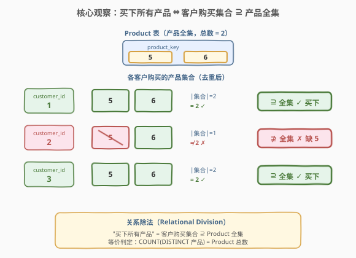
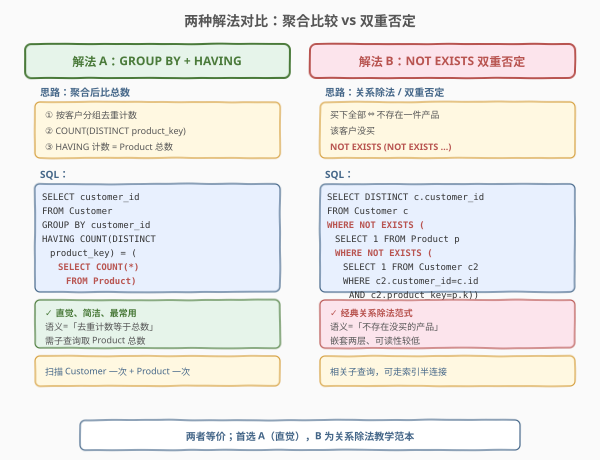
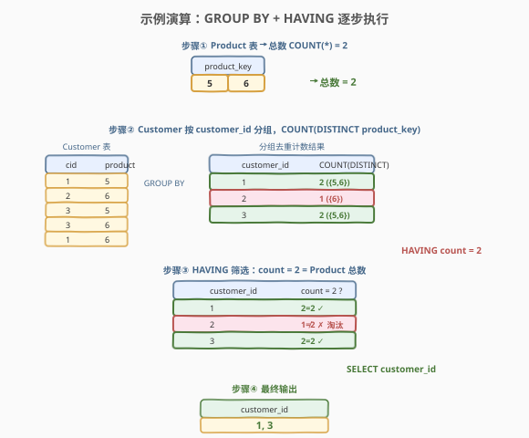

# LeetCode 买下所有产品的客户 题解

## 1. 题目概述

- **标题 / 题号**：买下所有产品的客户（#1045，medium）
- **链接**：https://leetcode.cn/problems/customers-who-bought-all-products/
- **难度**：中等
- **标签**：SQL、GROUP BY、HAVING、COUNT(DISTINCT)、关系除法、NOT EXISTS、子查询

**题意**：给定 `Customer` 表（客户购买记录）与 `Product` 表（产品全集），编写 SQL 查询报告 **购买了 `Product` 表中所有产品** 的客户的 `id`。结果无顺序要求。

**表结构**：

```text
Table: Customer
+-------------+---------+
| Column Name | Type    |
+-------------+---------+
| customer_id | int     |  ← 可与 product_key 组合重复
| product_key | int     |  ← 外键 → Product.product_key
+-------------+---------+
该表可能包含重复的行。customer_id 不为 NULL。

Table: Product
+-------------+---------+
| Column Name | Type    |
+-------------+---------+
| product_key | int     |  ← 主键（唯一）
+-------------+---------+
```

> 💡 **关键约束**：`Product.product_key` 是主键（唯一、非 NULL），代表**产品全集**；`Customer` 表的 `(customer_id, product_key)` 可能重复——同一客户对同一产品可能有多条记录。判定"买下所有产品"必须**按产品去重后再与全集比较**，这是 `COUNT(DISTINCT)` 的由来。

**示例 1**：

```text
输入：
Customer 表
+-------------+-------------+
| customer_id | product_key |
+-------------+-------------+
| 1           | 5           |
| 2           | 6           |
| 3           | 5           |
| 3           | 6           |
| 1           | 6           |
+-------------+-------------+
Product 表
+-------------+
| product_key |
+-------------+
| 5           |
| 6           |
+-------------+
输出：
+-------------+
| customer_id |
+-------------+
| 1           |
| 3           |
+-------------+
解释：产品全集 = {5, 6}。客户 1 买了 {5, 6}、客户 3 买了 {5, 6}，均覆盖全集；客户 2 只买了 {6}，缺产品 5，不入选。
```

**约束**：

- `Product.product_key` 为主键（唯一、非 NULL）
- `Customer.customer_id` 非 NULL，`Customer.product_key` 为指向 `Product` 的外键
- `Customer` 表可能有重复行
- 结果列名须为 `customer_id`，顺序不限

> 💡 本题是 SQL **"关系除法"（Relational Division）母题**——所有"找 A 表中关联了 B 表全部记录的行"都从这一题衍生。核心是把"买下所有产品"翻译成"客户购买的产品集合 ⊇ 产品全集"，进而有两种等价表达：**聚合比较**（`GROUP BY + HAVING COUNT(DISTINCT) = 总数`）与**双重否定**（`NOT EXISTS (NOT EXISTS ...)`）。前者直觉简洁、是面试首选；后者是关系代数中关系除法的经典范式，常作教学延伸。

## 2. 解题思路

### 2.1 暴力思路：逐客户逐产品比对

最直觉的过程式思路是：对每个客户 `c`，遍历 `Product` 表的每一件产品 `p`，检查 `Customer` 表中是否存在 `(c.customer_id, p.product_key)` 的记录；若所有产品都能找到，则输出 `c`。这在过程式语言里是一个双重循环，但**纯 SQL 没有逐行循环语句**——需要换两种"集合式"表达：聚合后比总数，或用双重 `NOT EXISTS` 把"全部满足"翻译成"不存在不满足的"。

> ⚠️ 过程式思维（"对每个客户检查每件产品"）在 SQL 中有两种等价的集合式表达，选哪种取决于**可读性**与是否要展示关系除法思想。

### 2.2 核心观察：买下所有产品 ⇔ 购买集合 ⊇ 产品全集



**关键洞察**：把每个客户购买的产品**去重后看作一个集合** $S_c$，把 `Product` 表看作**全集** $P$。则"买下所有产品"等价于集合包含关系：

$$\text{客户 } c \text{ 买下所有产品} \iff S_c \supseteq P \iff |S_c| = |P|$$

> 💡 **为何 $|S_c| = |P|$ 就足够？** 因为 $S_c \subseteq P$ 恒成立（`Customer.product_key` 是指向 `Product` 的外键，客户买的产品一定在全集里）。在 $S_c \subseteq P$ 前提下，$|S_c| = |P|$ 与 $S_c \supseteq P$ 等价——去重计数等于总数即说明一件不缺。这是外键约束提供的"免费"推理：无需担心客户买了不存在的产品。

- `SELECT COUNT(*) FROM Product` 得到全集大小 $|P|$；
- 对 `Customer` 按 `customer_id` 分组，`COUNT(DISTINCT product_key)` 得到每个客户的 $|S_c|$；
- `HAVING |S_c| = |P|$ 筛出买下全部的客户。

> ⚠️ **为何必须 `COUNT(DISTINCT)` 而非 `COUNT(*)`？** `Customer` 表允许重复行——若客户 1 对产品 5 有 3 条记录，`COUNT(*)` 会算成 3 而虚高，可能误把没买全的客户判为买全。`COUNT(DISTINCT product_key)` 先去重再计数，确保 $|S_c|$ 反映**不同产品的件数**，与全集大小可比。

### 2.3 两种解法对比



| 维度 | 解法 A：GROUP BY + HAVING | 解法 B：NOT EXISTS 双重否定 |
|------|---------------------------|------------------------------|
| **思路** | 聚合后比总数：去重计数 = Product 总数 | 关系除法：不存在一件产品该客户没买 |
| **写法** | `GROUP BY customer_id HAVING COUNT(DISTINCT product_key) = (SELECT COUNT(*) FROM Product)` | `WHERE NOT EXISTS (SELECT 1 FROM Product p WHERE NOT EXISTS (... c 买过 p ...))` |
| **可读性** | ✓ 直觉、简洁，接近自然语言 | ⚠ 嵌套两层 NOT EXISTS，较绕 |
| **NULL 安全** | ✓ 安全（外键非 NULL，DISTINCT 自动去重） | ✓ 安全（EXISTS 只判有无行） |
| **推荐度** | ✓ **首选**，面试默认写法 | 关系除法教学范本，了解即可 |

> 💡 **双重否定的逻辑**：`NOT EXISTS (产品 p 满足 NOT EXISTS (客户 c 买过 p))` 翻译为自然语言即"不存在一件产品该客户没买"——双重否定表全称肯定。这是关系代数中**关系除法**的标准 SQL 表达：$R \div S = \{t \mid \text{不存在 } s \in S \text{ 使得 } (t,s) \notin R\}$。两种解法语义完全等价，现代优化器常将 `NOT EXISTS` 优化为半连接（Semi-Join），性能与聚合接近。

### 2.4 示例演算



以示例数据为例，跟踪解法 A 的执行过程：

| 步骤 | 操作 | 结果 |
|------|------|------|
| ① | `SELECT COUNT(*) FROM Product` | 全集大小 $|P| = 2$（产品 5、6） |
| ② | `GROUP BY customer_id` + `COUNT(DISTINCT product_key)` | 客户 1 → $\{5,6\}$ 计数 2；客户 2 → $\{6\}$ 计数 1；客户 3 → $\{5,6\}$ 计数 2 |
| ③ | `HAVING count = 2` | 客户 1：$2=2$ ✓；客户 2：$1 \neq 2$ ✗ 淘汰；客户 3：$2=2$ ✓ |
| ④ | `SELECT customer_id` | 输出 `1, 3` |

> 💡 **重复行如何被消化**：客户 1 有两条记录 `(1,5)`、`(1,6)`，去重后 $\{5,6\}$ 计数 2；若客户 1 另有两条重复的 `(1,5)`，`COUNT(DISTINCT)` 仍只算 1 个产品 5——这正是 `DISTINCT` 抵御重复行的关键作用。客户 2 只有 `(2,6)` 一条记录，去重后 $\{6\}$ 计数 1，缺产品 5 被淘汰。

## 3. 参考代码

### SQL（解法 A：GROUP BY + HAVING，推荐）

```sql
SELECT customer_id
FROM Customer
GROUP BY customer_id
HAVING COUNT(DISTINCT product_key) = (
    SELECT COUNT(*)
    FROM Product
);
```

> 💡 **写法要点**：
> - `GROUP BY customer_id` 按客户分组，每个分组对应一个客户的全部购买记录。
> - `COUNT(DISTINCT product_key)` 对组内产品去重计数，得到 $|S_c|$——抵御 `Customer` 表的重复行。
> - 子查询 `SELECT COUNT(*) FROM Product` 得到全集大小 $|P|$（`Product.product_key` 是主键无重复，`COUNT(*)` 即可，不必 `DISTINCT`）。
> - `HAVING` 对**分组后**的结果筛选，保留 $|S_c| = |P|$ 的客户。注意 `HAVING` 与 `WHERE` 的区别：`WHERE` 在分组前过滤行，`HAVING` 在分组后过滤组。

### SQL（解法 B：NOT EXISTS 双重否定 / 关系除法）

```sql
SELECT DISTINCT c.customer_id
FROM Customer c
WHERE NOT EXISTS (
    SELECT 1
    FROM Product p
    WHERE NOT EXISTS (
        SELECT 1
        FROM Customer c2
        WHERE c2.customer_id = c.customer_id
          AND c2.product_key = p.product_key
    )
);
```

> 💡 **写法要点**：
> - 外层 `NOT EXISTS`：找"不存在"的产品 `p` 满足下一条件。
> - 内层 `NOT EXISTS`：该客户 `c` **没有**买过产品 `p`（`Customer` 中无 `(c.customer_id, p.product_key)` 记录）。
> - 双重否定 = 全称肯定：不存在该客户没买的产品 ⇔ 该客户买下了所有产品。
> - `SELECT DISTINCT` 去重：一个买全的客户在 `Customer` 中有多行，外层 `FROM Customer c` 会重复出现，需 `DISTINCT` 收敛。
> - 内层用 `c2` 别名避免与外层 `c` 冲突；`SELECT 1` 只判存在性，最省。

### Python（pandas）

```python
import pandas as pd

def buy_all_products(customer: pd.DataFrame, product: pd.DataFrame) -> pd.DataFrame:
    total = product['product_key'].nunique()
    cnt = customer.groupby('customer_id')['product_key'].nunique()
    bought_all = cnt[cnt == total].index
    return pd.DataFrame({'customer_id': bought_all})
```

> 💡 **pandas 对照**：`groupby('customer_id')['product_key'].nunique()` 对应 SQL 的 `GROUP BY customer_id` + `COUNT(DISTINCT product_key)`；`product['product_key'].nunique()` 对应 `SELECT COUNT(*) FROM Product`（Product 主键无重复，`nunique` 与 `count` 等价）；最后比较计数筛出客户。也可用集合思路：对每个客户 `set(product_key)` 与 `set(Product)` 比较 `>=`，但 `groupby + nunique` 更贴近 SQL 的聚合思维且向量化效率更高。

## 4. 复杂度分析

| 维度 | 复杂度 | 说明 |
|------|--------|------|
| **时间（解法 A）** | $O(m + n)$ | 扫描 Customer 分组聚合 $O(m)$（$m$ = Customer 行数）；子查询扫描 Product $O(n)$（$n$ = Product 行数）；分组聚合用哈希表，无排序时线性 |
| **时间（解法 B）** | $O(m + n)$ ~ $O(m \cdot n)$ | 相关子查询对每个客户×每个产品检查；`product_key` 有索引时走半连接近线性，无索引时最坏 $O(m \cdot n)$。现代优化器常改写为 Semi-Join 降到接近 $O(m + n)$ |
| **空间** | $O(m)$ | 分组聚合的哈希表 / 子查询物化中间结果 |
| **结果行数** | $O(k)$ | $k$ = 买下全部的客户数，$0 \le k \le$ 客户总数 |

> ⚠️ SQL 复杂度取决于**执行计划与索引**：解法 A 的聚合只需扫描两表各一次，稳定线性；解法 B 的双重相关子查询在无索引时易退化，但有索引或被优化器改写为半连接后性能接近。面试中说明"首选聚合写法，稳定且直观；NOT EXISTS 为关系除法范式，优化器友好"即可。

## 5. 扩展：关系除法的通用范式

### 5.1 "买下全部"的泛化模板

本题是关系代数中**关系除法**（$R \div S$）的典型实例：在 $R(A, B)$ 中找所有"关联了 $S(B)$ 全部取值"的 $A$。两种写法均可泛化：

```sql
-- 模板 A：聚合比较
SELECT a_key
FROM R
GROUP BY a_key
HAVING COUNT(DISTINCT b_key) = (SELECT COUNT(*) FROM S);

-- 模板 B：双重否定（关系除法）
SELECT DISTINCT a_key
FROM R r
WHERE NOT EXISTS (
    SELECT 1 FROM S s
    WHERE NOT EXISTS (
        SELECT 1 FROM R r2
        WHERE r2.a_key = r.a_key AND r2.b_key = s.b_key
    )
);
```

> 💡 只需替换表名与关联键即可套用——所有"选了所有必修课的学生""覆盖了所有测试用例的提交""买了所有促销商品的顾客"类 SQL 题都是这个模板的实例。

### 5.2 为何外键约束让问题简化

若 `Customer.product_key` **不是**外键（客户可能买了不存在于 `Product` 的产品），则 $S_c \subseteq P$ 不成立，$|S_c| = |P|$ **不能**推出 $S_c \supseteq P$——客户可能买的全是不在全集里的产品，计数恰好相等却没买任何一件目标产品。此时解法 A 需加约束：

```sql
SELECT customer_id
FROM Customer
WHERE product_key IN (SELECT product_key FROM Product)   -- 只数在全集内的
GROUP BY customer_id
HAVING COUNT(DISTINCT product_key) = (SELECT COUNT(*) FROM Product);
```

而解法 B 的双重否定天然只枚举 `Product` 中的产品，不受外键约束影响——这是关系除法写法的鲁棒性优势。本题有外键约束，两种解法等价。

> ⚠️ **面试加分点**：主动指出"解法 A 依赖外键保证 $S_c \subseteq P$，若无外键需先用 `WHERE product_key IN (...)` 限定到全集"——展示对约束与语义关系的深刻理解。

### 5.3 HAVING 与 WHERE 的边界

| 子句 | 作用阶段 | 能否用聚合函数 | 本题用途 |
|------|---------|---------------|---------|
| `WHERE` | 分组**前**过滤行 | ✗ 不能用 `COUNT` | 限定行（如只数在全集内的产品） |
| `HAVING` | 分组**后**过滤组 | ✓ 能用 `COUNT(DISTINCT)` | 筛选 $|S_c| = |P|$ 的客户组 |

> 💡 **口诀**：`WHERE` 筛行、`HAVING` 筛组。本题比较的是"每组的去重计数"，必须用 `HAVING`；若误把 `COUNT(DISTINCT)` 写进 `WHERE` 会直接报语法错。

## 6. 面试要点

1. **为什么用 `COUNT(DISTINCT)` 而不是 `COUNT(*)`？**

   - `Customer` 表允许重复行——同一客户对同一产品可能有多条记录。`COUNT(*)` 会把重复行重复计数，使没买全的客户虚高误判；`COUNT(DISTINCT product_key)` 先去重再计数，确保得到的是**不同产品的件数**，才能与产品全集大小正确比较。

2. **`HAVING` 和 `WHERE` 有什么区别？为什么这里用 `HAVING`？**

   - `WHERE` 在分组**前**过滤行，不能使用聚合函数；`HAVING` 在分组**后**过滤组，可以使用 `COUNT/SUM/AVG` 等聚合。本题要比较的是"每个客户分组的产品计数"，属于分组后的条件，必须用 `HAVING`。

3. **为什么 `|S_c| = |P|` 就能判定买下全部？**

   - 因为 `Customer.product_key` 是指向 `Product` 的外键，保证客户买的产品一定在全集内，即 $S_c \subseteq P$ 恒成立。在子集前提下，$|S_c| = |P|$ 与 $S_c = P$ 等价——计数相等即一件不缺。若无此外键约束，需先用 `WHERE product_key IN (...)` 限定到全集。

4. **双重 `NOT EXISTS` 的逻辑是什么？**

   - 外层"不存在产品 `p`" + 内层"该客户没买 `p`"，双重否定表全称肯定：不存在该客户没买的产品 ⇔ 该客户买下了所有产品。这是关系代数中**关系除法** $R \div S$ 的标准 SQL 表达，语义与聚合写法完全等价。

5. **两种解法性能差异？**

   - 语义等价。解法 A 聚合扫描两表各一次，稳定线性 $O(m+n)$；解法 B 双重相关子查询在无索引时最坏 $O(m \cdot n)$，但有索引或被优化器改写为半连接（Semi-Join）后接近线性。现代优化器常把 `NOT EXISTS` 优化为与聚合相近的执行计划。面试答"首选聚合写法因稳定直观，NOT EXISTS 为关系除法范式"。

> 💡 **一句话总结**：1045 是 SQL **关系除法母题**——核心就一句 `GROUP BY customer_id HAVING COUNT(DISTINCT product_key) = (SELECT COUNT(*) FROM Product)`。考点不在语法难度，而在理解"买下全部 = 去重计数等于总数"的集合包含本质，以及 `COUNT(DISTINCT)` 抵御重复行、外键约束保证子集前提这两个细节。记住这条公式，所有"关联了全部"类 SQL 题都能套用。

## 同类练习题

| # | 题目 | 与本题的关联 |
|---|------|-------------|
| 183 | [从不订购的客户](https://leetcode.cn/problems/customers-never-order/)（[题解](../0101-0200/183_从不订购的客户.md)） | SQL **反连接母题**——找"从未出现"用 `LEFT JOIN + IS NULL`；本题找"全部出现"用 `GROUP BY + HAVING`，两者合起来覆盖"按关联覆盖度筛行"的完整光谱（零覆盖 vs 全覆盖） |
| 175 | [组合两个表](https://leetcode.cn/problems/combine-two-tables/) | `LEFT JOIN` 入门母题，展示"保留全部行"的连接思想——175 是基础连接，1045 在连接之上叠加"覆盖全集"的聚合判定，由连接到分组递进 |
| 182 | [查找重复的电子邮箱](https://leetcode.cn/problems/duplicate-emails/) | `GROUP BY + HAVING COUNT >= 2` 入门——与 1045 共享 `GROUP BY + HAVING` 聚合筛组范式，182 比"次数≥2"，1045 比"计数=总数"，同模板不同谓词 |
| 596 | [超过 5 名学生的课](https://leetcode.cn/problems/classes-more-than-5-students/) | `GROUP BY + HAVING COUNT >= 5`——与 1045 同为 `HAVING` 聚合筛选，596 比绝对阈值，1045 比动态子查询阈值，进阶理解 `HAVING` 与子查询联动 |
| 603 | [连续空余座位](https://leetcode.cn/problems/consecutive-available-seats/) | `Self JOIN + 相邻 id` 判连续——同属 SQL 经典范式练习，拓展连接类题感，与 1045 的"分组聚合"互补 |
