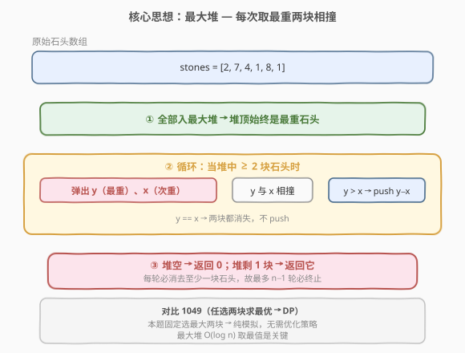
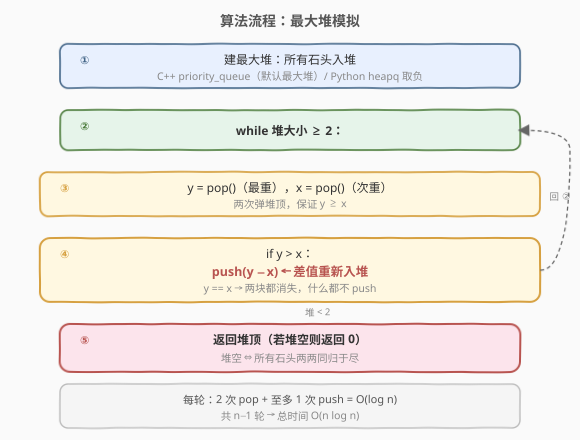
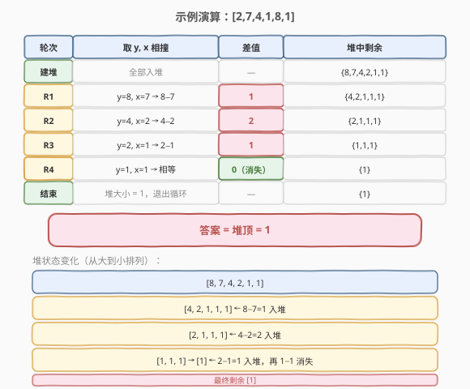

# LeetCode 最后一块石头的重量 题解

## 1. 题目概述

- **标题 / 题号**：最后一块石头的重量（#1046，easy）
- **链接**：https://leetcode.cn/problems/last-stone-weight/
- **难度**：简单
- **标签**：堆、优先队列、模拟、数组

**题意**：有一堆石头，每块石头的重量都是正整数。每一回合，从中选出两块 **最重的** 石头，然后将它们一起粉碎。设重量分别为 `x` 和 `y`，且 `x ≤ y`：

- 如果 `x == y`，那么两块石头都会被完全粉碎；
- 如果 `x != y`，那么重量为 `x` 的石头将会完全粉碎，而重量为 `y` 的石头新重量为 `y − x`。

最后，最多只会剩下一块石头。返回此石头的重量。如果没有石头剩下，就返回 `0`。

**示例 1**：

```text
输入：[2,7,4,1,8,1]
输出：1
解释：
先选出 7 和 8，得到 1，数组转换为 [2,4,1,1,1]，
再选出 2 和 4，得到 2，数组转换为 [2,1,1,1]，
接着是 2 和 1，得到 1，数组转换为 [1,1,1]，
最后选出 1 和 1，得到 0，最终数组转换为 [1]。
```

**示例 2**：

```text
输入：[1]
输出：1
```

**约束**：

- $1 \leq \text{stones.length} \leq 30$
- $1 \leq \text{stones[i]} \leq 1000$

> 💡 与 [1049. 最后一块石头的重量 II](../1001-1100/1049_最后一块石头的重量II.md) 的区别：1046 每回合**固定选最重的两块**，是**模拟题**；1049 **可任选两块**求最优，是 **DP 题**。

## 2. 解题思路

### 2.1 暴力思路：每轮排序

最直观的暴力做法：每轮对数组排序，取最大的两块相撞，把差值放回数组，重复直到剩至多一块。每轮排序 $O(n \log n)$，共 $n - 1$ 轮，总时间 $O(n^2 \log n)$。$n \leq 30$ 时可过，但显然不够优雅——每次只为找最大两个值就做一次全排序，浪费了大量计算。

### 2.2 核心观察：最大堆



关键观察：**每轮只需要「最大」和「次大」两个值**，不需要全排序。最大堆（优先队列）天然支持 $O(\log n)$ 取最值：

> **把所有石头放入最大堆，循环「弹出两个最大的相撞，差值重新入堆」，直到堆中不足两块。**

- **C++**：`priority_queue<int>` 默认就是最大堆，直接用。
- **Python**：`heapq` 是最小堆，存入负值即可模拟最大堆。

> ⚠️ **为什么不用排序而用堆？** 每轮只需最大两个值，堆的 `pop` + `push` 各 $O(\log n)$，比每轮全排序 $O(n \log n)$ 更高效。虽然本题 $n \leq 30$ 两种做法都能过，但堆是这类「动态取最值」问题的标准解法。

### 2.3 算法流程图



1. **建堆**：所有石头入最大堆。
2. **循环**：当堆大小 $\geq 2$ 时：
   - 弹出 `y`（最重）、`x`（次重），保证 $y \geq x$。
   - 若 $y > x$，将 $y - x$ 重新入堆；若 $y = x$，两块都消失，不入堆。
3. **返回**：堆空返回 `0`，否则返回堆顶。

> 💡 **终止性**：每轮至少消去一块石头（相等消两块，不等消一块），所以最多 $n - 1$ 轮必然终止。

### 2.4 示例演算

以 `stones = [2,7,4,1,8,1]` 为例，建最大堆后堆中元素从大到小排列为 `{8,7,4,2,1,1}`：



| 轮次 | 取 y, x | 相撞 | 差值 | 堆中剩余 |
|------|---------|------|------|----------|
| 建堆 | 全部入堆 | — | — | {8,7,4,2,1,1} |
| R1 | 8, 7 | 8−7 | 1 | {4,2,1,1,1} |
| R2 | 4, 2 | 4−2 | 2 | {2,1,1,1} |
| R3 | 2, 1 | 2−1 | 1 | {1,1,1} |
| R4 | 1, 1 | 相等 | 0（消失） | {1} |
| 结束 | 堆大小=1 | — | — | **{1}** |

最终堆中剩一块，重量为 `1`，即为答案。

## 3. 参考代码

### C++

```cpp
class Solution {
  public:
    int lastStoneWeight(vector<int>& stones) {
        priority_queue<int> pq;          // 默认最大堆
        for (int s : stones) pq.push(s);
        while (pq.size() >= 2) {
            int y = pq.top(); pq.pop();   // 最重
            int x = pq.top(); pq.pop();   // 次重
            if (y > x) pq.push(y - x);    // 相等则不入堆
        }
        return pq.empty() ? 0 : pq.top();
    }
};
```

### Python

```python
class Solution:
    def lastStoneWeight(self, stones: List[int]) -> int:
        pq = [-s for s in stones]         # 取负模拟最大堆
        heapq.heapify(pq)
        while len(pq) >= 2:
            y = -heapq.heappop(pq)        # 最重（还原正值）
            x = -heapq.heappop(pq)        # 次重
            if y > x:
                heapq.heappush(pq, -(y - x))
        return -pq[0] if pq else 0
```

> ⚠️ **Python 易错点**：`heapq` 是最小堆，存负值模拟最大堆。弹出时要取负还原，入堆时差值也要取负。若忘记取负会导致逻辑错误。

## 4. 复杂度分析

| 维度 | 复杂度 | 说明 |
|------|--------|------|
| 时间复杂度 | $O(n \log n)$ | 建堆 $O(n)$，$n-1$ 轮循环每轮 2 次 pop + 至多 1 次 push，各 $O(\log n)$ |
| 空间复杂度 | $O(n)$ | 堆存储所有石头 |

> 💡 本题 $n \leq 30$，$O(n \log n)$ 非常快。即便 $n$ 放大到 $10^5$，堆解法依然高效。

## 5. 扩展：暴力排序解法

如果不使用堆，直接用排序模拟也能通过（$n \leq 30$）：

```cpp
class Solution {
  public:
    int lastStoneWeight(vector<int>& stones) {
        while (stones.size() >= 2) {
            sort(stones.begin(), stones.end());
            int y = stones.back(); stones.pop_back();
            int x = stones.back(); stones.pop_back();
            if (y > x) stones.push_back(y - x);
        }
        return stones.empty() ? 0 : stones[0];
    }
};
```

每轮排序 $O(n \log n)$，共 $n - 1$ 轮，总时间 $O(n^2 \log n)$。对比堆解法的 $O(n \log n)$，排序法在 $n$ 较大时劣势明显，但代码更短、无堆 API 依赖，适合面试中快速写出后口头优化。

> 💡 **选择建议**：面试时优先写堆解法展示数据结构功底；若语言不熟堆 API，排序法作为保底方案完全可接受。

## 6. 面试要点

1. **为什么用最大堆而不是每轮排序？**
   - 每轮只需最大两个值，堆的 `pop`/`push` 各 $O(\log n)$，总 $O(n \log n)$；每轮全排序是 $O(n^2 \log n)$。堆是「动态取最值」的标准工具。

2. **Python 如何用 `heapq` 实现最大堆？**
   - `heapq` 是最小堆，存入负值即可翻转大小关系：`push(-val)`、`pop()` 后取负还原。注意差值入堆时也要取负。

3. **$y == x$ 时为什么不入堆？**
   - 两块石头重量相等，相撞后 $y - x = 0$，两块同归于尽。若 push 0 进堆，虽然不影响正确性（0 总是最小），但浪费一次堆操作。

4. **循环什么时候终止？每轮一定减少石头数量吗？**
   - 堆大小 $< 2$ 时终止。每轮弹出两块、至多 push 一块，净减 $\geq 1$，所以最多 $n - 1$ 轮必然终止。

5. **与 1049（最后一块石头的重量 II）有什么区别？**
   - 1046 固定选最重两块 → **确定过程**，直接模拟；1049 可任选两块 → **优化问题**，需 DP 求最优策略。看似相似，解法完全不同。

## 同类练习题

| # | 题目 | 与本题的关联 |
|---|------|-------------|
| 1049 | [最后一块石头的重量 II](https://leetcode.cn/problems/last-stone-weight-ii/)（[题解](../1001-1100/1049_最后一块石头的重量II.md)） | 本题的「任选两块求最优」版，对比模拟与 DP 的边界——相同题面不同规则导致解法分野 |
| 703 | [数据流中的第 K 大元素](https://leetcode.cn/problems/kth-largest-element-in-a-stream/) | 最小堆维护前 K 大，动态取最值的另一种堆应用 |
| 215 | [数组中的第 K 个最大元素](https://leetcode.cn/problems/kth-largest-element-in-an-array/)（[题解](../0201-0300/215_数组中的第K个最大元素.md)） | 堆或快速选择求第 K 大，对比堆与分治取最值 |
| 23 | [合并 K 个升序链表](https://leetcode.cn/problems/merge-k-sorted-lists/) | 最小堆 K 路归并，堆在「动态维护最值」场景的经典扩展 |
| 767 | [重构字符串](https://leetcode.cn/problems/reorganize-string/)（[题解](../0701-0800/767_重构字符串.md)） | 贪心 + 大根堆按频率交替放置，堆配合贪心的进阶用法 |
