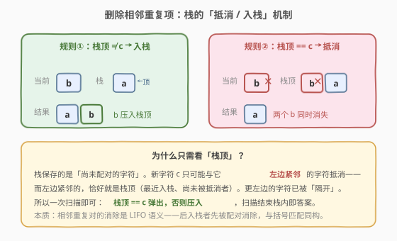
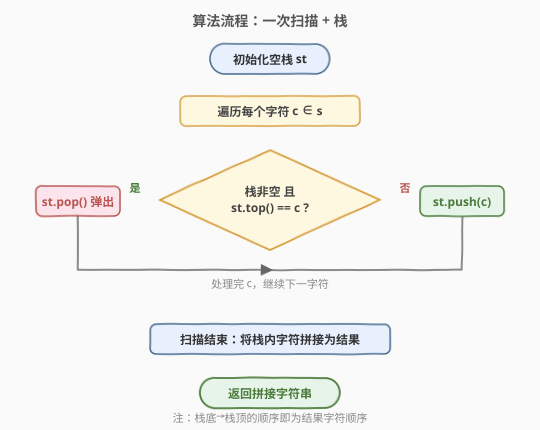
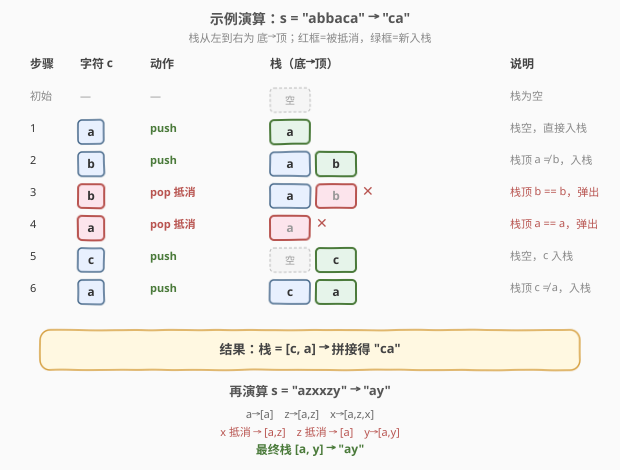

# LeetCode 删除字符串中的所有相邻重复项 题解

## 1. 题目概述

- **标题 / 题号**：删除字符串中的所有相邻重复项（#1047，easy）
- **链接**：https://leetcode.cn/problems/remove-all-adjacent-duplicates-in-string/
- **难度**：简单
- **标签**：栈、字符串

**题意**：给出由小写字母组成的字符串 `s`，**重复项删除操作**会选择两个**相邻且相同**的字母并删除它们。在 `s` 上反复执行该操作，直到无法继续删除。完成所有删除操作后返回**最终的字符串**（答案保证唯一）。

**示例 1**：

```text
输入：s = "abbaca"
输出："ca"
解释：在 "abbaca" 中，先删除 "bb" 得到 "aaca"，再删除 "aa" 得到 "ca"。
```

**示例 2**：

```text
输入：s = "azxxzy"
输出："ay"
```

**约束**：

- $1 \leq \text{s.length} \leq 10^5$
- `s` 仅由小写英文字母组成

> 💡 关键点：删除一对后，原本不相邻的字符可能变成相邻并再次触发删除（如 `"abba"` 删 `bb` 后 `aa` 又相邻）。因此不能只做一遍扫描，需考虑「连锁消除」。

## 2. 解题思路

### 2.1 暴力思路：反复扫描删除

反复扫描字符串，每轮找到一对相邻相同的字符就删除，直到某轮没有可删除的对。每轮扫描 `O(n)`，最坏要 `n/2` 轮（如 `"abab...ab"` 删完逐层塌缩），总计 $O(n^2)$；且每次删除涉及字符串挪动，常数大。对 $n = 10^5$ 不可接受。

### 2.2 核心观察：栈匹配相邻重复项



相邻重复对的消除本质是**后进先出（LIFO）**语义：一对相同字符中，**后出现**的那个先被拿来与「左边紧邻」的字符配对消除。这正与栈天然契合。

**核心策略**——用一个栈保存**尚未配对的字符**：

- 遍历每个字符 `c`：
  - 若**栈非空且栈顶 == `c`**：说明 `c` 与左边紧邻的未配对字符相同 → **弹出栈顶**（二者抵消）；
  - 否则：**压入 `c`**（等待后续配对）。

> 💡 **为什么只需看栈顶？** 栈里存的是「尚未被抵消的字符」，栈顶就是当前 `c` **左边紧邻**的未配对字符。更左边的字符已被栈顶「隔开」，不可能与 `c` 直接相邻。所以一次扫描就完成了所有连锁消除——因为抵消后新暴露的栈顶，会在处理下一个字符时自然参与比较。

扫描结束后，**栈内字符（从底到顶）的顺序就是最终结果**。

### 2.3 算法流程图



```
1. 初始化空栈 st
2. 遍历每个字符 c ∈ s：
   a. 若 st 非空 且 st.top() == c → st.pop()   // 抵消
   b. 否则                     → st.push(c)  // 入栈
3. 扫描结束：将栈内字符（底→顶）拼接为字符串返回
```

### 2.4 示例演算

以 `s = "abbaca"` 为例：



| 步骤 | 字符 c | 动作 | 栈（底→顶） | 说明 |
|------|--------|------|-------------|------|
| 初始 | — | — | `[]` | 栈空 |
| ① | `a` | push | `[a]` | 栈空，入栈 |
| ② | `b` | push | `[a, b]` | 栈顶 `a ≠ b`，入栈 |
| ③ | `b` | **pop** | `[a]` | 栈顶 `b == b`，抵消 |
| ④ | `a` | **pop** | `[]` | 栈顶 `a == a`，抵消（连锁！） |
| ⑤ | `c` | push | `[c]` | 栈空，入栈 |
| ⑥ | `a` | push | `[c, a]` | 栈顶 `c ≠ a`，入栈 |

扫描结束，栈 = `[c, a]`，拼接得 **`"ca"`**。

> 💡 第 ③ 步抵消 `bb` 后，栈顶变回 `a`；第 ④ 步的 `a` 恰好与新栈顶 `a` 配对——这就是「删除 `bb` 后 `aa` 变相邻」的连锁消除，被栈自动处理。再演算 `"azxxzy"`：`a→[a]`、`z→[a,z]`、`x→[a,z,x]`、`x` 抵消→`[a,z]`、`z` 抵消→`[a]`、`y→[a,y]`，结果 `"ay"`。

## 3. 参考代码

### C++

```cpp
class Solution {
public:
    string removeDuplicates(string s) {
        string st;                 // 直接用 string 模拟栈，栈顶 = 末尾
        for (char c : s) {
            if (!st.empty() && st.back() == c)
                st.pop_back();     // 栈顶 == c，抵消
            else
                st.push_back(c);   // 否则入栈
        }
        return st;                 // 栈底→栈顶即结果，无需再拼接
    }
};
```

### Python

```python
class Solution:
    def removeDuplicates(self, s: str) -> str:
        st = []
        for c in s:
            if st and st[-1] == c:
                st.pop()           # 栈顶 == c，抵消
            else:
                st.append(c)       # 否则入栈
        return ''.join(st)         # 栈底→栈顶拼接为结果
```

> 💡 **C++ 小技巧**：用 `string` 本身当栈（`back()`/`push_back()`/`pop_back()`），栈内字符顺序天然就是结果顺序，省去最后把 `stack<char>` 倒回字符串的步骤，更简洁高效。

## 4. 复杂度分析

| 维度 | 复杂度 | 说明 |
|------|--------|------|
| **时间** | $O(n)$ | 每个字符最多入栈、出栈各一次，单趟扫描 |
| **空间** | $O(n)$ | 最坏情况无任何相邻重复（如 `"ababab"`），栈存 `n` 个字符 |

> 💡 暴力法 $O(n^2)$ 的问题在于「抵消后要回头重扫」；栈法把「回头」转化为「看栈顶」，每步 `O(1)`，连锁消除由栈结构自然承担。

## 5. 扩展：原地双指针解法

若允许修改输入字符串，可用**双指针**模拟栈，做到 $O(1)$ 额外空间：`write` 指针指向「栈顶」的下一写入位置。

```cpp
class Solution {
public:
    string removeDuplicates(string s) {
        int write = 0;                       // [0, write) 为结果区间，s[write-1] 即栈顶
        for (int read = 0; read < s.size(); ++read) {
            if (write > 0 && s[write - 1] == s[read])
                --write;                     // 栈顶 == 当前，回退（弹出）
            else
                s[write++] = s[read];        // 入栈（写入）
        }
        s.resize(write);
        return s;
    }
};
```

逻辑与栈法完全同构，只是把「栈」复用了输入字符串的前缀空间。会破坏原字符串，面试中作为「空间优化」的追问应答即可。

## 6. 面试要点

**Q1：为什么用栈而不是一遍扫描直接比较相邻？**
> 一遍直接比较只能删掉**原始相邻**的对，删完后新变成相邻的对（连锁消除）就处理不到。栈把「左边紧邻的未配对字符」始终维护在栈顶，抵消后新栈顶自动成为下一个比较对象，一次扫描即完成全部连锁消除。

**Q2：为什么只需比较栈顶，不用看更深的栈元素？**
> 栈里都是「尚未配对」的字符，栈顶就是当前字符 `c` 左边紧邻的未配对字符。更深的字符被栈顶隔开，与 `c` 不相邻，不可能配对。只有当栈顶被抵消弹掉后，更深的元素才会「暴露」成新栈顶参与下一轮比较。

**Q3：栈内字符顺序为什么就是答案？**
> 入栈顺序保留了字符在原串中的相对先后，且只有相邻相同才成对删除。栈从底到顶的顺序就是未被抵消字符在原串中从左到右的顺序，直接拼接即结果。

**Q4：能否做到 $O(1)$ 额外空间？**
> 可以，用双指针复用输入字符串前缀当栈（见第 5 节）。`write` 指针模拟栈顶，抵消时 `write--`、入栈时写入并 `write++`。C++ 中 `string` 可原地修改，Python 字符串不可变则仍需 `O(n)` 列表。

**Q5：本题与括号匹配、行星碰撞有什么共同点？**
> 三者都是「相邻元素按规则抵消」的栈模型：20 题是左右括号配对、735 题是反向行星碰撞、本题是相同字符抵消。核心都是「新元素只与栈顶判定，满足条件就弹出，否则入栈」，属于同一套栈模拟模板。

## 同类练习题

| # | 题目 | 与本题的关联 |
|---|------|-------------|
| 20 | [有效的括号](https://leetcode.cn/problems/valid-parentheses/)（[题解](../0001-0100/20_有效括号.md)） | 栈匹配的母题，右括号与栈顶左括号配对弹出，同构于本题的「相同即抵消」 |
| 735 | [行星碰撞](https://leetcode.cn/problems/asteroid-collision/)（[题解](../0701-0800/735_行星碰撞.md)） | 栈模拟相邻碰撞消除，方向相反才判定，对照本题「相同才抵消」的判定条件差异 |
| 1209 | [删除字符串中的所有相邻重复项 II](https://leetcode.cn/problems/remove-all-adjacent-duplicates-in-string-ii/) | 本题的泛化版——删除 **k 个**连续相同而非 2 个，栈需额外记录连续计数 |
| 2390 | [从字符串中移除星号](https://leetcode.cn/problems/removing-stars-from-a-string/) | 星号删除左侧最近字符，同样是「栈顶参与操作」的栈模拟 |
| 71 | [简化路径](https://leetcode.cn/problems/simplify-path/)（[题解](../0001-0100/71_简化路径.md)） | 栈模拟路径层级的压栈/弹栈，另一类「逐元素判定栈顶」的应用 |
