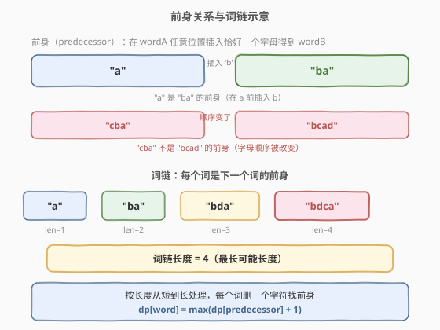
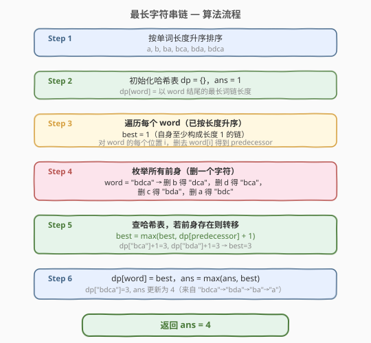
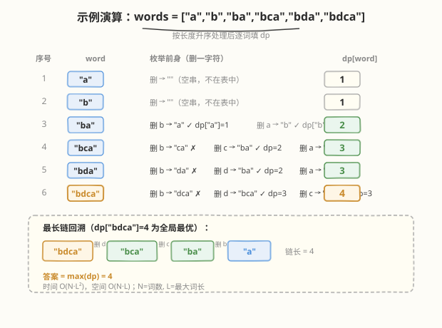

# 最长字符串链

- **题目名称**：最长字符串链
- **链接**：[1048. 最长字符串链](https://leetcode.cn/problems/longest-string-chain/)
- **难度**：中等
- **标签**：数组、哈希表、动态规划、排序

## 1. 题目概述

给出一个单词数组 `words`，每个单词由小写英文字母组成。若**不改变其他字符的顺序**，在 `wordA` 的任意位置添加**恰好一个**字母使其变成 `wordB`，则称 `wordA` 是 `wordB` 的**前身**。例如 `"abc"` 是 `"abac"` 的前身，而 `"cba"` 不是 `"bcad"` 的前身。

**词链**是单词 `[word_1, word_2, ..., word_k]`（$k \geq 1$）组成的序列，其中 `word_1` 是 `word_2` 的前身，`word_2` 是 `word_3` 的前身，依此类推。单个单词本身就是长度为 1 的词链。

从 `words` 中选择单词组成词链，返回**最长可能长度**。

**示例 1**：

```text
输入：words = ["a","b","ba","bca","bda","bdca"]
输出：4
解释：最长词链之一为 ["a","ba","bda","bdca"]
```

**示例 2**：

```text
输入：words = ["xbc","pcxbcf","xb","cxbc","pcxbc"]
输出：5
解释：所有单词都可放入词链 ["xb","xbc","cxbc","pcxbc","pcxbcf"]
```

**示例 3**：

```text
输入：words = ["abcd","dbqca"]
输出：1
解释：["abcd","dbqca"] 不是有效词链，因为字母顺序被改变了
```

**约束条件**：

- $1 \leq \text{words.length} \leq 1000$
- $1 \leq \text{words[i].length} \leq 16$
- `words[i]` 仅由小写英文字母组成

> 💡 本题与 [300. 最长递增子序列](../0201-0300/300_最长递增子序列.md) 思想一脉相承——都是「以某元素结尾的最长链」型 DP。区别在于：LIS 的转移是「往前扫所有更小的元素」，而本题的转移是「删一个字符枚举前身，哈希查表」，把 $O(n^2)$ 的扫描优化到 $O(L^2)$。

---

## 2. 解题思路

### 2.1 暴力思路：枚举所有排列

对 `words` 的所有排列，检查每个排列是否构成合法词链（后一个是前一个的「前身反过来」即前者是后者的前身），取最长合法排列长度。排列数 $n!$，$n = 1000$ 时完全不可行。

退一步用记忆化搜索：以某个单词为起点，DFS 尝试接上所有可能的「后继」（插入一个字符后仍在 `words` 中的单词），但每步需遍历整个词表 + 26 个插入位置 × $L$ 个位置 = $26L$ 种后继候选，且状态空间为单词的子序列组合，难以有效记忆化。

### 2.2 核心观察：按长度排序 + 删字符找前身



关键观察有两点：

1. **词链中单词长度严格递增 1**：前身比后继恰好短一个字符。因此**按长度升序处理**，处理到某个 `word` 时，它的所有可能前身（长度恰好少 1）必然已经处理完毕。

2. **反向枚举前身**：与其问「`word` 能接在哪些词后面」，不如问「从 `word` 删一个字符能得到哪些长度−1 的串」。一个长度为 $L$ 的单词只有 $L$ 种删法，每种产生一个唯一的前身候选。用哈希表 $O(1)$ 查询该前身是否在 `words` 中即可。

> 💡 **为什么删字符而非插字符？** 插字符需要枚举 26 个字母 × $L+1$ 个位置 = $26(L+1)$ 种候选；而删字符只需 $L$ 种，少了一个 26 倍常数。这是本题最核心的优化。

定义 `dp[word]` = **以 `word` 结尾的最长词链长度**。初始每个单词至少构成长度为 1 的链（自身）。转移方程：

$$
dp[\text{word}] = \max\bigl(1,\ \max_{\text{pred} \in \text{Predecessors}(\text{word})} dp[\text{pred}] + 1\bigr)
$$

其中 $\text{Predecessors}(\text{word})$ = 从 `word` 删除一个字符得到的所有在 `words` 中出现过的字符串。

### 2.3 算法流程图



具体步骤：

1. **按长度升序排序** `words`。长度相同的单词顺序无关紧要（它们互不为前身）。
2. **初始化**哈希表 `dp = {}`，答案 `ans = 1`。
3. **遍历**每个 `word`（已排序，保证前身先处理）：
   - `best = 1`（自身至少是长度 1 的链）。
   - 对 `word` 的每个位置 `i`，删除 `word[i]` 得到 `pred`。
   - 若 `pred` 在 `dp` 中：`best = max(best, dp[pred] + 1)`。
   - `dp[word] = best`，`ans = max(ans, best)`。
4. **返回** `ans`。

> ⚠️ **排序的关键作用**：按长度升序保证处理 `word` 时，所有长度更短（包括恰好少 1）的单词已入表。若不排序，`dp[pred]` 可能尚未计算，转移失效。

### 2.4 示例演算

以 `words = ["a","b","ba","bca","bda","bdca"]` 为例。排序后顺序为 `"a", "b", "ba", "bca", "bda", "bdca"`：



| 序号 | word | 枚举前身（删一字符） | dp[word] | 说明 |
|------|------|----------------------|----------|------|
| 1 | `"a"` | `""`（不在表中） | 1 | 无前身，自身长度 1 |
| 2 | `"b"` | `""`（不在表中） | 1 | 无前身，自身长度 1 |
| 3 | `"ba"` | `"a"` ✓(dp=1), `"b"` ✓(dp=1) | 2 | max(1+1, 1+1) = 2 |
| 4 | `"bca"` | `"ca"` ✗, `"ba"` ✓(dp=2), `"bc"` ✗ | 3 | max(1, 2+1) = 3 |
| 5 | `"bda"` | `"da"` ✗, `"ba"` ✓(dp=2), `"bd"` ✗ | 3 | max(1, 2+1) = 3 |
| 6 | `"bdca"` | `"dca"` ✗, `"bca"` ✓(dp=3), `"bda"` ✓(dp=3), `"bdc"` ✗ | **4** ⭐ | max(1, 3+1) = 4 |

答案 $= \max(dp) = 4$，对应词链 `["a", "ba", "bca", "bdca"]` 或 `["a", "ba", "bda", "bdca"]`。

> 💡 **示例 2**：`["xbc","pcxbcf","xb","cxbc","pcxbc"]` 排序后为 `"xb"→"xbc"→"cxbc"→"pcxbc"→"pcxbcf"`，每步前身都在表中，dp 依次为 1,2,3,4,5，答案 5。

---

## 3. 参考代码

### C++

```cpp
class Solution {
  public:
    int longestStrChain(vector<string>& words) {
        sort(words.begin(), words.end(),
             [](const string& a, const string& b) {
                 return a.size() < b.size();
             });
        unordered_map<string, int> dp;
        int ans = 1;
        for (const string& w : words) {
            int best = 1;
            for (int i = 0; i < (int)w.size(); ++i) {
                string pred = w.substr(0, i) + w.substr(i + 1);
                auto it = dp.find(pred);
                if (it != dp.end()) {
                    best = max(best, it->second + 1);
                }
            }
            dp[w] = best;
            ans = max(ans, best);
        }
        return ans;
    }
};
```

### Python

```python
class Solution:
    def longestStrChain(self, words: List[str]) -> int:
        words.sort(key=len)
        dp = {}
        ans = 1
        for w in words:
            best = 1
            for i in range(len(w)):
                pred = w[:i] + w[i + 1:]
                if pred in dp:
                    best = max(best, dp[pred] + 1)
            dp[w] = best
            ans = max(ans, best)
        return ans
```

> ⚠️ **易错点**：排序必须按**长度**而非字典序。长度相同的两个单词互不为前身（前身必须短 1），故同长度内的顺序不影响正确性。另外 `substr` 拼接时注意 `w.substr(0, i)` 取前 `i` 个字符，`w.substr(i + 1)` 取从 `i+1` 到末尾，跳过第 `i` 个字符。

---

## 4. 复杂度分析

| 维度 | 复杂度 | 说明 |
|------|--------|------|
| 时间复杂度 | $O(N \log N \cdot L + N \cdot L^2)$ | 排序 $O(NL \log N)$（字符串比较 $O(L)$）+ DP 遍历 $N$ 个词各删 $L$ 次、每次拼接 $O(L)$ |
| 空间复杂度 | $O(N \cdot L)$ | 哈希表存储 $N$ 个单词及其 dp 值 |

> 💡 本题 $N \leq 1000$、$L \leq 16$，故 $N \cdot L^2 \leq 1000 \times 256 = 256000$，非常快。瓶颈在排序 $O(NL \log N) \approx 16000 \times 10 = 160000$，也可忽略。

---

## 5. 扩展：LIS 视角与通用「DAG 上最长路」

本题本质是一个 **DAG 上的最长路径**问题：

- **节点**：`words` 中的每个单词。
- **有向边**：`wordA → wordB` 当且仅当 `wordA` 是 `wordB` 的前身（长度差恰好 1 且可删字符得到）。
- **目标**：DAG 上的最长路径（节点数）。

通用解法是拓扑排序后 DP，但本题的 DAG 有特殊结构——**边只从长度 $k$ 指向长度 $k+1$**，因此按长度排序等价于拓扑序，无需显式建图。

与 [300. 最长递增子序列](https://leetcode.cn/problems/longest-representation/) 的对比：

| 维度 | LIS (300) | 本题 (1048) |
|------|-----------|-------------|
| 元素 | 整数 | 字符串 |
| 前驱关系 | `nums[j] < nums[i]` | 删一字符后在词表中 |
| 转移 | 往前扫所有 $j < i$ | 枚举 $L$ 种删除 + 哈希查 |
| 时间 | $O(n^2)$ 或 $O(n \log n)$ | $O(N \cdot L^2)$ |
| 关键优化 | 二分找位置 | 删字符缩小候选集 |

> 💡 若把「前身」改为「子序列」关系（不要求长度差 1），则变为 [139. 单词拆分](../0001-0100/139_单词拆分.md) 的变体，需更复杂的状态定义。

---

## 6. 面试要点

1. **为什么按长度排序？**
   - 词链中相邻单词长度差恰好 1，前身必比后继短。按长度升序处理，保证处理到某个 `word` 时其所有可能前身（长度−1）已在哈希表中，无需回溯。

2. **为什么删字符而不是插字符枚举后继？**
   - 删字符只需枚举 $L$ 个位置，插字符需枚举 $26 \times (L+1)$ 个候选（字母 × 位置）。删字符少一个 26 倍常数，且产生的前身候选唯一确定。

3. **dp 的状态定义是什么？为什么不用数组下标？**
   - `dp[word]` = 以 `word` 结尾的最长词链长度。用哈希表而非数组，是因为键是字符串而非整数下标，哈希 $O(1)$ 查询。

4. **与 300（LIS）的异同？**
   - **同**：都是「以某元素结尾的最长链」型 DP，转移都是从合法前驱取 max+1。
   - **异**：LIS 前驱判定是数值比较（$O(1)$ 但需扫所有 $j$），本题前驱判定是字符串操作（$O(L)$ 但只需 $L$ 种删法 + 哈希查）。LIS 可二分优化到 $O(n \log n)$，本题无需二分。

5. **如果有重复单词怎么办？**
   - 约束保证 `words` 中元素**唯一**（由题意隐含，且 LeetCode 测试用例无重复）。若有重复，排序后重复词会相邻，`dp` 会被覆盖为相同值，不影响正确性——但词链定义中重复词不合法（长度相同不能互为前身）。

---

## 7. 同类练习题

- [300. 最长递增子序列](https://leetcode.cn/problems/longest-increasing-subsequence/)（[题解](../0201-0300/300_最长递增子序列.md)）：同为「以某元素结尾的最长链」DP，对比数值比较与字符串操作的转移差异
- [139. 单词拆分](https://leetcode.cn/problems/word-break/)（[题解](../0001-0100/139_单词拆分.md)）：字符串 DP + 哈希查表，但判定方向相反（拆分而非拼接）
- [127. 单词接龙](https://leetcode.cn/problems/word-ladder/)：图上 BFS 最短路径，边定义为「改一个字母」，对比「删一个字母」的前身关系
- [72. 编辑距离](https://leetcode.cn/problems/edit-distance/)（[题解](../0001-0100/72_编辑距离.md)）：字符串 DP 的母题，删除/插入/替换三种操作的二维 DP
- [14. 最长公共前缀](https://leetcode.cn/problems/longest-common-prefix/)（[题解](../0001-0100/14_最长公共前缀.md)）：字符串基础操作，对比本题的逐字符删除枚举
