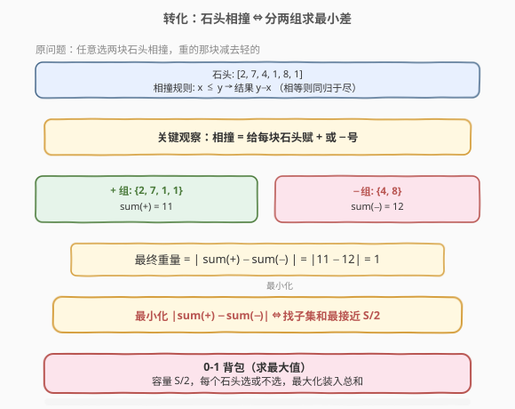
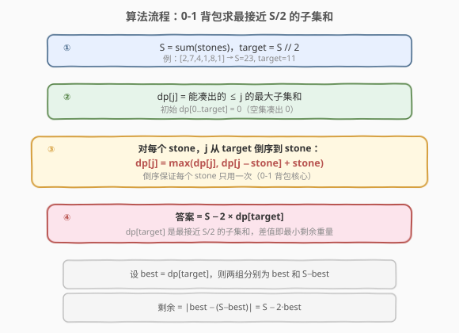
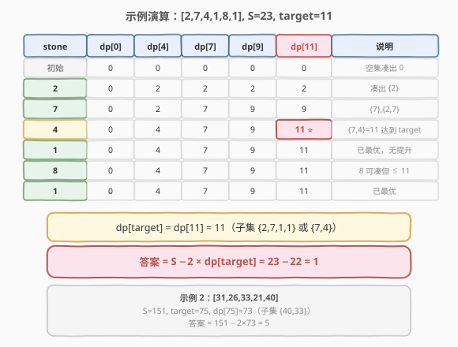

# 最后一块石头的重量 II

- **题目名称**：最后一块石头的重量 II
- **链接**：[1049. 最后一块石头的重量 II](https://leetcode.cn/problems/last-stone-weight-ii/)
- **难度**：中等
- **标签**：数组、动态规划、背包

## 1. 题目概述

给定一个正整数数组 `stones`，每回合**任选两块石头**相撞：设重量 `x ≤ y`，若 `x == y` 则两块同归于尽，若 `x != y` 则 `x` 被粉碎、`y` 变为 `y − x`。重复直到**至多剩一块**石头，返回其**最小可能重量**（若无石头剩余则返回 `0`）。

**示例 1**：

```text
输入：stones = [2,7,4,1,8,1]
输出：1
解释：2 和 4 相撞 → 2；7 和 8 相撞 → 1；2 和 1 相撞 → 1；1 和 1 相撞 → 0；最后剩 [1]。
```

**示例 2**：

```text
输入：stones = [31,26,33,21,40]
输出：5
```

**约束条件**：

- $1 \leq \text{stones.length} \leq 30$
- $1 \leq \text{stones[i]} \leq 100$

> 💡 与 [1046. 最后一块石头的重量](https://leetcode.cn/problems/last-stone-weight/) 的区别：1046 每回合**固定选最大的两块**，是模拟题；1049 **可任选两块**，求最优策略，是 DP 题。

---

## 2. 解题思路

### 2.1 暴力思路：枚举相撞顺序

每回合从 $n$ 块石头中选两块，相撞后剩余石头数减一。共有 $n-1$ 回合，每回合的选法呈阶乘级增长，$n = 30$ 时完全不可行。

退一步，用记忆化搜索：状态是「当前剩余石头的多重集合」，但状态空间仍然极大（每步可能产生新的重量值），无法有效记忆。

### 2.2 核心观察：相撞 = 给每块石头赋正负号



关键观察：**无论以什么顺序相撞，最终剩下石头的重量一定可以表示为** $|\sum_{i \in A} w_i - \sum_{i \in B} w_i|$，其中 $A, B$ 是对原石头的某种**二分划分**（每块石头要么归入「正组」、要么归入「负组」）。

> 💡 **直觉理解**：两块石头 $x, y$ 相撞得到 $|x - y|$，等价于给一块赋 $+$、一块赋 $−$，再做绝对值。多轮相撞就是不断把符号「传递」下去——最终每块石头都获得了一个 $+$ 或 $−$ 号，结果就是 $|\sum (\pm w_i)|$。

设总和 $S = \sum w_i$，令正组和为 $P$、负组和为 $N = S - P$，则剩余重量为：

$$
|P - N| = |P - (S - P)| = |2P - S|
$$

**最小化** $|2P - S|$，等价于让 $P$ 尽可能接近 $S / 2$。这转化为：

> **从** `stones` **中选若干元素组成子集，使其和尽可能接近（但不超过）** $S / 2$。

这正是 **0-1 背包**的「求最大值」版本——容量 $\lfloor S/2 \rfloor$，每件物品重量 = 价值 = `stones[i]`，最大化装入总价值。

### 2.3 算法流程图



定义 `dp[j]` = 用已处理的石头**能凑出的、不超过** `j` **的最大子集和**。初始 `dp[0..target] = 0`（空集凑出 0）。

对每个 `stone`（`j` 从 `target` **倒序**到 `stone`）：

$$
dp[j] = \max(dp[j],\ dp[j - \text{stone}] + \text{stone})
$$

- `dp[j]`：不选当前 `stone`，沿用旧值。
- `dp[j - stone] + stone`：选当前 `stone`，看去掉它后能凑出的最大值再加上它。

> ⚠️ **倒序的原因**：与 [416. 分割等和子集](../0401-0500/416_分割等和子集.md) 完全一致——一维 DP 中 `j` 从大到小遍历，保证 `dp[j - stone]` 用的是**上一轮**（未选当前 `stone`）的值，避免同一石头被重复选取。升序遍历会退化为完全背包。

最终答案：

$$
\text{answer} = S - 2 \times dp[\text{target}]
$$

### 2.4 示例演算

以 `stones = [2,7,4,1,8,1]` 为例：$S = 23$，$\text{target} = 11$。`dp` 数组长度 12，初始全 0。下表列出关键列的变化：



| 处理 stone | dp[0] | dp[4] | dp[7] | dp[9] | dp[11] | 说明 |
|------------|-------|-------|-------|-------|--------|------|
| 初始       | 0     | 0     | 0     | 0     | 0      | 空集凑出 0 |
| 2          | 0     | 2     | 2     | 2     | 2      | 凑出 {2} |
| 7          | 0     | 2     | 7     | 9     | 9      | 凑出 {7}、{2,7} |
| 4          | 0     | 4     | 7     | 9     | **11** ⭐ | 凑出 {7,4}=11，达到 target |
| 1          | 0     | 4     | 7     | 9     | 11     | dp[11] 已达 target |
| 8          | 0     | 4     | 7     | 9     | 11     | 8 可凑但无法超过 11 |
| 1          | 0     | 4     | 7     | 9     | 11     | 已最优 |

$dp[11] = 11$（子集 $\{7, 4\}$ 或 $\{2, 7, 1, 1\}$），答案 $= 23 - 2 \times 11 = 1$。

> 💡 示例 2：`[31,26,33,21,40]`，$S = 151$，$\text{target} = 75$。最大子集和 $\leq 75$ 的是 $\{40, 33\} = 73$，答案 $= 151 - 2 \times 73 = 5$。

---

## 3. 参考代码

### C++

```cpp
class Solution {
  public:
    int lastStoneWeightII(vector<int>& stones) {
        int s = accumulate(stones.begin(), stones.end(), 0);
        int target = s / 2;
        vector<int> dp(target + 1, 0);
        for (int st : stones) {
            for (int j = target; j >= st; --j) {
                dp[j] = max(dp[j], dp[j - st] + st);
            }
        }
        return s - 2 * dp[target];
    }
};
```

### Python

```python
class Solution:
    def lastStoneWeightII(self, stones: List[int]) -> int:
        s = sum(stones)
        target = s // 2
        dp = [0] * (target + 1)
        for st in stones:
            for j in range(target, st - 1, -1):
                dp[j] = max(dp[j], dp[j - st] + st)
        return s - 2 * dp[target]
```

> ⚠️ **易错点**：内层循环必须 `j` 从 `target` 递减到 `st`。若写成升序，`dp[j - st]` 会用到本轮刚被当前 `st` 更新过的值，导致同一石头被重复选取，退化为完全背包。

---

## 4. 复杂度分析

| 维度 | 复杂度 | 说明 |
|------|--------|------|
| 时间复杂度 | $O(n \cdot \text{target})$ | $n$ 块石头，每块扫一遍长度 $\text{target}+1$ 的 dp |
| 空间复杂度 | $O(\text{target})$ | 一维 dp，长度 $\text{target}+1$ |

> 💡 本题 $n \leq 30$、$\text{stones[i]} \leq 100$，故 $S \leq 3000$，$\text{target} \leq 1500$，$n \cdot \text{target} \leq 45000$，非常快。

---

## 5. 扩展：为什么「相撞等价于赋正负号」

严格证明可用**数学归纳法**。对石头数量 $n$ 归纳：

- **基础**（$n = 1$）：只有一块石头，不撞，结果 $= w_1 = |(+1) \cdot w_1|$。✓
- **基础**（$n = 2$）：两块相撞得 $|w_1 - w_2|$，即 $|(+1)w_1 + (-1)w_2|$。✓
- **归纳**：设 $n = k$ 时结论成立。对 $n = k+1$，任选两块 $x, y$ 相撞，结果为 $|x - y|$。将 $|x - y|$ 视为一块「合成石头」（重量 $|x - y|$，内部已确定符号），剩余 $k$ 块由归纳假设知最终结果 $= |\sum \pm w_i|$。✓

因此，**所有可能的相撞顺序产生的最终重量，都是某种** $\pm$ **赋值下的** $|\sum \pm w_i|$。反过来，**使两组和最接近的划分一定可达**（因为最小差 $\leq \max(w_i)$，总能通过合适的相撞顺序实现）。

> 💡 这也解释了为什么不需要关心相撞顺序——**顺序只决定** $\pm$ **赋值，而不改变「最终重量 = 两组差」的结构**。所以问题从「搜索最优相撞序列」简化为「找最优子集划分」。

---

## 6. 面试要点

1. **为什么相撞等价于赋正负号？**
   - 两块石头 $x, y$ 相撞得 $|x - y| = |(+x) + (-y)|$，即一块取 $+$、一块取 $−$。多轮相撞把符号层层传递，最终每块石头获得一个 $+$ 或 $−$，结果为 $|\sum \pm w_i|$。可用归纳法严格证明。

2. **为什么是 0-1 背包而不是完全背包？**
   - 每块石头只能被选中一次（归入正组或负组），不能重复使用。一维 DP 中 `j` 倒序遍历保证每件物品只用一次；若升序则退化为完全背包（物品无限取），答案错误。

3. **与 416（分割等和子集）有什么异同？**
   - **同**：都是 0-1 背包框架，一维 DP + 倒序遍历，目标都是找「最接近 $S/2$ 的子集和」。
   - **异**：416 是**判定**问题（能否恰好等于 $S/2$，布尔 DP），本题是**最值**问题（求不超过 $S/2$ 的最大和，整数 DP），转移算子从 `|` 变为 `max`。

4. **为什么答案是 $S - 2 \times dp[\text{target}]$？**
   - $dp[\text{target}]$ 是正组和 $P$ 的最大值（$P \leq S/2$），负组和 $N = S - P$。剩余 $= N - P = (S - P) - P = S - 2P$。

5. **如果 $S$ 为奇数怎么办？**
   - 不影响。$\text{target} = \lfloor S/2 \rfloor$ 取整即可。$P \leq \text{target} < S/2$，剩余 $= S - 2P > 0$，仍正确。

---

## 7. 同类练习题

- [416. 分割等和子集](https://leetcode.cn/problems/partition-equal-subset-sum/)（[题解](../0401-0500/416_分割等和子集.md)）：0-1 背包「判定」版，对比布尔 DP 与本题最值 DP 的转移算子
- [494. 目标和](https://leetcode.cn/problems/target-sum/)（[题解](../0401-0500/494_目标和.md)）：0-1 背包「计数」版，同样是赋 $\pm$ 号转化，但求方案数而非最值
- [2035. 将数组分成两个数组并最小化数组和的差](https://leetcode.cn/problems/partition-array-into-two-arrays-to-minimize-sum-difference/)：Hard，数组长度翻倍（$2n \leq 60$），需 Meet-in-the-Middle
- [474. 一和零](https://leetcode.cn/problems/ones-and-zeroes/)（[题解](../0401-0500/474_一和零.md)）：二维费用 0-1 背包，扩展费用维度
- [1046. 最后一块石头的重量](https://leetcode.cn/problems/last-stone-weight/)：本题的「固定选最大两块」版，模拟题，对比贪心与 DP 的边界
