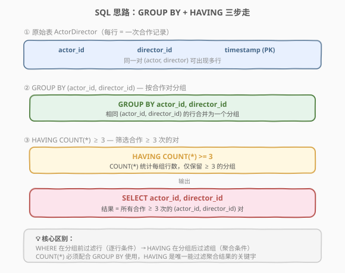
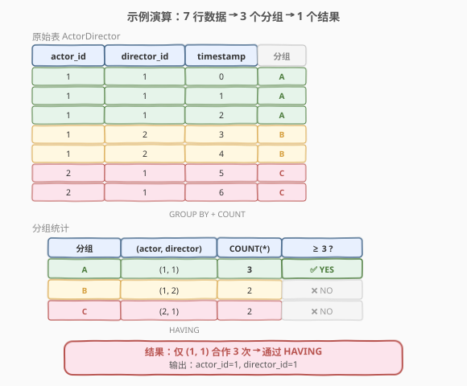

# LeetCode 合做过至少三次的演员和导演 题解

> ⚠️ **注意**：本题是 LeetCode 数据库（SQL）类题目，仅存在于 [leetcode.com](https://leetcode.com)，leetcode.cn 上无此题（CN 站编号从 1049 直接跳到 1051）。本文代码部分使用 SQL 而非 C++/Python。

## 1. 题目概述

- **标题 / 题号**：合作过至少三次的演员和导演（#1050，easy）
- **链接**：https://leetcode.com/problems/actors-and-directors-who-cooperate-at-least-three-times/
- **难度**：简单
- **标签**：SQL、数据库、GROUP BY、聚合

**题意**：给定表 `ActorDirector`，记录演员与导演的每次合作。请编写 SQL 查询，找出**合作过至少三次**的所有 `(actor_id, director_id)` 对。

**表结构**：

```text
表：ActorDirector
+-------------+---------+
| 列名        | 类型    |
+-------------+---------+
| actor_id    | int     |
| director_id | int     |
| timestamp   | int     |
+-------------+---------+
timestamp 是该表的主键（唯一标识一次合作记录）。
```

**示例 1**：

```text
输入：ActorDirector 表
+-------------+-------------+-------------+
| actor_id    | director_id | timestamp   |
+-------------+-------------+-------------+
| 1           | 1           | 0           |
| 1           | 1           | 1           |
| 1           | 1           | 2           |
| 1           | 2           | 3           |
| 1           | 2           | 4           |
| 2           | 1           | 5           |
| 2           | 1           | 6           |
+-------------+-------------+-------------+

输出：
+-------------+-------------+
| actor_id    | director_id |
+-------------+-------------+
| 1           | 1           |
+-------------+-------------+
解释：唯一合作达到 3 次的对是 (1, 1)，共出现 3 行。
```

**约束**：

- 每行记录表示一次合作，`timestamp` 为主键，不会重复。
- 同一 `(actor_id, director_id)` 对可在表中出现多行。

## 2. 解题思路

### 2.1 暴力思路：逐行扫描计数

用应用层代码（Python / Java）读出全表，用哈希表 `map<(actor_id, director_id), count>` 逐行累加，最后遍历哈希表输出 `count >= 3` 的键。

这能解决问题，但把**本该由数据库引擎高效完成的聚合操作**搬到了应用层，既低效也违背 SQL 的声明式哲学——应该让数据库做它擅长的事。

### 2.2 核心观察：GROUP BY + HAVING



本题的本质是**按合作对分组，统计每组行数，筛选满足条件的组**。SQL 天然提供了三个子句来完成这三步：

| 步骤 | SQL 子句 | 作用 |
|------|----------|------|
| ① 分组 | `GROUP BY actor_id, director_id` | 将相同 `(actor_id, director_id)` 的行合并为一组 |
| ② 计数 | `COUNT(*)` | 统计每组的行数（即合作次数） |
| ③ 筛选 | `HAVING COUNT(*) >= 3` | 只保留合作次数 ≥ 3 的组 |

> 💡 **WHERE vs HAVING**：`WHERE` 在**分组前**逐行过滤（不能用聚合函数），`HAVING` 在**分组后**对组过滤（可以用聚合函数）。本题的筛选条件 `COUNT(*) >= 3` 是对组的聚合结果做判断，必须用 `HAVING`。

### 2.3 算法流程图

完整的 SQL 执行流程如下：

```text
SELECT actor_id, director_id          ← ④ 最终输出列
FROM ActorDirector                    ← ① 扫描源表
GROUP BY actor_id, director_id        ← ② 按合作对分组
HAVING COUNT(*) >= 3;                 ← ③ 过滤合作 ≥ 3 次的组
```

SQL 的逻辑执行顺序为 `FROM → GROUP BY → HAVING → SELECT`，每一步逐步收敛数据集。

### 2.4 示例演算



以示例数据为例，7 行数据经 `GROUP BY (actor_id, director_id)` 后产生 3 个分组：

| 分组 | (actor_id, director_id) | COUNT(*) | ≥ 3 ? |
|------|------------------------|----------|-------|
| A    | (1, 1)                 | 3        | ✅ YES |
| B    | (1, 2)                 | 2        | ❌ NO  |
| C    | (2, 1)                 | 2        | ❌ NO  |

`HAVING COUNT(*) >= 3` 过滤后，仅分组 A 通过，输出 `(1, 1)`。

## 3. 参考代码

### SQL

```sql
SELECT actor_id, director_id
FROM ActorDirector
GROUP BY actor_id, director_id
HAVING COUNT(*) >= 3;
```

> 💡 **为什么用 `COUNT(*)` 而非 `COUNT(timestamp)`**：`COUNT(*)` 统计**所有行**（包括 NULL），`COUNT(column)` 只统计该列非 NULL 的行。本题 `timestamp` 是主键，不会有 NULL，两者结果相同，但 `COUNT(*)` 语义更清晰——"统计行数"，且不依赖任何具体列。

### Python（模拟验证，非提交代码）

如果需要在应用层实现等价逻辑（如本地测试验证）：

```python
from collections import defaultdict

def actors_and_directors(records: list[list[int]]) -> list[list[int]]:
    pair_count = defaultdict(int)
    for actor_id, director_id, _ in records:
        pair_count[(actor_id, director_id)] += 1
    return [[a, d] for (a, d), cnt in pair_count.items() if cnt >= 3]
```

## 4. 复杂度分析

| 维度 | 复杂度 | 说明 |
|------|--------|------|
| 时间复杂度 | $O(n)$ | 全表扫描一次，分组统计每行；若 `(actor_id, director_id)` 上有索引，聚合可利用索引加速 |
| 空间复杂度 | $O(k)$ | $k$ 为不同 `(actor_id, director_id)` 对的数量，聚合中间结果需存储每组的计数 |

> 💡 实际执行中，数据库引擎可能选择**排序聚合**（Sort-based）或**哈希聚合**（Hash-based）。前者需 $O(n \log n)$ 排序，后者需 $O(k)$ 哈希表空间，具体由查询优化器决定。

## 5. 扩展：GROUP BY 的小技巧

### 5.1 多列分组

`GROUP BY` 后跟多列时，按**列组合**分组，而非各自独立分组。本题 `GROUP BY actor_id, director_id` 是将 `(actor_id, director_id)` 作为一个整体键，而非分别按 `actor_id` 和 `director_id` 各分一次。

### 5.2 HAVING 中可引用列别名（部分数据库）

某些数据库（如 MySQL）允许在 `HAVING` 中使用 `SELECT` 中的列别名：

```sql
SELECT actor_id, director_id, COUNT(*) AS cnt
FROM ActorDirector
GROUP BY actor_id, director_id
HAVING cnt >= 3;   -- MySQL 支持，PostgreSQL / SQL Server 不支持
```

但标准 SQL 不保证此行为，建议在 `HAVING` 中**直接写聚合表达式**以保证可移植性。

### 5.3 如果要求"恰好 3 次"而非"至少 3 次"

将 `HAVING COUNT(*) >= 3` 改为 `HAVING COUNT(*) = 3` 即可。

## 6. 面试要点

1. **WHERE 和 HAVING 的区别是什么？**
   - `WHERE` 在 `GROUP BY` **之前**逐行过滤，不能用聚合函数（如 `COUNT`、`SUM`）。`HAVING` 在 `GROUP BY` **之后**对组过滤，可以使用聚合函数。本题的筛选条件是"合作次数 ≥ 3"，是对分组结果的聚合判断，必须用 `HAVING`。

2. **GROUP BY 多列时怎么分组？**
   - `GROUP BY a, b` 将 `(a, b)` 的**值组合**作为分组键。只有 `a` 和 `b` 都相同的行才会被分到同一组。不是"先按 a 分组，再按 b 分组"的嵌套分组。

3. **COUNT(*)、COUNT(column)、COUNT(DISTINCT column) 有什么区别？**
   - `COUNT(*)` 统计所有行（含 NULL）。`COUNT(column)` 统计该列非 NULL 的行数。`COUNT(DISTINCT column)` 统计该列不同非 NULL 值的个数。本题 `timestamp` 是主键无 NULL，三者中 `COUNT(*)` 语义最清晰。

4. **如果数据量很大（千万级），如何优化？**
   - 在 `(actor_id, director_id)` 上建复合索引，数据库引擎可走**索引-only 扫描**（Index-Only Scan），无需回表读取数据行。若进一步配合覆盖索引，可避免磁盘 I/O，大幅提升查询性能。

5. **SQL 的逻辑执行顺序是什么？**
   - `FROM → WHERE → GROUP BY → HAVING → SELECT → ORDER BY → LIMIT`。理解这个顺序是写对 SQL 的关键——`SELECT` 中的别名在 `HAVING` 阶段还未生成（标准 SQL），所以 `HAVING` 中不能引用 `SELECT` 的别名（部分数据库如 MySQL 例外）。

## 同类练习题

| # | 题目 | 与本题的关联 |
|---|------|-------------|
| 196 | [删除重复的电子邮箱](https://leetcode.cn/problems/delete-duplicate-emails/) | SQL 题，用 `GROUP BY` + `MIN(id)` 找重复行，再 `DELETE`，对比本题的 `SELECT` 输出 |
| 596 | [超过 5 名学生的课](https://leetcode.cn/problems/classes-more-than-5-students/) | SQL 题，`GROUP BY` + `HAVING COUNT(*) >= 5`，与本题完全同模板，仅阈值不同 |
| 620 | [有趣的电影](https://leetcode.cn/problems/not-boring-movies/) | SQL 题，`WHERE` 过滤 + `ORDER BY` 排序，对比 `WHERE`（逐行）与 `HAVING`（聚合）的使用场景 |
| 180 | [连续出现的数字](https://leetcode.cn/problems/consecutive-numbers/) | SQL 题，自连接 + `GROUP BY` + `HAVING`，比本题多一层连续性判断 |
| 184 | [部门工资最高的员工](https://leetcode.cn/problems/department-highest-salary/) | SQL 题，`JOIN` + `GROUP BY` + 聚合，综合考查多表关联与分组 |
