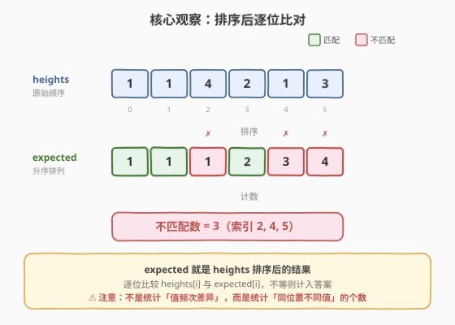
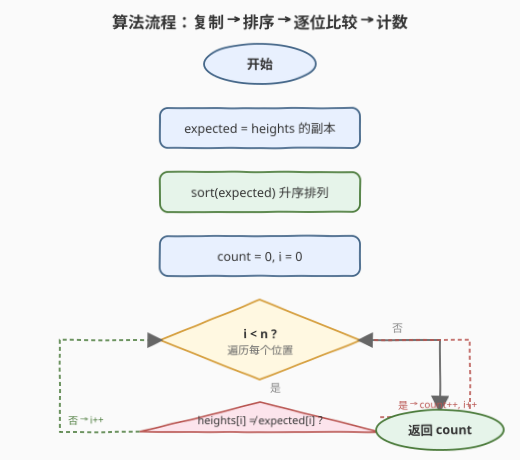

# 高度检查器

- **题目名称**：高度检查器
- **链接**：[1051. 高度检查器](https://leetcode.cn/problems/height-checker/)
- **难度**：简单
- **标签**：数组、计数排序、排序

## 1. 题目概述

学校拍年度合影，要求学生按身高**非递减**排成一列。给定整数数组 `heights` 表示当前站队的顺序（`heights[i]` 为第 `i` 位学生的身高），求**正确排序后**与当前排列**在多少个位置上身高不同**。

形式上，令 `expected = sorted(heights)`（升序），返回满足 `heights[i] != expected[i]` 的下标 `i` 的个数。

**示例 1**：

```text
输入：heights = [1,1,4,2,1,3]
输出：3
解释：
heights:  [1,1,4,2,1,3]
expected: [1,1,1,2,3,4]
索引 2、4、5 处身高不同，共 3 个。
```

**示例 2**：

```text
输入：heights = [5,1,2,3,4]
输出：5
解释：
heights:  [5,1,2,3,4]
expected: [1,2,3,4,5]
所有位置均不同。
```

**示例 3**：

```text
输入：heights = [1,2,3,4,5]
输出：0
解释：已有序，无需调整。
```

**约束条件**：

- $1 \leq \text{heights.length} \leq 100$
- $1 \leq \text{heights}[i] \leq 100$

> 💡 **关键直觉**：`expected` 就是 `heights` **排序后的结果**。问题本质是「排序 + 逐位比对」，不涉及实际交换操作，只统计**同位置值不同**的个数。

---

## 2. 解题思路

### 2.1 暴力思路

对每个位置 `i`，在 `heights` 中找第 `i` 小的值（用选择排序式的 $O(n)$ 扫描），与 `heights[i]` 比较。整体 $O(n^2)$，但 $n \leq 100$ 时完全可行。

> 💡 暴力的浪费在于：每个位置独立找第 `i` 小，重复扫描。其实**一次排序**就能得到所有位置的 `expected[i]`，再线性扫描比对即可。

### 2.2 核心观察：排序后逐位比对



两步转化：

1. **expected 即排序结果**：题目要求的「非递减排列」就是升序排序，故 `expected = sorted(heights)`。
2. **逐位比对计数**：遍历每个下标 `i`，若 `heights[i] != expected[i]` 则计数加一。

> ⚠️ **易错点**：统计的是「**同位置**身高不同」的个数，而非「需要移动的学生数」或「值频次差异」。例如 `heights = [1,1,4,2,1,3]`，虽然值 `1` 出现 3 次在原数组与排序后都一样，但位置 2 的 `4` 与 `expected[2]=1` 不同，仍需计入。

### 2.3 算法流程图



维护变量：

- `expected`：`heights` 的副本，排序后得到正确排列；
- `count`：不匹配位置数，初始 `0`。

**主循环**（`i` 从 `0` 到 `n-1`）：

1. **若** `heights[i] != expected[i]`：`count += 1`。
2. 继续。

循环结束返回 `count`。

### 2.4 示例演算

以 `heights = [1,1,4,2,1,3]` 为例，`expected = [1,1,1,2,3,4]`：

| i | heights[i] | expected[i] | 匹配? | count | 说明 |
|---|-----------|-------------|-------|-------|------|
| 0 | 1 | 1 | ✓ | 0 | — |
| 1 | 1 | 1 | ✓ | 0 | — |
| 2 | 4 | 1 | ✗ | 1 | 位置 2 不同 |
| 3 | 2 | 2 | ✓ | 1 | — |
| 4 | 1 | 3 | ✗ | 2 | 位置 4 不同 |
| 5 | 3 | 4 | ✗ | 3 | 位置 5 不同 |

返回 `count = 3`。

---

## 3. 参考代码

### C++

```cpp
class Solution {
  public:
    int heightChecker(vector<int>& heights) {
        vector<int> expected = heights;
        sort(expected.begin(), expected.end());
        int count = 0;
        for (int i = 0; i < (int)heights.size(); ++i) {
            if (heights[i] != expected[i]) {
                ++count;
            }
        }
        return count;
    }
};
```

### Python

```python
class Solution:
    def heightChecker(self, heights: List[int]) -> int:
        expected = sorted(heights)
        return sum(h != e for h, e in zip(heights, expected))
```

---

## 4. 复杂度分析

| 维度 | 复杂度 | 说明 |
|------|--------|------|
| 时间复杂度 | $O(n \log n)$ | 排序 $O(n \log n)$ + 一次遍历 $O(n)$ |
| 空间复杂度 | $O(n)$ | 额外副本 `expected` |

---

## 5. 扩展：计数排序优化（O(n + k)）

![计数排序优化：值域 [1,100] → 桶计数重建 expected](../images/height_checker_walkthrough.svg)

注意到 $1 \leq \text{heights}[i] \leq 100$，值域极小。可用**计数排序**免排序直接逐位重建 `expected[i]`：

1. 统计每个身高值的出现频次 `freq[h]`。
2. 维护指针 `h` 从 `1` 开始：当 `freq[h] == 0` 时 `h++`，否则 `expected[i] = h`、`freq[h]--`。
3. 逐位比较 `heights[i]` 与当前 `h`，不等则计数。

```cpp
class Solution {
  public:
    int heightChecker(vector<int>& heights) {
        int freq[101] = {};
        for (int h : heights) ++freq[h];
        int count = 0, h = 1;
        for (int i = 0; i < (int)heights.size(); ++i) {
            while (freq[h] == 0) ++h;      // 跳过空桶
            if (heights[i] != h) ++count;  // 逐位比对
            --freq[h];                     // 消费一个该身高的位置
        }
        return count;
    }
};
```

> 💡 **为什么有效？** 计数排序的本质是：`expected` 中前 `freq[1]` 个位置都是 `1`，接着 `freq[2]` 个位置都是 `2`，依此类推。指针 `h` 模拟「从最小值开始逐个弹出」，每弹出一个对应 `expected` 的一个位置，与 `heights[i]` 比对即可。无需显式构造 `expected` 数组，空间降到 $O(k)$（$k = 100$）。

### 两种解法对比

| 维度 | 排序 + 比对 | 计数排序 |
|------|------------|---------|
| 时间 | $O(n \log n)$ | $O(n + k)$，$k$ 为值域上界 |
| 空间 | $O(n)$（副本） | $O(k)$（频次数组） |
| 适用 | 通用，无值域限制 | 值域小时更优 |
| 代码量 | 简洁直观 | 稍多但常数更小 |

> ⚠️ 当值域 $k \gg n$ 时，计数排序退化（频次数组过大），排序 + 比对更稳。本题 $k = 100 \leq n_{\max} = 100$，两者实际性能接近。

---

## 6. 面试要点

1. **`expected` 是怎么得到的？**
   - 题目要求「非递减排列」，即升序排序。`expected` 就是 `sorted(heights)`，无需额外推导。

2. **统计的是「位置不同」还是「值不同」？**
   - 统计的是**同位置值不同**的个数（`heights[i] != expected[i]`），而非不同值的种类数或频次差异。即使某值在原数组和排序后出现次数相同，只要位置不对就计入。

3. **为什么计数排序可以省去显式排序？**
   - 计数排序用频次数组隐含了排序信息：`expected` 的前 `freq[1]` 位是 `1`，接着 `freq[2]` 位是 `2`……用指针 `h` 从小到大「弹出」即可逐位还原 `expected[i]`，边还原边比对。

4. **计数排序的 `while (freq[h] == 0)` 会不会超时？**
   - 不会。指针 `h` 在整个循环中只递增不回退，总共最多走到 `k`（值域上界），均摊每位置 $O(1)$，整体 $O(n + k)$。

5. **能否原地修改 `heights` 来省空间？**
   - 排序 + 比对法需要保留原始 `heights` 做比对，故需副本。计数排序法只读 `heights`、用 `freq` 数组代替副本，空间 $O(k)$ 且不修改输入，更优。

---

## 7. 同类练习题

- [1122. 数组的相对排序](https://leetcode.cn/problems/relative-sort-array/)：自定义排序顺序（给定 order 数组），同样值域小可用计数排序，对照本题的「升序」特例
- [1365. 有多少小于当前数字的数字](https://leetcode.cn/problems/how-many-numbers-are-smaller-than-the-current-number/)：值域 [0,100]，计数排序前缀和直接回答，同为「小值域 + 频次」家族
- [349. 两个数组的交集](https://leetcode.cn/problems/intersection-of-two-arrays/)：值域小时用频次/集合判定交集，计数思想延伸
- [274. H 指数](https://leetcode.cn/problems/h-index/)：计数排序 + 后缀和求阈值，本题频次数组的进阶应用
