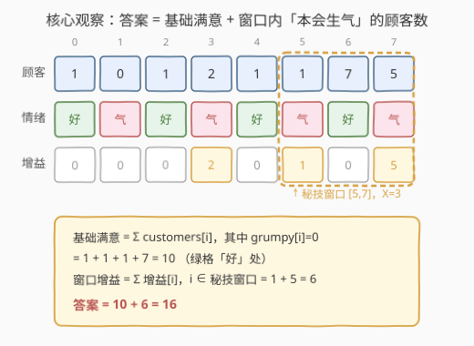
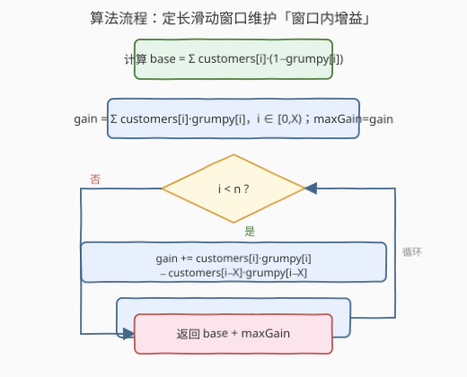
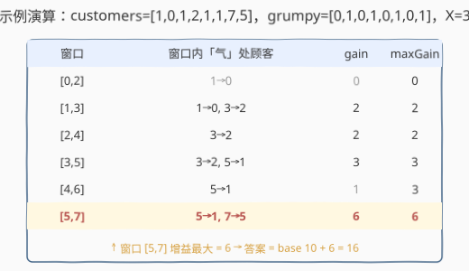

# 爱生气的书店老板

- **题目名称**：爱生气的书店老板
- **链接**：[1052. 爱生气的书店老板](https://leetcode.cn/problems/grumpy-bookstore-owner/)
- **难度**：中等
- **标签**：数组、滑动窗口、定长窗口

## 1. 题目概述

书店老板今天营业 `n` 分钟，每分钟有 `customers[i]` 位顾客进店并在该分钟结束时离开。老板在某些分钟会**生气**：`grumpy[i] = 1` 表示生气，`0` 表示不生气。**生气时进店的顾客不满意**，不生气时进店的顾客**满意**。

老板掌握一个秘技：能让连续 `minutes` 分钟（记作 `X`）**全程不生气**，但**只能用一次**。求全天**满意顾客的最大总数**。

**示例 1**：

```text
输入：customers = [1,0,1,2,1,1,7,5], grumpy = [0,1,0,1,0,1,0,1], minutes = 3
输出：16
解释：在最后 3 分钟使用秘技，窗口 [5,7] 内本会生气的顾客 1+5=6 被挽回。
      基础满意（不生气处）1+1+1+7=10，合计 10+6=16。
```

**示例 2**：

```text
输入：customers = [1], grumpy = [0], minutes = 1
输出：1
```

**约束条件**：

- $1 \leq \text{minutes} \leq \text{customers.length} == \text{grumpy.length} \leq 2 \times 10^4$
- $0 \leq \text{customers}[i] \leq 1000$
- $\text{grumpy}[i] \in \{0, 1\}$

> 💡 **直觉转化**：秘技只对**生气**的分钟有意义——在不生气的分钟用秘技纯属浪费（本来就满意）。因此问题拆为两半：① **基础满意**＝所有「不生气」分钟进店的顾客和（与秘技无关，恒定）；② **窗口增益**＝某个长度为 `X` 的窗口内所有「生气」分钟的顾客和（秘技把这些分钟从「不满意」扳成「满意」，挽回的量）。答案 ＝ 基础满意 ＋ 最大窗口增益。

---

## 2. 解题思路

### 2.1 暴力思路

枚举每一个长度为 `X` 的窗口起点 `i`，遍历窗口内每个位置 `j`，若 `grumpy[j] == 1` 则累加 `customers[j]` 得到该窗口增益；取所有窗口增益的最大值，加上基础满意。两重循环，最坏 $O(nX)$，当 $n = X = 2\times10^4$ 时约 $4\times10^8$ 次操作，会超时。

> 💡 暴力的浪费在于：相邻窗口只差一个进出元素，增益却整个重算。其实只需维护一个**定长滑动窗口**内的增益和，右端进、左端出各 $O(1)$ 增量更新即可。

### 2.2 核心观察：定长窗口维护「生气处顾客和」



把每个位置 `i` 的「**增益**」定义为 $\text{gain}[i] = \text{customers}[i] \cdot \text{grumpy}[i]$：

- `grumpy[i] == 0`（不生气）：本就满意，秘技用不到这，增益 `0`；
- `grumpy[i] == 1`（生气）：秘技若覆盖此分钟，可挽回 `customers[i]`，增益即 `customers[i]`。

于是：

- **基础满意** $= \sum_i \text{customers}[i] \cdot (1 - \text{grumpy}[i])$（恒定，与窗口无关）；
- **某窗口 `[l, r]` 的挽回量** $= \sum_{i=l}^{r} \text{gain}[i]$；
- **答案** $= \text{基础满意} + \max_{\text{窗口}} \sum_{i\in\text{窗口}} \text{gain}[i]$。

后者正是「**长度为 `X` 的子数组的最大和**」——经典定长滑动窗口，$O(n)$ 即可。

> ⚠️ **易错点**：别把窗口内**所有**顾客都算进增益。窗口里不生气的分钟本来就满意，秘技对它们没增益，只有 `grumpy[i] == 1` 处才计入挽回。乘以 `grumpy[i]` 是最简洁的写法，避免分支。

### 2.3 算法流程图



维护变量：

- `base`：基础满意数（不生气处的顾客和），初始 `0`；
- `gain`：当前窗口 `[i-X+1, i]` 内的增益和，随窗口滑动增量更新；
- `maxGain`：已扫到的最大窗口增益，初始为第一个窗口的增益。

**主循环**（`i` 从 `0` 到 `n-1`）：

1. 先累加 `base`：若 `grumpy[i] == 0`，`base += customers[i]`。
2. 把 `gain[i] = customers[i] * grumpy[i]` 计入当前窗口和 `gain`。
3. **若** `i >= X - 1`（窗口已满 `X` 个）：
   - 更新 `maxGain = max(maxGain, gain)`；
   - 把最左端 `gain[i - X + 1]` 移出窗口：`gain -= customers[i - X + 1] * grumpy[i - X + 1]`。

循环结束返回 `base + maxGain`。

> 💡 **定长窗口的写法**：与 [239. 滑动窗口最大值](../0201-0300/239_滑动窗口最大值.md) 的变长窗口不同，定长窗口的 `left = i - X + 1` 由 `right` 唯一确定，无需单独维护 `left` 指针与「左缩条件」——窗口长度恒为 `X`，满了就更新答案再丢掉最左端。

### 2.4 示例演算

以 `customers = [1,0,1,2,1,1,7,5]`，`grumpy = [0,1,0,1,0,1,0,1]`，`X = 3` 为例。

先算 `gain[i] = customers[i] * grumpy[i] = [0,0,0,2,0,1,0,5]`，`base = 1+1+1+7 = 10`（`grumpy=0` 处：下标 0、2、4、6）。



| 窗口 | 窗口内「气」处顾客 | gain | maxGain |
|------|-------------------|------|---------|
| `[0,2]` | 1→0 | 0 | 0 |
| `[1,3]` | 1→0, 3→2 | 2 | 2 |
| `[2,4]` | 3→2 | 2 | 2 |
| `[3,5]` | 3→2, 5→1 | 3 | 3 |
| `[4,6]` | 5→1 | 1 | 3 |
| `[5,7]` | 5→1, 7→5 | 6 | **6** |

最大增益在窗口 `[5,7]` 取到 `6`。答案 $= 10 + 6 = 16$。

> 💡 **窗口增量更新**：从 `[4,6]`（gain=1）滑到 `[5,7]`，进下标 7（gain 5）、出下标 4（gain 0），新 gain $= 1 + 5 - 0 = 6$，正是 $O(1)$ 增量。暴力法会重新求和下标 5、6、7，浪费已算的信息。

---

## 3. 参考代码

### C++

```cpp
class Solution {
  public:
    int maxSatisfied(vector<int>& customers, vector<int>& grumpy, int minutes) {
        int n = customers.size();
        int base = 0, gain = 0, maxGain = 0;
        for (int i = 0; i < n; ++i) {
            if (grumpy[i] == 0) base += customers[i];        // 基础满意
            gain += customers[i] * grumpy[i];                // 进窗
            if (i >= minutes - 1) {                          // 窗口满
                maxGain = max(maxGain, gain);
                gain -= customers[i - minutes + 1] * grumpy[i - minutes + 1]; // 出窗
            }
        }
        return base + maxGain;
    }
};
```

### Python

```python
class Solution:
    def maxSatisfied(self, customers: List[int], grumpy: List[int], minutes: int) -> int:
        base = gain = max_gain = 0
        for i, (c, g) in enumerate(zip(customers, grumpy)):
            if g == 0:
                base += c                                  # 基础满意
            gain += c * g                                  # 进窗
            if i >= minutes - 1:                           # 窗口满
                max_gain = max(max_gain, gain)
                gain -= customers[i - minutes + 1] * grumpy[i - minutes + 1]  # 出窗
        return base + max_gain
```

> 💡 **`customers[i] * grumpy[i]` 的妙处**：`grumpy[i]` 是 `0/1`，相乘自然实现了「生气处取顾客数、不生气处取 0」的筛选，省去 `if` 分支，代码更短且常数更小。等价于 `g ? c : 0`。

---

## 4. 复杂度分析

| 维度 | 复杂度 | 说明 |
|------|--------|------|
| 时间复杂度 | $O(n)$ | 单趟遍历，每个位置进窗/出窗各 $O(1)$，总计 $2n$ 次操作 |
| 空间复杂度 | $O(1)$ | 仅 `base`/`gain`/`maxGain` 三个变量，未额外开数组 |

> ⚠️ 没有显式构造 `gain` 数组，而是在遍历中**即时计算** `customers[i] * grumpy[i]`，故空间 $O(1)$。若先预处理 `gain` 数组再滑窗，空间升为 $O(n)$，时间不变但常数略大。

---

## 5. 扩展：前缀和实现定长窗口和

若不习惯「边进边出」的增量写法，可用**前缀和**求任意窗口和。令 `pref[i+1] = pref[i] + customers[i]*grumpy[i]`，则窗口 `[l, r]` 的增益 $= \text{pref}[r+1] - \text{pref}[l]$。枚举所有长度为 `X` 的窗口取最大：

```cpp
int maxSatisfied(vector<int>& customers, vector<int>& grumpy, int minutes) {
    int n = customers.size();
    vector<int> pref(n + 1, 0);
    int base = 0;
    for (int i = 0; i < n; ++i) {
        if (grumpy[i] == 0) base += customers[i];
        pref[i + 1] = pref[i] + customers[i] * grumpy[i];
    }
    int maxGain = 0;
    for (int l = 0; l + minutes <= n; ++l)
        maxGain = max(maxGain, pref[l + minutes] - pref[l]);
    return base + maxGain;
}
```

| 维度 | 滑动窗口（主解） | 前缀和 |
|------|-----------------|--------|
| 时间 | $O(n)$ | $O(n)$ |
| 空间 | $O(1)$ | $O(n)$（`pref` 数组） |
| 适用 | 定长窗口和的最值 | 任意区间和查询、窗口长度可变时更灵活 |

> 💡 当问题进一步变形为「窗口内需维护复杂状态（如最值、众数）」时，前缀和不再够用，需退回 [239. 滑动窗口最大值](../0201-0300/239_滑动窗口最大值.md) 的单调队列。本题只需求和，$O(1)$ 增量足矣。

---

## 6. 面试要点

1. **为什么把答案拆成「基础满意 + 窗口增益」？**
   - 秘技只影响「生气」的分钟：不生气处本就满意，秘技覆盖了也没增量。因此基础满意（不生气处顾客和）与秘技无关、恒定；秘技的贡献只来自窗口内「生气处」的顾客和。两者独立相加即答案，避免对每个窗口重算不生气处。

2. **`gain[i] = customers[i] * grumpy[i]` 为什么对？**
   - `grumpy[i]` 取 `0/1`。不生气（`0`）时乘积为 `0`，表示秘技无增益；生气（`1`）时乘积为 `customers[i]`，表示秘技可挽回这些顾客。一个乘法同时完成「筛选生气处」与「取顾客数」，等价于 `g ? c : 0`。

3. **定长滑动窗口和变长滑动窗口（如 1004）有何区别？**
   - 定长窗口长度恒为 `X`，`left = right - X + 1` 由 `right` 唯一确定，**无需左缩条件判断**——窗口满了就更新答案再丢最左端。变长窗口（[1004. 最大连续1的个数III](../1001-1100/1004_最大连续1的个数III.md)）需用 `while` 根据判据左缩到合法，`left` 的推进由条件驱动。

4. **`minutes >= n` 时会怎样？**
   - 此时唯一可能的窗口就是整个数组，秘技覆盖全程，所有生气处都被挽回。代码中 `i >= minutes - 1` 在 `i = n-1` 时触发一次，`maxGain` 取整个数组的 `gain` 之和，答案 $= \text{base} + \sum \text{gain} = \sum \text{customers}$（全部顾客满意）。无需特判。

5. **能否不用乘法、用分支判断？**
   - 可以，`if (grumpy[i]) gain += customers[i];` 等价。但乘法写法更紧凑且在现代 CPU 上分支预测开销可能高于一次乘法，本题数据规模下两者实测接近，按个人风格选择即可。

---

## 7. 同类练习题

- [1004. 最大连续1的个数III](https://leetcode.cn/problems/max-consecutive-ones-iii/)（[题解](../1001-1100/1004_最大连续1的个数III.md)）：变长滑动窗口求最长，对照本题的定长窗口求最大和，体会 `left` 推进方式的差异
- [239. 滑动窗口最大值](https://leetcode.cn/problems/sliding-window-maximum/)（[题解](../0201-0300/239_滑动窗口最大值.md)）：同为定长 `X` 窗口，但窗口内需维护最值，须用单调队列，对照本题只需维护和的 $O(1)$ 增量
- [643. 子数组最大平均数 I](https://leetcode.cn/problems/maximum-average-subarray-i/)：定长窗口求最大和再除以 `k`，与本题滑窗骨架完全一致，仅输出形式不同
- [209. 长度最小的子数组](https://leetcode.cn/problems/minimum-size-subarray-sum/)（[题解](../0201-0300/209_长度最小的子数组.md)）：变长窗口求最短，与本题定长求最值形成镜像，对照「定长 vs 变长」两类滑窗模板
- [713. 乘积小于K的子数组](https://leetcode.cn/problems/subarray-product-less-than-k/)（[题解](../0701-0800/713_乘积小于K的子数组.md)）：变长窗口计数型，进一步扩展滑窗的「求个数」变体
