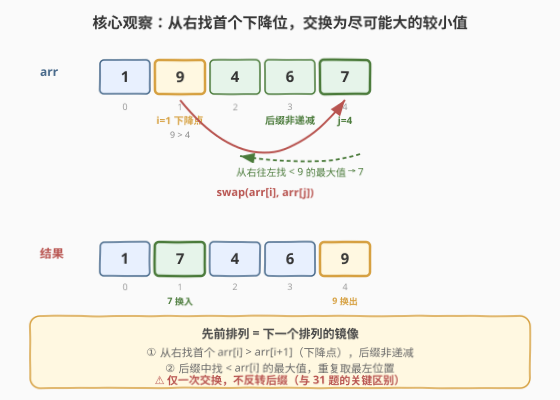
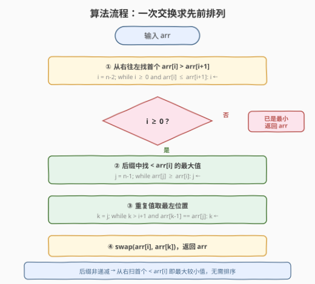

# 交换一次的先前排列

- **题目名称**：交换一次的先前排列
- **链接**：[1053. 交换一次的先前排列](https://leetcode.cn/problems/previous-permutation-with-one-swap/)
- **难度**：中等
- **标签**：数组、贪心、双指针

## 1. 题目概述

给定正整数数组 `arr`（元素可能重复），返回通过**恰好一次交换**（交换 `arr[i]` 和 `arr[j]` 的位置）能得到的所有排列中，**字典序小于 `arr` 的最大排列**。若无法通过一次交换得到更小的排列，则返回原数组。

**示例 1**：

```text
输入：arr = [3,2,1]
输出：[3,1,2]
解释：交换 2 和 1
```

**示例 2**：

```text
输入：arr = [1,1,5]
输出：[1,1,5]
解释：已经是最小排列，无法更小
```

**示例 3**：

```text
输入：arr = [1,9,4,6,7]
输出：[1,7,4,6,9]
解释：交换 9 和 7
```

**约束条件**：

- $1 \leq \text{arr.length} \leq 10^4$
- $1 \leq \text{arr}[i] \leq 10^4$

> 💡 **关键直觉**：这是 [31. 下一个排列](../0001-0100/31_下一个排列.md) 的**镜像问题**——求"上一个排列"。但有两点关键区别：①方向反转（找下降而非上升）；②只允许**一次交换**，不反转后缀。

---

## 2. 解题思路

### 2.1 暴力思路

枚举所有 $(i, j)$ 对（$i \neq j$），对每对交换后检查是否比原数组小，取所有更小方案中字典序最大者。时间 $O(n^3)$（$n^2$ 对 × $n$ 比较），$n = 10^4$ 时不可行。

> ⚠️ 暴力的浪费在于没抓住"上一个排列"的结构：它和当前排列只在**末尾一小段**不同，高位尽可能不变。正确做法是「从右往左找一个能变小的位置，做最小幅度调整」。

### 2.2 核心观察：从右找首个下降位，交换为尽可能大的较小值



把排列看作高位权重大的数。要让"上一个排列"**比当前小、又尽可能大**，必须：

1. **从右往左**找到第一个 $\text{arr}[i] > \text{arr}[i+1]$ 的位置 $i$——称 $i$ 为**下降点**。$i$ 右侧必然**非递减**（否则更靠右就会先出现下降对）。这是唯一能通过交换让整体变小的最高位。
2. 在 $i$ 右侧（非递减段）中，找**小于 $\text{arr}[i]$ 的最大值**——用它替换 $\text{arr}[i]$，让整体"刚好变小"而非变得过小。
3. 若该最大值有重复，取**最左**一个。因为交换后旧 $\text{arr}[i]$（更大的值）落入交换位，越靠左放置，后缀字典序越大。
4. **交换** $\text{arr}[i]$ 与 $\text{arr}[k]$，结束。**不反转后缀**（只允许一次操作）。

> ⚠️ **特殊情况**：若步骤 ① 找不到下降点（整个数组非递减），说明已是最小排列，返回原数组。

### 2.3 算法流程图



**主流程**：

1. 令 $i = n-2$，从右往左找到第一个 $\text{arr}[i] > \text{arr}[i+1]$ 的 $i$。
2. 若 $i < 0$：返回原数组（已是最小排列）。
3. 令 $j = n-1$，从右往左找到第一个 $\text{arr}[j] < \text{arr}[i]$ 的 $j$（即后缀中小于 $\text{arr}[i]$ 的最大值）。
4. 令 $k = j$，向左移动 $k$ 直到 $\text{arr}[k-1] \neq \text{arr}[j]$，找到最左等值位置。
5. 交换 $\text{arr}[i]$ 与 $\text{arr}[k]$，返回。

> 💡 **为什么后缀非递减就能保证步骤 ③ 正确？** 因为 $i$ 是从右看的第一个下降点，其右侧不存在任何 $\text{arr}[k] > \text{arr}[k+1]$，所以右侧非递减。在非递减序列中，从右往左第一个 $< \text{arr}[i]$ 的值就是小于 $\text{arr}[i]$ 的最大值，无需遍历整个后缀。

### 2.4 示例演算

以 `arr = [1,9,4,6,7]` 为例：

![示例演算：[1,9,4,6,7] 的四步变化](../images/prev_perm_example_walkthrough.svg)

| 步骤 | 操作 | 数组状态 | 说明 |
|------|------|----------|------|
| ① 找 $i$ | 从右找首个下降对 | `[1,9,4,6,7]` | $\text{arr}[1]=9 > \text{arr}[2]=4$，故 $i=1$（后缀 `[4,6,7]` 非递减） |
| ② 找 $j$ | 后缀找 $<\text{arr}[i]$ 的最大值 | 同上 | 从右：$7<9$ ✓，故 $j=4$（值为 7） |
| ③ 找 $k$ | 重复值取最左 | 同上 | $\text{arr}[3]=6 \neq 7$，无重复，$k=j=4$ |
| ④ 交换 | swap(arr[1], arr[4]) | `[1,7,4,6,9]` | 用 7 替换 9，整体变小但幅度最小 |

> ⚠️ **验证**：`[1,7,4,6,9]` 确实 $<$ `[1,9,4,6,7]`（第二位 $7<9$），且在所有小于原排列的一次交换方案中，第二位取 7（小于 9 的最大值）已最大，故为先前排列 ✓。

**重复值示例**：`arr = [3,1,1,3]`，$i=0$（$\text{arr}[0]=3 > \text{arr}[1]=1$），后缀 `[1,1,3]` 非递减。从右找 $<3$ 的最大值：$\text{arr}[3]=3 \not< 3$，$\text{arr}[2]=1 < 3$ ✓，故 $j=2$。但 $\text{arr}[1]=1 = \text{arr}[2]$，取最左 $k=1$。交换 $\text{arr}[0]$ 与 $\text{arr}[1]$：`[1,3,1,3]`。若取 $k=2$ 则得 `[1,1,3,3]`，字典序更小，非最优。

---

## 3. 参考代码

### C++

```cpp
class Solution {
  public:
    vector<int> prevPermOpt1(vector<int>& arr) {
        int n = arr.size();
        // ① 从右往左找第一个下降对 arr[i] > arr[i+1]
        int i = n - 2;
        while (i >= 0 && arr[i] <= arr[i + 1]) --i;

        if (i < 0) return arr;  // 已是最小排列

        // ② 后缀中从右找第一个 < arr[i] 的值（即最大较小值）
        int j = n - 1;
        while (arr[j] >= arr[i]) --j;

        // ③ 重复值取最左位置
        int k = j;
        while (k > i + 1 && arr[k - 1] == arr[j]) --k;

        // ④ 交换
        swap(arr[i], arr[k]);
        return arr;
    }
};
```

### Python

```python
class Solution:
    def prevPermOpt1(self, arr: List[int]) -> List[int]:
        n = len(arr)
        # ① 从右往左找第一个下降对
        i = n - 2
        while i >= 0 and arr[i] <= arr[i + 1]:
            i -= 1

        if i < 0:
            return arr  # 已是最小排列

        # ② 后缀中从右找第一个 < arr[i] 的值
        j = n - 1
        while arr[j] >= arr[i]:
            j -= 1

        # ③ 重复值取最左位置
        k = j
        while k > i + 1 and arr[k - 1] == arr[j]:
            k -= 1

        # ④ 交换
        arr[i], arr[k] = arr[k], arr[i]
        return arr
```

> 💡 步骤 ① 用 `<=`（遇到相等要继续左移，因为相等不算"下降"），步骤 ② 用 `>=`（等于也不算"更小"），确保找到的是严格更小值。步骤 ③ 在非递减后缀中等值元素连续排列，向左扫到不等即停，得到最左等值位。

---

## 4. 复杂度分析

| 维度 | 复杂度 | 说明 |
|------|--------|------|
| 时间复杂度 | $O(n)$ | 找 $i$、找 $j$、找 $k$ 各至多遍历一遍数组，三次线性扫描叠加仍为 $O(n)$ |
| 空间复杂度 | $O(1)$ | 只用常数个指针变量，原地修改 |

> ⚠️ 三次扫描是**并列**不是嵌套，总操作数 $\le 3n$，故 $O(n)$。整个算法不递归、不开辅助数组，严格 $O(1)$ 额外空间。

---

## 5. 扩展：与下一个排列（31 题）的对比

本题是 [31. 下一个排列](../0001-0100/31_下一个排列.md) 的镜像，两者同属"字典序排列调整"家族，核心思想对称：

| 维度 | 31. 下一个排列 | 1053. 交换一次的先前排列 |
|------|---------------|------------------------|
| 目标 | 字典序**下一个**（更大） | 字典序**上一个**（更小） |
| 扫描方向 | 从右找首个**升序**对 $\text{arr}[i] < \text{arr}[i+1]$ | 从右找首个**下降**对 $\text{arr}[i] > \text{arr}[i+1]$ |
| 后缀性质 | 降序 | 非递减 |
| 找 $j$ | 后缀中 $> \text{arr}[i]$ 的**最小**值 | 后缀中 $< \text{arr}[i]$ 的**最大**值 |
| 重复处理 | 无特殊处理（降序段中严格 $>$ 自然去重） | 取**最左**等值位（让旧大值尽早落位） |
| 交换后 | **反转**后缀（降序→升序，取最小排列） | **不反转**（只允许一次交换） |
| 无法操作时 | 反转整个数组（回绕到最小排列） | 返回原数组 |

> 💡 **关键差异**：31 题交换后还要**反转后缀**（相当于多次操作），而 1053 题只允许**一次交换**。若 1053 题也反转后缀，得到的将是"上一个排列"（可能需要多次交换），而非"一次交换的先前排列"。

---

## 6. 面试要点

1. **为什么从右往左找第一个下降对？**
   - 越靠右的位权重越小，"上一个排列"要尽可能保持高位不变。从右找首个 $\text{arr}[i] > \text{arr}[i+1]$，意味着 $i$ 是从右看第一个还能变小的最高位；其右侧已是非递减（最小状态），只能动 $i$。

2. **为什么 $i$ 右侧一定非递减？**
   - 若右侧存在 $\text{arr}[k] > \text{arr}[k+1]$，扫描时 $k$ 比 $i$ 更靠右、会先被选中，矛盾。所以 $i$ 右侧非递减。

3. **为什么重复值取最左位置？**
   - 交换后旧 $\text{arr}[i]$（更大的值）落入交换位 $k$。在非递减后缀中，等值元素连续排列；取最左 $k$ 让大值尽早落位，后缀字典序最大，整体结果才是"小于原排列的最大排列"。

4. **为什么不需要反转后缀？**
   - 题目限制**恰好一次交换**。31 题反转后缀是因为它允许多次操作（交换 + 反转），而本题只有一次交换的预算。交换完毕即返回。

5. **什么情况下无法得到更小的排列？**
   - 整个数组非递减（如 `[1,1,5]`），找不到任何下降对 $i$，说明已是最小排列，返回原数组。

---

## 7. 同类练习题

- [31. 下一个排列](https://leetcode.cn/problems/next-permutation/)（[题解](../0001-0100/31_下一个排列.md)）：本题的镜像，求字典序更大的下一个排列，交换后需反转后缀，对比"一次交换"与"多次操作"的差异
- [670. 最大交换](https://leetcode.cn/problems/maximum-swap/)：同样"找位 + 一次交换"的贪心，但目标是最大而非更小，贪心方向相反
- [556. 下一个更大元素 III](https://leetcode.cn/problems/next-greater-element-iii/)：把整数当数字数组套用 31 题算法，排列调整家族的变体
- [47. 全排列 II](https://leetcode.cn/problems/permutations-ii/)：含重复元素的全排列，理解字典序排列的生成与去重规律
