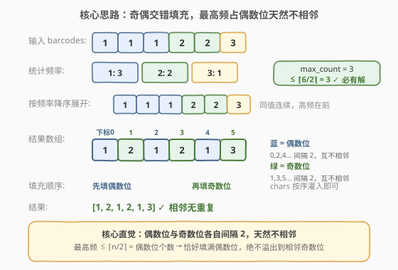
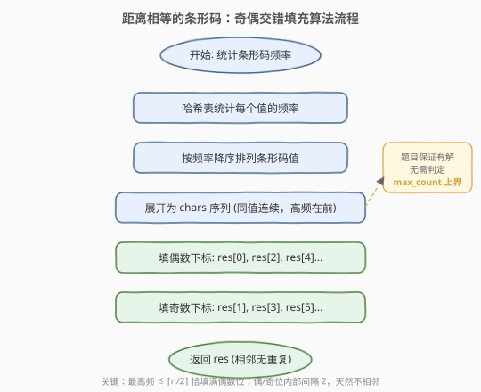
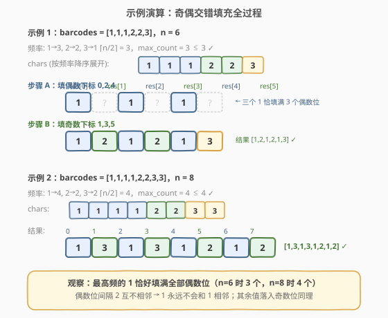

# 距离相等的条形码

- **题目名称**：距离相等的条形码
- **链接**：[1054. 距离相等的条形码](https://leetcode.cn/problems/distant-barcodes/)
- **难度**：中等
- **标签**：贪心、数组、计数、排序

## 1. 题目概述

在一个仓库里，有一排条形码，其中第 `i` 个条形码为 `barcodes[i]`。请你重新排列这些条形码，使得**任意两个相邻的条形码不能相等**。可以返回任何满足要求的答案，**题目保证存在答案**。

**示例 1**：

```text
输入：barcodes = [1,1,1,2,2,2]
输出：[2,1,2,1,2,1]
解释：相邻条形码两两不同，满足要求。
```

**示例 2**：

```text
输入：barcodes = [1,1,1,1,2,2,3,3]
输出：[1,3,1,3,2,1,2,1]
解释：相邻条形码两两不同，满足要求。
```

**约束条件**：

- $1 \leq \text{barcodes.length} \leq 10000$
- $1 \leq \text{barcodes[i]} \leq 10000$

> ⚠️ **关键保证**：题目**保证存在答案**。这意味着最高频条形码的出现次数 `max_count` 必然满足 `max_count ≤ ⌈n/2⌉`（否则无法不相邻排列）。这一保证让我们可以跳过「无解判定」，直接构造。

---

## 2. 解题思路

### 2.1 暴力思路

生成所有排列，逐个检查是否有相邻重复。排列数为 $n!$，$n = 10000$ 时显然不可行。

退一步用回溯逐位填值，每位选一个与上一位不同的条形码。但最坏情况仍需搜索大量分支，且无法快速判断当前局面能否导向合法解。

> 💡 暴力的核心痛点：没有利用**频率分布**这一结构性信息——只要把高频值「均匀散开」，相邻重复就自然消除，根本无需搜索。

### 2.2 核心观察：奇偶交错填充



关键直觉是利用**下标奇偶性**天然不相邻的性质：

- 数组下标 $0, 2, 4, \dots$（偶数位）两两间隔 $2$，**互不相邻**。
- 下标 $1, 3, 5, \dots$（奇数位）同理，两两间隔 $2$，**互不相邻**。

因此，如果把**同一个条形码值尽量集中放在偶数位（或奇数位）**，它就不会和自己相邻。

**核心构造**：

1. 统计每个条形码值的频率。
2. 按频率**降序**排列，展开成一个序列 `chars`（同值连续，最高频在最前）。
3. **先填偶数下标** `res[0], res[2], res[4], …`，**再填奇数下标** `res[1], res[3], res[5], …`。

**为什么最高频不会溢出到相邻奇数位？** 偶数位共有 $\lceil n/2 \rceil$ 个。题目保证有解，故 `max_count ≤ ⌈n/2⌉`，最高频值恰好（至多）填满偶数位，**不会跨入奇数位**与自身相邻。其余值频率更低，同样安全。

> 💡 **与 [767. 重构字符串](../0701-0800/767_重构字符串.md) 的关系**：两题本质完全同构——767 重排字符使相邻不同，1054 重排数字使相邻不同。区别在于 767 **不保证有解**（需判定 `max_count > ⌈n/2⌉` 返回空串），而 1054 **保证有解**，可省去判定直接构造。本解采用「奇偶交错填充」为主方法，与 767 题解的「大根堆贪心」形成互补。

### 2.3 算法流程图



流程非常直接：

1. **统计频率**：用哈希表 `cnt` 统计每个条形码值的出现次数。
2. **降序排列**：将 `(值, 频率)` 按频率降序排序。
3. **展开序列**：按降序把每个值重复频率次，拼成 `chars`（同值连续、高频在前）。
4. **填偶数位**：从 `chars` 头部依次取值，填入 `res[0], res[2], res[4], …`。
5. **填奇数位**：继续从 `chars` 取值，填入 `res[1], res[3], res[5], …`。
6. 返回 `res`。

### 2.4 示例演算



**示例 1**（`barcodes = [1,1,1,2,2,3]`，$n = 6$）：

频率：$1 \to 3$，$2 \to 2$，$3 \to 1$。$\lceil n/2 \rceil = 3$，`max_count = 3 ≤ 3` ✓。

`chars`（降序展开）$= [1,1,1,2,2,3]$。

| 步骤 | 填充下标 | 取值 | `res` 状态 |
|------|---------|------|-----------|
| A 填偶数位 | 0, 2, 4 | 1, 1, 1 | `[1, ?, 1, ?, 1, ?]` |
| B 填奇数位 | 1, 3, 5 | 2, 2, 3 | `[1, 2, 1, 2, 1, 3]` ✓ |

最高频的 `1` 恰好填满 3 个偶数位 $\{0, 2, 4\}$（互不相邻），`2`、`3` 落入奇数位。

**示例 2**（`barcodes = [1,1,1,1,2,2,3,3]`，$n = 8$）：

频率：$1 \to 4$，$2 \to 2$，$3 \to 2$。$\lceil n/2 \rceil = 4$，`max_count = 4 ≤ 4` ✓。

`chars` $= [1,1,1,1,2,2,3,3]$。

| 步骤 | 填充下标 | 取值 | `res` 状态 |
|------|---------|------|-----------|
| A 填偶数位 | 0, 2, 4, 6 | 1, 1, 1, 1 | `[1, ?, 1, ?, 1, ?, 1, ?]` |
| B 填奇数位 | 1, 3, 5, 7 | 2, 2, 3, 3 | `[1, 2, 1, 2, 1, 3, 1, 3]` ✓ |

> 💡 **临界观察**：示例 2 中 `max_count = 4 = ⌈n/2⌉`，最高频的 `1` 恰好填满全部 4 个偶数位，是上界的紧例。若 `1` 再多一个（$n$ 仍为 8），将无解——这正是「保证有解」等价于 `max_count ≤ ⌈n/2⌉` 的体现。

---

## 3. 参考代码

### 方法一：奇偶交错填充（推荐，O(n)）

### C++

```cpp
class Solution {
public:
    vector<int> rearrangeBarcodes(vector<int>& barcodes) {
        int n = barcodes.size();
        unordered_map<int, int> cnt;
        for (int b : barcodes) cnt[b]++;

        // 按频率降序排列
        vector<pair<int, int>> vals(cnt.begin(), cnt.end());
        sort(vals.begin(), vals.end(), [](const auto& a, const auto& b) {
            return a.second > b.second;
        });

        // 展开成 chars 序列（同值连续，高频在前）
        vector<int> chars;
        chars.reserve(n);
        for (auto& [v, c] : vals) {
            for (int i = 0; i < c; i++) chars.push_back(v);
        }

        // 先填偶数下标，再填奇数下标
        vector<int> res(n);
        int idx = 0;
        for (int i = 0; i < n; i += 2) res[i] = chars[idx++];
        for (int i = 1; i < n; i += 2) res[i] = chars[idx++];
        return res;
    }
};
```

### Python

```python
class Solution:
    def rearrangeBarcodes(self, barcodes: List[int]) -> List[int]:
        cnt = Counter(barcodes)
        # 按频率降序排列条形码值
        sorted_vals = sorted(cnt, key=lambda v: -cnt[v])
        # 展开成 chars 序列（同值连续，高频在前）
        chars = []
        for v in sorted_vals:
            chars.extend([v] * cnt[v])

        # 先填偶数下标，再填奇数下标
        n = len(barcodes)
        res = [0] * n
        idx = 0
        for i in range(0, n, 2):
            res[i] = chars[idx]
            idx += 1
        for i in range(1, n, 2):
            res[i] = chars[idx]
            idx += 1
        return res
```

> ⚠️ **两个易错点**：
> 1. **必须按频率降序展开**：最高频必须在 `chars` 最前面，才能优先占据偶数位。若随意展开，高频值可能跨越偶→奇边界落入相邻位置。
> 2. **填充顺序是先偶后奇**：`for (i = 0; i < n; i += 2)` 再 `for (i = 1; i < n; i += 2)`，下标序列为 $0, 2, 4, \dots, 1, 3, 5, \dots$，绝不能按 $0, 1, 2, \dots$ 顺序填。

---

## 4. 复杂度分析

| 维度 | 复杂度 | 说明 |
|------|--------|------|
| 时间复杂度 | $O(n + k \log k)$ | 统计频率 $O(n)$；排序 $k$ 个不同值 $O(k \log k)$；展开与填充各 $O(n)$。$k$ 为不同条形码值数，$k \leq \min(n, 10000)$ |
| 空间复杂度 | $O(n)$ | 哈希表 $O(k)$ + `chars` 序列 $O(n)$ + 结果数组 $O(n)$ |

> 💡 由于条形码值域 $\leq 10000$，可用计数排序（值域数组）将排序降到 $O(n + V)$，其中 $V = 10000$，总体严格 $O(n)$。但 `std::sort` 的 $O(k \log k)$ 在 $k \leq 10000$ 时常数极小，实测足够。若追求极致线性，可改用值域数组替代哈希表 + 排序。

---

## 5. 扩展：大根堆贪心交替放置

除奇偶填充外，还有**大根堆贪心**解法——每次弹出频率最高的两个值交替放置。该方法的思路与 [767. 重构字符串](../0701-0800/767_重构字符串.md) 完全一致，区别仅在于本题保证有解，无需判定无解条件。

```cpp
class Solution {
public:
    vector<int> rearrangeBarcodes(vector<int>& barcodes) {
        unordered_map<int, int> cnt;
        for (int b : barcodes) cnt[b]++;

        // 大根堆：(频率, 值)
        priority_queue<pair<int, int>> pq;
        for (auto& [v, c] : cnt) pq.push({c, v});

        vector<int> res;
        res.reserve(barcodes.size());
        while (pq.size() >= 2) {
            auto [c1, v1] = pq.top(); pq.pop();
            auto [c2, v2] = pq.top(); pq.pop();
            res.push_back(v1);
            res.push_back(v2);
            if (--c1 > 0) pq.push({c1, v1});
            if (--c2 > 0) pq.push({c2, v2});
        }
        if (!pq.empty()) res.push_back(pq.top().second);
        return res;
    }
};
```

```python
class Solution:
    def rearrangeBarcodes(self, barcodes: List[int]) -> List[int]:
        cnt = Counter(barcodes)
        # 频率取负模拟大根堆
        heap = [(-freq, v) for v, freq in cnt.items()]
        heapq.heapify(heap)

        res = []
        while len(heap) >= 2:
            f1, v1 = heapq.heappop(heap)
            f2, v2 = heapq.heappop(heap)
            res.append(v1)
            res.append(v2)
            if f1 + 1 < 0:   # 负数 +1 = 绝对值减 1
                heapq.heappush(heap, (f1 + 1, v1))
            if f2 + 1 < 0:
                heapq.heappush(heap, (f2 + 1, v2))
        if heap:
            res.append(heap[0][1])
        return res
```

**两种方法对比**：

| 维度 | 奇偶交错填充 | 大根堆贪心 |
|------|------------|-----------|
| 时间 | $O(n + k \log k)$ | $O(n \log k)$ |
| 空间 | $O(n)$ | $O(k)$ |
| 思路 | 静态一次性散开 | 动态每轮取两个交替 |
| 适用 | 字符/值集固定，无需冷却期 | 可迁移到「冷却期」变体（如 621） |
| 直观性 | 巧妙但需证明 | 直观易迁移 |

> 💡 面试中两种都值得提及：奇偶填充法**更快**且思路精巧；大根堆法**更直观**且可迁移到 [621. 任务调度器](../0601-0700/621_任务调度器.md) 等需要「相同元素间隔至少 $k$」的变体。

---

## 6. 面试要点

1. **为什么奇偶填充法保证相邻不同？**

   - 偶数位 $0, 2, 4, \dots$ 间隔 $2$，互不相邻；奇数位同理。最高频值频率 $\leq \lceil n/2 \rceil$（题目保证有解），恰好填满偶数位而不跨入奇数位，故它只出现在互不相邻的偶数位上。其余值频率更低，按序灌入剩余位置，同样不会与自身相邻。

2. **题目「保证存在答案」如何利用？**

   - 等价于 `max_count ≤ ⌈n/2⌉`，即最高频值不超过偶数位个数。因此可跳过无解判定，直接构造。对比 767 需先检查 `max_count > ⌈n/2⌉` 返回空串。

3. **为什么必须按频率降序展开？**

   - 最高频必须最先占据偶数位。若低频值先填偶数位，高频值可能从某个偶数位溢出到相邻奇数位，造成相邻重复。降序保证「最危险的」最高频值优先被均匀散开。

4. **奇偶填充法和大根堆法如何选择？**

   - 奇偶填充 $O(n + k \log k)$ 更快、空间 $O(n)$；大根堆 $O(n \log k)$ 但空间 $O(k)$ 更省，且思路可迁移到带冷却期的变体。本题两者皆可，奇偶填充更优。

5. **若改成「相同条形码间隔至少 $k$」呢？**

   - 退化为 [358. K 距离间隔重排字符串]（会员题）的数值版，奇偶填充不再适用（间隔需 $\geq k$ 而非 $\geq 1$），应使用大根堆 + 冷却队列，类似 621 任务调度器。

---

## 7. 同类练习题

- [767. 重构字符串](https://leetcode.cn/problems/reorganize-string/)（[题解](../0701-0800/767_重构字符串.md)）：与本题完全同构，输入是字符串且**不保证有解**，需判定 `max_count > ⌈n/2⌉` 返回空串
- [621. 任务调度器](https://leetcode.cn/problems/task-scheduler/)（[题解](../0601-0700/621_任务调度器.md)）：同属「按频率贪心安排」，增加冷却期约束，大根堆法的自然延伸
- [451. 根据字符出现频率排序](https://leetcode.cn/problems/sort-characters-by-frequency/)：按频率降序排列，是本题「降序展开」步骤的简化版
- [358. K 距离间隔重排字符串](https://leetcode.cn/problems/rearrange-string-k-distance-apart/)（会员题）：本题的泛化版，要求相同字符间隔至少为 $k$，奇偶填充失效需用冷却队列
