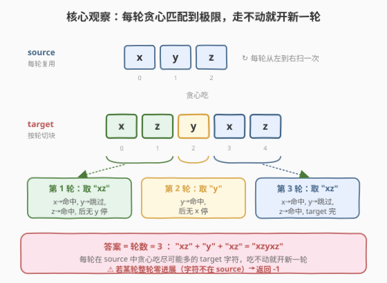
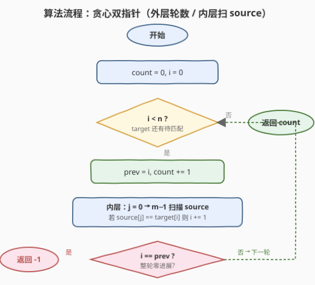
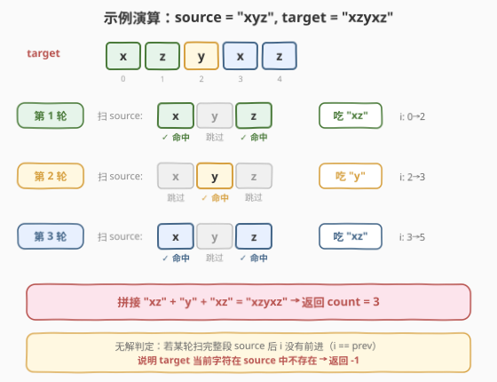

# 形成字符串的最短路径

- **题目名称**：形成字符串的最短路径
- **链接**：[1055. 形成字符串的最短路径](https://leetcode.cn/problems/shortest-way-to-form-string/)
- **难度**：中等
- **标签**：贪心、双指针、字符串、动态规划

## 1. 题目概述

给定两个仅由小写字母组成的字符串 `source` 和 `target`。每次操作可以从 `source` 中选出**一个子序列**（保持相对顺序、可不连续），将这次选出的子序列**拼接到结果末尾**。问**最少需要多少次操作**才能拼出 `target`；若无法拼出则返回 `-1`。

> 💡 **子序列**：从原串中删除若干（可不删）字符后得到的新串，**不改变剩余字符的相对顺序**。注意一个字符在一次子序列选取中最多用一次。

**示例 1**：

```text
输入：source = "abc", target = "abcbc"
输出：2
解释：
  第 1 次取子序列 "abc"（用 source 的 a, b, c）→ 已拼出 "abc"
  第 2 次取子序列 "bc" （用 source 的 b, c）   → 拼出 "abcbc"
  共 2 次。
```

**示例 2**：

```text
输入：source = "abc", target = "acdbc"
输出：-1
解释：target 含 'd'，而 source 中没有 'd'，任何子序列都无法产生 'd'，故无解。
```

**示例 3**：

```text
输入：source = "xyz", target = "xzyxz"
输出：3
解释：
  第 1 次取子序列 "xz"（x, z）→ "xz"
  第 2 次取子序列 "y"        → "xzy"
  第 3 次取子序列 "xz"（x, z）→ "xzyxz"
  共 3 次。
```

**约束条件**：

- $1 \leq \text{source.length}, \text{target.length} \leq 1000$
- `source` 和 `target` 仅由小写英文字母组成

> 💡 **关键直觉**：要让操作次数最少，每次选取子序列时应**尽可能多地匹配 target 的后续字符**（贪心）。而“每次能匹配多少”取决于在 source 中从前到后扫描时能命中多少 target 字符——这天然对应“双指针”。

---

## 2. 解题思路

### 2.1 暴力思路

枚举 target 的所有切分方式，把 target 切成若干段 $t_1 + t_2 + \dots + t_k$，要求每段都是 source 的子序列，求最小段数 $k$。切分方式指数级，且判定“是否为子序列”本身需要 $O(|source|)$，总复杂度不可接受。

> 💡 暴力的浪费在于：它**独立**考虑每段，没有利用“前一段匹配到哪、下一段从 target 哪里接”的连贯信息。其实只需**顺序扫描 target 一次**，每当当前轮在 source 中“走不动”了，就开新一轮——这就是贪心。

### 2.2 核心观察：贪心 + 双指针



两个观察：

1. **贪心最优**：每轮在 source 中**从左到右扫描一次**，只要当前 source 字符等于 target 当前待匹配字符就“吃掉”它（`i++`）。把每轮吃到极限，能让总轮数最少。证明用交换论证：若某轮少匹配一个本可匹配的字符，把它留给后续轮，后续轮数不会更少，只会更多或相等。

2. **无解判定**：若某一轮扫描完整个 source 后 `i` 没有任何前进（`i == prev`），说明 target 当前字符在 source 中根本不存在，直接返回 `-1`。

> ⚠️ **易错点**：无解判定看的是“整轮零进展”，而不是“单个字符没匹配到”。例如 source="abc"、target="acb"：第一轮 a 匹配、c 匹配（跳过 b）、b 没匹配到（已到 source 末尾），`i` 从 0 前进到 2，有进展，开第二轮即可继续匹配 b。只有当某字符在 source 里**完全不存在**时才会整轮零进展。

### 2.3 算法流程图



维护变量：

- `i`：target 中下一个待匹配字符的下标；
- `count`：已使用的子序列轮数；
- 每轮内部用 `j` 扫描 `source`，`prev` 记录本轮开始时的 `i`。

**主循环**（`i < n` 时）：

1. `count += 1`，`prev = i`。
2. **内层循环** `j` 从 `0` 到 `m-1`：若 `i < n` 且 `source[j] == target[i]`，则 `i += 1`。
3. **若** `i == prev`：返回 `-1`（target 当前字符不在 source 中）。

循环结束返回 `count`。

### 2.4 示例演算

以 `source = "xyz"`、`target = "xzyxz"` 为例（3 轮）：



| 轮次 | 起始 i | 本轮匹配路径（source 扫描） | 吃掉的 target 片段 | 结束 i | 说明 |
|------|--------|------------------------------|--------------------|--------|------|
| 1 | 0 | x→命中(idx0)，y→跳过(待匹配是 z)，z→命中(idx2)，y→source 已尽 | "xz" | 2 | 第二个待匹配是 y，但 source 扫到末尾没有 y |
| 2 | 2 | y→命中(idx1)，x→source 已尽(待匹配 x，但 idx1 之后只剩 z) | "y" | 3 | 只吃到 1 个字符，开新一轮 |
| 3 | 3 | x→命中(idx0)，z→命中(idx2) | "xz" | 5 | target 全部匹配完 |

返回 `count = 3`。三轮拼出 `"xz" + "y" + "xz" = "xzyxz"`。

---

## 3. 参考代码

### C++

```cpp
class Solution {
  public:
    int shortestWay(string source, string target) {
        int m = source.size(), n = target.size();
        int count = 0, i = 0;
        while (i < n) {
            int prev = i;
            ++count;                       // 开启新一轮子序列
            for (int j = 0; j < m; ++j) {
                if (i < n && source[j] == target[i]) ++i;
            }
            if (i == prev) return -1;      // 整轮零进展：某字符 source 中不存在
        }
        return count;
    }
};
```

### Python

```python
class Solution:
    def shortestWay(self, source: str, target: str) -> int:
        m, n = len(source), len(target)
        count = i = 0
        while i < n:
            prev = i
            count += 1                      # 开启新一轮子序列
            for ch in source:
                if i < n and ch == target[i]:
                    i += 1
            if i == prev:                   # 整轮零进展：某字符 source 中不存在
                return -1
        return count
```

---

## 4. 复杂度分析

| 维度 | 复杂度 | 说明 |
|------|--------|------|
| 时间复杂度 | $O(m \cdot \text{count}) \leq O(m \cdot n)$ | 每轮扫描一次 source（$O(m)$），共 count 轮；count $\leq n$（每轮至少吃 1 个字符），最坏 $O(mn)$ |
| 空间复杂度 | $O(1)$ | 仅用常数个指针/计数器 |

> 💡 本题 $m, n \leq 1000$，最坏 $10^6$ 次比较，完全可接受。但若数据规模放大到 $10^5$，需用第 5 节的“下一出现位置”预处理把单次匹配降到 $O(1)$。

---

## 5. 扩展：下一出现位置预处理（O(26m + n)）

当 $m, n$ 很大时，瓶颈在于每轮都要**线性扫描整个 source**。可预处理“从 source 第 `i` 位起，每个字符下一次出现在哪”，把“在 source 中找下一个匹配字符”从 $O(m)$ 降到 $O(1)$。

**预处理** `nxt[i][c]`：source 中下标 $\geq i$ 处字符 $c$ 的最小下标，不存在记为 $-1$。从右向左递推：

$$
\text{nxt}[i][c] = \begin{cases} i & \text{if } \text{source}[i] = c \\ \text{nxt}[i+1][c] & \text{otherwise} \end{cases}
$$

**匹配**：维护 `pos`（当前轮在 source 中可用的起始下标）。对 target 每个字符 $c$：

- 若 `nxt[0][c] == -1`：$c$ 在 source 中根本不存在，返回 `-1`；
- 若 `nxt[pos][c] == -1`：当前轮已用尽，开新一轮（`count++`，`pos = 0`）；
- 取 `pos = nxt[pos][c] + 1`（命中后下一次必须严格靠后，保证子序列不重复用同一字符）。

```cpp
class Solution {
  public:
    int shortestWay(string source, string target) {
        int m = source.size(), n = target.size();
        // nxt[i][c] = source 中 >= i 处字符 c 的最小下标，不存在为 -1
        vector<vector<int>> nxt(m + 1, vector<int>(26, -1));
        for (int i = m - 1; i >= 0; --i) {
            for (int c = 0; c < 26; ++c) nxt[i][c] = nxt[i + 1][c];
            nxt[i][source[i] - 'a'] = i;
        }
        int count = 1, pos = 0;
        for (char ch : target) {
            int c = ch - 'a';
            if (nxt[0][c] == -1) return -1;     // 该字符 source 中没有
            if (nxt[pos][c] == -1) {            // 当前轮已用尽，开新一轮
                ++count;
                pos = 0;
            }
            pos = nxt[pos][c] + 1;              // 命中，下一次严格靠后
        }
        return count;
    }
};
```

```python
class Solution:
    def shortestWay(self, source: str, target: str) -> int:
        m = len(source)
        nxt = [[-1] * 26 for _ in range(m + 1)]
        for i in range(m - 1, -1, -1):
            for c in range(26):
                nxt[i][c] = nxt[i + 1][c]
            nxt[i][ord(source[i]) - 97] = i
        count = 1
        pos = 0
        for ch in target:
            c = ord(ch) - 97
            if nxt[0][c] == -1:                 # 该字符 source 中没有
                return -1
            if nxt[pos][c] == -1:               # 当前轮已用尽，开新一轮
                count += 1
                pos = 0
            pos = nxt[pos][c] + 1               # 命中，下一次严格靠后
        return count
```

### 两种解法对比

| 维度 | 贪心双指针 | 下一出现位置预处理 |
|------|-----------|--------------------|
| 时间 | $O(m \cdot \text{count})$，最坏 $O(mn)$ | $O(26m + n)$ |
| 空间 | $O(1)$ | $O(26m)$ |
| 适用 | $m, n \leq 10^3$ 足够 | $m, n$ 放大到 $10^5$ 时必需 |
| 代码量 | 极简 | 略多，需建表 |

> ⚠️ `nxt` 表多开一行 `nxt[m]`（全 $-1$）作为哨兵，避免边界特判；递推时 `nxt[i][c] = nxt[i+1][c]` 再覆盖当前字符。

---

## 6. 面试要点

1. **为什么贪心（每轮匹配到极限）是最优的？**
   - 交换论证：若某轮放弃一个本可匹配的字符 $c$ 留给后续轮，后续轮要匹配 $c$ 仍需在 source 中找到它，不会比“本轮就吃掉”更省轮数；而被推迟的 $c$ 之前的字符也无法因此提前，总轮数只增不减。

2. **如何判断无解？为什么用“整轮零进展”而不是“单个字符没匹配到”？**
   - 单个字符在某轮没匹配到，可能只是因为 source 当前游标之后没有它（但前面有），开新一轮即可匹配（如 source="abc"、target="acb" 的 b）。只有当某字符在**整个 source** 中都不存在时，才会出现“扫完整轮 i 没动”的情况，此时才真正无解。

3. **贪心双指针的最坏时间复杂度是多少？什么时候退化？**
   - $O(m \cdot \text{count})$，count $\leq n$，最坏 $O(mn)$。退化场景：source 与 target 字符交错严重，每轮只吃 1 个字符，如 source="abc"、target="cbacbacba…"。

4. **下一出现位置预处理为什么能把单次匹配降到 $O(1)$？**
   - `nxt[pos][c]` 直接给出“从 pos 起字符 c 下一次出现在哪”，无需线性扫描。预处理从右向左递推，每个位置继承右侧信息再更新自身字符，共 $O(26m)$。

5. **`pos = nxt[pos][c] + 1` 中的 `+1` 能省吗？**
   - 不能。子序列要求下标严格递增，同一字符在单轮中不能复用。若不加 1，下一次查 `nxt[pos][c]` 会再次命中同一个位置，导致重复使用。

---

## 7. 同类练习题

- [392. 判断子序列](https://leetcode.cn/problems/is-subsequence/)：单轮“能否匹配”判定，本题的退化版（count=1 时只问 true/false），双指针模板直接套用
- [792. 匹配子序列的单词数](https://leetcode.cn/problems/number-of-matching-subsequences/)：多 target 批量子序列判定，用“下一出现位置”预处理把每次查询降到 $O(|word|)$，承接第 5 节优化
- [2825. 循环增长使字符串子序列等于另一字符串](https://leetcode.cn/problems/make-string-a-subsequence-using-cyclic-increments/)：子序列匹配 + 相邻字符可 +1 的变体，贪心匹配框架的延伸
- [2484. 统计回文子序列](https://leetcode.cn/problems/count-palindromic-subsequences/)：字符出现位置预处理思想的另一应用，按位置桶分组加速匹配
