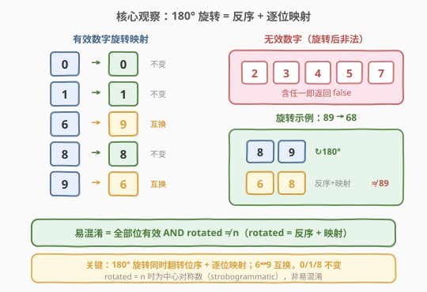
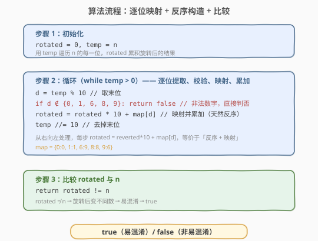
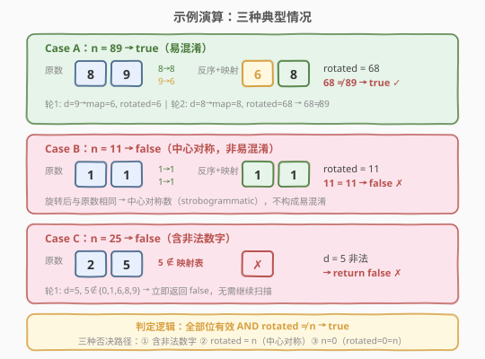

# LeetCode 易混淆数 题解

## 1. 题目概述

- **标题 / 题号**：易混淆数（#1056，easy）
- **链接**：https://leetcode.cn/problems/confusing-number/
- **难度**：简单
- **标签**：数学

**题意**：给定一个**非负整数** `n`，判断它是否为**易混淆数**（confusing number）。

一个数是易混淆数，当且仅当把它**旋转 180°** 后得到一个**与原数不同**的新数，且每一位数字旋转后仍然合法。数字旋转 180° 的映射规则如下：

| 原数字 | 旋转后 | 说明 |
|--------|--------|------|
| `0` | `0` | 合法（不变） |
| `1` | `1` | 合法（不变） |
| `6` | `9` | 合法（互换） |
| `8` | `8` | 合法（不变） |
| `9` | `6` | 合法（互换） |
| `2` `3` `4` `5` `7` | — | **非法**（旋转后无意义） |

> 💡 **旋转 180° 的本质**：不仅每个数字自身翻转，**整个数字的位序也反转**。例如 `89` 旋转后：`8→8`、`9→6`，再反序得到 `68`（不是 `86`）。

**示例 1**：

```text
输入：n = 6
输出：true
解释：6 旋转 180° 后变为 9，9 ≠ 6，是易混淆数。
```

**示例 2**：

```text
输入：n = 89
输出：true
解释：89 旋转后：9→6, 8→8, 反序得 68。68 ≠ 89，是易混淆数。
```

**示例 3**：

```text
输入：n = 11
输出：false
解释：11 旋转后：1→1, 1→1, 反序得 11。11 = 11，不是易混淆数。
```

**示例 4**：

```text
输入：n = 25
输出：false
解释：25 含非法数字 5（5 旋转后无意义），不是易混淆数。
```

**约束**：

- $0 \le n \le 10^9$

> ⚠️ **边界 `n = 0`**：`0` 旋转后仍为 `0`，`0 = 0`，故 `0` **不是**易混淆数。代码中循环 `while temp > 0` 对 `n = 0` 不执行，`rotated` 保持 `0`，最终 `0 != 0` 为 `false`，逻辑正确。

## 2. 解题思路

### 2.1 暴力思路：字符串翻转 + 映射

最直观的做法是转字符串，逐字符映射后翻转再转回整数比较：

```python
s = str(n)
m = {'0':'0','1':'1','6':'9','8':'8','9':'9'}  # 注意 9→6
if any(c not in m for c in s):
    return False
rotated = int(''.join(m[c] for c in s)[::-1])
return rotated != n
```

能 AC，但引入了 $O(L)$ 的字符串空间（$L$ 为数字位数），且绕了一次 `int→str→int` 的往返。既然旋转的本质是「逐位映射 + 反序」，完全可以**纯数字运算**完成，无需字符串中转。

### 2.2 核心观察：逐位映射 + 反序构造



关键性质有两点：

1. **映射表**：只有 `0/1/6/8/9` 五种数字旋转后合法，其中 `6↔9` 互换，`0/1/8` 不变。`2/3/4/5/7` 旋转后非法——遇到即直接返回 `false`。
2. **反序天然实现**：从右向左逐位取出 `d = temp % 10`，做 `rotated = rotated * 10 + map[d]`，相当于**先映射再反序拼接**。这与[9. 回文数](../0001-0100/9_回文数.md)中「弹出末位 / 压入新数」的机制完全相同，只是多了一步 `map[d]` 映射。

> 💡 **为什么从右向左取就是反序？** 原数 `89` 的末位是 `9`（最右），第一个被压入 `rotated`；然后是 `8`，压到 `9` 前面。最终 `rotated = 68`，恰好是原数反序后再映射的结果。180° 旋转 = 物理上翻转整个数字，位序自然反转，与这一过程完全对应。

> ⚠️ **易混淆 vs 中心对称**：若 `rotated == n`（旋转后不变），如 `11`、`69`→`69`、`88`、`0`，则该数是**中心对称数**（strobogrammatic），**不是**易混淆数。易混淆要求旋转后**变不同**。详见第 5 节与 [246. 中心对称数](https://leetcode.cn/problems/strobogrammatic-number/) 的对比。

### 2.3 算法流程图



算法分三步：

1. **初始化**：`rotated = 0`，`temp = n`（用 `temp` 遍历，保留 `n` 用于最终比较）。
2. **循环逐位处理**（`while temp > 0`）：
   - 取末位 `d = temp % 10`；
   - 若 `d` 不在映射表中，立即返回 `false`；
   - 否则 `rotated = rotated * 10 + map[d]`（映射 + 反序累加）；
   - `temp //= 10`（去掉末位）。
3. **比较**：`return rotated != n`。

> ⚠️ **`n = 0` 的正确性**：`temp = 0` 时循环不执行，`rotated` 保持 `0`，`0 != 0` 为 `false`。`0` 旋转后仍是 `0`，是中心对称数而非易混淆数，结果正确。无需额外兜底。

### 2.4 示例演算



以三种典型情况对照：

**Case A：`n = 89`（易混淆，`true`）**

| 轮次 | `d = temp % 10` | `map[d]` | `rotated` | `temp` |
|------|-----------------|----------|-----------|--------|
| 1 | 9 | 6 | `0*10+6 = 6` | 8 |
| 2 | 8 | 8 | `6*10+8 = 68` | 0 |

循环结束，`rotated = 68`，`68 ≠ 89` → `true` ✓

**Case B：`n = 11`（中心对称，`false`）**

| 轮次 | `d` | `map[d]` | `rotated` | `temp` |
|------|-----|----------|-----------|--------|
| 1 | 1 | 1 | 1 | 1 |
| 2 | 1 | 1 | 11 | 0 |

`rotated = 11`，`11 = 11` → `false` ✗（旋转后不变）

**Case C：`n = 25`（含非法数字，`false`）**

| 轮次 | `d` | 判定 | 结果 |
|------|-----|------|------|
| 1 | 5 | `5 ∉ {0,1,6,8,9}` | 立即 `return false` ✗ |

无需扫描第 2 位，遇到非法数字即刻终止。

## 3. 参考代码

### C++

```cpp
class Solution {
  public:
    bool confusingNumber(int n) {
        int map[10] = {0, 1, -1, -1, -1, -1, 9, -1, 8, 6}; // 0~9 的旋转映射，-1 表示非法
        long long rotated = 0;  // 用 long long 防止 rotated 溢出（n ≤ 10^9 不会溢出，保险起见）
        int temp = n;
        while (temp > 0) {
            int d = temp % 10;
            if (map[d] < 0) return false;   // 非法数字
            rotated = rotated * 10 + map[d];
            temp /= 10;
        }
        return rotated != n;
    }
};
```

> ⚠️ **数组映射表的技巧**：用 `int map[10]` 以数字值为下标直接索引，`-1` 标记非法位（`2/3/4/5/7`），比 `unordered_map` 更紧凑且 $O(1)$ 访问。`n ≤ 10^9`（最多 10 位），`rotated` 不会超过 $10^{10}$，`int`（$< 2.1 \times 10^9$）可能溢出，故用 `long long` 保险。

### Python

```python
class Solution:
    def confusingNumber(self, n: int) -> bool:
        m = {0: 0, 1: 1, 6: 9, 8: 8, 9: 6}
        rotated = 0
        temp = n
        while temp > 0:
            d = temp % 10
            if d not in m:
                return False
            rotated = rotated * 10 + m[d]
            temp //= 10
        return rotated != n
```

> 💡 Python 整数无限精度，无需考虑溢出。`d not in m` 天然处理非法数字。`n = 0` 时循环不执行，`rotated = 0`，`0 != 0` 为 `False`，正确。

也可用字符串写法（更简洁但多 $O(L)$ 空间）：

```python
class Solution:
    def confusingNumber(self, n: int) -> bool:
        m = {'0':'0','1':'1','6':'9','8':'8','9':'6'}
        s = str(n)
        if any(c not in m for c in s):
            return False
        return int(''.join(m[c] for c in reversed(s))) != n
```

## 4. 复杂度分析

| 维度 | 复杂度 | 说明 |
|------|--------|------|
| 时间复杂度 | $O(\log_{10} n)$ | 循环次数为数字位数 $L = \lfloor\log_{10} n\rfloor + 1$，每次循环 $O(1)$ |
| 空间复杂度 | $O(1)$ | 仅用 `rotated`、`temp` 等常数个变量，映射表大小固定为 10 |

> 💡 与字符串法（$O(L)$ 时间 + $O(L)$ 空间）相比，数字运算法无额外空间，且避免 `int→str→int` 的类型转换开销。由于 $L \leq 10$，两者在最坏情况下都是常数级，但数字法更贴合「数学」标签的考察意图。

## 5. 扩展：与 246 中心对称数的关系

### 5.1 易混淆数 vs 中心对称数

[246. 中心对称数](https://leetcode.cn/problems/strobogrammatic-number/) 与本题共享完全相同的旋转映射表，但判定方向相反：

| 维度 | 1056 易混淆数 | 246 中心对称数 |
|------|--------------|---------------|
| 定义 | 旋转后得到**不同**的合法数 | 旋转后得到**相同**的数 |
| 判定 | 全部位有效 **AND** `rotated ≠ n` | 全部位有效 **AND** `rotated = n` |
| 示例 | `89→68`（变）✓ | `69→69`（不变）✓ |
| 关系 | 二者**互斥但并集 = 全部位有效的数** | 同左 |

> 💡 **记忆要点**：同一套映射 + 反序逻辑，仅最终比较方向不同——`≠` 判易混淆，`==` 判中心对称。理解了一个，另一个只需改一个符号。

### 5.2 旋转映射的数学本质

旋转 180° 的操作可以分解为两个独立变换的复合：

$$\text{rotated} = \text{reverse}(\text{map}(d_1), \text{map}(d_2), \ldots, \text{map}(d_L))$$

其中 $d_1 d_2 \ldots d_L$ 是 $n$ 的各位数字。`reverse`（反序）来自物理翻转，`map`（映射）来自单数字旋转。代码中从右向左取位 + `rotated = rotated * 10 + map[d]` 恰好完成了「反序 + 映射」的复合，无需显式反转。

这一模式与[7. 整数反转](https://leetcode.cn/problems/reverse-integer/)和[9. 回文数](../0001-0100/9_回文数.md)的「弹出末位 / 压入新数」机制一脉相承，只是多了一步 `map[d]`。

## 6. 面试要点

1. **为什么从右向左取位就能实现反序？**

   - `rotated = rotated * 10 + map[d]` 每次把新映射的数字追加到 `rotated` 的**末尾**。先取的末位（如 `89` 的 `9`）被压到最低位，后取的高位（`8`）被压到更高位。最终 `rotated` 的位序恰好是原数的反序——这和整数反转的原理完全相同。

2. **`n = 0` 为什么不需要特殊处理？**

   - `temp = 0` 时 `while temp > 0` 不执行，`rotated` 保持 `0`。`0 != 0` 为 `false`，而 `0` 旋转后确实仍是 `0`（中心对称，非易混淆），结果正确。与[1009. 十进制整数的补数](1009_十进制整数的补数.md)中 `n=0` 需要兜底不同，本题的循环天然处理了这一边界。

3. **易混淆数和中心对称数有什么关系？**

   - 二者使用相同的旋转映射表，但判定方向相反：易混淆数要求 `rotated ≠ n`（旋转后变不同），中心对称数要求 `rotated = n`（旋转后不变）。一个数不可能同时是两者。如 `69` 旋转后仍为 `69`，是中心对称数而非易混淆数；`89` 旋转后变为 `68`，是易混淆数。

4. **C++ 中 `rotated` 为什么用 `long long`？**

   - `n ≤ 10^9`，最多 10 位数字。最坏情况下 `rotated` 可达 $9 \times 10^9$（如 `n = 9999999996`，`rotated = 6999999999`），超过 `INT_MAX`（$\approx 2.1 \times 10^9$）。用 `long long` 保险。实际上 LeetCode 测试用例中 `n ≤ 10^9`，`rotated` 不超过 $10^{10}$，但用 `long long` 更稳妥。

5. **用数组还是哈希表存映射？**

   - C++ 中用 `int map[10]` 数组以数字值为下标直接索引，`-1` 标记非法位，比 `unordered_map` 更紧凑、访问更快。Python 中用字典 `{0:0, 1:1, 6:9, 8:8, 9:6}` 更自然，`d not in m` 判非法即可。映射表大小固定为 10（或 5），两种方式都是 $O(1)$。

## 同类练习题

| # | 题目 | 与本题的关联 |
|---|------|-------------|
| 246 | [中心对称数](https://leetcode.cn/problems/strobogrammatic-number/) | 与本题共享旋转映射表，判定方向相反（`rotated == n` 为中心对称），可交叉验证 |
| 1088 | [易混淆数 II](https://leetcode.cn/problems/confusing-number-ii/) | 本题进阶，统计 $[1, N]$ 中易混淆数的个数，需数位 DP / 构造枚举 |
| 9 | [回文数](https://leetcode.cn/problems/palindrome-number/)（[题解](../0001-0100/9_回文数.md)） | 「弹出末位 / 压入新数」反序机制的本题基础，半量反转判定回文 |
| 7 | [整数反转](https://leetcode.cn/problems/reverse-integer/)（[题解](../0001-0100/7_整数反转.md)） | 整数逐位反转的母题，重点考察 32 位溢出处理 |
| 1009 | [十进制整数的补数](https://leetcode.cn/problems/complement-of-base-10-integer/)（[题解](1009_十进制整数的补数.md)） | 同为逐位处理的简单数学题，对照 `n=0` 边界的不同处理方式 |
