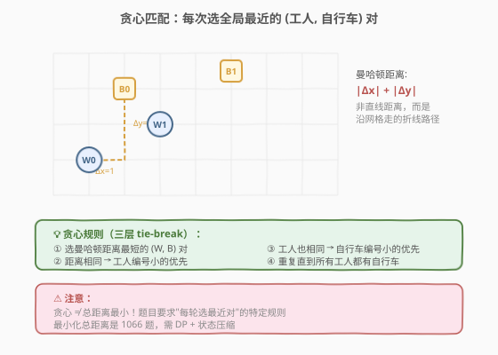
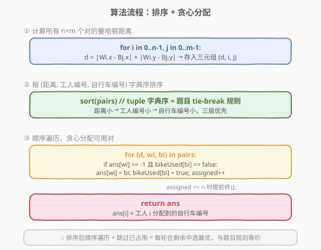
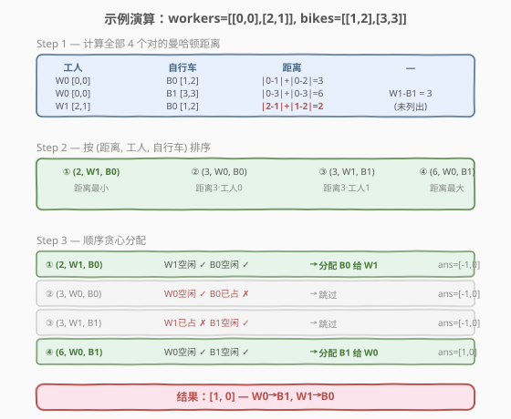

# LeetCode 校园自行车分配 题解

> ⚠️ **注意**：本题是 LeetCode 会员专享题，需 Plus 会员才能在 [leetcode.cn](https://leetcode.cn/problems/campus-bikes/) 提交。

## 1. 题目概述

- **标题 / 题号**：校园自行车分配（#1057，medium）
- **链接**：https://leetcode.cn/problems/campus-bikes/
- **难度**：中等
- **标签**：贪心、排序、数组

**题意**：在校园二维网格上，有 `n` 个工人和 `m` 辆自行车（`n <= m`），每个工人和自行车的位置用 `[x, y]` 坐标表示。需要为**每个工人分配一辆自行车**，分配规则如下：

1. 在所有**未被分配**的工人和自行车中，选择**曼哈顿距离最短**的 `(工人, 自行车)` 对进行分配；
2. 若有多对距离相同，选择**工人编号最小**的对；
3. 若仍有多种选择，选择**自行车编号最小**的对；
4. 重复以上过程，直到所有工人都分配到自行车。

曼哈顿距离定义为 $|x_1 - x_2| + |y_1 - y_2|$。

返回长度为 `n` 的数组 `answer`，其中 `answer[i]` 是第 `i` 个工人分配到的自行车编号（从 0 开始）。

**示例 1**：

```text
输入：workers = [[0,0],[2,1]], bikes = [[1,2],[3,3]]
输出：[1,0]
解释：
各对的曼哈顿距离：
  (W0, B0) = |0-1| + |0-2| = 3
  (W0, B1) = |0-3| + |0-3| = 6
  (W1, B0) = |2-1| + |1-2| = 2  ← 最短
  (W1, B1) = |2-3| + |1-3| = 3

距离最短的是 (W1, B0) = 2，分配 B0 给 W1。
剩余 W0 分配 B1。
结果：W0→B1, W1→B0，即 [1, 0]。
```

**示例 2**：

```text
输入：workers = [[0,0],[1,1],[2,0]], bikes = [[1,0],[2,2],[2,1]]
输出：[0,2,1]
解释：
距离为 1 的对有：(W0,B0)、(W1,B0)、(W1,B2)、(W2,B0)、(W2,B2)
按 (距离, 工人, 自行车) 排序，首个是 (1, W0, B0) → 分配 B0 给 W0。
剩余距离为 1 的对中，(1, W1, B2) → 分配 B2 给 W1。
剩余 W2 分配 B1。
结果：[0, 2, 1]。
```

**约束**：

- $1 \leq \text{workers.length} \leq \text{bikes.length} \leq 10$
- $0 \leq \text{workers}[i][0], \text{workers}[i][1] < 1000$
- $0 \leq \text{bikes}[i][0], \text{bikes}[i][1] < 1000$

> 💡 **关键直觉**：分配规则本质是**贪心**——每轮选全局最近的可用对。将所有 $(distance, worker\_idx, bike\_idx)$ 三元组按字典序排序后，顺序遍历贪心分配即可。

## 2. 解题思路

### 2.1 暴力思路：每轮全扫描

每轮分配时，遍历所有**未分配**的工人和自行车，找到距离最小的对。共需 $n$ 轮，每轮 $O(nm)$，总复杂度 $O(n^2 m)$。

> 💡 暴力的浪费在于：每轮重新计算所有对的距离。其实可以**一次性计算所有对**并排序，然后顺序扫描贪心分配——已分配的对直接跳过。

### 2.2 核心观察：排序 + 贪心



两步转化：

1. **三元组排序**：计算所有 $n \times m$ 个 `(距离, 工人编号, 自行车编号)` 三元组，按 `(距离, 工人编号, 自行车编号)` 字典序升序排列。这天然实现了题目的三层 tie-break 规则。
2. **顺序贪心分配**：遍历排序后的三元组，若当前工人和自行车都**未被占用**，则分配并标记；否则跳过。

> ⚠️ **易错点**：贪心分配**不等于**总距离最小化。题目要求的是"每轮选最近对"的**特定规则**，而非最小化总距离（那才是 1066 题）。本贪心可能产生总距离非最优的分配，但这是题目规则决定的。

### 2.3 算法流程图



维护变量：

- `pairs`：所有 `(距离, 工人编号, 自行车编号)` 三元组列表；
- `ans[i]`：工人 `i` 分配到的自行车编号，初始 `-1`（未分配）；
- `bikeUsed[j]`：自行车 `j` 是否已被占用，初始 `false`；
- `assigned`：已分配工人数，用于提前终止。

**主循环**（遍历排序后的 `pairs`）：

1. 取 `(d, wi, bi)`：若 `ans[wi] != -1`（工人已分配）或 `bikeUsed[bi]`（自行车已占用），跳过。
2. 否则：`ans[wi] = bi`，`bikeUsed[bi] = true`，`assigned += 1`。
3. 若 `assigned == n`，提前终止。

### 2.4 示例演算

以 `workers = [[0,0],[2,1]], bikes = [[1,2],[3,3]]` 为例：



**Step 1**：计算所有对的曼哈顿距离

| 工人 | 自行车 | 距离 |
|------|--------|------|
| W0 [0,0] | B0 [1,2] | 3 |
| W0 [0,0] | B1 [3,3] | 6 |
| W1 [2,1] | B0 [1,2] | 2 |
| W1 [2,1] | B1 [3,3] | 3 |

**Step 2**：按 `(距离, 工人, 自行车)` 排序

| 排序序号 | (距离, W, B) | 说明 |
|----------|-------------|------|
| ① | (2, W1, B0) | 距离最小 |
| ② | (3, W0, B0) | 距离 3，工人 0 |
| ③ | (3, W1, B1) | 距离 3，工人 1 |
| ④ | (6, W0, B1) | 距离最大 |

**Step 3**：顺序贪心分配

| 序号 | (距离, W, B) | W 空闲? | B 空闲? | 操作 | ans |
|------|-------------|---------|---------|------|-----|
| ① | (2, W1, B0) | ✓ | ✓ | 分配 B0→W1 | [-1, 0] |
| ② | (3, W0, B0) | ✓ | ✗ (B0 已占) | 跳过 | [-1, 0] |
| ③ | (3, W1, B1) | ✗ (W1 已占) | ✓ | 跳过 | [-1, 0] |
| ④ | (6, W0, B1) | ✓ | ✓ | 分配 B1→W0 | [1, 0] |

`assigned == 2 == n`，终止。返回 `[1, 0]`。

## 3. 参考代码

### C++

```cpp
class Solution {
  public:
    vector<int> assignBikes(vector<vector<int>>& workers,
                            vector<vector<int>>& bikes) {
        int n = workers.size(), m = bikes.size();
        vector<tuple<int, int, int>> pairs;
        pairs.reserve(n * m);
        for (int i = 0; i < n; ++i) {
            for (int j = 0; j < m; ++j) {
                int d = abs(workers[i][0] - bikes[j][0]) +
                        abs(workers[i][1] - bikes[j][1]);
                pairs.emplace_back(d, i, j);
            }
        }
        sort(pairs.begin(), pairs.end());

        vector<int> ans(n, -1);
        vector<bool> bikeUsed(m, false);
        int assigned = 0;
        for (auto& [d, wi, bi] : pairs) {
            if (ans[wi] != -1 || bikeUsed[bi]) continue;
            ans[wi] = bi;
            bikeUsed[bi] = true;
            if (++assigned == n) break;
        }
        return ans;
    }
};
```

### Python

```python
class Solution:
    def assignBikes(self, workers: List[List[int]],
                    bikes: List[List[int]]) -> List[int]:
        n, m = len(workers), len(bikes)
        pairs = []
        for i in range(n):
            for j in range(m):
                d = abs(workers[i][0] - bikes[j][0]) + \
                    abs(workers[i][1] - bikes[j][1])
                pairs.append((d, i, j))
        pairs.sort()

        ans = [-1] * n
        bike_used = [False] * m
        assigned = 0
        for d, wi, bi in pairs:
            if ans[wi] != -1 or bike_used[bi]:
                continue
            ans[wi] = bi
            bike_used[bi] = True
            assigned += 1
            if assigned == n:
                break
        return ans
```

## 4. 复杂度分析

| 维度 | 复杂度 | 说明 |
|------|--------|------|
| 时间复杂度 | $O(nm \log(nm))$ | 生成 $nm$ 个三元组 $O(nm)$ + 排序 $O(nm \log(nm))$ + 顺序扫描 $O(nm)$ |
| 空间复杂度 | $O(nm)$ | 存储所有三元组 |

> 💡 由于 $n, m \leq 10$，$nm \leq 100$，排序开销极小。坐标 $< 1000$ 意味着曼哈顿距离 $\leq 1998$，可用桶排序优化至 $O(nm + D)$（见扩展）。

## 5. 扩展：桶排序优化（O(nm + D)）

注意到曼哈顿距离的值域有限：$0 \leq d \leq 2 \times 999 = 1998$。可用**桶排序**替代通用排序，将时间复杂度降至 $O(nm + D)$（$D = 2000$ 为最大距离）。

**思路**：以距离为桶键，`bucket[d]` 存放所有距离为 `d` 的 `(工人, 自行车)` 对。按外层 `i`（工人）、内层 `j`（自行车）的顺序生成，桶内自然有序（工人编号升序、同工人自行车编号升序）。遍历 `d` 从 `0` 到 `maxDist`，桶内顺序贪心分配。

```cpp
class Solution {
  public:
    vector<int> assignBikes(vector<vector<int>>& workers,
                            vector<vector<int>>& bikes) {
        int n = workers.size(), m = bikes.size();
        int maxDist = 2000;
        vector<vector<pair<int, int>>> buckets(maxDist + 1);
        for (int i = 0; i < n; ++i) {
            for (int j = 0; j < m; ++j) {
                int d = abs(workers[i][0] - bikes[j][0]) +
                        abs(workers[i][1] - bikes[j][1]);
                buckets[d].push_back({i, j});
            }
        }

        vector<int> ans(n, -1);
        vector<bool> bikeUsed(m, false);
        int assigned = 0;
        for (int d = 0; d <= maxDist && assigned < n; ++d) {
            for (auto& [wi, bi] : buckets[d]) {
                if (ans[wi] != -1 || bikeUsed[bi]) continue;
                ans[wi] = bi;
                bikeUsed[bi] = true;
                if (++assigned == n) break;
            }
        }
        return ans;
    }
};
```

> 💡 **为什么桶内天然有序？** 外层循环 `i` 从 `0` 到 `n-1`，内层 `j` 从 `0` 到 `m-1`，生成的 `(i, j)` 对按 `(i, j)` 字典序排列。同一桶内的对保持生成顺序，恰好满足题目"工人编号优先、自行车编号次之"的 tie-break 规则，无需额外排序。

### 两种解法对比

| 维度 | 排序 + 贪心 | 桶排序 + 贪心 |
|------|------------|--------------|
| 时间 | $O(nm \log(nm))$ | $O(nm + D)$，$D$ 为最大距离 |
| 空间 | $O(nm)$（三元组数组） | $O(nm + D)$（桶数组） |
| 适用 | 通用，无距离值域限制 | 距离值域小时更优 |
| 代码量 | 简洁直观 | 稍多但常数更小 |

> ⚠️ 本题 $n, m \leq 10$，两种方法实际性能几乎无差异。桶排序的优势在 $n, m$ 较大且距离值域有限时才显现。

## 6. 面试要点

1. **贪心分配是否保证总距离最小？**
   - 不保证。题目规则是"每轮选全局最近对"，这是**特定贪心策略**，可能产生总距离非最优的解。若要求最小化总距离，需用 DP + 状态压缩（见 1066 题）。

2. **三层 tie-break 如何用排序自然实现？**
   - 将三元组设为 `(距离, 工人编号, 自行车编号)`，C++ `tuple` 和 Python `tuple` 的默认字典序排列恰好对应"距离优先 → 工人编号 → 自行车编号"的 tie-break 规则，无需自定义比较器。

3. **为什么遍历排序后的对时直接跳过已分配的就能得到正确结果？**
   - 排序后，每个对按"最优优先"排列。若某个工人已被分配，说明他在更早的（更优的）对中已获得自行车；若某自行车已占用，同理。跳过已分配的对，等价于"在剩余可用对中选最优"，与题目"每轮在未分配的中选最近"完全等价。

4. **桶排序为什么不需要在桶内额外排序？**
   - 生成三元组时外层遍历工人 `i`、内层遍历自行车 `j`，同一桶内的 `(i, j)` 对天然按 `(i, j)` 字典序排列，与 tie-break 规则一致。

5. **为什么提前终止 `assigned == n` 是安全的？**
   - 工人数 $n \leq$ 自行车数 $m$，每个工人一定能分配到自行车。当 `assigned == n` 时所有工人已分配，后续对无需处理，提前终止节省扫描时间。

## 同类练习题

| # | 题目 | 与本题的关联 |
|---|------|-------------|
| 1066 | [校园自行车分配 II](https://leetcode.cn/problems/campus-bikes-ii/) | 同场景，目标改为**最小化总距离**，需 DP + 状态压缩，对照本题的贪心策略 |
| 1029 | [两地调度](https://leetcode.cn/problems/two-city-scheduling/) | 贪心分配，按代价差排序后选最优半数，同为"排序 + 贪心分配"范式 |
| 406 | [根据身高重建队列](https://leetcode.cn/problems/queue-reconstruction-by-height/) | 排序 + 贪心插入，多维 tie-break 排序的经典应用 |
| 56 | [合并区间](https://leetcode.cn/problems/merge-intervals/) | 排序 + 贪心扫描，排序后顺序处理的核心套路 |
