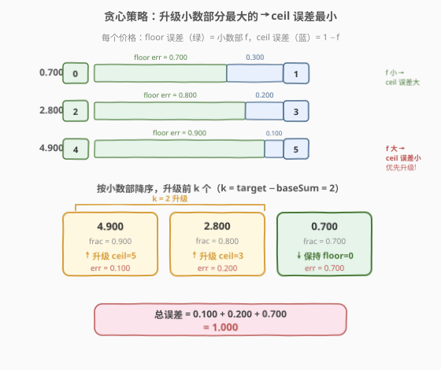
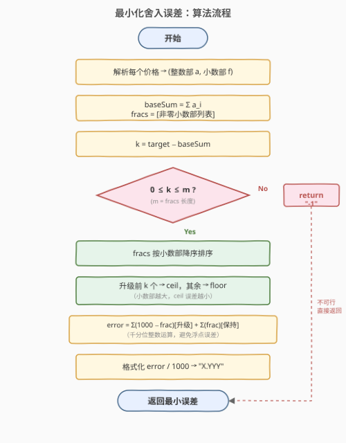
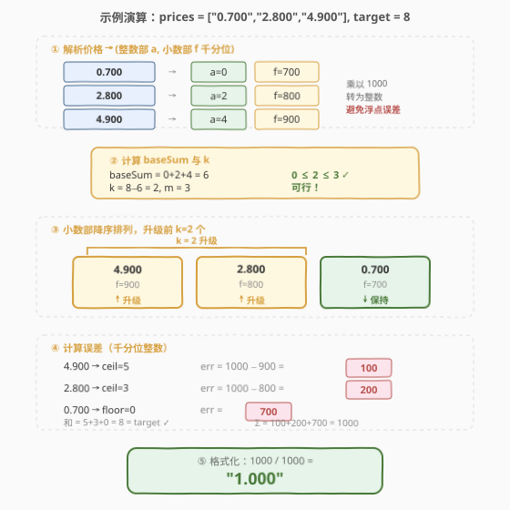

# LeetCode 最小化舍入误差以满足目标 题解

## 1. 题目概述

- **标题 / 题号**：最小化舍入误差以满足目标（#1058，medium）
- **链接**：https://leetcode.cn/problems/minimize-rounding-error-to-meet-target/
- **难度**：中等
- **标签**：贪心、数组、字符串、数学

**题意**：给定一组用字符串表示的价格 `prices` 和一个整数目标 `target`。每个价格必须被**向下取整（floor）或向上取整（ceil）**为整数。所有取整后的价格之和必须**恰好等于** `target`。

如果不能找到满足条件的取整方案，返回 `"-1"`。否则，返回**最小舍入误差**（每个价格取整后与原值之差的绝对值之和），结果用字符串表示，保留 **3 位小数**。

**示例 1**：

```text
输入：prices = ["0.700","2.800","4.900"], target = 8
输出："1.000"
解释：0.700→0（floor），2.800→3（ceil），4.900→5（ceil）
      和 = 0+3+5 = 8 = target ✓
      误差 = |0-0.7| + |3-2.8| + |5-4.9| = 0.7+0.2+0.1 = 1.0
```

**示例 2**：

```text
输入：prices = ["1.500","2.500","3.500"], target = 10
输出："-1"
解释：floor 之和 = 1+2+3 = 6，最多升级 3 次到 ceil 得 2+3+4 = 9 < 10，不可能达到。
```

**示例 3**：

```text
输入：prices = ["1.500","2.500","3.500"], target = 9
输出："1.500"
解释：全部取 ceil：2+3+4 = 9 = target ✓
      误差 = 0.5+0.5+0.5 = 1.5
```

**约束**：

- `1 <= prices.length <= 10^5`
- `prices[i]` 是表示 `0` 到 `1000` 之间实数的字符串，最多 3 位小数
- `0 <= target <= 10^6`

## 2. 解题思路

### 2.1 暴力思路：枚举取整方案

每个价格有 floor 和 ceil 两种选择（整数价格除外），共 $2^n$ 种组合。对每种组合检查和是否等于 `target`，在满足条件的方案中找最小误差。$n$ 可达 $10^5$，$2^{10^5}$ 完全不可行。

### 2.2 核心观察：贪心——升级小数部分最大的



关键观察：对每个非整数价格 $p_i$，设其整数部分为 $a_i$、小数部分为 $f_i$（$0 < f_i < 1$）：

- **floor**（取 $a_i$）：误差贡献 $= f_i$（即 $p_i - a_i$）
- **ceil**（取 $a_i + 1$）：误差贡献 $= 1 - f_i$

如果**全部取 floor**，总和为 $\text{baseSum} = \sum a_i$。每将一个价格从 floor「升级」为 ceil，总和**恰好增加 1**（整数价格无法升级，因为 floor = ceil）。

要使总和达到 `target`，需要恰好 $k = \text{target} - \text{baseSum}$ 次升级。可行性条件：

$$0 \leq k \leq \text{非整数价格个数 } m$$

> ⚠️ 若 $k < 0$（target 太小，连全 floor 都超过）或 $k > m$（target 太大，全 ceil 都不够），返回 `"-1"`。

**最小化误差**：全 floor 时的基准误差为 $\sum f_i$。每次升级价格 $i$，误差变化量为：

$$\Delta_i = (1 - f_i) - f_i = 1 - 2f_i$$

$f_i$ 越大，$\Delta_i$ 越小（越负），即升级带来的误差减少越多。因此**贪心策略**：将所有非整数价格按小数部分**降序排列**，升级前 $k$ 个（小数部分最大的），其余保持 floor。

> 💡 **直觉**：$4.900$ 向上取整为 $5$ 只增加 $0.1$ 误差，而 $0.700$ 向上取整为 $1$ 增加 $0.3$ 误差。优先升级「差一点就到整数」的价格，误差最小。

### 2.3 算法流程图



核心步骤：解析价格 → 计算 baseSum 与 $k$ → 可行性检查 → 排序贪心选 $k$ 个升级 → 汇总误差 → 格式化输出。

### 2.4 示例演算

以 `prices = ["0.700","2.800","4.900"]`、`target = 8` 为例：



| 价格 | 整数部 | 小数部（千分位） | baseSum 贡献 |
|------|--------|------------------|--------------|
| 0.700 | 0 | 700 | +0 |
| 2.800 | 2 | 800 | +2 |
| 4.900 | 4 | 900 | +4 |

- $\text{baseSum} = 6$，$m = 3$，$k = 8 - 6 = 2$
- 小数部降序：$[900, 800, 700]$
- 升级前 2 个：$4.900 \to 5$（误差 $100$）、$2.800 \to 3$（误差 $200$）；保持 $0.700 \to 0$（误差 $700$）
- 总误差 $= 100 + 200 + 700 = 1000$（千分位）→ `"1.000"`

> 💡 示例 3：`["1.500","2.500","3.500"]`，`target = 9`。$\text{baseSum} = 6$，$k = 3 = m$，全部升级到 ceil，误差 $= 3 \times 500 = 1500$ → `"1.500"`。

## 3. 参考代码

### C++

```cpp
class Solution {
public:
    string minimizeError(vector<string>& prices, int target) {
        vector<int> fracs;          // 非整数价格的小数部分（千分位整数）
        long long baseSum = 0;

        for (const string& p : prices) {
            int dot = p.find('.');
            int intPart, fracPart = 0;
            if (dot == string::npos) {
                intPart = stoi(p);
            } else {
                intPart = stoi(p.substr(0, dot));
                string fs = p.substr(dot + 1);
                while (fs.size() < 3) fs += '0';   // 补齐到 3 位
                fracPart = stoi(fs);
            }
            baseSum += intPart;     // floor 贡献
            if (fracPart > 0) fracs.push_back(fracPart);
        }

        int k = target - baseSum;   // 需要升级的次数
        if (k < 0 || k > (int)fracs.size()) return "-1";

        // 按小数部分降序：优先升级小数部分最大的
        sort(fracs.begin(), fracs.end(), greater<int>());

        long long error = 0;        // 误差（千分位整数）
        for (int i = 0; i < (int)fracs.size(); i++) {
            error += (i < k) ? (1000 - fracs[i])   // 升级：ceil 误差
                             : fracs[i];            // 保持：floor 误差
        }

        // 格式化为 "X.YYY"
        string result = to_string(error / 1000) + ".";
        int rem = error % 1000;
        result += to_string(rem / 100) + to_string((rem / 10) % 10) + to_string(rem % 10);
        return result;
    }
};
```

### Python

```python
class Solution:
    def minimizeError(self, prices: List[str], target: int) -> str:
        fracs = []
        base_sum = 0

        for p in prices:
            if '.' in p:
                int_str, frac_str = p.split('.')
                int_part = int(int_str)
                frac_str = (frac_str + '000')[:3]   # 补齐到 3 位
                frac_part = int(frac_str)
            else:
                int_part = int(p)
                frac_part = 0
            base_sum += int_part                    # floor 贡献
            if frac_part > 0:
                fracs.append(frac_part)

        k = target - base_sum                       # 需要升级的次数
        if k < 0 or k > len(fracs):
            return "-1"

        fracs.sort(reverse=True)                    # 小数部分降序

        error = sum(1000 - fracs[i] for i in range(k)) + \
                sum(fracs[i] for i in range(k, len(fracs)))

        return f"{error // 1000}.{error % 1000:03d}"
```

> ⚠️ **浮点精度陷阱**：直接用 `float` 解析价格会引入二进制浮点误差（如 `0.700` 可能存为 `0.6999999...`），导致小数部分计算偏差。本题利用「最多 3 位小数」的约束，将所有数值乘以 $1000$ 转为**整数运算**，彻底避免精度问题。这是处理定点小数问题的通用技巧。

## 4. 复杂度分析

| 维度 | 复杂度 | 说明 |
|------|--------|------|
| 时间复杂度 | $O(n \log n)$ | 解析 $O(n)$，排序 $O(n \log n)$，求和 $O(n)$；排序为主导 |
| 空间复杂度 | $O(n)$ | 存储小数部分数组 `fracs` |

> 💡 若题目保证小数部分种类有限（3 位小数共 $999$ 种），可用**计数排序**优化到 $O(n)$，但 $O(n \log n)$ 对 $n \leq 10^5$ 已足够。

## 5. 扩展：贪心正确性证明

**命题**：在所有恰好进行 $k$ 次升级的方案中，按小数部分降序升级前 $k$ 个的方案误差最小。

**证明**：总误差可分解为：

$$E = \underbrace{\sum_{\text{所有非整数}} f_i}_{\text{常数项（全 floor 基准误差）}} + \sum_{i \in S} (1 - 2f_i)$$

其中 $S$ 是被升级的价格集合（$|S| = k$）。第一项与升级选择无关（常数）。第二项中，每个被升级的价格 $i$ **独立**贡献 $(1 - 2f_i)$。要从 $m$ 个非整数价格中选 $k$ 个使 $\sum_{i \in S}(1 - 2f_i)$ 最小，等价于选 $k$ 个 $(1 - 2f_i)$ 最小的，即 $f_i$ 最大的。

由于各选项的贡献**完全独立**——升级价格 $i$ 不影响价格 $j$ 的误差——不存在「选 A 还是 B」的冲突，排序后取前 $k$ 个即为全局最优。这与 [1029. 两地调度](../1001-1100/1029_两地调度.md) 中「按差值排序贪心分配」的证明结构一致。

> 💡 **对比 1029**：两地调度中每人去 A 或 B 城市有费用差 $\Delta = \text{cost}_A - \text{cost}_B$，按 $\Delta$ 排序取前 $n/2$ 去 A。本题中每个价格的升级「费用差」$\Delta_i = 1 - 2f_i$，按 $\Delta_i$ 升序（即 $f_i$ 降序）取前 $k$ 个升级。两者本质相同：**独立选择 + 排序贪心**。

## 6. 面试要点

1. **为什么升级次数恰好是 $k = \text{target} - \text{baseSum}$？**

   - 全 floor 时总和为 $\text{baseSum}$。每次升级（floor→ceil）使总和恰好 $+1$（因为 $\lceil p \rceil - \lfloor p \rfloor = 1$ 对非整数成立）。要达到 target，恰好需要 $k$ 次升级。

2. **为什么按小数部分降序升级？**

   - 升级价格 $i$ 的误差变化量 $\Delta_i = 1 - 2f_i$。$f_i$ 越大，$\Delta_i$ 越负（误差减少越多）。选 $k$ 个 $f_i$ 最大的升级，总误差最小。

3. **整数价格如何处理？**

   - 整数价格的 floor = ceil，无法升级（升级不改变总和也不改变误差，且不消耗升级名额）。代码中 `fracPart == 0` 时不加入 `fracs`，自然排除。

4. **为什么用整数运算而非浮点？**

   - 价格最多 3 位小数，乘以 $1000$ 后均为整数。浮点 `float` 无法精确表示多数十进制小数（如 $0.1$ 在二进制中是无限循环），会导致小数部分计算偏差。整数运算保证精确。

5. **如果 $k = 0$ 怎么办？**

   - target 恰好等于 baseSum，全部取 floor 即可。误差 $= \sum f_i$（所有非整数价格的小数部分之和）。代码中 `range(0)` 为空，直接累加所有 `fracs[i]`，正确返回。

## 同类练习题

| # | 题目 | 与本题的关联 |
|---|------|-------------|
| 1029 | [两地调度](https://leetcode.cn/problems/two-city-scheduling/)（[题解](../1001-1100/1029_两地调度.md)） | 按费用差排序，贪心分配 $n/2$ 人到各城市，与本题「按小数部排序选 $k$ 个升级」同构 |
| 1005 | [K 次取反后最大化的数组和](https://leetcode.cn/problems/maximize-sum-of-array-after-k-negations/)（[题解](../1001-1100/1005_K次取反后最大化的数组和.md)） | 排序后选择 $k$ 次取反操作使数组和最大，同为「排序 + 贪心选 $k$ 次修改」 |
| 435 | [无重叠区间](https://leetcode.cn/problems/non-overlapping-intervals/)（[题解](../0401-0500/435_无重叠区间.md)） | 按右端点排序贪心保留最多区间，经典排序贪心范式 |
| 881 | [救生艇](https://leetcode.cn/problems/boats-to-save-people/) | 排序 + 双指针贪心配对，另一种排序后的贪心选择策略 |
