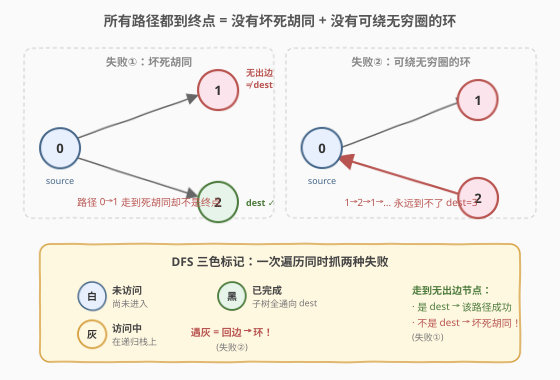
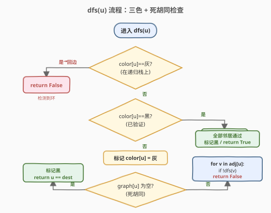
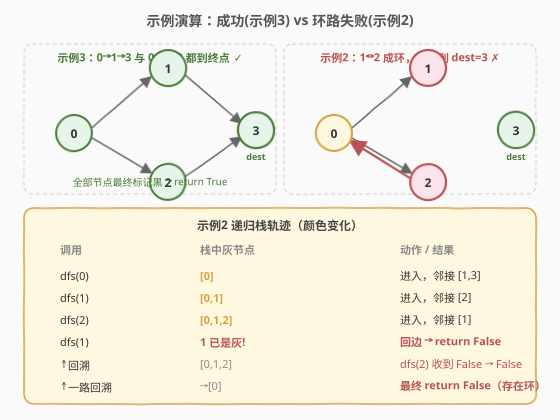

# LeetCode 从起点到终点的所有路径 题解

## 1. 题目概述

- **标题 / 题号**：从起点到终点的所有路径（#1059，medium）
- **链接**：https://leetcode.cn/problems/all-paths-from-source-lead-to-destination/
- **难度**：中等
- **标签**：深度优先搜索、图、三色标记法

**题意**：给定一个有向图的边集合 `edges`，以及图中的起点 `source` 和终点 `destination`。判断**从 `source` 出发的所有路径是否最终都终止于 `destination`**，当且仅当满足以下三个条件时返回 `true`：

1. 从 `source` 到 `destination` 至少存在一条路径；
2. 若从 `source` 能走到某个**无出边**的节点，则该节点**必须等于** `destination`（即不存在"坏死胡同"）；
3. 从 `source` 到 `destination` 的路径数是**有限的**（即不存在可以绕无穷圈的环）。

**示例 1**：

```text
输入：n = 3, edges = [[0,1],[0,2]], source = 0, destination = 2
输出：false
解释：存在路径 0→1，而节点 1 无出边且 1 ≠ 2，属于"坏死胡同"。
```

**示例 2**：

```text
输入：n = 4, edges = [[0,1],[0,3],[1,2],[2,1]], source = 0, destination = 3
输出：false
解释：虽然有路径 0→3，但也存在 0→1→2→1→2→… 的环，永远到不了 3，路径数无限。
```

**示例 3**：

```text
输入：n = 4, edges = [[0,1],[0,2],[1,3],[2,3]], source = 0, destination = 3
输出：true
解释：从 0 出发的路径只有 0→1→3 与 0→2→3，都终止于 3。
```

**约束**：

- $1 \leq n \leq 10^4$
- $0 \leq \text{edges.length} \leq 10^4$
- $\text{edges}[i].\text{length} == 2$
- $0 \leq \text{source}, \text{destination} \leq n - 1$
- 图中可能有**自环和重边**

> 💡 **关键直觉**：题目不是问"能否到达终点"，而是问"是否**所有**走法都必然落到终点"。失败只有两种姿势——①某条路走进了一个不是终点的死胡同；②存在环让人可以绕无穷圈永远到不了终点。一次带状态标记的 DFS 就能把两种失败都揪出来。

## 2. 解题思路

### 2.1 暴力思路

枚举从 `source` 出发的所有路径，逐条检查：要么终止于 `destination`，要么……但路径数可能**无穷**（有环时），暴力枚举根本停不下来。即便限制步数，也无法判定"是否永远到不了"。

> 💡 暴力的本质困难在于：环让搜索空间无限。必须用**状态标记**把"已经确认安全/正在排查中/有环"区分开，让每个节点只被有效访问常数次。

### 2.2 核心观察：DFS 三色标记法



把 [207. 课程表](https://leetcode.cn/problems/course-schedule/) 里判有向图环的**三色标记法**搬过来，再补一个"死胡同检查"即可一次解决：

- **白（`0`，未访问）**：尚未进入的节点。
- **灰（`1`，访问中）**：在当前递归栈上的节点。DFS 中若再次遇到灰节点 → 从后代指回了祖先 → **回边 → 有环**（对应失败②，路径数无限）。
- **黑（`2`，已完成）**：从该节点出发的所有路径都已验证通向 `destination`，再次遇到可直接放行。

**死胡同检查**（对应失败①）：当 DFS 走到一个**无出边**的节点 `u` 时，这条路径在此终止。此时只有 `u == destination` 才合法，否则就是"坏死胡同"，立即返回 `false`。

> ⚠️ **易错点**：`destination` 本身也可能有出边。例如 `dest=3` 且 `3→4→3`，此时路径 `0→…→3` 并未结束，还会继续走，必须照样 DFS 下去（环会被三色标记捕获）。所以**不要**在"到达 dest 时立即返回 true"，只有"无出边且等于 dest"才是合法终点。

### 2.3 算法流程图



`dfs(u)` 的递归逻辑：

1. 若 `color[u] == 灰`：回边，**有环**，返回 `false`。
2. 若 `color[u] == 黑`：已验证安全，返回 `true`。
3. 标记 `color[u] = 灰`。
4. 若 `graph[u]` 为空（死胡同）：标记 `color[u] = 黑`，返回 `u == destination`。
5. 否则对每个邻居 `v` 递归 `dfs(v)`；任一返回 `false` 则整体返回 `false`。
6. 全部邻居通过后，标记 `color[u] = 黑`，返回 `true`。

主函数只需 `return dfs(source)`。注意 `source == destination` 时也由同一套逻辑处理：若 `source` 无出边则 `u == dest` 成立返回 `true`；若有出边则继续 DFS 验证所有走法都回到 `source`。

### 2.4 示例演算



**示例 3（`true`）**：图 `0→1→3, 0→2→3`。

- `dfs(0)` 灰 → 访问 `1`：`dfs(1)` 灰 → 访问 `3`：`dfs(3)` 无出边且 `3==dest` → 标记黑、返回 `true`；`dfs(1)` 标记黑、返回 `true`。
- 再访问 `2`：`dfs(2)` 灰 → 访问 `3`：`color[3]==黑` 直接 `true`；`dfs(2)` 标记黑、返回 `true`。
- `dfs(0)` 标记黑、返回 `true`。所有节点最终为黑。

**示例 2（`false`）**：图 `0→1, 0→3, 1→2, 2→1`。

- `dfs(0)` 灰 → 访问 `1`：`dfs(1)` 灰 → 访问 `2`：`dfs(2)` 灰 → 访问 `1`：`color[1]==灰` → **回边，有环**，返回 `false`。
- `false` 一路回传：`dfs(2)`、`dfs(1)`、`dfs(0)` 均返回 `false`。

## 3. 参考代码

### C++

```cpp
class Solution {
    vector<vector<int>> adj;
    vector<int> color;          // 0 白未访问 / 1 灰访问中 / 2 黑已完成
    int dest;
    bool dfs(int u) {
        if (color[u] == 1) return false;          // 灰 → 回边 → 环
        if (color[u] == 2) return true;           // 黑 → 已验证
        color[u] = 1;                             // 标记灰
        if (adj[u].empty()) {                     // 死胡同：必须就是终点
            color[u] = 2;
            return u == dest;
        }
        for (int v : adj[u])
            if (!dfs(v)) return false;            // 任一邻居失败即整体失败
        color[u] = 2;                             // 全部通过 → 标记黑
        return true;
    }
  public:
    bool leadsToDestination(int n, vector<vector<int>>& edges,
                            int source, int destination) {
        adj.assign(n, {});
        color.assign(n, 0);
        dest = destination;
        for (auto& e : edges) adj[e[0]].push_back(e[1]);
        return dfs(source);
    }
};
```

### Python

```python
class Solution:
    def leadsToDestination(self, n: int, edges: List[List[int]],
                           source: int, destination: int) -> bool:
        adj = [[] for _ in range(n)]
        for a, b in edges:
            adj[a].append(b)
        color = [0] * n          # 0 白 / 1 灰 / 2 黑

        def dfs(u: int) -> bool:
            if color[u] == 1:    # 灰 → 回边 → 环
                return False
            if color[u] == 2:    # 黑 → 已验证
                return True
            color[u] = 1
            if not adj[u]:       # 死胡同：必须就是终点
                color[u] = 2
                return u == destination
            for v in adj[u]:
                if not dfs(v):
                    return False
            color[u] = 2
            return True

        return dfs(source)
```

> ⚠️ $n$ 上界 $10^4$，链状图时 Python 递归深度可达 $10^4$，需 `sys.setrecursionlimit(20000)` 或改用下面的迭代版，否则可能 `RecursionError`。

## 4. 复杂度分析

| 维度 | 复杂度 | 说明 |
|------|--------|------|
| 时间复杂度 | $O(V + E)$ | 每个节点至多由"灰→黑"转换一次，每条边在其起点 DFS 时遍历一次；已黑节点直接放行不重复搜索 |
| 空间复杂度 | $O(V + E)$ | 邻接表 $O(V+E)$，颜色数组 $O(V)$，递归栈最深 $O(V)$ |

> 💡 **正确性关键**：`color[u] = 黑` 表示"从 `u` 出发的所有路径都通向 `dest`"这一性质已被完整验证，因此再次遇到黑节点可直接信任 `true`，避免对环/长链的重复搜索，把潜在指数级路径枚举压到线性。

## 5. 扩展：迭代版 DFS（规避栈溢出）

当 $n$ 很大时（如 $10^5$），递归 DFS 有栈溢出风险。可改为**显式栈 + 后序标记**：栈中记录 `(u, 邻居迭代器位置)`，先把 `u` 染灰并压栈，逐个处理邻居；当邻居全部处理完毕（模拟"离开 `u`"）时再把 `u` 染黑。逻辑与递归版完全等价，只是把"递归返回"换成"弹栈染黑"。

```cpp
bool leadsToDestination(int n, vector<vector<int>>& edges,
                        int source, int destination) {
    vector<vector<int>> adj(n);
    for (auto& e : edges) adj[e[0]].push_back(e[1]);
    vector<int> color(n, 0);
    stack<pair<int,int>> st;            // (节点, 下一个待访问邻居下标)
    auto push = [&](int u) {
        color[u] = 1;
        st.push({u, 0});
    };
    push(source);
    while (!st.empty()) {
        auto& [u, idx] = st.top();
        if (idx == 0 && adj[u].empty()) {     // 死胡同
            if (u != destination) return false;
            color[u] = 2; st.pop(); continue;
        }
        if (idx < (int)adj[u].size()) {
            int v = adj[u][idx++];
            if (color[v] == 1) return false;   // 灰 → 环
            if (color[v] == 0) push(v);        // 白 → 继续深入
            // 黑 → 跳过，处理下一个邻居
        } else {
            color[u] = 2;                      // 邻居全过 → 染黑
            st.pop();
        }
    }
    return true;
}
```

> 💡 迭代版的核心是：**染黑发生在"所有邻居处理完"那一刻**，与递归版"递归返回前染黑"语义一致，因此环检测（遇灰即失败）与死胡同检查逻辑不变。

## 6. 面试要点

1. **这道题和"能否从起点到终点"有什么区别？**
   - 普通可达性问题只需一条路径到终点即可；本题要求**所有**走法都必然落到终点，是一个"全称量化"判断，必须排查每条可能路径，故需要状态标记避免重复/无限搜索。

2. **为什么遇到灰节点就是环？**
   - 灰节点表示在当前递归栈（即正在走的这条路径）上。若从某后代又指回栈中节点，说明可以在这条路径上绕该环任意多圈，产生无穷多条不同路径，违反"路径数有限"。

3. **为什么不能在"到达 dest"时立即返回 true？**
   - 路径只有在**无出边**时才终止。若 `dest` 有出边（如 `dest→x`），到达 `dest` 后路径还在继续，必须 DFS 验证后续也合法。只有"无出边且等于 dest"才是合法终点；若 `dest` 无出边，则它天然是合法终点。

4. **黑色标记的作用是什么？**
   - 黑色 = "从该节点出发的所有路径都已验证通向 dest"。再次遇到黑节点直接放行，避免对共享子结构（如多条路径汇聚到同一节点）重复搜索，把指数级路径数压成线性时间。

5. **重边和自环需要单独处理吗？**
   - 重边只是多几条相同的出边，不影响判定（邻居重复访问时已是黑/灰会被常数处理）。自环 `u→u` 会让 `dfs(u)` 标灰后立刻访问自己 → 遇灰 → 判环失败，这正是自环导致"路径数无限"的正确结论，无需特判。

## 同类练习题

| # | 题目 | 与本题的关联 |
|---|------|-------------|
| 207 | [课程表](https://leetcode.cn/problems/course-schedule/) | 三色标记法判有向图环的母题，本题在其基础上多了一个"死胡同必须等于终点"的检查 |
| 802 | [找到最终的安全状态](https://leetcode.cn/problems/find-eventual-safe-states/) | 三色标记找出"所有路径都终止于终点的节点"集合，即本题的安全节点推广到全图 |
| 797 | [所有可能的路径](https://leetcode.cn/problems/all-paths-from-source-to-target/) | DAG 上枚举所有路径，对比本题"判断所有路径是否都合规"的判定型变体 |
| 997 | [找到小镇的法官](https://leetcode.cn/problems/find-the-town-judge/) | 图上"全信任汇聚到一点"的判定，与"所有路径汇聚到终点"结构相似 |
