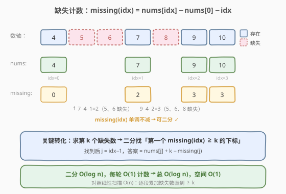
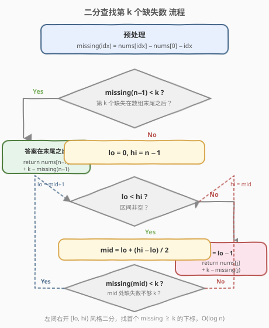
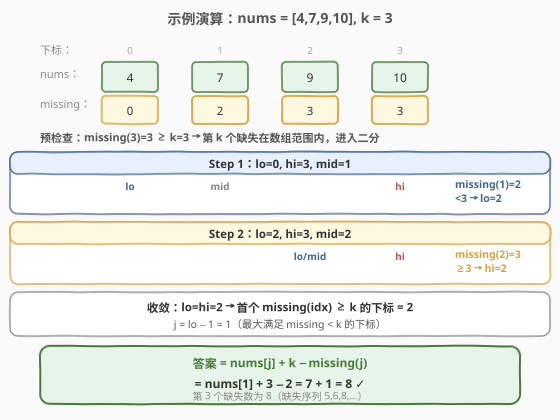

# LeetCode 有序数组中的缺失元素 题解

## 1. 题目概述

- **标题 / 题号**：有序数组中的缺失元素（#1060，medium）
- **链接**：https://leetcode.cn/problems/missing-element-in-sorted-array/
- **难度**：中等
- **标签**：数组、二分查找

**题意**：给定一个**升序排列**且**所有元素互不相同**的整数数组 `nums`，再给定一个整数 `k`，返回从数组**最左边的数** `nums[0]` 开始的第 `k` 个缺失数字。

> 💡 缺失数字是指：在 $[\text{nums}[0], \text{nums}[n-1]]$ 范围内（及之后）本应连续出现、但数组中不存在的整数。

**示例 1**：

```text
输入：nums = [4,7,9,10], k = 1
输出：5
解释：从 4 开始的缺失数字依次为 5, 6, 8, ...，第 1 个是 5。
```

**示例 2**：

```text
输入：nums = [4,7,9,10], k = 3
输出：8
解释：缺失数字为 [5, 6, 8, ...]，第 3 个是 8。
```

**示例 3**：

```text
输入：nums = [1,2,4], k = 3
输出：6
解释：缺失数字为 [3, 5, 6, ...]，第 3 个是 6（已超出数组末尾 4）。
```

**约束**：

- $1 \leq \text{nums.length} \leq 5 \times 10^4$
- $1 \leq \text{nums}[0] < \text{nums}[i] \leq 10^7$（对所有有效 $i$）
- `nums` 升序排列且所有值互不相同
- $1 \leq k \leq 10^8$

> ⚠️ **进阶**：你能在 $O(\log n)$ 时间复杂度内解决吗？

## 2. 解题思路

### 2.1 暴力思路：逐段线性扫描

从左到右遍历相邻元素对 `(nums[i], nums[i+1])`，它们之间的缺失数量为：

$$\text{gap}_i = \text{nums}[i+1] - \text{nums}[i] - 1$$

把 `gap` 逐段累加到计数器 `cnt`，当 `cnt + gap_i >= k` 时，第 `k` 个缺失数落在这一段内，答案为：

$$\text{nums}[i] + (k - \text{cnt})$$

若遍历完整个数组 `cnt` 仍小于 `k`，说明第 `k` 个缺失数在数组末尾之后，答案为 $\text{nums}[n-1] + (k - \text{cnt})$。

**复杂度**：时间 $O(n)$，空间 $O(1)$。$n = 5 \times 10^4$ 能过但未利用「有序」性质，不满足 $O(\log n)$ 进阶要求。

> ⚠️ 瓶颈：线性扫描把每一段都看了一遍。但「缺失计数」是关于下标**单调不减**的——这正是二分的信号。

### 2.2 核心观察：缺失计数函数 + 二分

定义**缺失计数函数**：

$$\text{missing}(\text{idx}) = \text{nums}[\text{idx}] - \text{nums}[0] - \text{idx}$$

它的含义是：在区间 $[\text{nums}[0], \text{nums}[\text{idx}]]$ 内，有多少个整数**不在**数组的前 `idx+1` 个元素中。

> 💡 **直觉推导**：如果从 `nums[0]` 到 `nums[idx]` 完全连续，应该恰好有 `idx + 1` 个数（含两端）。实际跨度为 $\text{nums}[\text{idx}] - \text{nums}[0] + 1$ 个整数，减去已有的 `idx + 1` 个，缺失数 $= (\text{nums}[\text{idx}] - \text{nums}[0] + 1) - (\text{idx} + 1) = \text{nums}[\text{idx}] - \text{nums}[0] - \text{idx}$。



以 `nums = [4,7,9,10]` 为例：

| idx | nums[idx] | missing(idx) | 缺失的数 |
|-----|-----------|--------------|----------|
| 0   | 4         | 4−4−0 = **0** | — |
| 1   | 7         | 7−4−1 = **2** | 5, 6 |
| 2   | 9         | 9−4−2 = **3** | 5, 6, 8 |
| 3   | 10        | 10−4−3 = **3** | 5, 6, 8 |

**关键性质**：`missing(idx)` 随 `idx` **单调不减**（因为 `nums` 升序，跨度只增不减，而已有元素数的增长不会超过跨度的增长）。单调 → 可二分。

> 💡 **关键转化**：求第 `k` 个缺失数 $\Longleftrightarrow$ 二分找「**第一个** `missing(idx) >= k` 的下标 `lo`」。找到后令 $j = \text{lo} - 1$（最大满足 $\text{missing} < k$ 的下标），答案 $= \text{nums}[j] + k - \text{missing}(j)$——即从 `nums[j]` 往后跳「还差的缺失数」步。

### 2.3 算法流程图



**两个分支**：

1. **预检查**：若 $\text{missing}(n-1) < k$，说明即使到数组末尾，缺失数仍不足 `k` 个，第 `k` 个缺失在末尾之后。直接返回 $\text{nums}[n-1] + k - \text{missing}(n-1)$。
2. **二分查找**：否则第 `k` 个缺失落在数组范围内，二分找首个 $\text{missing}(\text{idx}) \geq k$ 的下标 `lo`，令 $j = \text{lo} - 1$，返回 $\text{nums}[j] + k - \text{missing}(j)$。

> ⚠️ 二分模板采用「左闭右闭 `[lo, hi]` + `lo < hi` + `lo = mid + 1` / `hi = mid`」的 lower_bound 写法，与 [34. 在排序数组中查找元素的第一个和最后一个位置](../0001-0100/34_在排序数组中查找元素的第一个和最后一个位置.md) 中「找首个满足条件的位置」完全一致。

### 2.4 示例演算

以 `nums = [4,7,9,10], k = 3` 为例，`missing = [0, 2, 3, 3]`：



**预检查**：`missing(3) = 3 >= k = 3` → 第 3 个缺失在数组范围内，进入二分。

| 轮次 | lo | hi | mid | missing(mid) | 判断 | 操作 |
|------|----|----|-----|--------------|------|------|
| 1    | 0  | 3  | 1   | 2            | 2 < 3 | lo = 2 |
| 2    | 2  | 3  | 2   | 3            | 3 ≥ 3 | hi = 2 |
| 收敛 | 2  | 2  | —   | —            | lo = hi | 结束 |

`lo = 2` 即首个 `missing >= k` 的下标，$j = \text{lo} - 1 = 1$。

$$\text{ans} = \text{nums}[1] + k - \text{missing}(1) = 7 + 3 - 2 = 8 \quad \checkmark$$

> 💡 验证：缺失序列为 5, 6, 8, ...，第 3 个确实是 8。

再看 `nums = [1,2,4], k = 3`：`missing = [0, 0, 1]`。预检查 `missing(2) = 1 < 3` → 第 3 个缺失在末尾之后。$\text{ans} = \text{nums}[2] + 3 - 1 = 4 + 2 = 6$。缺失序列 3, 5, 6, ...，第 3 个是 6 ✓。

## 3. 参考代码

### C++

```cpp
class Solution {
public:
    int missingElement(vector<int>& nums, int k) {
        int n = nums.size();
        // 缺失计数函数
        auto missing = [&](int idx) {
            return nums[idx] - nums[0] - idx;
        };
        // 预检查：第 k 个缺失在数组末尾之后
        if (missing(n - 1) < k) {
            return nums[n - 1] + k - missing(n - 1);
        }
        // 二分：找首个 missing(idx) >= k 的下标
        int lo = 0, hi = n - 1;
        while (lo < hi) {
            int mid = lo + (hi - lo) / 2;
            if (missing(mid) < k) {
                lo = mid + 1;
            } else {
                hi = mid;
            }
        }
        int j = lo - 1;
        return nums[j] + k - missing(j);
    }
};
```

### Python

```python
class Solution:
    def missingElement(self, nums: List[int], k: int) -> int:
        n = len(nums)

        def missing(idx: int) -> int:
            return nums[idx] - nums[0] - idx

        # 预检查：第 k 个缺失在数组末尾之后
        if missing(n - 1) < k:
            return nums[-1] + k - missing(n - 1)

        # 二分：找首个 missing(idx) >= k 的下标
        lo, hi = 0, n - 1
        while lo < hi:
            mid = (lo + hi) // 2
            if missing(mid) < k:
                lo = mid + 1
            else:
                hi = mid

        j = lo - 1
        return nums[j] + k - missing(j)
```

> 💡 **公式简化**：`nums[j] + k - missing(j)` 展开为 $\text{nums}[j] + k - (\text{nums}[j] - \text{nums}[0] - j) = \text{nums}[0] + k + j$。两种写法等价，前者语义更直观（「从 `nums[j]` 往后跳剩余缺失数」），后者计算更简（少一次数组访问）。面试中写任一种均可。

## 4. 复杂度分析

| 维度 | 方法 | 复杂度 | 说明 |
|------|------|--------|------|
| 时间复杂度 | 二分 + 计数 | $O(\log n)$ | 每轮 $O(1)$ 计算缺失数，区间折半，共 $\log_2 n$ 轮 |
| 空间复杂度 | 二分 + 计数 | $O(1)$ | 仅常数指针与 lambda |
| 时间复杂度 | 线性扫描 | $O(n)$ | 逐段累加缺失数 |
| 空间复杂度 | 线性扫描 | $O(1)$ | 仅计数器 |

> ⚠️ 本题 $n \leq 5 \times 10^4$ 且 $k \leq 10^8$。线性 $O(n)$ 虽能过，但 $k$ 很大时线性法仍需遍历整个数组才能判断是否超出末尾；二分法无论 $k$ 多大都只需 $\log_2(5 \times 10^4) \approx 16$ 轮，这才是进阶要求的最优解。

## 5. 扩展：统一公式与边界分析

### 5.1 统一答案公式

无论是「缺失在数组范围内」还是「超出末尾」，答案都可用统一公式表达：

$$\text{ans} = \text{nums}[0] + k + j$$

其中 $j$ 是**最大的满足 $\text{missing}(j) < k$ 的下标**（若不存在，即所有位置都 $\text{missing} < k$，则 $j = n - 1$）。

- 数组范围内：$j = \text{lo} - 1$（`lo` 为二分找到的首个 $\text{missing} \geq k$ 的下标）。
- 超出末尾：$j = n - 1$（预检查命中）。

两种情况都归结为「找 $j$」，因此也可以不写预检查，改用在 $[0, n]$ 上二分（下标 $n$ 视作 $\text{missing} = +\infty$ 的哨兵）：

```python
class Solution:
    def missingElement(self, nums: List[int], k: int) -> int:
        lo, hi = 0, len(nums)  # hi = n 作为哨兵
        while lo < hi:
            mid = (lo + hi) // 2
            if nums[mid] - nums[0] - mid < k:
                lo = mid + 1
            else:
                hi = mid
        # lo 是首个 missing >= k 的下标（或 n）
        return nums[0] + k + lo - 1
```

> ⚠️ 哨兵写法更简洁但需注意 `lo` 可能等于 `n`（此时 `nums[lo]` 越界），因此不能在循环内访问 `nums[lo]`，且最终用统一公式 `nums[0] + k + lo - 1` 避免越界访问。

### 5.2 为什么 missing(idx) 单调不减？

由定义 $\text{missing}(\text{idx}) = \text{nums}[\text{idx}] - \text{nums}[0] - \text{idx}$，考虑相邻两项：

$$\text{missing}(\text{idx}+1) - \text{missing}(\text{idx}) = [\text{nums}[\text{idx}+1] - \text{nums}[\text{idx}]] - 1 \geq 0$$

因为数组严格升序，$\text{nums}[\text{idx}+1] - \text{nums}[\text{idx}] \geq 1$。差值恰好等于该段的缺失数，恒非负，故单调不减。

## 6. 面试要点

1. **`missing(idx)` 这个公式怎么想到的？**
   - 从「完全连续应有几个数」减去「实际有几个数」：跨度 $\text{nums}[\text{idx}] - \text{nums}[0] + 1$ 减去已占 $\text{idx} + 1$，化简即得 $\text{nums}[\text{idx}] - \text{nums}[0] - \text{idx}$。

2. **为什么能二分？单调性如何保证？**
   - $\text{missing}(\text{idx}+1) - \text{missing}(\text{idx}) = \text{nums}[\text{idx}+1] - \text{nums}[\text{idx}] - 1 \geq 0$，严格升序保证每段跨度 $\geq 1$，故缺失计数单调不减。

3. **预检查 `missing(n-1) < k` 的作用？能否省去？**
   - 用于判断第 `k` 个缺失是否在数组末尾之后。若省去，二分在所有 `missing < k` 时会返回 `lo = n-1`（非真正的「首个 ≥ k」），导致错误。可用哨兵下标 $n$（见 5.1）统一处理，但预检查写法更直观。

4. **二分找的是「首个 $\geq k$」还是「最大 $< k$」？**
   - 本解法找「首个 $\text{missing}(\text{idx}) \geq k$」的下标 `lo`（lower_bound 谓词版），再令 $j = \text{lo} - 1$。等价于找「最大 $\text{missing} < k$」的下标 $j$，两者互补，选择哪种取决于二分模板习惯。

5. **和 [34. 查找区间](../0001-0100/34_在排序数组中查找元素的第一个和最后一个位置.md) 的二分有何异同？**
   - 34 在数组值上二分找等于 `target` 的边界；本题在「缺失计数」这一**派生量**上二分找满足谓词 $\geq k$ 的边界。核心都是 lower_bound 模板——找「首个满足条件」的位置，区别仅在于条件从 `nums[mid] == target` 换成了 `missing(mid) >= k`。

## 同类练习题

| # | 题目 | 与本题的关联 |
|---|------|-------------|
| 34 | [在排序数组中查找元素的第一个和最后一个位置](https://leetcode.cn/problems/find-first-and-last-position-of-element-in-sorted-array/)（[题解](../0001-0100/34_在排序数组中查找元素的第一个和最后一个位置.md)） | lower_bound 二分模板的母题，找「首个/最后一个」满足条件的位置，与本题二分骨架完全一致 |
| 704 | [二分查找](https://leetcode.cn/problems/binary-search/)（[题解](../0701-0800/704_二分查找.md)） | 一切二分的入门母题，闭区间模板的基础写法 |
| 278 | [第一个错误的版本](https://leetcode.cn/problems/first-bad-version/)（[题解](../0201-0300/278_第一个错误的版本.md)） | 二分找「首个满足谓词」的位置（布尔单调序列），与本题找「首个 `missing >= k`」同构 |
| 719 | [找出第 K 小的数对距离](https://leetcode.cn/problems/find-k-th-smallest-pair-distance/)（[题解](../0701-0800/719_找出第K小的数对距离.md)） | 同样是「定义计数函数 + 二分找满足计数的边界」，双指针计数对应本题的 `missing` 计数，结构高度相似 |
| 153 | [寻找旋转排序数组中的最小值](https://leetcode.cn/problems/find-minimum-in-rotated-sorted-array/)（[题解](../0101-0200/153_寻找旋转排序数组中的最小值.md)） | 二分缩区间的另一变体，体会「与右端点比较定方向」的判断差异 |
