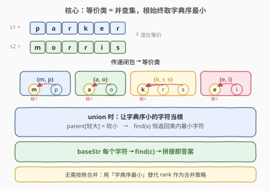
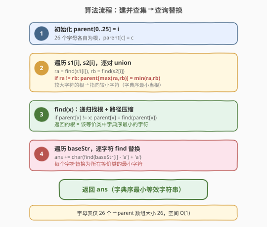
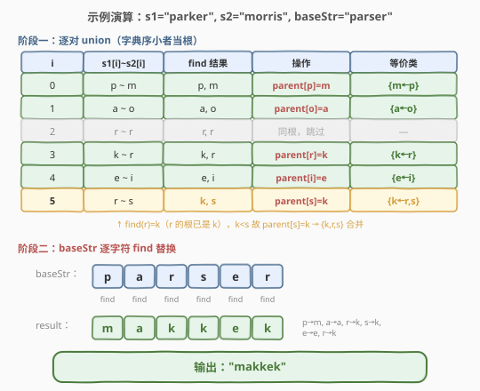

# LeetCode 按字典序排列最小的等效字符串 题解

## 1. 题目概述

- **标题 / 题号**：按字典序排列最小的等效字符串（#1061，medium）
- **链接**：https://leetcode.cn/problems/lexicographically-smallest-equivalent-string/
- **难度**：中等
- **标签**：并查集、字符串

**题意**：给出长度相同的两个字符串 `s1` 和 `s2`，还有一个字符串 `baseStr`。其中 `s1[i]` 和 `s2[i]` 是一组等价字符。

等价字符遵循等价关系的一般规则：

- **自反性**：`'a' == 'a'`
- **对称性**：`'a' == 'b'` 则 `'b' == 'a'`
- **传递性**：`'a' == 'b'` 且 `'b' == 'c'` 则 `'a' == 'c'`

利用 `s1` 和 `s2` 的等价信息，找出并返回 `baseStr` 的**按字典序排列最小的等效字符串**。

**示例 1**：

```text
输入：s1 = "parker", s2 = "morris", baseStr = "parser"
输出："makkek"
解释：根据等价信息，字符可分为 [m,p], [a,o], [k,r,s], [e,i] 共 4 组。
     每组取字典序最小的字符替换 baseStr 中对应字符。
```

**示例 2**：

```text
输入：s1 = "hello", s2 = "world", baseStr = "hold"
输出："hdld"
解释：字符可分为 [h,w], [d,e,o], [l,r] 共 3 组。
     baseStr "hold" 中只有 'o' 变成 'd'。
```

**示例 3**：

```text
输入：s1 = "leetcode", s2 = "programs", baseStr = "sourcecode"
输出："aauaaaaada"
解释：字符可分为 [a,c,e,o,r,s], [l,p], [g,t], [d,m] 共 4 组。
     除 'u' 和 'd' 外所有字母都转化成 'a'。
```

**约束**：

- `1 <= s1.length, s2.length, baseStr <= 1000`
- `s1.length == s2.length`
- 字符串 `s1`、`s2`、`baseStr` 仅由从 `'a'` 到 `'z'` 的小写英文字母组成

## 2. 解题思路

### 2.1 暴力思路

对每个等价对 `s1[i] ~ s2[i]`，用邻接表建图（26 个字母为节点），然后对每个字符做 BFS/DFS 求其所在连通分量中的最小字符。时间复杂度 $O(|\Sigma| \cdot (|s1| + |baseStr|))$，其中 $|\Sigma| = 26$。能过，但**没有利用等价关系的结构特性**——等价类天然适合并查集，且并查集的「合并 + 查询」范式可复用。

### 2.2 核心观察：并查集 + 字典序最小当根



这道题的本质是：给定若干等价对，求每个字符所在**等价类**的**字典序最小元素**。

**并查集天然维护等价类**：

- 每个字符初始自成一棵树，`parent[c] = c`。
- `s1[i] ~ s2[i]` → `union(s1[i], s2[i])` 把两个等价类合并。
- 传递性由 `find` 的向上追溯自动保证：`a~b`、`b~c` 合并后，`find(a)` 和 `find(c)` 返回同一个根。

**关键改造**：标准并查集合并时用「按秩」或「按大小」决定谁当根。本题改为**让字典序小的字符当根**——合并时 `parent[max(ra, rb)] = min(ra, rb)`。这样 `find(x)` 返回的根**恒为该等价类中字典序最小的字符**，无需额外维护最小值。

> 💡 为什么这样可行？并查集的根是集合的「代表元」，我们只需把代表元的选取策略从「按树高」换成「按字典序最小」。合并两个类时，让较小的根成为新根，保证任意时刻每个类的根都是类内最小字符。路径压缩只把节点挂到根下，不改变根是谁，所以最小性始终成立。

### 2.3 算法流程图



### 2.4 示例演算



以 `s1 = "parker"`, `s2 = "morris"`, `baseStr = "parser"` 为例：

**阶段一**：逐对 union（字典序小者当根）

| i | s1[i]~s2[i] | find 结果 | 操作 | 等价类 |
|---|-------------|-----------|------|--------|
| 0 | p ~ m | p, m | `parent[p]=m` | {m←p} |
| 1 | a ~ o | a, o | `parent[o]=a` | {a←o} |
| 2 | r ~ r | r, r | 同根，跳过 | — |
| 3 | k ~ r | k, r | `parent[r]=k` | {k←r} |
| 4 | e ~ i | e, i | `parent[i]=e` | {e←i} |
| 5 | r ~ s | **k**, s | `parent[s]=k` | {k←r,s} |

> ⚠️ 注意 `i=5`：`find(r)` 返回的是 `k`（因为 `i=3` 时 `parent[r]=k`），不是 `r`。这正是并查集传递性的体现——`r` 的根已是 `k`，所以 `r~s` 等价于 `k~s`，`k < s` 故 `parent[s] = k`，三个字符 `{k, r, s}` 合为一类。

**阶段二**：baseStr 逐字符 find 替换

- `p` → `find(p) = m` → `'m'`
- `a` → `find(a) = a` → `'a'`
- `r` → `find(r) = k` → `'k'`
- `s` → `find(s) = k` → `'k'`
- `e` → `find(e) = e` → `'e'`
- `r` → `find(r) = k` → `'k'`

拼接得 `"makkek"`，与示例 1 一致。

## 3. 参考代码

### C++

```cpp
class Solution {
  public:
    int parent[26];

    int find(int x) {
        if (parent[x] != x)
            parent[x] = find(parent[x]);   // 路径压缩
        return parent[x];
    }

    void unite(int a, int b) {
        int ra = find(a), rb = find(b);
        if (ra == rb) return;
        if (ra < rb) parent[rb] = ra;      // 字典序小的当根
        else          parent[ra] = rb;
    }

    string smallestEquivalentString(string s1, string s2, string baseStr) {
        for (int i = 0; i < 26; i++) parent[i] = i;   // 初始化
        for (int i = 0; i < (int)s1.size(); i++)
            unite(s1[i] - 'a', s2[i] - 'a');
        string ans;
        for (char c : baseStr)
            ans += (char)(find(c - 'a') + 'a');
        return ans;
    }
};
```

### Python

```python
class Solution:
    def smallestEquivalentString(self, s1: str, s2: str, baseStr: str) -> str:
        parent = list(range(26))

        def find(x: int) -> int:
            while parent[x] != x:
                parent[x] = parent[parent[x]]   # 路径压缩（隔代压缩）
                x = parent[x]
            return x

        def union(a: int, b: int) -> None:
            ra, rb = find(a), find(b)
            if ra == rb:
                return
            if ra < rb:
                parent[rb] = ra                 # 字典序小的当根
            else:
                parent[ra] = rb

        for a, b in zip(s1, s2):
            union(ord(a) - 97, ord(b) - 97)

        return ''.join(chr(find(ord(c) - 97) + 97) for c in baseStr)
```

> 💡 代码要点：① 字母只有 26 个，`parent` 数组大小固定为 26，空间 $O(1)$；② `union` 时比较的是**两个根** `ra`、`rb` 的字典序，不是原始字符 `a`、`b`——因为合并的是两个等价类的根；③ 路径压缩不影响正确性，因为压缩只把节点挂到当前根下，而根始终是类内最小字符。

## 4. 复杂度分析

| 维度 | 复杂度 | 说明 |
|------|--------|------|
| 时间复杂度 | $O((n + m) \cdot \alpha(26))$ | $n$ = `s1` 长度（union 次数），$m$ = `baseStr` 长度（find 次数），$\alpha$ 为阿克曼反函数 |
| 空间复杂度 | $O(1)$ | `parent` 数组固定 26 个元素 |

> 💡 由于字母表大小 $|\Sigma| = 26$ 是常数，$\alpha(26) < 4$，实际时间复杂度等同于 $O(n + m)$。即使 `s1`、`baseStr` 长度达 $10^5$，也只需线性时间。

## 5. 扩展：为什么不用按秩合并？

标准并查集用「按秩合并 + 路径压缩」把单次操作均摊到 $O(\alpha(n))$。本题**故意不用按秩合并**，原因有二：

1. **目标不同**：按秩合并的「秩」近似树高，目的是压低树以保证效率；本题的合并目标是**让根 = 字典序最小**，二者不能同时满足（按秩合并时根可能是任意字符）。

2. **效率无损**：字母表仅 26 个，即使退化成链表（最坏树高 26），`find` 也只需 26 步。**$|\Sigma|$ 为常数时，朴素合并的复杂度仍是 $O(1)$ 均摊**，无需按秩优化。

> ⚠️ 如果题目把字母表扩展到更大的字符集（如 Unicode），朴素合并可能退化。此时可额外维护一个 `min_char[root]` 数组记录每个根对应的最小字符，仍用按秩合并保证树高，查询时返回 `min_char[find(x)]` 而非 `find(x)` 本身。

## 6. 面试要点

1. **为什么并查集适合这道题？**

   - 题目描述的「等价关系」（自反、对称、传递）正是并查集维护的「等价类」结构。每对 `s1[i]~s2[i]` 是一次 `union`，`baseStr` 中每个字符的查询是一次 `find`，传递性由 `find` 的向上追溯自动保证。

2. **为什么 union 时比较的是根而不是原始字符？**

   - 合并的是两个**等价类**，而非两个独立字符。`s1[i]` 可能已经通过之前的等价对归入某个类，其根（代表元）才是真正的合并对象。比较 `find(s1[i])` 和 `find(s2[i])` 的根，才能正确维护「根 = 类内最小」的不变量。

3. **路径压缩会破坏「根 = 字典序最小」吗？**

   - 不会。路径压缩只把路径上的节点**直接挂到当前根下**，不改变根是谁。根始终是合并时选出的较小字符，压缩后所有节点仍指向同一个最小根。

4. **和标准并查集（如 547 省份数量）的区别？**

   - [547. 省份数量](../0501-0600/547_省份数量.md) 用按秩合并，只关心「连通分量个数」；本题用「字典序最小当根」，关心「每个类的最小元素」。合并策略不同，但 `find` + 路径压缩的骨架完全一致。

5. **如果 baseStr 很长，重复 find 同一字符怎么办？**

   - 可以预处理 26 个字母的 `find` 结果存入缓存表 `min_char[0..25]`，之后直接查表 $O(1)$。但本题 `find` 已有路径压缩，重复查询第一次后即 $O(1)$，优化收益有限。

## 同类练习题

| # | 题目 | 与本题的关联 |
|---|------|-------------|
| 547 | [省份数量](https://leetcode.cn/problems/number-of-provinces/)（[题解](../0501-0600/547_省份数量.md)） | 并查集模板题，按秩合并 + 路径压缩，求连通分量个数 |
| 684 | [冗余连接](https://leetcode.cn/problems/redundant-connection/)（[题解](../0601-0700/684_冗余连接.md)） | 并查集判环，union 失败即冗余边 |
| 990 | [等式方程的可满足性](https://leetcode.cn/problems/satisfiability-of-equality-equations/) | 先 union 等式、再查不等式是否冲突，并查集处理等价关系 |
| 721 | [账户合并](https://leetcode.cn/problems/accounts-merge/) | 并查集合并同名账户下的邮箱，模板进阶 |
| 1202 | [交换字符串中的元素](https://leetcode.cn/problems/smallest-string-with-swaps/) | 并查集维护可交换下标集合，每组内排序拼回，与本题同为「并查集 + 字符串最小化」 |
