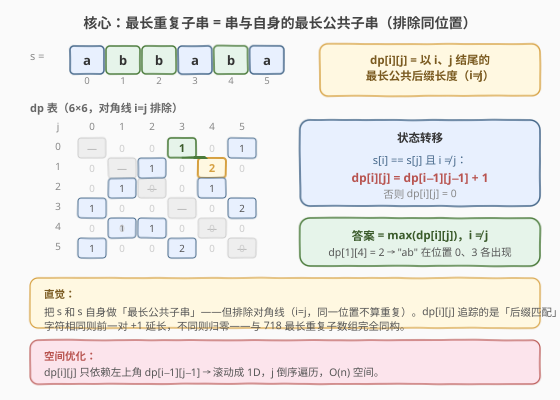
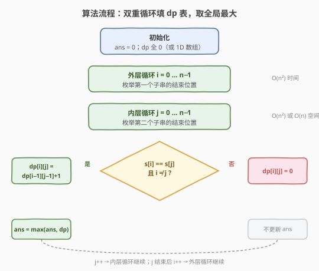
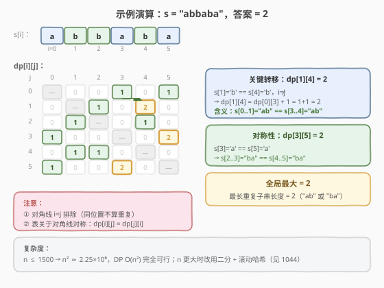

# 最长重复子串的长度

- **题目名称**：最长重复子串的长度
- **链接**：[1062. 最长重复子串的长度](https://leetcode.cn/problems/longest-repeating-substring/)
- **难度**：中等
- **标签**：字符串、动态规划、二分查找、滚动哈希

## 1. 题目概述

给定字符串 `s`，找出其中**出现至少两次**的最长子串的**长度**。若不存在重复子串，返回 `0`。

> ⚠️ 「子串」指**连续**子串；「重复」指同一子串在**不同起始位置**出现两次及以上（**允许重叠**，如 `"aaa"` 中 `"aa"` 在位置 0 和位置 1 各出现一次，长度 2）。

**示例 1**：

```text
输入：s = "abcd"
输出：0
解释：所有字符互不相同，无任何重复子串。
```

**示例 2**：

```text
输入：s = "abbaba"
输出：2
解释："ab" 在位置 0（ab-baba）和位置 3（abb-ab-a）各出现一次；
      "ba" 在位置 1（a-ba-ba）和位置 4（abba-ba-）各出现一次。
      不存在长度 3 的重复子串。
```

**示例 3**：

```text
输入：s = "aabcaab"
输出：3
解释："aab" 在位置 0（aab-caab）和位置 4（aabc-aab）各出现一次，长度 3。
```

**约束条件**：

- $1 \leq \text{s.length} \leq 1500$
- `s` 由小写英文字母组成

> 💡 本题是 [1044. 最长重复子串](../1001-1100/1044_最长重复子串.md) 的**简化版**：1044 的 $n \leq 3 \times 10^4$，必须用「二分 + 滚动哈希」$O(n \log n)$；本题 $n \leq 1500$，$O(n^2)$ DP 即可通过，实现更简洁、思路更直观。两者本质相同——找串中「出现至少两次的最长连续子串」。

---

## 2. 解题思路

### 2.1 暴力思路

枚举所有子串起始位置对 $(i, j)$（$i \neq j$）与所有长度 $L$，逐字符比较 `s[i..i+L-1]` 与 `s[j..j+L-1]` 是否相等，记录最长者。

- 子串对数 $O(n^2)$，每对比较 $O(n)$，整体 $O(n^3)$。$n = 1500$ 时约 $3.4 \times 10^9$ 次操作，超时。

> 💡 暴力法逐对独立比较，忽略了**相邻位置匹配的连续性**：若 `s[i] == s[j]`，则看 `s[i-1]` 与 `s[j-1]` 是否也相等即可延长——这正是 DP 的切入点，能把 $O(n^3)$ 降到 $O(n^2)$。

### 2.2 核心观察：DP——串与自身的最长公共子串



将问题转化为：**求字符串 `s` 与自身的「最长公共子串」长度，但排除同一位置（$i = j$）的匹配**。

定义：

$$\text{dp}[i][j] = \text{以 } s[i] \text{ 和 } s[j] \text{ 为结尾的最长公共后缀长度} \quad (i \neq j)$$

**状态转移**：

$$\text{dp}[i][j] = \begin{cases} \text{dp}[i-1][j-1] + 1 & \text{若 } s[i] = s[j] \text{ 且 } i \neq j \\ 0 & \text{否则} \end{cases}$$

> 💡 **直觉**：若 $s[i] == s[j]$（两位置字符相同），则看它们**各自前一位**的匹配能否延长——`dp[i-1][j-1]` 记录的正是前一对的公共后缀长度，+1 即可。若字符不同，公共后缀断裂，归零。这与 [718. 最长重复子数组](../0701-0800/718_最长重复子数组.md) 的 DP 完全同构，只是从「两个数组」变成「一个串与自身」。

> ⚠️ **必须排除 $i = j$**：同一位置与自身匹配恒为 $n$（整个串），但那不是「重复」。对角线 `dp[i][i]` 不参与计算，保持 $0$。此外，`i` 和 `j` 是对称的（$\text{dp}[i][j] = \text{dp}[j][i]$），只需遍历上三角即可，但全表遍历更直观且不影响复杂度。

**答案**：

$$\text{ans} = \max_{\substack{0 \le i, j < n \\ i \neq j}} \text{dp}[i][j]$$

### 2.3 算法流程图



初始化 `ans = 0`，`dp` 表全零。外层循环 $i$ 从 $0$ 到 $n-1$，内层循环 $j$ 从 $0$ 到 $n-1$：若 $i \neq j$ 且 $s[i] == s[j]$，则 $\text{dp}[i][j] = \text{dp}[i-1][j-1] + 1$（边界 $i=0$ 或 $j=0$ 时前驱不存在，取 $0 + 1 = 1$），并更新 $\text{ans} = \max(\text{ans}, \text{dp}[i][j])$；否则 $\text{dp}[i][j] = 0$。遍历完毕返回 `ans`。

### 2.4 示例演算



以 `s = "abbaba"`、$n = 6$ 为例，填完 dp 表后：

| | j=0 | j=1 | j=2 | j=3 | j=4 | j=5 |
|---|---|---|---|---|---|---|
| **i=0** (a) | — | 0 | 0 | **1** | 0 | 1 |
| **i=1** (b) | 0 | — | 1 | 0 | **2** ← | 0 |
| **i=2** (b) | 0 | 1 | — | 0 | 1 | 0 |
| **i=3** (a) | 1 | 0 | 0 | — | 0 | **2** |
| **i=4** (b) | 0 | 1 | 1 | 0 | — | 0 |
| **i=5** (a) | 1 | 0 | 0 | **2** | 0 | — |

关键转移：

- **dp[1][4] = 2**：$s[1] =$ `b` $= s[4]$，前驱 $\text{dp}[0][3] = 1$（$s[0] =$ `a` $= s[3]$），故 $1 + 1 = 2$。含义：`s[0..1]` = `"ab"` == `s[3..4]` = `"ab"`。
- **dp[3][5] = 2**：$s[3] =$ `a` $= s[5]$，前驱 $\text{dp}[2][4] = 1$（$s[2] =$ `b` $= s[4]$），故 $1 + 1 = 2$。含义：`s[2..3]` = `"ba"` == `s[4..5]` = `"ba"`。
- 全局最大 $= 2$，返回 `2`。✓

> 💡 表关于对角线对称（$\text{dp}[i][j] = \text{dp}[j][i]$），因为匹配是双向的。`dp[1][4]` 和 `dp[4][1]` 都等于 2，反映同一对重复子串。

---

## 3. 参考代码

### C++

```cpp
class Solution {
  public:
    int longestRepeatingSubstring(string s) {
        int n = s.size();
        // dp[i][j] = 以 s[i]、s[j] 结尾的最长公共后缀长度
        vector<vector<int>> dp(n, vector<int>(n, 0));
        int ans = 0;
        for (int i = 0; i < n; i++) {
            for (int j = 0; j < n; j++) {
                if (i != j && s[i] == s[j]) {
                    dp[i][j] = (i > 0 && j > 0 ? dp[i - 1][j - 1] : 0) + 1;
                    ans = max(ans, dp[i][j]);
                }
            }
        }
        return ans;
    }
};
```

### Python

```python
class Solution:
    def longestRepeatingSubstring(self, s: str) -> int:
        n = len(s)
        dp = [[0] * n for _ in range(n)]
        ans = 0
        for i in range(n):
            for j in range(n):
                if i != j and s[i] == s[j]:
                    dp[i][j] = (dp[i - 1][j - 1] if i > 0 and j > 0 else 0) + 1
                    ans = max(ans, dp[i][j])
        return ans
```

> 💡 两版骨架一致：双重循环填表，`s[i] == s[j]` 且 `i != j` 时取左上角 `dp[i-1][j-1] + 1`，否则保持 0。边界 `i=0` 或 `j=0` 时前驱不存在，取 `0 + 1 = 1`（单个字符匹配）。

### 空间优化版（1D 滚动数组）

`dp[i][j]` 只依赖左上角 `dp[i-1][j-1]`，可滚动成一维数组。**关键**：`j` 必须**倒序**遍历，这样 `dp[j-1]` 读取的仍是上一轮 `i-1` 的值（尚未被覆盖）：

```cpp
class Solution {
  public:
    int longestRepeatingSubstring(string s) {
        int n = s.size();
        vector<int> dp(n, 0);
        int ans = 0;
        for (int i = 0; i < n; i++) {
            for (int j = n - 1; j >= 0; j--) {   // j 倒序
                if (i != j && s[i] == s[j]) {
                    dp[j] = (i > 0 && j > 0 ? dp[j - 1] : 0) + 1;
                    ans = max(ans, dp[j]);
                } else {
                    dp[j] = 0;                   // 不匹配必须显式清零
                }
            }
        }
        return ans;
    }
};
```

```python
class Solution:
    def longestRepeatingSubstring(self, s: str) -> int:
        n = len(s)
        dp = [0] * n
        ans = 0
        for i in range(n):
            for j in range(n - 1, -1, -1):       # j 倒序
                if i != j and s[i] == s[j]:
                    dp[j] = (dp[j - 1] if i > 0 and j > 0 else 0) + 1
                    ans = max(ans, dp[j])
                else:
                    dp[j] = 0
        return ans
```

> ⚠️ **1D 版的易错点**：不匹配时必须**显式置零** `dp[j] = 0`（2D 版天然为零）。因为 1D 数组复用上一轮的值，若不清零，上一轮 `i-1` 的 `dp[j]` 会残留，导致下一轮误读。`j` 倒序保证 `dp[j-1]` 仍是 `i-1` 轮的值。

---

## 4. 复杂度分析

| 维度 | 复杂度 | 说明 |
|------|--------|------|
| 时间复杂度 | $O(n^2)$ | 双重循环 $n \times n$，每格 $O(1)$ 转移 |
| 空间复杂度（2D） | $O(n^2)$ | $n \times n$ 的 dp 表 |
| 空间复杂度（1D） | $O(n)$ | 滚动成单行，$j$ 倒序复用 |

> 💡 $n = 1500$ 时，$n^2 = 2.25 \times 10^6$，DP 在毫秒级完成。2D 版空间约 $2.25 \times 10^6 \times 4\text{B} \approx 9\text{MB}$，1D 版仅 $6\text{KB}$，均远低于限制。若 $n$ 增至 $3 \times 10^4$（如 1044），$n^2 = 9 \times 10^8$ 超时，须改用「二分 + 滚动哈希」$O(n \log n)$。

---

## 5. 扩展：大数据量解法——二分 + 滚动哈希

当 $n$ 较大（如 $n \leq 3 \times 10^4$）时，$O(n^2)$ DP 超时，需改用**二分答案长度 $L$ + Rabin-Karp 滚动哈希判定**，整体 $O(n \log n)$。

**思路**：定义 $\text{exists}(L)$ =「是否存在长度 $L$ 的重复子串」。由单调性（存在长度 $L$ 的重复 $\Rightarrow$ 其长度 $L-1$ 的前缀也重复 $\Rightarrow$ 存在长度 $L-1$ 的重复），$\text{exists}(L)$ 呈「真→假」二段性，可二分找分界点 $L^*$。每次 `check(L)` 用滚动哈希 $O(n)$ 判定是否存在两处相同子串。

> 💡 这正是 [1044. 最长重复子串](../1001-1100/1044_最长重复子串.md) 的解法，完整实现与双模数哈希冲突分析见该题解。1062 的 $n \leq 1500$ 无需此法，但面试中可主动提及「大数据量升级路径」体现深度。

### 解法对比

| 解法 | 时间 | 空间 | 适用场景 |
|------|------|------|----------|
| DP $O(n^2)$ | $O(n^2)$ | $O(n)$ / $O(n^2)$ | $n \leq 2000$，实现简洁 |
| 二分 + 滚动哈希 | $O(n \log n)$ | $O(n)$ | $n \leq 10^5$，需处理哈希冲突 |
| 后缀数组 + LCP | $O(n)$ / $O(n \log n)$ | $O(n)$ | 理论最优，实现复杂 |

---

## 6. 面试要点

1. **dp 的状态定义是什么？为什么这样定义？**

   > $\text{dp}[i][j]$ = 以 $s[i]$ 和 $s[j]$ 结尾的最长公共后缀长度。这样定义是因为「公共后缀」天然具有**连续延展性**：当前字符相同则前一位的匹配可 +1 延长，不同则断裂归零。把「最长重复子串」转化为「串与自身的最长公共子串」，复用 718 的 DP 模板。

2. **为什么要排除 $i = j$？**

   > $i = j$ 意味着同一位置与自身匹配，公共后缀长度恒为 $i+1$（整个前缀），但这不是「重复」——重复要求**不同起始位置**。排除对角线后，dp 表只在 $i \neq j$ 处计算，保证找到的是真正的重复子串。

3. **1D 滚动数组为什么 j 要倒序？**

   > $\text{dp}[i][j]$ 依赖左上角 $\text{dp}[i-1][j-1]$。1D 数组中 `dp[j-1]` 在更新 `dp[j]` 前仍存的是上一轮 $i-1$ 的值。若 `j` 正序遍历，`dp[j-1]` 已被当前轮 $i$ 覆盖，读到的是 $\text{dp}[i][j-1]$ 而非 $\text{dp}[i-1][j-1]$，逻辑错误。倒序保证依赖未被破坏。

4. **和 1044 的区别？什么时候该换解法？**

   > 1044 的 $n \leq 3 \times 10^4$，$O(n^2)$ 超时，必须用「二分 + 滚动哈希」$O(n \log n)$。本题 $n \leq 1500$，$O(n^2) \approx 2.25 \times 10^6$ 可接受。经验法则：$n \leq 2000$ 用 DP，$n > 2000$ 上二分 + 哈希。

5. **允许重叠是什么意思？DP 自然处理了吗？**

   > 「允许重叠」指两个重复子串的区间可以交叠，如 `"aaa"` 中 `"aa"` 在位置 0 和位置 1 各出现（区间 $[0,1]$ 与 $[1,2]$ 共享位置 1）。DP 中只要 $i \neq j$ 即可计算，不要求区间不交叠，故自然处理。若题目改为「不允许重叠」，则需额外检查区间是否相交，DP 不再直接适用。

---

## 7. 同类练习题

- [1044. 最长重复子串](https://leetcode.cn/problems/longest-duplicate-substring/)（[题解](../1001-1100/1044_最长重复子串.md)）：本题的大数据量版（$n \leq 3 \times 10^4$），返回子串本身而非长度，用「二分 + 双模数滚动哈希」$O(n \log n)$，是本题的进阶升级
- [718. 最长重复子数组](https://leetcode.cn/problems/maximum-length-of-repeated-subarray/)（[题解](../0701-0800/718_最长重复子数组.md)）：两个数组的最长公共子串，DP $O(mn)$ 与本题完全同构，区别仅在于「跨串」vs「单串自身」
- [1143. 最长公共子序列](https://leetcode.cn/problems/longest-common-subsequence/)（[题解](../1101-1200/1143_最长公共子序列.md)）：不要求连续的公共子序列，DP 转移从「左上 +1」变为「max(左, 上)」，对照本题理解「连续 vs 不连续」对 DP 转移的影响
- [187. 重复的 DNA 序列](https://leetcode.cn/problems/repeated-dna-sequences/)（[题解](../0101-0200/187_重复的DNA序列.md)）：固定长度 10 的重复子串查找，用位编码 + 滚动哈希，是「固定长度查重」的特例版
- [3. 无重复字符的最长子串](https://leetcode.cn/problems/longest-substring-without-repeating-characters/)（[题解](../0001-0100/3_无重复字符的最长子串.md)）：滑动窗口求「无重复」最长，与本题「有重复」最长互为正反问题
