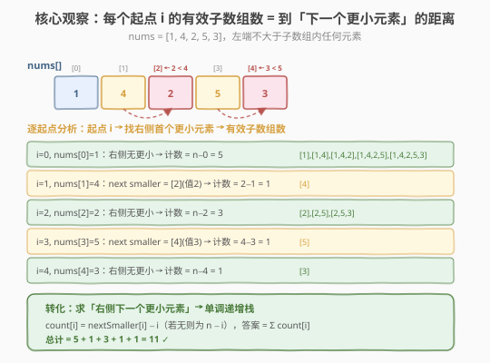
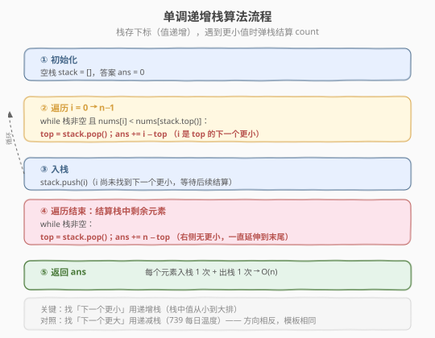
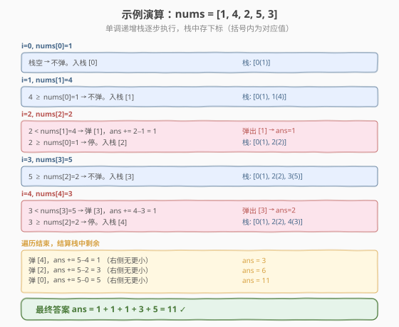

# 有效子数组的数目

- **题目名称**：有效子数组的数目
- **链接**：[1063. 有效子数组的数目](https://leetcode.cn/problems/number-of-valid-subarrays/)
- **难度**：困难
- **标签**：数组、单调栈

## 1. 题目概述

给定一个整数数组 `nums`，返回其中**非空连续子数组**的数目，要求子数组的**最左端元素不大于该子数组中的其他任何元素**。

> 💡 换句话说，子数组 `nums[i..j]` 合法当且仅当 $\text{nums}[i] \leq \text{nums}[k]$ 对所有 $k \in [i, j]$ 成立。

**示例 1**：

```text
输入：nums = [1,4,2,5,3]
输出：11
解释：11 个有效子数组如下：
  [1], [1,4], [1,4,2], [1,4,2,5], [1,4,2,5,3]
  [4], [2], [5], [3], [2,5], [2,5,3]
```

**示例 2**：

```text
输入：nums = [3,2,1]
输出：3
解释：3 个有效子数组：[3], [2], [1]
```

**示例 3**：

```text
输入：nums = [2,2,2]
输出：6
解释：6 个有效子数组：[2], [2,2], [2,2,2], [2], [2,2], [2]
```

**约束条件**：

- $1 \leq \text{nums.length} \leq 5 \times 10^4$
- $0 \leq \text{nums}[i] \leq 10^5$

> 💡 本题是 **单调栈** 的经典应用，与 [739. 每日温度](../0701-0800/739_每日温度.md) 是同一套模板的镜像——739 找「右侧第一个更大」用递减栈，本题找「右侧第一个更小」用递增栈。核心转化在于：把「数有效子数组」变成「对每个起点求到下一个更小元素的距离」。

---

## 2. 解题思路

### 2.1 暴力思路：双重循环

对每个起点 `i`，向右扩展终点 `j`，一旦遇到 `nums[j] < nums[i]` 就停止，`i` 贡献的有效子数组数为 `j - i`；若一直没遇到更小值，贡献 `n - i`。

```text
ans = 0
for i in 0..n:
    j = i + 1
    while j < n and nums[j] >= nums[i]:
        j += 1
    ans += j - i
```

时间复杂度 $O(n^2)$，$n = 5 \times 10^4$ 时约 $2.5 \times 10^9$ 次运算，**超时**。

> ⚠️ 瓶颈：每个起点独立向右扫描，大量重复比较。例如 `[1, 4, 2, 5, 3]` 中找 `4` 的下一个更小要扫到 `2`，找 `5` 的下一个更小又要扫到 `3`……。这些重复比较可以通过**单调栈**一次性消除。

### 2.2 核心观察：转化为「下一个更小元素」

**关键定义**：对每个下标 `i`，令 $\text{nextSmaller}[i]$ 为 `i` 右侧首个满足 $\text{nums}[j] < \text{nums}[i]$ 的下标 `j`；若不存在，则 $\text{nextSmaller}[i] = n$。

> 💡 **核心转化**：起点 `i` 贡献的有效子数组数恰好为 $\text{nextSmaller}[i] - i$。因为从 `i` 到 `nextSmaller[i] - 1` 的所有元素都 $\geq \text{nums}[i]$，子数组 `[i, i], [i, i+1], ..., [i, nextSmaller[i]-1]` 全部合法，恰好 `nextSmaller[i] - i` 个。

$$\text{ans} = \sum_{i=0}^{n-1} (\text{nextSmaller}[i] - i)$$



以 `nums = [1,4,2,5,3]` 为例：

| i | nums[i] | nextSmaller[i] | count | 有效子数组 |
|---|---------|----------------|-------|-----------|
| 0 | 1       | 5（不存在→n）  | 5−0=**5** | [1],[1,4],[1,4,2],[1,4,2,5],[1,4,2,5,3] |
| 1 | 4       | 2（nums[2]=2<4）| 2−1=**1** | [4] |
| 2 | 2       | 5（不存在→n）  | 5−2=**3** | [2],[2,5],[2,5,3] |
| 3 | 5       | 4（nums[4]=3<5）| 4−3=**1** | [5] |
| 4 | 3       | 5（不存在→n）  | 5−4=**1** | [3] |

总计 $5+1+3+1+1 = 11$ ✓

### 2.3 算法流程图



**用单调递增栈求 nextSmaller**：维护一个栈，栈中存下标，对应值从栈底到栈顶**单调递增**。遍历 `i` 从 `0` 到 `n-1`：

1. **弹栈结算**：当栈非空且 $\text{nums}[i] < \text{nums}[\text{stack.top}()]$ 时，弹出 `top`，此时 `i` 就是 `top` 的 $\text{nextSmaller}$，`ans += i - top`。循环弹直到栈顶值 $\leq \text{nums}[i]$ 或栈空。
2. **入栈**：将 `i` 入栈（它尚未找到下一个更小，等待后续结算）。
3. **收尾**：遍历结束后，栈中剩余元素均无右侧更小值，逐个弹出 `top`，`ans += n - top`。

> ⚠️ **为什么是递增栈？** 我们要找「右侧第一个更小」。栈中暂存「尚未遇到更小值」的元素，它们应该**递增**排列——若栈中出现逆序（栈顶附近有较大者在较小者下方），那较大者的下一个更小一定先被遇到，弹栈后栈恢复递增。递增保证栈顶总是「最迫切等待更小值」的那个。

### 2.4 示例演算

以 `nums = [1,4,2,5,3]` 为例：



| 步骤 | i | nums[i] | 弹栈动作 | ans 变化 | 栈状态（下标，值） |
|------|---|---------|----------|----------|-------------------|
| 1 | 0 | 1 | 栈空，不弹 | — | [0(1)] |
| 2 | 1 | 4 | 4≥1，不弹 | — | [0(1), 1(4)] |
| 3 | 2 | 2 | 2<4 弹[1]；2≥1 停 | +1 → **1** | [0(1), 2(2)] |
| 4 | 3 | 5 | 5≥2，不弹 | — | [0(1), 2(2), 3(5)] |
| 5 | 4 | 3 | 3<5 弹[3]；3≥2 停 | +1 → **2** | [0(1), 2(2), 4(3)] |
| 收尾 | — | — | 弹[4]→+1；弹[2]→+3；弹[0]→+5 | +9 → **11** | [] |

> 💡 验证示例 3 `nums = [2,2,2]`：遍历过程中 `2 ≥ 2` 恒成立，无弹栈。遍历结束栈为 `[0, 1, 2]`，收尾：弹[2]→+1, 弹[1]→+2, 弹[0]→+3，总计 $1+2+3=6$ ✓。注意此处用 `<`（严格更小）而非 `≤`，因为相等元素不破坏合法性。

---

## 3. 参考代码

### C++

```cpp
class Solution {
public:
    long long validSubarrays(vector<int>& nums) {
        int n = nums.size();
        long long ans = 0;
        stack<int> stk; // 存下标，对应值单调递增
        for (int i = 0; i < n; ++i) {
            while (!stk.empty() && nums[i] < nums[stk.top()]) {
                int top = stk.top();
                stk.pop();
                ans += i - top;
            }
            stk.push(i);
        }
        while (!stk.empty()) {
            int top = stk.top();
            stk.pop();
            ans += n - top;
        }
        return ans;
    }
};
```

### Python

```python
class Solution:
    def validSubarrays(self, nums: List[int]) -> int:
        n = len(nums)
        ans = 0
        stack = []  # 存下标，对应值单调递增
        for i in range(n):
            while stack and nums[i] < nums[stack[-1]]:
                top = stack.pop()
                ans += i - top
            stack.append(i)
        # 栈中剩余元素：右侧无更小，延伸到末尾
        while stack:
            top = stack.pop()
            ans += n - top
        return ans
```

> 💡 **哨兵简化**：可在 `nums` 末尾追加一个虚拟的 $-\infty$（或直接用 `n` 作哨兵），则遍历到 `i = n` 时所有栈中元素都会被弹完，省去收尾循环。C++ 中可遍历到 `i <= n`，当 `i == n` 时 `nums[i]` 用 `INT_MIN` 替代判断。但收尾循环本身只有 $O(n)$，写法更直观，面试中两种均可。

---

## 4. 复杂度分析

| 维度 | 方法 | 复杂度 | 说明 |
|------|------|--------|------|
| 时间复杂度 | 单调栈 | $O(n)$ | 每个元素入栈 1 次、出栈 1 次，总操作 $\leq 2n$ |
| 空间复杂度 | 单调栈 | $O(n)$ | 最坏情况栈存全部 $n$ 个下标（数组严格递增时） |
| 时间复杂度 | 暴力双循环 | $O(n^2)$ | 每个起点独立向右扫描 |
| 空间复杂度 | 暴力双循环 | $O(1)$ | 仅计数器 |

> ⚠️ 本题 $n \leq 5 \times 10^4$，$O(n^2)$ 约 $2.5 \times 10^9$ 会超时，必须用单调栈。答案最大为 $n(n+1)/2 \approx 1.25 \times 10^9$，C++ 中需用 `long long` 防溢出。

---

## 5. 扩展：从右向左的等价写法

上述解法是**从左向右遍历**，用当前元素作为栈中元素的「下一个更小」来结算。也可以**从右向左遍历**，对每个 `i` 主动找自己的 `nextSmaller[i]`：

```python
class Solution:
    def validSubarrays(self, nums: List[int]) -> int:
        n = len(nums)
        nums.append(-1)  # 哨兵，保证最后所有元素弹出
        stack = []
        ans = 0
        for i in range(n - 1, -1, -1):
            while stack and nums[stack[-1]] >= nums[i]:
                stack.pop()
            nxt = stack[-1] if stack else n
            ans += nxt - i
            stack.append(i)
        return ans
```

> ⚠️ 从右向左时栈中维护的是「右侧候选更小值」，由于要找**严格更小**，弹栈条件用 `>=`（相等的不算更小，需要跳过）。两种方向等价，时间空间复杂度相同，选择习惯的写法即可。

---

## 6. 面试要点

1. **怎么把「数有效子数组」转化为单调栈问题？**
   - 观察到子数组 `[i, j]` 合法当且仅当 `[i, j]` 内没有比 `nums[i]` 更小的元素，即 `j` 可以延伸到 `nextSmaller[i] - 1`。所以每个起点 `i` 贡献 `nextSmaller[i] - i` 个，求和即可。「数子数组」→「求每个起点的延伸距离」→「找下一个更小」→ 单调栈。

2. **为什么用递增栈而不是递减栈？**
   - 找「右侧第一个更小」用递增栈：栈中值从小到大排列，新来的更小值会从栈顶开始逐个弹掉比它大的元素。对照 739 找「右侧第一个更大」用递减栈——方向相反，模板结构完全一样，只是不等号方向翻转。

3. **弹栈条件为什么用 `<` 而不是 `<=`？**
   - 题目要求左端「不大于」其他元素，即 `nums[i] <= nums[k]`。相等元素不破坏合法性，所以只有**严格更小**的值才会终止子数组。因此弹栈条件是 `nums[i] < nums[stack.top()]`。若误用 `<=`，会把相等值也当作终止，导致少算（如示例 3 `[2,2,2]` 会得到 3 而非 6）。

4. **遍历结束后栈中剩余元素怎么处理？**
   - 剩余元素右侧没有更小值，它们的有效子数组一直延伸到数组末尾，贡献 `n - top`。也可以在末尾加哨兵 $-\infty$ 统一处理，省去收尾循环。

5. **答案为什么可能溢出？C++ 中怎么处理？**
   - 最坏情况数组严格递增（如 `[1,2,3,...,50000]`），每个起点都延伸到末尾，答案 $= n + (n-1) + \cdots + 1 = n(n+1)/2 \approx 1.25 \times 10^9$，超过 `int` 上限 $2.1 \times 10^9$ 勉强不溢出但极危险。务必用 `long long` 累加。

---

## 7. 同类练习题

- [739. 每日温度](https://leetcode.cn/problems/daily-temperatures/)（[题解](../0701-0800/739_每日温度.md)）：单调栈招牌题，找「右侧第一个更大」用递减栈，与本题找「右侧第一个更小」用递增栈互为镜像，模板完全一致
- [84. 柱状图中最大的矩形](https://leetcode.cn/problems/largest-rectangle-in-histogram/)（[题解](../0001-0100/84_柱状图中最大的矩形.md)）：单调栈经典困难题，同样用递增栈找「左右第一个更小」，本题是其计数变体
- [901. 股票价格跨度](https://leetcode.cn/problems/online-stock-span/)（[题解](../0901-1000/901_股票价格跨度.md)）：单调栈 + 跨度合并，找「左侧第一个更大」并累加跨度，与本题「累加到下一个更小的距离」思路同构
- [503. 下一个更大元素 II](https://leetcode.cn/problems/next-greater-element-ii/)：单调栈找「下一个更大」的环形变体，体会循环数组下标取模技巧
- [42. 接雨水](https://leetcode.cn/problems/trapping-rain-water/)（[题解](../0001-0100/42_接雨水.md)：单调栈解法也是找「下一个更大/更小」的延伸应用，结算时计算水量与本题结算 count 结构相似
