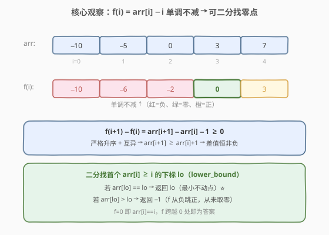
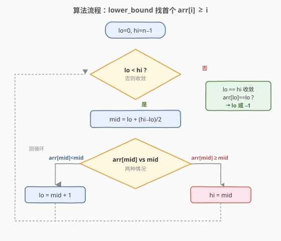
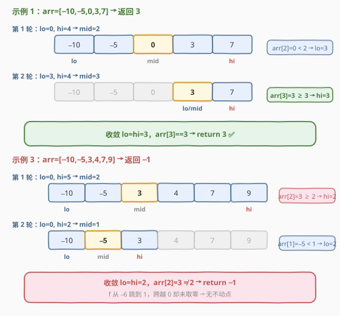

# 不动点

- **题目名称**：不动点
- **链接**：[1064. 不动点](https://leetcode.cn/problems/fixed-point/)
- **难度**：简单
- **标签**：数组、二分查找

## 1. 题目概述

给定一个**升序排列**且**所有元素互不相同**的整数数组 `arr`，返回满足 `arr[i] == i` 的**最小下标** `i`。如果不存在这样的下标，返回 `-1`。

**示例 1**：

```text
输入：arr = [-10,-5,0,3,7]
输出：3
解释：arr[0] = -10 ≠ 0，arr[1] = -5 ≠ 1，arr[2] = 0 ≠ 2，arr[3] = 3 == 3，故返回 3。
```

**示例 2**：

```text
输入：arr = [0,2,5,8,17]
输出：0
解释：arr[0] = 0 == 0，故返回 0。
```

**示例 3**：

```text
输入：arr = [-10,-5,3,4,7,9]
输出：-1
解释：不存在满足 arr[i] == i 的下标。
```

**约束条件**：

- $1 \leq \text{arr.length} \leq 10^4$
- $-10^9 \leq \text{arr}[i] \leq 10^9$
- `arr` 已按**升序**排列
- `arr` 中的所有元素**互不相同**

> 💡 本题是 [704. 二分查找](../0701-0800/704_二分查找.md) 的变体：不再查找固定值 `target`，而是查找满足 `arr[i] == i` 的下标。关键在于把「值与下标的关系」转化为一个**单调函数**，从而套用 lower_bound 模板。

---

## 2. 解题思路

### 2.1 暴力思路：线性扫描

从左到右遍历数组，逐个检查 `arr[i] == i`，命中即返回 `i`，遍历完未命中返回 `-1`。时间 $O(n)$、空间 $O(1)$。

> ⚠️ 线性扫描完全浪费了「升序 + 互异」这两条关键性质。$n = 10^4$ 虽能过，但面试中一定会被追问「能不能利用有序性做到 $O(\log n)$」。

### 2.2 核心观察：f(i) = arr[i] − i 单调不减



定义**差值函数**：

$$f(i) = \text{arr}[i] - i$$

我们要找的就是 $f(i) = 0$ 的位置。关键问题是：$f(i)$ 有没有单调性？

**单调性证明**：因为数组严格升序且互异，$\text{arr}[i+1] \geq \text{arr}[i] + 1$，所以：

$$f(i+1) - f(i) = [\text{arr}[i+1] - (i+1)] - [\text{arr}[i] - i] = \text{arr}[i+1] - \text{arr}[i] - 1 \geq 0$$

因此 $f(i)$ **单调不减** → 可二分。

以 `arr = [-10,-5,0,3,7]` 为例：

| $i$ | $\text{arr}[i]$ | $f(i) = \text{arr}[i]-i$ | 符号 |
|-----|------------------|---------------------------|------|
| 0   | −10              | −10                       | 负   |
| 1   | −5               | −6                        | 负   |
| 2   | 0                | −2                        | 负   |
| 3   | 3                | **0**                     | 零 ⭐ |
| 4   | 7                | 3                         | 正   |

$f$ 从负到零再到正，**单调不减**。二分找首个 $f(i) \geq 0$（即 $\text{arr}[i] \geq i$）的下标 `lo`：

- 若 $\text{arr}[\text{lo}] == \text{lo}$（$f = 0$）：`lo` 就是**最小不动点**（之前的下标 $f$ 全为负，不可能等于）。
- 若 $\text{arr}[\text{lo}] > \text{lo}$（$f > 0$）：$f$ 从负直接跳到正，**从未取零** → 返回 $-1$。

> 💡 **为什么是最小的？** 因为二分找的是「首个 $\text{arr}[i] \geq i$」的下标。在此之前的所有下标都有 $\text{arr}[j] < j$（$f < 0$），不可能满足 $\text{arr}[j] == j$。所以若 `lo` 处 $f = 0$，它就是最小不动点。

### 2.3 算法流程图



采用 **lower_bound 模板**（`lo < hi` + `lo = mid + 1` / `hi = mid`），与 [34. 在排序数组中查找元素的第一个和最后一个位置](../0001-0100/34_在排序数组中查找元素的第一个和最后一个位置.md) 中「找首个满足条件的位置」完全一致：

- **循环不变量**：答案一定在 $[\text{lo}, \text{hi}]$ 内（若存在）。
- `arr[mid] < mid`：`mid` 及其左侧 $f < 0$，全部排除，`lo = mid + 1`。
- `arr[mid] >= mid`：`mid` 可能是答案（$f = 0$）或右侧有更小的答案，`hi = mid`（保留 `mid`）。
- 循环结束时 `lo == hi`，检查 `arr[lo] == lo` 即可。

> ⚠️ 与 [704. 二分查找](../0701-0800/704_二分查找.md) 的闭区间模板（`left <= right` + 命中即返回）不同：本题要找**首个**满足 `arr[i] >= i` 的位置，命中后不能立即返回（左侧可能有更小的），必须继续向左收缩，因此用 lower_bound 写法。

### 2.4 示例演算



**示例 1**：`arr = [-10,-5,0,3,7]`，$f = [-10, -6, -2, 0, 3]$。

| 轮次 | lo | hi | mid | arr[mid] | 判断 | 动作 |
|------|----|----|-----|----------|------|------|
| 1    | 0  | 4  | 2   | 0        | 0 < 2 | lo = 3 |
| 2    | 3  | 4  | 3   | 3        | 3 ≥ 3 | hi = 3 |
| 收敛 | 3  | 3  | —   | —        | lo = hi | 结束 |

`lo = 3`，`arr[3] == 3` → **return 3** ✅

**示例 3**：`arr = [-10,-5,3,4,7,9]`，$f = [-10, -6, 1, 1, 3, 4]$。

| 轮次 | lo | hi | mid | arr[mid] | 判断 | 动作 |
|------|----|----|-----|----------|------|------|
| 1    | 0  | 5  | 2   | 3        | 3 ≥ 2 | hi = 2 |
| 2    | 0  | 2  | 1   | −5       | −5 < 1 | lo = 2 |
| 收敛 | 2  | 2  | —   | —        | lo = hi | 结束 |

`lo = 2`，`arr[2] = 3 ≠ 2` → **return −1**。$f$ 从 $-6$（$i=1$）跳到 $1$（$i=2$），跨越 $0$ 却未取零，不存在不动点。

> 💡 验证示例 2：`arr = [0,2,5,8,17]`，$f = [0, 1, 3, 5, 13]$。首轮 `mid=2`，`arr[2]=5 ≥ 2 → hi=2`；`mid=1`，`arr[1]=2 ≥ 1 → hi=1`；`mid=0`，`arr[0]=0 ≥ 0 → hi=0`。`lo=hi=0`，`arr[0]==0` → return 0 ✅。

---

## 3. 参考代码

### C++

```cpp
class Solution {
  public:
    int fixedPoint(vector<int>& arr) {
        int lo = 0, hi = arr.size() - 1;
        while (lo < hi) {
            int mid = lo + (hi - lo) / 2;
            if (arr[mid] < mid) {
                lo = mid + 1;
            } else {
                hi = mid;
            }
        }
        return arr[lo] == lo ? lo : -1;
    }
};
```

### Python

```python
class Solution:
    def fixedPoint(self, arr: List[int]) -> int:
        lo, hi = 0, len(arr) - 1
        while lo < hi:
            mid = (lo + hi) // 2
            if arr[mid] < mid:
                lo = mid + 1
            else:
                hi = mid
        return lo if arr[lo] == lo else -1
```

> ⚠️ **两个易错点**：
> 1. **循环条件 `lo < hi` 而非 `lo <= hi`**：lower_bound 模板在 `lo == hi` 时收敛，不需要额外一轮。若用 `<=`，`hi = mid` 会导致死循环（`mid` 不越过 `hi`）。
> 2. **最终必须检查 `arr[lo] == lo`**：二分找到的是「首个 $\text{arr}[i] \geq i$」的位置，不保证 $\text{arr}[i] == i$（可能 $f$ 从负跳正直接越过零）。漏检会返回错误的下标。

---

## 4. 复杂度分析

| 维度 | 复杂度 | 说明 |
|------|--------|------|
| 时间复杂度 | $O(\log n)$ | 每轮区间折半，最多 $\lceil \log_2 n \rceil$ 轮；$n=10^4$ 时约 14 轮 |
| 空间复杂度 | $O(1)$ | 仅用 `lo`、`hi`、`mid` 三个指针变量 |

> 💡 **为什么是 $O(\log n)$？** 关键转化在于把「查找 $\text{arr}[i] == i$」变成「在单调函数 $f(i) = \text{arr}[i] - i$ 上二分找零点」。单调性来自「严格升序 + 互异」保证了 $f(i+1) - f(i) \geq 0$，因此每轮能根据 $f(\text{mid})$ 的符号安全丢弃一半搜索空间。

---

## 5. 扩展：单调不减 vs 严格递增

$f(i)$ 是**单调不减**而非严格递增——当 $\text{arr}[i+1] = \text{arr}[i] + 1$ 时，$f(i+1) = f(i)$，差值为零。这意味着 $f$ 可以有**平坦段**（连续多个 $f$ 值相同）。

以 `arr = [0, 1, 2, 5]` 为例：$f = [0, 0, 0, 2]$。下标 0、1、2 都满足 $\text{arr}[i] == i$，二分找到的首个 $\text{arr}[i] \geq i$ 是 $i = 0$（$f = 0$），正确返回最小不动点 0。

> ⚠️ 如果题目改为「找**任意**一个不动点」而非「最小」，闭区间模板（命中即返回）也能用。但「找最小」必须用 lower_bound 继续向左收缩。这与 [34. 查找区间](../0001-0100/34_在排序数组中查找元素的第一个和最后一个位置.md) 中「找左边界 vs 找任意一个」的区分完全一致。

---

## 6. 面试要点

1. **为什么能二分？单调性从哪来？**

   - 定义 $f(i) = \text{arr}[i] - i$。因为数组严格升序且互异，$\text{arr}[i+1] \geq \text{arr}[i] + 1$，所以 $f(i+1) - f(i) = \text{arr}[i+1] - \text{arr}[i] - 1 \geq 0$，$f$ 单调不减 → 可二分。

2. **为什么找「首个 $\text{arr}[i] \geq i$」而非直接找「$\text{arr}[i] == i$」？**

   - 二分的谓词必须是**单调布尔序列**（一段 false 后接一段 true）才能用 lower_bound。`arr[i] >= i` 满足（$f$ 从负到非负，一旦非负不会再变负），而 `arr[i] == i` 不满足单调性（可能 false-true-false）。找到首个 $\geq i$ 后再检查是否 $== i$ 即可。

3. **找到 `lo` 后为什么要检查 `arr[lo] == lo`？**

   - `lo` 是首个 $\text{arr}[i] \geq i$ 的位置。若 $\text{arr}[\text{lo}] > \text{lo}$，说明 $f$ 从负直接跳到正、从未取零，不存在不动点。若不检查直接返回 `lo`，会返回一个不满足条件的错误下标。

4. **和 [704. 二分查找](../0701-0800/704_二分查找.md) 的模板有何区别？**

   - 704 用闭区间 `left <= right` + 命中即返回，适用于「找任意一个等于 target 的位置」。本题要找**最小**满足条件的下标，命中后不能返回、需继续向左收缩，因此用 lower_bound 模板 `lo < hi` + `hi = mid`（保留 `mid` 不排除）。

5. **如果数组有重复元素，结论还成立吗？**

   - 单调性证明依赖 $\text{arr}[i+1] \geq \text{arr}[i] + 1$（即互异）。若有重复，$\text{arr}[i+1] = \text{arr}[i]$ 时 $f(i+1) - f(i) = -1 < 0$，$f$ 不再单调，二分会失效。题目保证互异，无需担心。

---

## 7. 同类练习题

- [704. 二分查找](https://leetcode.cn/problems/binary-search/)（[题解](../0701-0800/704_二分查找.md)）：一切二分的母题，闭区间模板的基础写法，本题在其上改为 lower_bound 变体
- [34. 在排序数组中查找元素的第一个和最后一个位置](https://leetcode.cn/problems/find-first-and-last-position-of-element-in-sorted-array/)（[题解](../0001-0100/34_在排序数组中查找元素的第一个和最后一个位置.md)）：lower_bound 模板的母题，找「首个/最后一个」满足条件的位置，与本题二分骨架完全一致
- [1060. 有序数组中的缺失元素](https://leetcode.cn/problems/missing-element-in-sorted-array/)（[题解](../1001-1100/1060_有序数组中的缺失元素.md)）：同样在有序数组上定义单调计数函数并二分找边界，结构高度相似
- [278. 第一个错误的版本](https://leetcode.cn/problems/first-bad-version/)（[题解](../0201-0300/278_第一个错误的版本.md)）：二分找「首个满足谓词」的位置（布尔单调序列），与本题找「首个 arr[i] ≥ i」同构
- [35. 搜索插入位置](https://leetcode.cn/problems/search-insert-position/)（[题解](../0001-0100/35_搜索插入位置.md)）：lower_bound 的直接应用，找「首个 ≥ target」的插入位置
