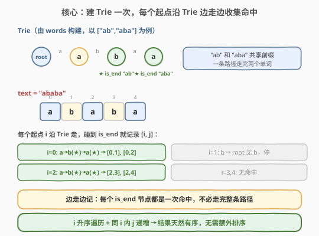
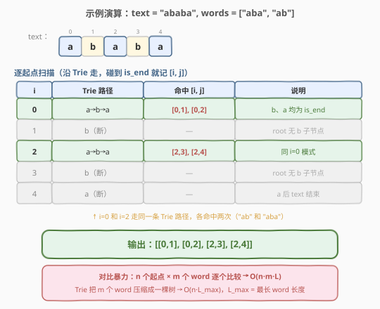

# LeetCode 字符串的索引对 题解

## 1. 题目概述

- **标题 / 题号**：字符串的索引对（#1065，easy）
- **链接**：https://leetcode.cn/problems/index-pairs-of-a-string/
- **难度**：简单
- **标签**：字典树、字符串、哈希表

**题意**：给定一个字符串 `text` 和一个单词列表 `words`，找出所有索引对 `[i, j]`，使得子串 `text[i..j]` 出现在 `words` 中。

返回的索引对应**按起始索引 `i` 升序排列**；若 `i` 相同则按结束索引 `j` 升序排列。

**示例 1**：

```text
输入：text = "thestoryofleetcodeandme", words = ["story","fleet","leetcode"]
输出：[[3,7],[9,13],[10,17]]
解释：
  "story"    → text[3..7]
  "fleet"    → text[9..13]
  "leetcode" → text[10..17]
```

**示例 2**：

```text
输入：text = "ababa", words = ["aba","ab"]
输出：[[0,1],[0,2],[2,3],[2,4]]
解释：
  "ab"  → text[0..1], text[2..3]
  "aba" → text[0..2], text[2..4]
  同一起点 i=0 可命中多个单词（"ab" 是 "aba" 的前缀）
```

**约束**：

- `1 <= text.length <= 100`
- `1 <= words.length <= 100`
- `1 <= words[i].length <= 100`
- `text` 和 `words[i]` 仅由小写英文字母组成
- `words` 中所有单词互不相同

## 2. 解题思路

### 2.1 暴力思路

对 `text` 的每个起点 `i`，枚举 `words` 中每个单词 `w`，检查 `text[i : i+len(w)] == w`。时间复杂度 $O(n \cdot m \cdot L)$，其中 $n = |\text{text}|$、$m = |\text{words}|$、$L$ 为单词平均长度。约束下 $n, m, L \leq 100$，暴力可过，但**没有利用单词间的共享前缀**——"ab" 和 "aba" 共享前缀 "ab"，逐个比较会重复扫描同一段字符。

### 2.2 核心观察：Trie 多模式匹配



这道题的本质是**多模式匹配**：在 `text` 的每个位置，同时检查所有 `words` 是否匹配。

**Trie 天然压缩共享前缀**：

- 把所有 `words` 插入一棵 Trie，"ab" 和 "aba" 共享 `root→a→b` 这条路径。
- 对 `text` 的每个起点 `i`，沿 Trie 逐字符走：走到 `b` 节点（`is_end`）→ 命中 "ab"；继续走到 `a` 节点（`is_end`）→ 命中 "aba"。**一次遍历同时检查所有共享前缀的单词**。

**关键观察**：不必等走完整条路径再判断——**每个 `is_end` 节点都是一次命中**，边走边记。一个起点可能命中多个单词（如 i=0 同时命中 "ab" 和 "aba"）。

> 💡 为什么结果天然有序？外层循环 `i` 从 $0$ 到 $n-1$ 升序，内层 `j` 从 `i` 递增——因此 `[i, j]` 对自动按 `(i, j)` 升序生成，**无需额外排序**。

### 2.3 算法流程图


### 2.4 示例演算



以 `text = "ababa"`, `words = ["aba", "ab"]` 为例：

**阶段一**：构建 Trie

```text
root → a → b(★is_end "ab") → a(★is_end "aba")
```

"ab" 和 "aba" 共享 `root→a→b` 路径，"aba" 多走一步 `→a`。

**阶段二**：逐起点扫描

| i | Trie 路径 | 命中 [i, j] | 说明 |
|---|-----------|-------------|------|
| 0 | a→b→a | [0,1], [0,2] | b、a 均为 is_end |
| 1 | b（断） | — | root 无 b 子节点 |
| 2 | a→b→a | [2,3], [2,4] | 同 i=0 模式 |
| 3 | b（断） | — | root 无 b 子节点 |
| 4 | a（断） | — | a 后 text 结束 |

> ⚠️ 注意 `i=0`：走到 `b` 时命中 "ab"（`[0,1]`），但**不停下**——继续走到 `a` 又命中 "aba"（`[0,2]`）。这正是「边走边记」的精髓：一个起点可能命中多个单词。

最终输出 `[[0,1], [0,2], [2,3], [2,4]]`，与示例 2 一致。

## 3. 参考代码

### C++

```cpp
class Solution {
    struct TrieNode {
        TrieNode* children[26] = {};
        bool is_end = false;
    };

  public:
    vector<vector<int>> indexPairs(string text, vector<string>& words) {
        TrieNode* root = new TrieNode();
        for (const string& w : words) {
            TrieNode* node = root;
            for (char c : w) {
                int idx = c - 'a';
                if (!node->children[idx])
                    node->children[idx] = new TrieNode();
                node = node->children[idx];
            }
            node->is_end = true;
        }

        vector<vector<int>> ans;
        int n = text.size();
        for (int i = 0; i < n; i++) {
            TrieNode* node = root;
            for (int j = i; j < n; j++) {
                int idx = text[j] - 'a';
                if (!node->children[idx]) break;
                node = node->children[idx];
                if (node->is_end) ans.push_back({i, j});
            }
        }
        return ans;
    }
};
```

### Python

```python
class Solution:
    def indexPairs(self, text: str, words: List[str]) -> List[List[int]]:
        root = {}
        for w in words:
            node = root
            for c in w:
                if c not in node:
                    node[c] = {}
                node = node[c]
            node['#'] = True

        ans = []
        n = len(text)
        for i in range(n):
            node = root
            for j in range(i, n):
                c = text[j]
                if c not in node:
                    break
                node = node[c]
                if '#' in node:
                    ans.append([i, j])
        return ans
```

> 💡 代码要点：① 建 Trie 和扫描共用同一套「逐字符走子节点」逻辑；② 内层 `j` 循环遇到 `children` 中无对应字符即 `break`——Trie 路径走完就停，不浪费多余比较；③ `is_end` 检查在每一步都做，不是只查终点。

## 4. 复杂度分析

| 维度 | 复杂度 | 说明 |
|------|--------|------|
| 时间复杂度 | $O(S + n \cdot L)$ | $S = \sum|\text{words}[i]|$（建 Trie），$n = |\text{text}|$，$L = \max|\text{words}[i]|$（每个起点最多走 $L$ 步） |
| 空间复杂度 | $O(S)$ | Trie 节点总数不超过 $\sum|\text{words}[i]|$ |

> 💡 约束下 $n, L \leq 100$，总操作量 $\leq 10^4$，非常高效。Trie 深度等于最长单词长度，内层循环最多走 $L$ 步即因路径耗尽而 `break`。

## 5. 扩展：哈希集合替代 Trie

约束较小时（$n, m, L \leq 100$），可直接用哈希集合：

```python
class Solution:
    def indexPairs(self, text: str, words: List[str]) -> List[List[int]]:
        word_set = set(words)
        max_len = max(len(w) for w in words)
        ans = []
        n = len(text)
        for i in range(n):
            for j in range(i, min(i + max_len, n)):
                if text[i:j+1] in word_set:
                    ans.append([i, j])
        return ans
```

- **优点**：实现更简单，无需手写 Trie
- **缺点**：每个子串切片 + 哈希计算有额外开销；无法利用共享前缀
- **何时选 Trie**：单词数 $m$ 或单词长度 $L$ 很大时，Trie 的前缀压缩优势显现；需要前缀匹配（不只是精确匹配）时必须用 Trie

> ⚠️ 注意内层上界用 `min(i + max_len, n)` 而非 $n$，避免生成不可能在 `words` 中的长子串——这是从 Trie「路径深度有限」思想迁移来的剪枝。

## 6. 面试要点

1. **为什么用 Trie 而不是暴力枚举？**

   - 暴力对每个起点枚举所有单词逐个比较，$O(n \cdot m \cdot L)$，重复扫描共享前缀。Trie 把 $m$ 个单词压缩成一棵树，每个起点只需沿一条路径走，$O(n \cdot L)$，$L$ 为最长单词长度。

2. **一个起点如何命中多个单词？**

   - Trie 路径上可能有多个 `is_end` 节点（如 "ab" 是 "aba" 的前缀，共享 `root→a→b` 路径）。扫描时**每走一步都检查 `is_end`**，而非只查终点，因此一个起点能命中路径上所有完整单词。

3. **为什么结果天然有序，无需排序？**

   - 外层 `i` 从 $0$ 到 $n-1$ 升序，保证起始索引有序；内层 `j` 从 `i` 递增，保证同一起点内结束索引有序。`(i, j)` 对按生成顺序即满足题目要求的排序。

4. **Trie 和哈希集合各适合什么场景？**

   - **Trie**：单词多 / 长、需前缀匹配、需避免重复比较共享前缀
   - **哈希集合**：约束小、只需精确匹配、追求代码简洁
   - 本题约束 $n, m, L \leq 100$，两者均可，Trie 是更通用的解法

5. **如果 text 是数据流（无限长）怎么办？**

   - 需要用 **AC 自动机**（Aho-Corasick）：在 Trie 上构建 `fail` 指针，实现 $O(n + \text{匹配数})$ 的多模式匹配，无需对每个起点重新从头走 Trie。本题约束小无需 AC 自动机，但面试中可作为进阶讨论。

## 同类练习题

| # | 题目 | 与本题的关联 |
|---|------|-------------|
| 208 | [实现 Trie (前缀树)](https://leetcode.cn/problems/implement-trie-prefix-tree/)（[题解](../0201-0300/208_实现Trie.md)） | Trie 基础模板，insert/search/startsWith 三件套 |
| 212 | [单词搜索 II](https://leetcode.cn/problems/word-search-ii/)（[题解](../0201-0300/212_单词搜索II.md)） | Trie + DFS 回溯，在二维网格中多模式匹配 |
| 648 | [单词替换](https://leetcode.cn/problems/replace-words/) | Trie 前缀匹配，找到最短前缀即替换 |
| 1032 | [字符流](https://leetcode.cn/problems/stream-of-characters/)（[题解](../1001-1100/1032_字符流.md)） | 反向插入 Trie + 流式查询，数据流场景的多模式匹配 |
| 14 | [最长公共前缀](https://leetcode.cn/problems/longest-common-prefix/)（[题解](../0001-0100/14_最长公共前缀.md)） | 前缀概念入门，对比 Trie 的共享前缀优势 |
