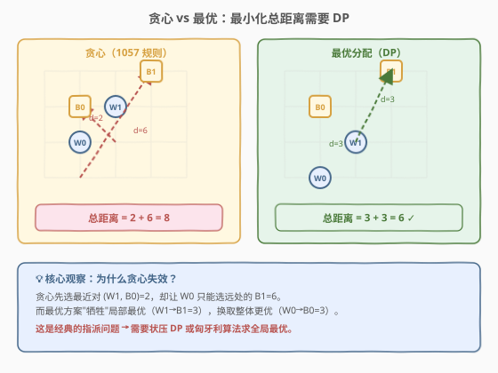
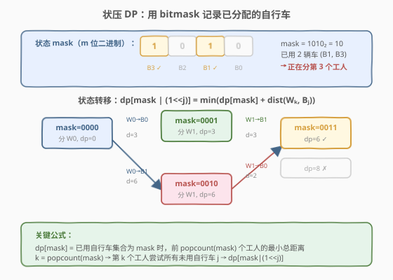
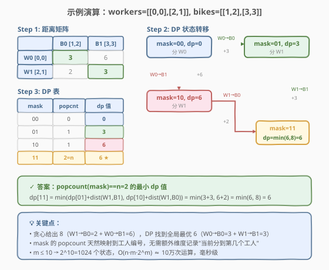

# 校园自行车分配 II

- **题目名称**：校园自行车分配 II
- **链接**：[1066. Campus Bikes II](https://leetcode.cn/problems/campus-bikes-ii/)
- **难度**：中等
- **标签**：动态规划、状态压缩、位运算、分配问题

> ⚠️ **注意**：本题是 LeetCode 会员专享题，需 Plus 会员才能在 [leetcode.cn](https://leetcode.cn/problems/campus-bikes-ii/) 提交。

## 1. 题目概述

在校园二维网格上，有 `n` 个工人和 `m` 辆自行车（`n <= m`），每个工人和自行车的位置用 `[x, y]` 坐标表示。需要为**每个工人分配一辆自行车**（每辆自行车至多分配给一个工人），使得**所有工人到其分配自行车的曼哈顿距离之和最小**。

曼哈顿距离定义为 $|x_1 - x_2| + |y_1 - y_2|$。

返回最小的曼哈顿距离之和。

**示例 1**：

```text
输入：workers = [[0,0],[2,1]], bikes = [[1,2],[3,3]]
输出：6
解释：
各对的曼哈顿距离：
  (W0, B0) = |0-1| + |0-2| = 3
  (W0, B1) = |0-3| + |0-3| = 6
  (W1, B0) = |2-1| + |1-2| = 2
  (W1, B1) = |2-3| + |1-3| = 3

最优分配：W0→B0(3) + W1→B1(3) = 6
（贪心会选 W1→B0(2) + W0→B1(6) = 8，非最优）
```

**示例 2**：

```text
输入：workers = [[0,0],[1,1],[2,0]], bikes = [[1,0],[2,2],[2,1]]
输出：4
解释：
最优分配：W0→B0(1) + W1→B1(2) + W2→B2(1) = 4
（或 W0→B0(1) + W1→B2(1) + W2→B1(2) = 4）
```

**约束条件**：

- $1 \leq \text{workers.length} \leq \text{bikes.length} \leq 10$
- $\text{workers}[i].\text{length} == \text{bikes}[j].\text{length} == 2$
- $0 \leq \text{workers}[i][0], \text{workers}[i][1], \text{bikes}[j][0], \text{bikes}[j][1] < 1000$

> ⚠️ **关键信号**：`m ≤ 10` 是**状压 DP（bitmask DP）**的标志性数据范围——$2^{10} = 1024$ 个状态。本题是经典的**指派问题（Assignment Problem）**，目标是**最小化总距离**，与 [1057. 校园自行车分配](../1001-1100/1057_校园自行车分配.md)（贪心规则分配）形成鲜明对照。

---

## 2. 解题思路

### 2.1 暴力思路：全排列枚举

从 `m` 辆自行车中选 `n` 辆并全排列分配给 `n` 个工人，共 $A(m, n) = \frac{m!}{(m-n)!}$ 种方案。$m = 10, n = 10$ 时为 $10! \approx 3.6 \times 10^6$，勉强可过但缺乏扩展性。需要利用「**分配是逐工人进行的**」这一结构，用 DP 避免重复计算。

### 2.2 核心观察：贪心失效，需要全局最优



与 [1057 题](../1001-1100/1057_校园自行车分配.md) 的贪心规则不同，本题要求**最小化总距离**。贪心策略（每轮选最近对）可能让后续工人被迫选择远处自行车，导致总距离非最优：

- **贪心**：先选最近对 (W1, B0)=2，W0 只能选 B1=6，总计 **8**
- **最优**：W0→B0=3 + W1→B1=3 = **6**

> 💡 这是经典的**指派问题**：$n$ 个任务分配给 $m$ 个执行者，最小化总代价。核心特征是「**牺牲局部最优换取全局最优**」——这正是贪心无法处理、而 DP 能穷举所有方案找全局最优的场景。

### 2.3 核心解法：状态压缩 DP

用位掩码 `mask` 记录**哪些自行车已被分配**：

- `mask` 是一个 `m` 位二进制数，第 `j` 位为 `1` 表示自行车 `j` 已被占用；
- 已分配工人数 = `popcount(mask)`（`mask` 中 `1` 的个数）；
- 当前待分配工人编号 $k = \text{popcount(mask)}$（从 0 开始）。

> 💡 **为什么只需一维 `mask`？** 工人按编号顺序依次分配，已分配个数 `popcount(mask)` 唯一确定下一个待分配的工人编号。无需额外维度记录「当前分到第几个工人」。



**状态定义**：

$$dp[\text{mask}] = \text{已用自行车集合为 mask 时，前 popcount(mask) 个工人的最小总距离}$$

**状态转移**：对每个状态 `mask`，令 $k = \text{popcount(mask)}$。若 $k < n$，枚举所有**未被占用**的自行车 $j$（`mask` 第 `j` 位为 `0`），将工人 $k$ 分配给自行车 $j$：

$$dp[\text{mask} \mid (1 \ll j)] = \min\big(dp[\text{mask} \mid (1 \ll j)],\;\; dp[\text{mask}] + \text{dist}(W_k, B_j)\big)$$

- **初始**：$dp[0] = 0$（无自行车被占用，总距离为 0）
- **答案**：$\min_{\text{popcount(mask)} = n} dp[\text{mask}]$（所有 `n` 个工人分配完毕的状态中的最小值）

### 2.4 算法流程图

1. 预计算距离矩阵 `dist[i][j]`（工人 `i` 到自行车 `j` 的曼哈顿距离）；
2. 初始化 `dp` 数组大小为 $2^m$，全部设为 `INF`，`dp[0] = 0`；
3. 从小到大枚举 `mask`（$0$ 到 $2^m - 1$）：
   - 计算 $k = \text{popcount(mask)}$；
   - 若 $k \geq n$，跳过（所有工人已分配）；
   - 枚举每个未被占用的自行车 $j$：`dp[mask | (1<<j)] = min(dp[mask | (1<<j)], dp[mask] + dist[k][j])`；
4. 返回所有 `popcount(mask) == n` 的 `dp[mask]` 中的最小值。

### 2.5 示例演算

以 `workers = [[0,0],[2,1]], bikes = [[1,2],[3,3]]` 为例：



**距离矩阵**：

| 工人 | B0 [1,2] | B1 [3,3] |
|------|----------|----------|
| W0 [0,0] | 3 | 6 |
| W1 [2,1] | 2 | 3 |

**DP 逐状态计算**：

| mask | popcount | dp 值 | 转移说明 |
|------|----------|-------|---------|
| `00` | 0 | 0 | 初始状态 |
| `01` | 1 | 3 | W0→B0，dist=3 |
| `10` | 1 | 6 | W0→B1，dist=6 |
| `11` | 2=n | 6 | min(dp[01]+dist(W1,B1), dp[10]+dist(W1,B0)) = min(3+3, 6+2) = min(6, 8) = 6 |

最终答案：`dp[11] = 6`。

> 💡 对比贪心的 8，DP 通过穷举所有 $C(m, n) \times n!$ 种分配方案，找到全局最优的 6。状态压缩将指数级方案压缩为 $2^m$ 个状态，利用「相同自行车集合的最优子结构」避免重复计算。

---

## 3. 参考代码

### 方法一：递推状压 DP（推荐）

### C++

```cpp
class Solution {
  public:
    int assignBikes(vector<vector<int>>& workers,
                    vector<vector<int>>& bikes) {
        int n = workers.size(), m = bikes.size();
        int INF = 1e9;

        // 预计算距离矩阵
        vector<vector<int>> dist(n, vector<int>(m));
        for (int i = 0; i < n; ++i)
            for (int j = 0; j < m; ++j)
                dist[i][j] = abs(workers[i][0] - bikes[j][0]) +
                             abs(workers[i][1] - bikes[j][1]);

        vector<int> dp(1 << m, INF);
        dp[0] = 0;

        for (int mask = 0; mask < (1 << m); ++mask) {
            if (dp[mask] == INF) continue;
            int k = __builtin_popcount(mask);   // 已分配工人数 = 下一个工人编号
            if (k >= n) continue;               // 所有工人已分配
            for (int j = 0; j < m; ++j) {
                if (mask & (1 << j)) continue;  // 自行车 j 已被占用
                int next = mask | (1 << j);
                dp[next] = min(dp[next], dp[mask] + dist[k][j]);
            }
        }

        int ans = INF;
        for (int mask = 0; mask < (1 << m); ++mask)
            if (__builtin_popcount(mask) == n)
                ans = min(ans, dp[mask]);
        return ans;
    }
};
```

### Python

```python
class Solution:
    def assignBikes(self, workers: List[List[int]],
                    bikes: List[List[int]]) -> int:
        n, m = len(workers), len(bikes)
        INF = float('inf')

        dist = [[abs(workers[i][0] - bikes[j][0]) +
                 abs(workers[i][1] - bikes[j][1])
                 for j in range(m)] for i in range(n)]

        dp = [INF] * (1 << m)
        dp[0] = 0

        for mask in range(1 << m):
            if dp[mask] == INF:
                continue
            k = mask.bit_count()            # 已分配工人数
            if k >= n:
                continue
            for j in range(m):
                if mask & (1 << j):
                    continue
                nxt = mask | (1 << j)
                dp[nxt] = min(dp[nxt], dp[mask] + dist[k][j])

        return min(dp[mask] for mask in range(1 << m)
                   if mask.bit_count() == n)
```

### 方法二：记忆化搜索（自顶向下）

### C++

```cpp
class Solution {
    int n, m;
    vector<vector<int>> dist;
    vector<int> memo;

    int dfs(int mask) {
        int k = __builtin_popcount(mask);
        if (k == n) return 0;
        if (memo[mask] != -1) return memo[mask];
        int best = 1e9;
        for (int j = 0; j < m; ++j) {
            if (mask & (1 << j)) continue;
            best = min(best, dist[k][j] + dfs(mask | (1 << j)));
        }
        return memo[mask] = best;
    }

  public:
    int assignBikes(vector<vector<int>>& workers,
                    vector<vector<int>>& bikes) {
        n = workers.size(), m = bikes.size();
        dist.assign(n, vector<int>(m));
        for (int i = 0; i < n; ++i)
            for (int j = 0; j < m; ++j)
                dist[i][j] = abs(workers[i][0] - bikes[j][0]) +
                             abs(workers[i][1] - bikes[j][1]);
        memo.assign(1 << m, -1);
        return dfs(0);
    }
};
```

### Python

```python
class Solution:
    def assignBikes(self, workers: List[List[int]],
                    bikes: List[List[int]]) -> int:
        n, m = len(workers), len(bikes)
        dist = [[abs(workers[i][0] - bikes[j][0]) +
                 abs(workers[i][1] - bikes[j][1])
                 for j in range(m)] for i in range(n)]

        @lru_cache(None)
        def dfs(mask: int) -> int:
            k = mask.bit_count()
            if k == n:
                return 0
            best = float('inf')
            for j in range(m):
                if mask & (1 << j):
                    continue
                best = min(best, dist[k][j] + dfs(mask | (1 << j)))
            return best

        return dfs(0)
```

> 💡 记忆化搜索的思路更直观：`dfs(mask)` 返回「从当前已用车集合 `mask` 出发，分配完剩余工人的最小代价」。两种写法等价，面试推荐先写递推版（边界清晰不易出错）。

---

## 4. 复杂度分析

| 维度 | 复杂度 | 说明 |
|------|--------|------|
| 时间复杂度 | $O(n \cdot m \cdot 2^m)$ | $2^m$ 个状态，每个状态枚举 $m$ 辆自行车，距离计算 $O(nm)$ |
| 空间复杂度 | $O(2^m + nm)$ | `dp` 数组 $O(2^m)$ + 距离矩阵 $O(nm)$ |

$m = 10$ 时约为 $10 \times 10 \times 1024 \approx 10^5$ 次操作，毫秒级完成。

> ⚠️ 状态空间取决于自行车数 $m$ 而非工人数 $n$，因为 `mask` 编码的是自行车占用情况。若 $n < m$，大量 `popcount(mask) > n` 的状态会被跳过，实际计算量远小于理论上界。

---

## 5. 扩展：匈牙利算法（O(m³) 最优指派）

本题是经典的**指派问题**：给定 $n \times m$ 代价矩阵（$n \leq m$），求最小代价的一一指派。**匈牙利算法（Hungarian Algorithm）** 可在 $O(m^3)$ 时间内求精确解，是状压 DP 之外的通用解法。

**核心思想**：

1. 将代价矩阵补成 $m \times m$ 方阵（多余的行填 0）；
2. 对每行减去行内最小值（行归约），再对每列减去列内最小值（列归约）；
3. 用最少的线覆盖所有零元素，若线数 = $m$ 则找到最优指派，否则调整归约重复。

**适用场景**：当 $m$ 较大（如 $m = 20$）时，$2^{20} \approx 10^6$ 状压 DP 仍可过，但 $m = 30$ 时 $2^{30}$ 不可行，而匈牙利算法 $O(m^3) = O(27000)$ 仍然高效。

```cpp
// 匈牙利算法（KM 算法实现，O(m^3)）
class Solution {
  public:
    int assignBikes(vector<vector<int>>& workers,
                    vector<vector<int>>& bikes) {
        int n = workers.size(), m = bikes.size();
        // 补成 m x m 方阵，多余行填 0
        vector<vector<int>> cost(m, vector<int>(m, 0));
        for (int i = 0; i < n; ++i)
            for (int j = 0; j < m; ++j)
                cost[i][j] = abs(workers[i][0] - bikes[j][0]) +
                             abs(workers[i][1] - bikes[j][1]);

        // KM 算法求最小权完美匹配
        vector<int> u(m + 1), v(m + 1), p(m + 1), way(m + 1);
        for (int i = 1; i <= m; ++i) {
            p[0] = i;
            vector<int> minv(m + 1, 1e9);
            vector<bool> used(m + 1, false);
            int j0 = 0;
            do {
                used[j0] = true;
                int i0 = p[j0], delta = 1e9, j1 = -1;
                for (int j = 0; j <= m; ++j) {
                    if (!used[j]) {
                        int cur = cost[i0 - 1][j - 1 < 0 ? 0 : j - 1] - u[i0] - v[j];
                        if (j == 0) cur = 0; // 虚拟列
                        if (cur < minv[j]) {
                            minv[j] = cur;
                            way[j] = j0;
                        }
                        if (minv[j] < delta) {
                            delta = minv[j];
                            j1 = j;
                        }
                    }
                }
                for (int j = 0; j <= m; ++j) {
                    if (used[j]) { u[p[j]] += delta; v[j] -= delta; }
                    else minv[j] -= delta;
                }
                j0 = j1;
            } while (p[j0] != 0);
            do {
                int j1 = way[j0];
                p[j0] = p[j1];
                j0 = j1;
            } while (j0 != 0);
        }

        int ans = 0;
        for (int j = 1; j <= m; ++j)
            if (p[j] <= n)
                ans += cost[p[j] - 1][j - 1];
        return ans;
    }
};
```

> ⚠️ 匈牙利算法实现较复杂，面试中 $m \leq 10$ 时**首选状压 DP**（代码简洁、不易出错）。匈牙利算法的价值在于 $m$ 较大时的理论最优复杂度。

### 两种解法对比

| 维度 | 状压 DP | 匈牙利算法 |
|------|---------|-----------|
| 时间 | $O(n \cdot m \cdot 2^m)$ | $O(m^3)$ |
| 空间 | $O(2^m)$ | $O(m^2)$ |
| 适用 $m$ 范围 | $m \leq 20$ | 任意 $m$ |
| 代码复杂度 | 低，~15 行核心逻辑 | 高，~30 行 |
| 面试推荐 | ✅ 首选 | 了解原理即可 |

---

## 6. 面试要点

1. **为什么贪心（1057 题规则）不能用于本题？**
   - 1057 题要求「每轮选最近对」的**特定规则**，贪心是其规则本身。本题要求**最小化总距离**，贪心可能让后续工人被迫选远车，导致总距离非最优。最小化总距离需要穷举所有方案（DP）或使用多项式时间的匈牙利算法。

2. **为什么 `m ≤ 10` 提示用状压 DP？**
   - $2^{10} = 1024$ 个状态，配合 $m$ 次枚举，总运算约 $10^5$，毫秒级。一般 $m \leq 20$ 的「选/不选」最值问题都可考虑状压 DP，这是识别该套路的经验阈值。

3. **状态为什么只需一维 `mask`，不用记工人编号？**
   - 工人按编号 $0, 1, \ldots, n-1$ 顺序分配，已分配个数 $k = \text{popcount(mask)}$ 唯一确定下一个待分配工人编号。所以「已用自行车集合」已包含全部信息，无需额外维度。

4. **`mask` 编码的是工人还是自行车？为什么选自行车？**
   - 编码自行车。因为 $n \leq m$，编码自行车（$2^m$）的状态空间不大于编码工人（$2^n$）……实际上两者都可，但编码自行车更自然——「哪些车已被占用」直接决定剩余可选项。若 $n < m$，编码自行车时需在答案阶段筛选 `popcount == n` 的状态。

5. **状压 DP vs 匈牙利算法怎么选？**
   - $m \leq 20$：状压 DP 代码简洁、不易出错，面试首选。
   - $m > 20$：$2^m$ 状态爆炸，需用匈牙利算法 $O(m^3)$。面试中了解匈牙利算法原理即可，不要求手写。

---

## 7. 同类练习题

- [1057. 校园自行车分配](https://leetcode.cn/problems/campus-bikes/)（[题解](../1001-1100/1057_校园自行车分配.md)）：同场景，目标是特定贪心规则而非最小化总距离，对照本题理解贪心 vs DP 的区别
- [526. 优美的排列](https://leetcode.cn/problems/beautiful-arrangement/)（[题解](../0501-0600/526_优美的安排.md)）：状压 DP 入门，`mask` 表示已放数字集合，与本题「`mask` 表示已用车集合」同构
- [1799. N 次操作后的最大分数](https://leetcode.cn/problems/maximize-score-after-n-operations/)：状压 DP，`mask` 表示剩余可用数字，成对取数求最大得分
- [1655. 分配重复整数](https://leetcode.cn/problems/distribute-repeating-integers/)：状压 DP 进阶，`mask` 表示已分配的需求子集，指派问题的高级变体
- [1947. 最大兼容性评分和](https://leetcode.cn/problems/maximum-compatibility-score-sum/)：与本题几乎同构，学生分配导师最小化总评分，状压 DP 直接套用
