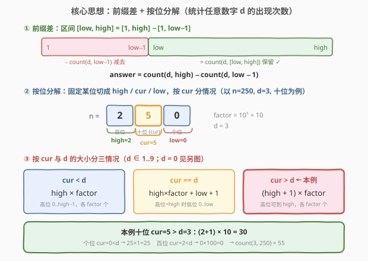
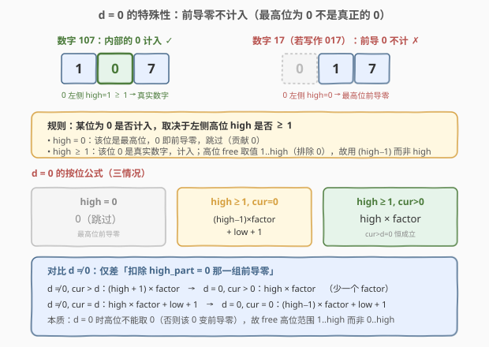
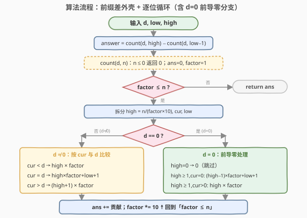
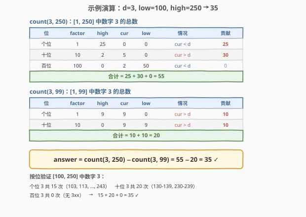

# 范围内的数字计数

- **题目名称**：范围内的数字计数
- **链接**：[1067. 范围内的数字计数](https://leetcode.cn/problems/digit-count-in-range/)
- **难度**：困难
- **标签**：数学、数位 DP、按位计数

## 1. 题目概述

给定一个数字 $d$（$0 \le d \le 9$）与两个整数 $low$、$high$（$low \le high$），统计 **$[low, high]$ 范围内所有整数**中数字 $d$ 出现的**总次数**。

> 💡 注意是「数字 $d$ 出现的总次数」，不是「含 $d$ 的数的个数」。例如 $d=1$ 时，$11$ 出现了 **2 次** 1，要计 2。

**示例 1**：

```text
输入：d = 1, low = 1, high = 13
输出：6
解释：[1, 13] 中数字 1 出现位置如下（共 6 次）：
      1, 10, 11, 12, 13
      其中 1 出现 1 次，10 出现 1 次，11 出现 2 次，12 出现 1 次，13 出现 1 次，合计 6。
```

**示例 2**：

```text
输入：d = 3, low = 100, high = 250
输出：35
```

**约束条件**：

- $0 \le d \le 9$
- $1 \le low \le high \le 2 \times 10^8$

> ⚠️ **与 [233. 数字 1 的个数](../0201-0300/233_数字1的个数.md) 的关系**：233 统计 $[1, n]$ 中数字 1 的次数；本题是它的两个维度上的推广——① 统计**任意数字 $d$**（含 0）；② 统计**区间 $[low, high]$** 而非 $[1, n]$。$high \le 2 \times 10^8$，逐个数枚举 $O(n \log n)$ 必然超时，必须沿用 233 的「按位分解」思路，并补上「区间 → 前缀差」「$d=0$ → 前导零」两块拼图。

---

## 2. 解题思路

### 2.1 暴力思路：逐个数逐位检查

最直白做法：遍历 $i \in [low, high]$，把 $i$ 转字符串数其中 $d$ 的个数，累加。

```text
ans = 0
for i in low..high:
    ans += str(i).count(str(d))
```

$high \le 2 \times 10^8$、区间最长 $2 \times 10^8$ 个数，每个数 $O(\log_{10} n)$ 位，总操作量约 $1.8 \times 10^9$，必然超时。问题症结与 233 相同：**逐个数重复扫描数位**。换视角——按「位」一次性算出该位在区间上的总贡献。

### 2.2 核心观察：前缀差 + 按位分解



本题在 233 的按位分解基础上多了两步：

**第一步：区间 → 前缀差。** 定义 $\text{count}(d, n)$ 为数字 $d$ 在 $[1, n]$ 中出现的总次数，则：

$$\text{answer} = \text{count}(d, high) - \text{count}(d, low - 1)$$

这是计数题的通用降维——把「区间计数」归约为「前缀计数之差」，与 [370. 区间加法](https://leetcode.cn/problems/range-addition/) 用差分数组、[303. 区域和检索](https://leetcode.cn/problems/range-sum-query-immutable/) 用前缀和同源。于是只需实现 $\text{count}(d, n)$。

**第二步：按位分解（$d \in 1..9$）。** 对 $n$ 的第 $i$ 位（位权 $\text{factor} = 10^i$），切成三段 $n = \text{high} \times 10^{i+1} + \text{cur} \times 10^i + \text{low}$，按 `cur` 与 $d$ 的大小分三种情况，统计该位等于 $d$ 的数的个数（每个 $d$ 唯一归属于某一位，逐位累加即总数，详见 233 题解）：

| `cur` | 该位为 $d$ 的个数 | 直觉 |
|-------|------------------|------|
| $< d$ | $\text{high} \times \text{factor}$ | 高位取 $0 \dots \text{high}-1$（取到 high 时该位 $< d$ 必越界），各 factor 个低位 |
| $= d$ | $\text{high} \times \text{factor} + \text{low} + 1$ | 高位 $0 \dots \text{high}-1$ 各 factor 个；高位 $= \text{high}$ 时低位卡在 $0 \dots \text{low}$ |
| $> d$ | $(\text{high} + 1) \times \text{factor}$ | 高位可取 $0 \dots \text{high}$（取到 high 时该位填 $d$ 仍 $< \text{cur}$ 不越界） |

> 💡 对 $d \in \{1, \dots, 9\}$，这就是 233 公式里把「1」换成 $d$、把「cur=0/1/≥2」换成「cur<d/=d/>d」而已——233 的三情况是 $d=1$ 的特例。

### 2.3 关键难点：$d = 0$ 的前导零处理



当 $d = 0$ 时，按位公式会**多算前导零**：例如 $n = 17$ 时，若对十位套用 $d \ne 0$ 公式，会把「十位为 0」的 `00..09`（即 $0 \sim 9$）都计入，但这些数的十位 0 是**前导零**，并非真实数字，不应计数。

**判定准则**：某位上的 0 是否为真实数字，取决于它**左侧高位 $\text{high}$ 是否 $\ge 1$**：

- $\text{high} = 0$：该位是当前最高位，0 即前导零 → **跳过，贡献 0**；
- $\text{high} \ge 1$：该位 0 是真实数字 → 计入；但高位 free 取值范围从「$0 \dots \text{high}$」收窄为「$1 \dots \text{high}$」（排除 $\text{high\_part}=0$ 那一组前导零），故 free 部分用 $\text{high} - 1$ 而非 $\text{high}$。

于是 $d = 0$ 的按位公式为（$\text{high} \ge 1$ 时）：

| `cur` | 该位为 0 的个数 |
|-------|----------------|
| $= 0$ | $(\text{high} - 1) \times \text{factor} + \text{low} + 1$ |
| $> 0$ | $\text{high} \times \text{factor}$ |

> ⚠️ **对比 $d \ne 0$ 的本质差异**：$d \ne 0$ 时高位 free 范围 $0 \dots \text{high}$（含 0）；$d = 0$ 时高位 free 范围 $1 \dots \text{high}$（不含 0，否则该 0 变前导零）。所以 $d=0$ 的 free 部分恰比 $d \ne 0$ **少一个 $\text{factor}$**：$d \ne 0,\ \text{cur} > d$ 给 $(\text{high}+1) \times \text{factor}$，$d=0,\ \text{cur} > 0$ 给 $\text{high} \times \text{factor}$；$d \ne 0,\ \text{cur}=d$ 给 $\text{high} \times \text{factor} + \text{low}+1$，$d=0,\ \text{cur}=0$ 给 $(\text{high}-1) \times \text{factor} + \text{low}+1$。

### 2.4 算法流程图



外层用前缀差调用两次 $\text{count}(d, \cdot)$；$\text{count}(d, n)$ 内部一层按位循环，按 $d$ 是否为 0 走两套三情况分支，逐位累加后返回：

1. `answer = count(d, high) - count(d, low - 1)`。
2. `count(d, n)`：`n ≤ 0` 返回 0；否则 `ans=0, factor=1`。
3. 当 `factor ≤ n`：拆分 `high / cur / low`；按 `d==0` 与否选公式累加；`factor *= 10`。
4. 返回 `ans`。

### 2.5 示例演算



以示例 2（$d=3,\ low=100,\ high=250$）为例，分别算 $\text{count}(3, 250)$ 与 $\text{count}(3, 99)$：

**$\text{count}(3, 250)$**（$d \ne 0$，逐位）：

| 位 | factor | high | cur | low | 情况 | 贡献 |
|----|--------|------|-----|-----|------|------|
| 个位 | 1 | 25 | 0 | 0 | cur < d | $25 \times 1 = 25$ |
| 十位 | 10 | 2 | 5 | 0 | cur > d | $(2+1) \times 10 = 30$ |
| 百位 | 100 | 0 | 2 | 50 | cur < d | $0 \times 100 = 0$ |

合计 $= 25 + 30 + 0 = 55$。

**$\text{count}(3, 99)$**：

| 位 | factor | high | cur | low | 情况 | 贡献 |
|----|--------|------|-----|-----|------|------|
| 个位 | 1 | 9 | 9 | 0 | cur > d | $(9+1) \times 1 = 10$ |
| 十位 | 10 | 0 | 9 | 9 | cur > d | $(0+1) \times 10 = 10$ |

合计 $= 10 + 10 = 20$。

$$\text{answer} = 55 - 20 = 35 \quad \checkmark$$

> 💡 **按位验证**：直接在 $[100, 250]$ 内数 3——个位 3 共 15 次（$103,113,\dots,243$），十位 3 共 20 次（$130\text{-}139$、$230\text{-}239$），百位 3 共 0 次（无 $3xx$），$15+20+0=35$，与前缀差结果一致。

---

## 3. 参考代码

### C++

```cpp
class Solution {
  public:
    int digitsCount(int d, int low, int high) {
        return (int)(countDigit(d, high) - countDigit(d, low - 1));
    }
  private:
    // 统计数字 d 在 [1, n] 中出现的总次数
    long long countDigit(int d, int n) {
        if (n <= 0) return 0;
        long long ans = 0, factor = 1;
        while (factor <= n) {
            long long high = n / (factor * 10);
            long long cur  = (n / factor) % 10;
            long long low  = n % factor;
            if (d == 0) {
                if (high > 0) {                     // 最高位为 0 是前导零，跳过
                    if (cur == 0) ans += (high - 1) * factor + low + 1;
                    else          ans += high * factor;
                }
            } else {
                if (cur < d)      ans += high * factor;
                else if (cur == d) ans += high * factor + low + 1;
                else              ans += (high + 1) * factor;
            }
            factor *= 10;
        }
        return ans;
    }
};
```

### Python

```python
class Solution:
    def digitsCount(self, d: int, low: int, high: int) -> int:
        def count_digit(n: int) -> int:
            if n <= 0:
                return 0
            ans = 0
            factor = 1
            while factor <= n:
                high, cur, low = n // (factor * 10), (n // factor) % 10, n % factor
                if d == 0:
                    if high > 0:                    # 最高位为 0 是前导零，跳过
                        if cur == 0:
                            ans += (high - 1) * factor + low + 1
                        else:
                            ans += high * factor
                else:
                    if cur < d:
                        ans += high * factor
                    elif cur == d:
                        ans += high * factor + low + 1
                    else:
                        ans += (high + 1) * factor
                factor *= 10
            return ans

        return count_digit(high) - count_digit(low - 1)
```

> 💡 **类型选择**：$high \le 2 \times 10^8$，最终答案上界约 $1.8 \times 10^8$，`int` 足以容纳，故返回值直接转 `int`。但循环末轮 `factor` 可达 $10^9$，`factor * 10` 达 $10^{10}$ 超过 32 位 `int` 上界（$\approx 2.1 \times 10^9$），故 C++ 中 `factor` 及中间量用 `long long`，与 [233](../0201-0300/233_数字1的个数.md) 同理。Python 整数任意精度，无此顾虑。

---

## 4. 复杂度分析

| 维度 | 复杂度 | 说明 |
|------|--------|------|
| 时间复杂度 | $O(\log_{10} high)$ | 调用两次 $\text{count}$，每次循环 $= high$ 的十进制位数（$\le 9$ 轮），每轮 $O(1)$ |
| 空间复杂度 | $O(1)$ | 仅常数个变量，与输入规模无关 |

> ⚠️ **与暴力 $O(n \log n)$ 的对比**：$n = 2 \times 10^8$ 时暴力约 $1.8 \times 10^9$ 次操作；按位分解仅 $2 \times 9 = 18$ 次 $O(1)$ 计算。这是**数的进制结构**带来的降维——把线性枚举压缩为对数次累加，与 [233](../0201-0300/233_数字1的个数.md)、[172. 阶乘后的零](../0101-0200/172_阶乘后的零.md) 同源。

---

## 5. 扩展：数位 DP 通用框架（`started` 状态统一处理 $d=0$）

闭合公式高效但需为 $d=0$ 单独推导前导零分支。若用**数位 DP**，只需多一个 `started` 状态标记「是否已开始填非零位」，即可**统一**处理 $d \in 0..9$——前导零阶段的 0 不计入，无需特判。

```python
from functools import lru_cache

class Solution:
    def digitsCount(self, d: int, low: int, high: int) -> int:
        def count_digit(n: int) -> int:
            if n <= 0:
                return 0
            s = str(n)

            @lru_cache(None)
            def dfs(i: int, tight: bool, started: bool):
                # 返回 (方案数, 数字 d 的总个数)
                if i == len(s):
                    return (1, 0)
                up = int(s[i]) if tight else 9
                ways, cnt = 0, 0
                for x in range(up + 1):
                    ntight = tight and (x == up)
                    nstarted = started or (x != 0)
                    w, c = dfs(i + 1, ntight, nstarted)
                    ways += w
                    # 仅当已开始（非前导零）且 x == d 时，每个后缀各多 1 个 d
                    if nstarted and x == d:
                        cnt += c + w
                    else:
                        cnt += c
                return (ways, cnt)

            return dfs(0, True, False)[1]

        return count_digit(high) - count_digit(low - 1)
```

**关键在 `nstarted and x == d`**：前导零阶段（`started=False` 且 `x=0`）`nstarted` 仍为 `False`，该 0 不计数，天然规避前导零；一旦填了非零位，后续的 0 都是真实数字，照常计入。这样 $d=0$ 与 $d \ne 0$ 走同一套逻辑。

| 解法 | 时间 | 空间 | 适用场景 |
|------|------|------|----------|
| 按位分解闭合公式 | $O(\log n)$ | $O(1)$ | 统计单一数字出现次数，最快最简洁，本题首选 |
| 数位 DP | $O(\log n \times \text{状态数})$ | $O(\log n \times \text{状态数})$ | 任意位约束（连续 d、数位和、大小关系），通用性强 |

> 💡 **数位 DP 的通用价值**：闭合公式是「统计单一数字」的特例最优解；一旦约束变复杂（如「不含连续某数字」「数位和为 k」「数字来自给定集合」），闭合公式难推导，数位 DP 只需加状态维度即可适配。详见 [233 题解第 5 节](../0201-0300/233_数字1的个数.md) 与下方练习题。

---

## 6. 面试要点

1. **本题与 233 的关系是什么？如何把 233 的解法迁移过来？**

   > 233 统计 $[1,n]$ 中数字 1 的次数；本题统计 $[low,high]$ 中任意数字 $d$。迁移两步：① 区间 → 前缀差 $\text{count}(d,high) - \text{count}(d,low-1)$，把「区间计数」归约为「前缀计数之差」；② 把 233 公式里的「1」换成 $d$，「cur=0/1/≥2」换成「cur<d/=d/>d」。对 $d \in 1..9$ 这就是全部改动。

2. **$d = 0$ 为什么要单独处理？**

   > 套用 $d \ne 0$ 公式会把前导零计入。例如 $n=17$，十位为 0 的 `00..09`（即 $0 \sim 9$）的十位 0 是前导零，不是真实数字。判定准则：某位 0 是否真实，看左侧高位 $\text{high}$ 是否 $\ge 1$——$\text{high}=0$ 则为最高位前导零，跳过；$\text{high} \ge 1$ 则计入，但高位 free 范围由 $0 \dots \text{high}$ 收窄为 $1 \dots \text{high}$，故 free 部分用 $\text{high}-1$ 而非 $\text{high}$。

3. **前缀差 $\text{count}(d, low-1)$ 在 $low=1$ 时会不会出错？**

   > 不会。$low \ge 1$ 故 $low-1 \ge 0$；$\text{count}(d, 0)$ 在代码里由 `n <= 0 return 0` 兜底返回 0。此时 $\text{answer} = \text{count}(d, high) - 0 = \text{count}(d, high)$，即 $[1, high]$ 的计数，与 $[1, high]$ 区间一致。

4. **为什么 `factor` 要用 `long long`？**

   > $high \le 2 \times 10^8$ 共 9 位，循环末轮 `factor` 达 $10^8$，`factor * 10 = 10^9` 接近 32 位 `int` 上界；若约束略放宽即溢出，导致 `high = n/(factor*10)` 算错。用 `long long` 让 `factor*10` 在 64 位下运算最直白；也可改写 `high = n / factor / 10`（利用 $\lfloor\lfloor n/a\rfloor/b\rfloor = \lfloor n/(ab)\rfloor$）规避。

5. **闭合公式和数位 DP 该用哪个？**

   > 本题只统计单一数字出现次数，闭合公式 $O(\log n)$ / $O(1)$ 是最优解，面试首选；$d=0$ 的前导零分支是唯一新增点。若约束升级（如「不含连续 d」「数位和为 k」），闭合公式难推导，数位 DP 加 `started`/`prev`/`sum` 等状态维度即可通用适配，且 `started` 能统一处理 $d=0$ 无需特判。

> 💡 **一句话总结**：1067 = 233 ＋「前缀差」＋「$d=0$ 前导零」。区间计数归约为 $\text{count}(d,high) - \text{count}(d,low-1)$；按位分解把 $d \in 1..9$ 的公式从 233 平移而来；$d=0$ 需扣除前导零——高位 free 范围由 $0..high$ 收窄为 $1..high$，free 部分用 $\text{high}-1$。整体 $O(\log n)$ 时间 $O(1)$ 空间。

---

## 7. 同类练习题

- [233. 数字 1 的个数](https://leetcode.cn/problems/number-of-digit-one/)（[站内题解](../0201-0300/233_数字1的个数.md)）：本题的直接母题，统计 $[1,n]$ 中数字 1 的次数；1067 的 $d \in 1..9$ 公式即 233 公式把 1 换成 $d$ 的平移
- [剑指 Offer 43. 1～n 整数中 1 出现的次数](https://leetcode.cn/problems/1nzheng-shu-zhong-1chu-xian-de-ci-shu-lcof/)：与 233 完全等价，可作为按位分解公式的另一份题面练习
- [172. 阶乘后的零](https://leetcode.cn/problems/factorial-trailing-zeroes/)（[站内题解](../0101-0200/172_阶乘后的零.md)）：同为「按幂分层累加」的数论计数题，对比「$5$ 进制位权数因子」与「$10$ 进制位权数数字」两套分解
- [600. 不含连续 1 的非负整数](https://leetcode.cn/problems/non-negative-integers-without-consecutive-ones/)：数位 DP 进阶，展示 `prev` 状态维度的通用性——闭合公式难推导时的标准出路
- [902. 最大为 N 的数字组合](https://leetcode.cn/problems/numbers-at-most-n-given-digit-set/)：数位 DP 模板题，`tight` 标记的典型应用，可与本文数位 DP 扩展解法对照
