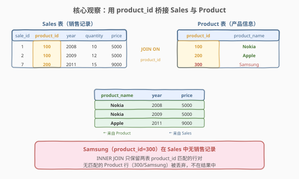
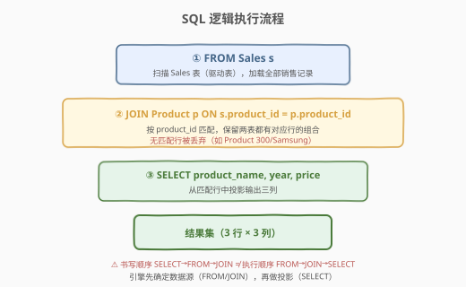
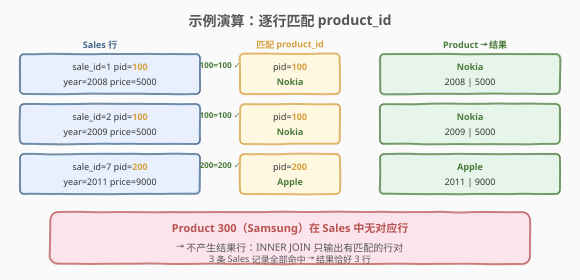

# LeetCode 产品销售分析 I 题解

## 1. 题目概述

- **标题 / 题号**：产品销售分析 I（#1068，easy）
- **链接**：https://leetcode.cn/problems/product-sales-analysis-i/
- **难度**：简单
- **标签**：SQL、数据库、JOIN、INNER JOIN、多表关联

**题意**：给定 `Sales` 表（销售记录）与 `Product` 表（产品信息），编写 SQL 查询，返回 `Sales` 表中所有销售记录对应的 `product_name` 以及该产品的 `year` 和 `price`。结果无顺序要求。

**表结构**：

```text
表：Sales
+-------------+-------+
| 列名        | 类型  |
+-------------+-------+
| sale_id     | int   |
| product_id  | int   |  ← 外键 → Product.product_id
| year        | int   |
| quantity    | int   |
| price       | int   |
+-------------+-------+
(sale_id, year) 是该表的主键（唯一值组合）。
product_id 是关联到 Product 表的外键。
每行显示某 product_id 在某一年的销售情况，price 为每单位价格。

表：Product
+--------------+---------+
| 列名         | 类型    |
+--------------+---------+
| product_id   | int     |  ← 主键
| product_name | varchar |
+--------------+---------+
product_id 是该表的主键。
每行表示一种产品的产品名称。
```

**示例 1**：

```text
输入：
Sales 表
+---------+------------+------+----------+-------+
| sale_id | product_id | year | quantity | price |
+---------+------------+------+----------+-------+
| 1       | 100        | 2008 | 10       | 5000  |
| 2       | 100        | 2009 | 12       | 5000  |
| 7       | 200        | 2011 | 15       | 9000  |
+---------+------------+------+----------+-------+
Product 表
+------------+--------------+
| product_id | product_name |
+------------+--------------+
| 100        | Nokia        |
| 200        | Apple        |
| 300        | Samsung      |
+------------+--------------+
输出：
+--------------+------+-------+
| product_name | year | price |
+--------------+------+-------+
| Nokia        | 2008 | 5000  |
| Nokia        | 2009 | 5000  |
| Apple        | 2011 | 9000  |
+--------------+------+-------+
解释：每条销售记录通过 product_id 关联到 Product 表获取产品名称。
     Samsung（product_id=300）在 Sales 中无销售记录，不在结果中。
```

**约束**：

- `(sale_id, year)` 为 `Sales` 表主键
- `product_id` 为 `Product` 表主键，`Sales.product_id` 为指向 `Product` 的外键
- `price` 表示每单位价格
- 结果列须为 `product_name`、`year`、`price`，顺序不限

> 💡 本题是 SQL **JOIN 母题**——所有"把两张表按某列拼在一起"的需求都从这一题衍生。核心是把"获取销售记录对应的产品名"翻译成"按 `product_id` 把 `Sales` 与 `Product` 连接"，而 `JOIN ... ON` 正是 SQL 声明式表达这一操作的标准子句。

## 2. 解题思路

### 2.1 暴力思路：逐行嵌套查找

最直觉的过程式思路是：对 `Sales` 表的每一行，扫描 `Product` 表找 `product_id` 相等的行，取出 `product_name` 拼上 `year`、`price` 输出。这是经典的**嵌套循环连接**（Nested Loop Join），时间复杂度 $O(m \times n)$（$m$ = Sales 行数，$n$ = Product 行数）。

这能解决问题，但把连接逻辑写成了命令式循环——SQL 的哲学是**声明式**：你只需描述"要什么"和"按什么连接"，引擎自己选最优执行计划（哈希连接、索引嵌套等）。

### 2.2 核心观察：JOIN ON product_id 桥接两表



这道题的本质是：`product_name` 只存在于 `Product` 表，而 `year`、`price` 只存在于 `Sales` 表——要把它们拼到同一行，必须找到一个**两表共有的列**作为"桥"。`product_id` 正是这座桥：

- `Sales.product_id`（外键）→ 指向 `Product.product_id`（主键）
- 对每条 Sales 行，按 `product_id` 在 Product 中找到对应行，取出 `product_name`
- 两表拼接的条件：`s.product_id = p.product_id`

**为什么用 INNER JOIN？**

- `Sales.product_id` 是**外键**，保证每条销售记录的 `product_id` 在 `Product` 表中**一定存在**（引用完整性）。
- 因此 `INNER JOIN`（只保留两表都匹配的行）与 `LEFT JOIN`（保留左表全部行）结果相同——不会有 Sales 行因找不到 Product 而被丢弃。
- `Product` 表中可能有**没有销售记录的产品**（如 Samsung/300），`INNER JOIN` 会丢弃它们——这正是我们要的：只输出有销售的产品。

> 💡 **外键约束的"免费保证"**：正因为 `Sales.product_id` 是外键，我们无需担心 Sales 中出现"幽灵产品"。若没有外键约束，`INNER JOIN` 会静默丢弃 Sales 中引用了不存在产品的行——此时需改用 `LEFT JOIN` 才能保留所有 Sales 行，但 `product_name` 会出现 `NULL`。

### 2.3 算法流程图



SQL 的**逻辑执行顺序**与书写顺序不同：

```text
书写顺序：SELECT → FROM → JOIN
执行顺序：FROM → JOIN → SELECT
```

1. **FROM Sales s**：先加载 Sales 表作为驱动表（左表）。
2. **JOIN Product p ON s.product_id = p.product_id**：对每条 Sales 行，按 `product_id` 在 Product 中查找匹配行，拼接成宽行（含两表所有列）。无匹配的 Product 行（如 300/Samsung）被丢弃。
3. **SELECT product_name, year, price**：从拼接后的宽行中投影输出三列。

### 2.4 示例演算



以示例数据为例，3 条 Sales 记录逐行匹配：

| sale_id | Sales.product_id | → 匹配 Product | product_name | 输出行 |
|---------|-----------------|----------------|--------------|--------|
| 1 | 100 | Product 100 | Nokia | Nokia, 2008, 5000 |
| 2 | 100 | Product 100 | Nokia | Nokia, 2009, 5000 |
| 7 | 200 | Product 200 | Apple | Apple, 2011, 9000 |

> ⚠️ **Product 300（Samsung）** 在 Sales 表中无任何销售记录，`INNER JOIN` 不为其产生结果行。最终结果恰好 3 行 = Sales 行数，因为外键保证每条 Sales 都能命中一个 Product。

## 3. 参考代码

### SQL

```sql
SELECT product_name, year, price
FROM Sales s
JOIN Product p ON s.product_id = p.product_id;
```

> 💡 **写法要点**：
> - `JOIN` 默认即 `INNER JOIN`，可省略 `INNER` 关键字。
> - `ON s.product_id = p.product_id` 指定连接条件——两表中 `product_id` 相等的行才拼接。
> - 表别名 `s`、`p` 简化书写。`product_name`、`year`、`price` 三列名各只存在于一张表（`product_name` 仅在 Product，`year`/`price` 仅在 Sales），无需加表名前缀也不会歧义。若列名在两表都存在（如 `product_id`），则**必须**加前缀消歧。

### SQL（显式前缀写法，更严谨）

```sql
SELECT p.product_name, s.year, s.price
FROM Sales s
JOIN Product p ON s.product_id = p.product_id;
```

> 💡 面试中推荐显式写前缀——即使列名不歧义，也能让读者一眼看出每列来源，并避免后续表结构变更引入同名列时的隐蔽 bug。

### Python（pandas）

```python
import pandas as pd

def sales_analysis(sales: pd.DataFrame, product: pd.DataFrame) -> pd.DataFrame:
    return sales.merge(product, on='product_id')[['product_name', 'year', 'price']]
```

> 💡 **pandas 对照**：`merge(product, on='product_id')` 对应 SQL 的 `JOIN Product ON product_id`，默认 `how='inner'`（即 INNER JOIN）。合并后两表的同名列 `product_id` 自动合并为一列；`[['product_name', 'year', 'price']]` 对应 `SELECT` 投影三列。

## 4. 复杂度分析

| 维度 | 复杂度 | 说明 |
|------|--------|------|
| 时间复杂度 | $O(m + n)$ ~ $O(m \log n)$ | $m$ = Sales 行数，$n$ = Product 行数。有索引时走**索引嵌套循环** $O(m \log n)$；无索引时优化器常选**哈希连接** $O(m + n)$ |
| 空间复杂度 | $O(m)$ | 结果集大小 = Sales 行数（外键保证每行都匹配），中间哈希表 $O(n)$ |
| 结果行数 | $O(m)$ | 恰好等于 Sales 行数——外键约束保证无丢失行 |

> 💡 SQL 复杂度取决于**执行计划与索引**：若 `Product.product_id` 上有索引（主键默认有），引擎对每条 Sales 行走索引查找 $O(\log n)$，总计 $O(m \log n)$；若 Sales 较大且无索引，优化器常改用哈希连接，先对 Product 建哈希表 $O(n)$，再逐行探测 $O(m)$，总计 $O(m + n)$。

## 5. 扩展：INNER JOIN vs LEFT JOIN

### 5.1 四种 JOIN 的语义

| JOIN 类型 | 行为 | 本题结果 |
|-----------|------|---------|
| `INNER JOIN` | 只保留两表都匹配的行 | 3 行（正确） |
| `LEFT JOIN` | 保留左表（Sales）全部行，右表无匹配则填 NULL | 3 行（外键保证无 NULL，与 INNER 相同） |
| `RIGHT JOIN` | 保留右表（Product）全部行，左表无匹配则填 NULL | 4 行（含 Samsung/NULL） |
| `FULL JOIN` | 保留两表全部行，无匹配处填 NULL | 4 行（含 Samsung/NULL） |

### 5.2 为什么本题 INNER = LEFT？

因为 `Sales.product_id` 是指向 `Product.product_id` 的**外键**，数据库强制引用完整性：每条 Sales 行的 `product_id` 必须在 Product 中存在。因此不存在"Sales 行找不到 Product"的情况，`LEFT JOIN` 的 NULL 补齐机制永远不会触发，与 `INNER JOIN` 结果完全相同。

> ⚠️ **若去掉外键约束**，Sales 中可能出现 `product_id = 999`（Product 中不存在）的行。此时 `INNER JOIN` 会静默丢弃该行，`LEFT JOIN` 则保留它但 `product_name = NULL`。面试中主动指出这一点，展示对外键语义的理解。

### 5.3 什么时候该用 LEFT JOIN？

当驱动表（左表）的行**即使无匹配也必须保留**时——典型场景是"找从未订购的客户"（[183. 从不订购的客户](https://leetcode.cn/problems/customers-never-order/)）：用 `LEFT JOIN` 保留所有客户，再 `WHERE 右表.列 IS NULL` 筛出无订单的客户。这是 **LEFT JOIN + IS NULL** 的反连接范式，与本题的 INNER JOIN（只留匹配行）互补。

## 6. 面试要点

1. **INNER JOIN 和 LEFT JOIN 的区别是什么？**

   - `INNER JOIN` 只保留两表中**都匹配**的行；`LEFT JOIN` 保留左表全部行，右表无匹配处填 `NULL`。本题要求输出所有销售记录的产品名，每条 Sales 一定能匹配到 Product（外键保证），故两者结果相同。

2. **为什么这里 INNER JOIN 和 LEFT JOIN 结果相同？**

   - `Sales.product_id` 是指向 `Product.product_id` 的外键，引用完整性保证每条 Sales 行的 `product_id` 在 Product 中一定存在，不存在无匹配行。因此 `LEFT JOIN` 的 NULL 补齐机制永不触发，与 `INNER JOIN` 完全等价。

3. **SQL 的逻辑执行顺序是什么？**

   - `FROM → JOIN ON → WHERE → GROUP BY → HAVING → SELECT → ORDER BY → LIMIT`。先确定数据源（FROM/JOIN），再做行过滤（WHERE）、分组聚合（GROUP BY/HAVING），最后投影输出（SELECT）。理解这个顺序是写对 SQL 的关键。

4. **如果 product_id 没有索引，JOIN 性能如何？**

   - 无索引时，朴素嵌套循环为 $O(m \times n)$。但现代优化器通常改用**哈希连接**（对较小的表建哈希表），降到 $O(m + n)$。面试中可答："主键默认有索引，走索引嵌套循环 $O(m \log n)$；即使无索引，优化器也会选哈希连接避免 $O(m \times n)$ 退化。"

5. **为什么 Samsung 不在结果中？**

   - Samsung（product_id=300）在 Sales 表中无任何销售记录，`INNER JOIN` 只保留两表都有匹配的行对，故 300 不产生结果行。若需求改为"列出所有产品（含无销售的）"，则需 `RIGHT JOIN` 或以 Product 为左表做 `LEFT JOIN`。

> 💡 **一句话总结**：1068 是 SQL **JOIN 母题**——核心就一句 `SELECT product_name, year, price FROM Sales JOIN Product ON product_id`。考点不在语法难度，而在理解"共有列桥接两表"的连接本质，以及外键约束保证 INNER = LEFT 的语义推理。

## 同类练习题

| # | 题目 | 与本题的关联 |
|---|------|-------------|
| 175 | [组合两个表](https://leetcode.cn/problems/combine-two-tables/) | SQL `LEFT JOIN` 入门母题——保留全部 person 行，展示"左表全保留"的连接思想，与本题 INNER JOIN 形成对照 |
| 183 | [从不订购的客户](https://leetcode.cn/problems/customers-never-order/)（[题解](../0101-0200/183_从不订购的客户.md)） | `LEFT JOIN + IS NULL` 反连接——找"从未出现"的行，与本题"只留匹配行"互补，合起来覆盖 JOIN 的完整光谱 |
| 1069 | [产品销售分析 II](https://leetcode.cn/problems/product-sales-analysis-ii/) | 同表系列进阶——`JOIN` + `GROUP BY` + `SUM` 聚合，在连接之上叠加分组统计 |
| 1070 | [产品销售分析 III](https://leetcode.cn/problems/product-sales-analysis-iii/) | 同表系列进阶——`JOIN` + `GROUP BY` + `MIN/MAX` 分组最值，延伸聚合维度 |
| 570 | [至少有 5 名直接下属的经理](https://leetcode.cn/problems/managers-with-at-least-5-direct-reports/) | `JOIN`（自连接）+ `GROUP BY` + `HAVING COUNT >= 5`，综合连接与分组筛选 |
