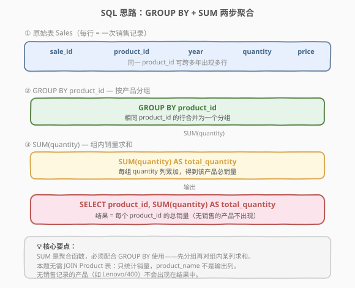
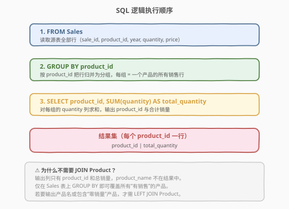
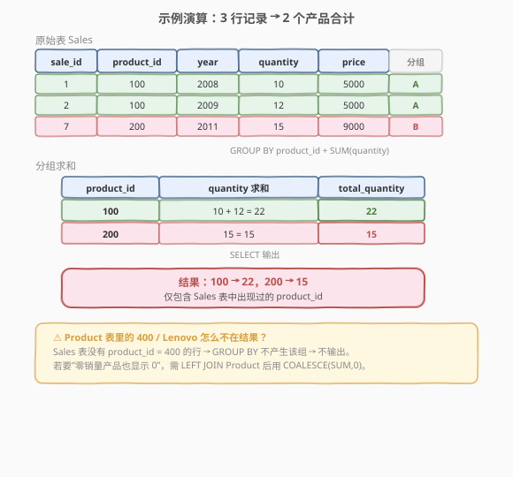

# LeetCode 产品销售分析 II 题解

> ⚠️ **注意**：本题是 LeetCode 数据库（SQL）类题目，在 leetcode.cn 上为 **Plus 会员专享题**，leetcode.com 上为免费题。本文代码部分使用 SQL 而非 C++/Python。

## 1. 题目概述

- **标题 / 题号**：产品销售分析 II（#1069，easy）
- **链接**：https://leetcode.cn/problems/product-sales-analysis-ii/
- **难度**：简单
- **标签**：SQL、数据库、GROUP BY、聚合、SUM

**题意**：给定 `Sales` 表（记录每笔销售）和 `Product` 表（产品信息）。请编写 SQL 查询，报告**每个产品的总销售数量**。

**表结构**：

```text
表：Sales
+-------------+-------+
| 列名        | 类型  |
+-------------+-------+
| sale_id     | int   |
| product_id  | int   |
| year        | int   |
| quantity    | int   |
| price       | int   |
+-------------+-------+
(sale_id, year) 是该表主键。
product_id 是指向 Product 表的外键。
注意 price 是单位价格。
```

```text
表：Product
+-------------+---------+
| 列名        | 类型    |
+-------------+---------+
| product_id  | int     |
| product_name| varchar |
+-------------+---------+
product_id 是该表主键。
```

**示例 1**：

```text
输入：Sales 表
+---------+------------+------+----------+-------+
| sale_id | product_id | year | quantity | price |
+---------+------------+------+----------+-------+
| 1       | 100        | 2008 | 10       | 5000  |
| 2       | 100        | 2009 | 12       | 5000  |
| 7       | 200        | 2011 | 15       | 9000  |
+---------+------------+------+----------+-------+

Product 表
+------------+--------------+
| product_id | product_name |
+------------+--------------+
| 100        | Nokia        |
| 200        | Apple        |
| 400        | Lenovo       |
+------------+--------------+

输出：
+--------------+----------------+
| product_id   | total_quantity |
+--------------+----------------+
| 100          | 22             |
| 200          | 15             |
+--------------+----------------+
解释：产品 100 共售出 10 + 12 = 22 件；产品 200 售出 15 件。
      产品 400 (Lenovo) 在 Sales 表中无记录，故不在结果中。
```

**约束**：

- `sale_id`、`year` 组合唯一标识一条销售记录。
- 同一 `product_id` 可在多笔销售、多个年份出现。
- `price` 为单位价格，本题不参与计算。

## 2. 解题思路

### 2.1 暴力思路：逐行扫描累加

用应用层代码读出全表，以 `product_id` 为键建哈希表 `map<product_id, total>`，遍历每行把 `quantity` 累加进去，最后输出所有键值对。

这能解决问题，但把**本该由数据库引擎高效完成的聚合操作**搬到了应用层，既低效也违背 SQL 的声明式哲学——应该让数据库做它擅长的事。

### 2.2 核心观察：GROUP BY + SUM



本题的本质是**按产品分组，对每组的 `quantity` 求和**。SQL 天生提供两件工具完成此事：

| 步骤 | SQL 子句 / 函数 | 作用 |
|------|-----------------|------|
| ① 分组 | `GROUP BY product_id` | 把相同 `product_id` 的行合并为一组 |
| ② 求和 | `SUM(quantity)` | 对每组的 `quantity` 列累加，得到该产品总销量 |

> 💡 **关键判断：不需要 JOIN Product 表**。输出列只有 `product_id` 和总销量，`product_name` 不在结果中。`Sales` 表自身已含 `product_id`，在其上 `GROUP BY` 即可覆盖所有“有销售记录”的产品。`Product` 表在本题是干扰信息。

> ⚠️ **为什么 400 / Lenovo 不在结果里？** `GROUP BY` 只对 `Sales` 表中**实际出现**的 `product_id` 生成分组。`Product` 表有 400 但 `Sales` 表没有相关行，于是不产生该组、不输出。若要求“零销量产品也显示 0”，需改用 `LEFT JOIN`（见第 5 节）。

### 2.3 算法流程图



完整的 SQL 执行流程如下：

```text
SELECT product_id, SUM(quantity) AS total_quantity   ← ③ 输出列 + 聚合
FROM Sales                                           ← ① 扫描源表
GROUP BY product_id;                                 ← ② 按产品分组
```

SQL 的逻辑执行顺序为 `FROM → GROUP BY → SELECT`，聚合函数 `SUM` 在 `GROUP BY` 产生的每个分组上计算。

### 2.4 示例演算



以示例数据为例，3 行记录经 `GROUP BY product_id` 后产生 2 个分组：

| 分组 | product_id | quantity 求和 | total_quantity |
|------|------------|---------------|----------------|
| A    | 100        | 10 + 12       | 22             |
| B    | 200        | 15            | 15             |

`SUM(quantity)` 把每组的 `quantity` 列累加，得到 `100 → 22`、`200 → 15`。`Product` 表中的 `400 / Lenovo` 因 `Sales` 表无对应行而不产生分组，结果集中不出现。

## 3. 参考代码

### SQL

```sql
SELECT product_id, SUM(quantity) AS total_quantity
FROM Sales
GROUP BY product_id;
```

> 💡 **为什么输出列名是 `total_quantity`**：题目要求结果列名为 `total_quantity`，用 `AS total_quantity` 给聚合表达式起别名。`SUM(quantity)` 不带别名时，不同数据库会返回形如 `SUM(quantity)` 的默认列名，不符合输出规范。

### Python（模拟验证，非提交代码）

如需在应用层实现等价逻辑（如本地测试验证）：

```python
from collections import defaultdict

def product_sales_analysis(sales: list[list[int]]) -> list[list[int]]:
    total = defaultdict(int)
    for sale_id, product_id, year, quantity, price in sales:
        total[product_id] += quantity
    return [[pid, qty] for pid, qty in total.items()]
```

## 4. 复杂度分析

| 维度 | 复杂度 | 说明 |
|------|--------|------|
| 时间复杂度 | $O(n)$ | 全表扫描一次，对每行做分组累加；若 `product_id` 上有索引，聚合可走 Index-Only Scan 加速 |
| 空间复杂度 | $O(k)$ | $k$ 为 `Sales` 表中不同 `product_id` 的数量，聚合中间结果需存储每组的累加值 |

> 💡 数据库引擎可能选择**排序聚合**（Sort-based，$O(n \log n)$）或**哈希聚合**（Hash-based，$O(k)$ 哈希表空间），由查询优化器根据数据量与内存决定。`GROUP BY` 列上有索引时，引擎可利用索引的有序性避免额外排序。

## 5. 扩展：包含“零销量”产品

本题只统计 `Sales` 表中出现过的产品。若题目改为**“报告所有产品的总销量，无销售的记为 0”**，需以 `Product` 表为基准做 `LEFT JOIN`：

```sql
SELECT p.product_id, COALESCE(SUM(s.quantity), 0) AS total_quantity
FROM Product p
LEFT JOIN Sales s ON p.product_id = s.product_id
GROUP BY p.product_id;
```

要点：

1. **`LEFT JOIN`** 保证 `Product` 表的每一行都保留，即使 `Sales` 中无匹配行（此时 `s.quantity` 为 `NULL`）。
2. **`COALESCE(SUM(...), 0)`** 把“全 `NULL` 组”的 `SUM` 结果（`NULL`）转成 `0`——`SUM` 对全 `NULL` 值返回 `NULL` 而非 `0`。
3. **以 `Product` 表为驱动表**，`GROUP BY p.product_id`，这样 `400 / Lenovo` 也会生成一行 `(400, 0)`。

> ⚠️ 不要写成 `INNER JOIN`，否则无销售的产品又会被过滤掉，退化为原题行为。

## 6. 面试要点

1. **为什么不需要 JOIN Product 表？**
   - 输出列只有 `product_id` 和总销量，`product_name` 不在结果中。`Sales` 表自身已含 `product_id`，在其上 `GROUP BY` 即可得到所有“有销售记录”的产品的合计。`Product` 表是题目的干扰信息，引入 `JOIN` 反而增加无谓开销。

2. **SUM 和 COUNT 的区别？**
   - `SUM(column)` 对该列的值求和；`COUNT(*)` 统计行数。本题要“总销售数量”，是对 `quantity` 列的值累加，必须用 `SUM(quantity)`。若误用 `COUNT(*)` 得到的是销售笔数而非总销量（如产品 100 会得到 2 而非 22）。

3. **GROUP BY 的列和 SELECT 的列有什么约束？**
   - `SELECT` 中出现的**非聚合列**必须全部出现在 `GROUP BY` 中（标准 SQL 要求，多数数据库严格校验）。本题 `SELECT product_id, SUM(quantity)` 中 `product_id` 是非聚合列，恰好在 `GROUP BY` 中，合法；`quantity` 被包在 `SUM` 里属聚合列，无需单独出现在 `GROUP BY`。

4. **为什么 Lenovo（400）不在结果中？如何让它出现？**
   - `GROUP BY` 只对 `Sales` 表中实际存在的 `product_id` 生成分组，400 无销售行就不产生分组。要让它出现需以 `Product` 表为基准 `LEFT JOIN Sales` 再 `GROUP BY`，并用 `COALESCE(SUM(...), 0)` 把 `NULL` 转为 0（见第 5 节）。

5. **数据量很大时如何优化？**
   - 在 `Sales(product_id)` 上建索引，引擎可走 **Index-Only Scan**，扫描索引即得有序的 `product_id`，省去回表与额外排序。若进一步建覆盖索引 `(product_id, quantity)`，聚合所需列全在索引中，避免磁盘 I/O 读取数据行。

## 同类练习题

| # | 题目 | 与本题的关联 |
|---|------|-------------|
| 1050 | [合作过至少三次的演员和导演](https://leetcode.cn/problems/actors-and-directors-who-cooperate-at-least-three-times/)（[题解](../1001-1100/1050_合作过至少三次的演员和导演.md)） | `GROUP BY` + `HAVING COUNT(*)`，与本题同为分组聚合模板，仅聚合函数（COUNT vs SUM）与是否过滤不同 |
| 1068 | [产品销售分析 I](https://leetcode.cn/problems/product-sales-analysis-i/) | 同表结构，`JOIN` Product 输出产品名 + 销售年份，对照本题“何时该 JOIN、何时不该” |
| 1070 | [产品销售分析 III](https://leetcode.cn/problems/product-sales-analysis-iii/) | 同表结构，筛选每个产品**首年**的销售记录，`GROUP BY` + `MIN(year)` 子查询，本题的进阶 |
| 596 | [超过 5 名学生的课](https://leetcode.cn/problems/classes-more-than-5-students/) | `GROUP BY` + `HAVING COUNT`，分组计数后过滤组，对比本题分组后直接输出 |
| 586 | [订单最多的客户](https://leetcode.cn/problems/customer-placing-the-largest-number-of-orders/) | `GROUP BY` + `COUNT` + `ORDER BY ... LIMIT 1`，分组计数后取 Top-1，聚合查询的综合应用 |
