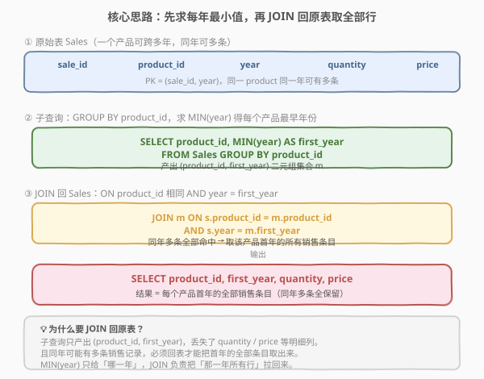
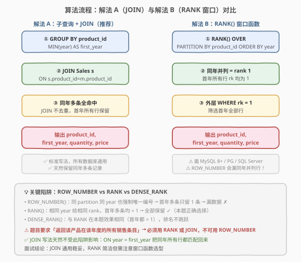
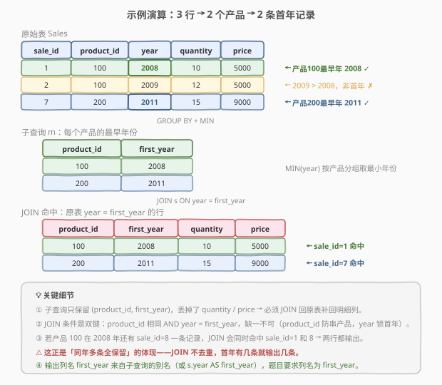

# LeetCode 产品销售分析 III 题解

## 1. 题目概述

- **标题 / 题号**：产品销售分析 III（#1070，medium）
- **链接**：https://leetcode.cn/problems/product-sales-analysis-iii/
- **难度**：中等
- **标签**：SQL、GROUP BY、MIN、子查询、JOIN、窗口函数、RANK

**题意**：给定销售表 `Sales`，每一行表示编号 `product_id` 的产品在某一年的销售额。编写 SQL 查询，选出**每个售出过的产品第一年**（即首次出现的最早年份）销售的 `product_id`、`年份`、`数量` 和 `价格`。

**关键要求**：

- 对每个 `product_id`，找到其在 `Sales` 表中首次出现的最早年份。
- **返回该产品在该年度的所有销售条目**（同年可能有多条，全部保留）。

**表结构**：

```text
表：Sales
+-------------+-------+
| 列名        | 类型  |
+-------------+-------+
| sale_id     | int   |
| product_id  | int   |
| year        | int   |
| quantity    | int   |
| price       | int   |
+-------------+-------+
(sale_id, year) 是这张表的主键（具有唯一值的列的组合）。
这张表的每一行都表示：编号 product_id 的产品在某一年的销售额。
一个产品可能在同一年内有多个销售条目。
价格是按每单位计的。
```

> 💡 **关键约束**：主键是 `(sale_id, year)` 的**组合**，而非单列。这意味着同一 `product_id` 可以在不同年份出现多次，**甚至同一年内也可以有多条记录**（不同 `sale_id`、相同 `year`）。题目明确要求返回首年的「所有」销售条目——这一句决定了窗口函数的选型（见 2.3）。

**示例 1**：

```text
输入：
Sales 表：
+---------+------------+------+----------+-------+
| sale_id | product_id | year | quantity | price |
+---------+------------+------+----------+-------+
| 1       | 100        | 2008 | 10       | 5000  |
| 2       | 100        | 2009 | 12       | 5000  |
| 7       | 200        | 2011 | 15       | 9000  |
+---------+------------+------+----------+-------+

输出：
+------------+------------+----------+-------+
| product_id | first_year | quantity | price |
+------------+------------+----------+-------+
| 100        | 2008       | 10       | 5000  |
| 200        | 2011       | 15       | 9000  |
+------------+------------+----------+-------+

解释：产品 100 的最早年份是 2008（sale_id=1），产品 200 的最早年份是 2011（sale_id=7）。
      各取首年那条记录输出。
```

**约束**：

- `(sale_id, year)` 为主键（组合唯一）。
- 同一 `product_id` 可跨多年、同年多条出现。
- 结果列名须为 `product_id`、`first_year`、`quantity`、`price`，顺序任意。

## 2. 解题思路

### 2.1 暴力思路：逐产品逐年扫描

用应用层代码读出全表，对每个 `product_id` 维护一个「已见过的最小年份」；遍历结束后再扫一遍，挑出 `year == 最小年份` 的所有行输出。

这能解决问题，但本质是**把数据库引擎擅长的分组聚合与连接搬到了应用层**——既低效也违背 SQL 的声明式哲学。本题在 SQL 中只需两步集合操作：**聚合求最小值** + **连接取明细**。

### 2.2 核心观察：先求每年最小值，再 JOIN 回原表取全部行



本题分两步：

| 步骤 | 操作 | 产出 |
|------|------|------|
| ① 求最早年份 | `GROUP BY product_id` + `MIN(year)` | 每个产品的 `(product_id, first_year)` |
| ② 取首年明细 | `JOIN Sales` ON `product_id` 相同且 `year = first_year` | 首年的全部销售条目（含 quantity / price） |

> 💡 **为什么必须 JOIN 回原表？** 子查询 `MIN(year)` 只产出 `(product_id, first_year)` 两个列，**丢掉了 `quantity` 和 `price` 等明细**。而且同年可能有多条记录，必须回表才能把首年的**全部**条目取出来。`MIN(year)` 只负责告诉你「哪一年」，`JOIN` 负责把「那一年所有行」拉回来。

> ⚠️ **JOIN 条件是双键**：`ON s.product_id = m.product_id AND s.year = m.first_year`。两个条件缺一不可——`product_id` 防止串产品，`year` 锁定首年。若只按 `product_id` JOIN 会把该产品所有年份的记录全拉回来，失去「首年」语义。

### 2.3 算法流程图：两种解法对比



本题有两种主流写法：

| 维度 | 解法 A：子查询 + JOIN（推荐） | 解法 B：RANK() 窗口函数 |
|------|------------------------------|-------------------------|
| **思路** | 聚合求 MIN(year)，再 JOIN 回原表 | 按 `product_id` 分区按 `year` 升序排名，取 rank=1 |
| **写法** | `JOIN (SELECT product_id, MIN(year) ... ) m` | `RANK() OVER (PARTITION BY product_id ORDER BY year)` 外层 `WHERE rk = 1` |
| **同年多条** | ✓ JOIN 不去重，首年多条全保留 | ✓ 同年并列均 rank=1，全部保留 |
| **数据库兼容** | ✓ 全部数据库通用 | ⚠️ 需 MySQL 8.0+ / PostgreSQL / SQL Server |
| **推荐度** | ✓ **首选**，稳妥通用 | 简洁，但需注意窗口函数选型 |

> ⚠️ **致命陷阱：不能用 `ROW_NUMBER()`**！`ROW_NUMBER()` 在同一分区内**强制唯一编号**，即使两条记录的 `year` 相同，也会被分配不同的序号（1、2……）。若首年有多条记录，`ROW_NUMBER()` 只会保留第一条，**漏掉同年其余条目**——与题目「返回所有销售条目」的要求矛盾。
>
> | 窗口函数 | 同年并列行为 | 本题是否正确 |
> |----------|-------------|-------------|
> | `ROW_NUMBER()` | 强制唯一，首年多条只留 1 条 | ✗ 漏数据 |
> | `RANK()` | 相同 year 给相同 rank，首年多条均 = 1 | ✓ 正确 |
> | `DENSE_RANK()` | 与 RANK 在本题效果相同 | ✓ 正确 |
>
> `JOIN` 写法天然不受此陷阱影响——`ON year = first_year` 把同年所有行都匹配回来，无需关心排名。

### 2.4 示例演算



以示例数据跟踪解法 A 的执行过程：

| 步骤 | 操作 | 结果 |
|------|------|------|
| ① | `GROUP BY product_id` + `MIN(year)` | 产品 100 → first_year=2008；产品 200 → first_year=2011 |
| ② | `JOIN Sales s ON s.product_id=m.product_id AND s.year=m.first_year` | sale_id=1（100,2008）命中；sale_id=7（200,2011）命中；sale_id=2（100,2009）未命中 |
| ③ | `SELECT product_id, first_year, quantity, price` | 输出 `(100,2008,10,5000)`、`(200,2011,15,9000)` |

> 💡 **同年多条如何被保留**：若产品 100 在 2008 年还有一条 `sale_id=8` 的记录，`JOIN ON year=2008` 会**同时命中** sale_id=1 和 sale_id=8，两行都输出——这正是「同年多条全保留」的体现。`JOIN` 不做去重，首年有几条就返回几条。

## 3. 参考代码

### SQL（解法 A：子查询 + JOIN，推荐）

```sql
SELECT s.product_id, s.year AS first_year, s.quantity, s.price
FROM Sales s
JOIN (
    SELECT product_id, MIN(year) AS first_year
    FROM Sales
    GROUP BY product_id
) m ON s.product_id = m.product_id AND s.year = m.first_year;
```

> 💡 **写法要点**：
> - 子查询 `m` 按 `product_id` 分组，`MIN(year)` 求每个产品的最早年份，产出 `(product_id, first_year)`。
> - `JOIN ... ON s.product_id = m.product_id AND s.year = m.first_year` 双键连接：`product_id` 配对产品、`year` 锁定首年。
> - `s.year AS first_year`：输出列名须为 `first_year`，从原表取 `year` 并重命名即可（`m.first_year` 与 `s.year` 在 JOIN 命中时值相同，取哪个都行）。
> - 用 `JOIN`（INNER JOIN）而非 `LEFT JOIN`：子查询 `m` 的每个 `product_id` 都来自 `Sales`，必定能在原表找到匹配行，内连接足够。

### SQL（解法 B：RANK() 窗口函数）

```sql
SELECT product_id, year AS first_year, quantity, price
FROM (
    SELECT product_id, year, quantity, price,
           RANK() OVER (PARTITION BY product_id ORDER BY year) AS rk
    FROM Sales
) t
WHERE rk = 1;
```

> 💡 **写法要点**：
> - `RANK() OVER (PARTITION BY product_id ORDER BY year)`：按 `product_id` 分区，区内按 `year` 升序排名。`year` 最小的行 rank=1；同年多条均 rank=1。
> - 外层 `WHERE rk = 1` 筛出每个产品的首年**全部**行。
> - **务必用 `RANK()` 而非 `ROW_NUMBER()`**：见 2.3 的陷阱说明。
> - 子查询别名 `t` 是部分数据库的语法要求（MySQL 8.0 / PostgreSQL 要求派生表必须有别名）。

### SQL（解法 C：IN 相关子查询，不推荐）

```sql
SELECT product_id, year AS first_year, quantity, price
FROM Sales s
WHERE (s.product_id, s.year) IN (
    SELECT product_id, MIN(year)
    FROM Sales
    GROUP BY product_id
);
```

> 💡 **写法要点**：用元组 `(product_id, year)` 与子查询结果集做 `IN` 匹配，语义与 JOIN 等价。某些数据库（如 SQL Server 旧版）不支持元组 `IN`，可改写为 `WHERE s.year = (SELECT MIN(year) FROM Sales s2 WHERE s2.product_id = s.product_id)` 的相关子查询形式，但效率较低（每行触发一次子查询）。

### Python（pandas）

```python
import pandas as pd

def sales_analysis(sales: pd.DataFrame) -> pd.DataFrame:
    first_year = sales.groupby('product_id')['year'].transform('min')
    result = sales[sales['year'] == first_year]
    return result[['product_id', 'year', 'quantity', 'price']].rename(columns={'year': 'first_year'})
```

> 💡 **pandas 对照**：`groupby('product_id')['year'].transform('min')` 对应 SQL 的 `GROUP BY product_id` + `MIN(year)`，`transform` 把聚合结果广播回每一行（与 `RANK() OVER (PARTITION BY ...)` 的窗口语义一致）；布尔索引 `sales['year'] == first_year` 对应 `JOIN ON year = first_year`；最后重命名 `year` 列为 `first_year` 满足输出要求。

## 4. 复杂度分析

| 维度 | 复杂度 | 说明 |
|------|--------|------|
| **时间（解法 A）** | $O(n)$ | 子查询扫描 `Sales` 一次分组聚合 $O(n)$；JOIN 再扫描一次，若 `product_id` / `year` 上有索引可走索引连接，整体线性 |
| **时间（解法 B）** | $O(n \log n)$ | 窗口函数需按 `(product_id, year)` 排序，排序开销 $O(n \log n)$；分区后排名线性 |
| **时间（解法 C）** | $O(n \cdot k)$ ~ $O(n)$ | 相关子查询每行触发一次；无索引时最坏 $O(n^2)$，有索引或被优化器改写为半连接后接近线性 |
| **空间** | $O(n)$ | 子查询物化中间结果 / 窗口函数排序缓冲区 |
| **结果行数** | $O(n)$ | 最坏情况每个产品首年都有多条记录，结果不超过原表行数 |

> ⚠️ SQL 复杂度取决于**执行计划与索引**：解法 A 的聚合 + JOIN 扫描两次表，稳定高效；解法 B 的窗口函数需排序，常数略大但语义简洁；解法 C 的相关子查询在无索引时易退化。面试中说明「首选 JOIN 写法，稳定通用；RANK 简洁但需 8.0+ 且注意选型」即可。

## 5. 扩展：窗口函数选型与 GROUP BY 的边界

### 5.1 ROW_NUMBER / RANK / DENSE_RANK 的本质区别

三者都做「分区内排名」，区别在于对**并列值**的处理：

| 函数 | 并列处理 | 下一排名 | 示例（值 1,1,2） |
|------|---------|---------|------------------|
| `ROW_NUMBER()` | 强制唯一 1,2,3 | — | 1, 2, 3 |
| `RANK()` | 相同值同 rank，下一 rank 跳过 | 跳跃 | 1, 1, 3 |
| `DENSE_RANK()` | 相同值同 rank，下一 rank 不跳 | 连续 | 1, 1, 2 |

> 💡 本题只取 rank=1（最小 year），`RANK` 与 `DENSE_RANK` 效果完全相同——因为它们对最小值的排名都是 1。差异体现在 rank≥2 的行，但本题不关心。`ROW_NUMBER` 则会破坏并列，**绝对不能用**。

### 5.2 「聚合 + JOIN」 vs 「窗口函数」的通用范式

所有「取每组最小/最大值对应的明细行」类问题都有这两种写法：

```sql
-- 范式 A：聚合 + JOIN（通用）
SELECT s.*
FROM T s
JOIN (SELECT grp, MIN(val) AS min_val FROM T GROUP BY grp) m
  ON s.grp = m.grp AND s.val = m.min_val;

-- 范式 B：窗口函数（需 8.0+）
SELECT *
FROM (
    SELECT *, RANK() OVER (PARTITION BY grp ORDER BY val) AS rk
    FROM T
) t WHERE rk = 1;
```

> 💡 范式 A 适用于**所有数据库**，是稳妥的面试默认写法；范式 B 更简洁且只需扫一次表，但依赖窗口函数支持。若问题改为「每组取 Top-K」（K>1），范式 B 用 `WHERE rk <= K` 一行搞定，范式 A 则需额外处理，此时窗口函数更优。

### 5.3 如果只要首年一条（任意一条）

若题目改为「每个产品首年**任意一条**记录」（不要求全部），则可用 `ROW_NUMBER()`：

```sql
SELECT product_id, year AS first_year, quantity, price
FROM (
    SELECT product_id, year, quantity, price,
           ROW_NUMBER() OVER (PARTITION BY product_id ORDER BY year) AS rn
    FROM Sales
) t WHERE rn = 1;
```

这能保证每个产品只输出一行，但**丢失了同年其余条目**——只适用于「去重取一」的场景，不适用于本题。

## 6. 面试要点

1. **为什么要 JOIN 回原表，不能直接用子查询的结果？**

   - 子查询 `SELECT product_id, MIN(year) FROM Sales GROUP BY product_id` 只产出 `(product_id, first_year)` 两列，**丢失了 `quantity` 和 `price`**。题目要求输出这些明细列，必须 JOIN 回 `Sales` 原表，按 `product_id` 和 `year = first_year` 双键匹配，把首年的完整行取回来。

2. **JOIN 条件为什么必须写两个 `ON`？**

   - `ON s.product_id = m.product_id AND s.year = m.first_year`：`product_id` 确保不串产品，`year` 确保只取首年。若只写 `product_id`，会把该产品**所有年份**的记录都匹配回来；若只写 `year`，会把不同产品同一年份的记录混进来。双键缺一不可。

3. **能用 `ROW_NUMBER()` 代替 `RANK()` 吗？为什么？**

   - **不能**。`ROW_NUMBER()` 在同一分区内强制唯一编号，即使两条记录的 `year` 相同也会分配不同序号。若首年有多条记录，`ROW_NUMBER()` 只保留 rank=1 的那一条，**漏掉同年其余条目**。`RANK()` 对相同 `year` 给相同 rank，首年多条均 rank=1，全部保留，符合题目「返回所有销售条目」的要求。

4. **主键是 `(sale_id, year)` 的组合，这意味着什么？**

   - 同一 `sale_id` 在不同 `year` 可以出现（虽然业务上不太可能），同一 `(sale_id, year)` 组合唯一。更重要的是，这允许**同一 `product_id` 在同一年有多条不同 `sale_id` 的记录**——这正是「同年多条全保留」要求的来源。组合主键而非单列主键，意味着不能仅靠 `sale_id` 去重。

5. **`GROUP BY` + `MIN` 和窗口函数 `RANK` 哪个更好？**

   - 语义等价。`GROUP BY` + `JOIN` 写法**通用稳妥**（所有数据库支持），但需扫表两次；`RANK()` 窗口函数**简洁**且只扫一次表，但需 MySQL 8.0+ 等支持窗口函数的数据库，且必须注意不能用 `ROW_NUMBER`。面试答「首选 JOIN 写法因通用，RANK 简洁但需选对函数」。

> 💡 **一句话总结**：1070 是 SQL **「分组取最小值对应明细行」母题**——核心就一句 `JOIN (SELECT product_id, MIN(year) ... GROUP BY product_id) m ON s.product_id=m.product_id AND s.year=m.first_year`。考点不在语法难度，而在理解「聚合只给年份、JOIN 取明细」的两步拆解，以及同年多条时**绝不能用 `ROW_NUMBER`** 的陷阱。记住这条范式，所有「每组最早/最晚记录」类 SQL 题都能套用。

## 同类练习题

| # | 题目 | 与本题的关联 |
|---|------|-------------|
| 1068 | [产品销售分析 I](https://leetcode.cn/problems/product-sales-analysis-i/) | 同 `Sales` 表的基础查询，`SELECT` + `JOIN Product` 取产品名，是本系列入门题，与 1070 共享表结构，由简单查询递进到分组取首年 |
| 1069 | [产品销售分析 II](https://leetcode.cn/problems/product-sales-analysis-ii/) | 同 `Sales` 表，`GROUP BY` + `SUM(quantity)` 求总销量并 `LEFT JOIN Product` 补零，与 1070 共享分组聚合范式，区别在聚合维度（求和 vs 取最小） |
| 1174 | [即时食物配送 II](https://leetcode.cn/problems/immediate-food-delivery-ii/) | `GROUP BY customer_id` + `MIN(order_date)` 求首单再 JOIN 回取即时率，与 1070 **完全同模板**（分组取最小值对应行），是「首年/首单」范式的直接复用 |
| 550 | [游戏玩法分析 IV](https://leetcode.cn/problems/game-play-analysis-iv/) | `GROUP BY player_id` + `MIN(event_date)` 求首次登录日，再算次日留存率，在 1070 的「取首日」基础上叠加日期差判断，难度递进 |
| 184 | [部门工资最高的员工](https://leetcode.cn/problems/department-highest-salary/) | `JOIN` + `GROUP BY department` + `MAX(salary)` 取每组最大值对应行，与 1070 是**镜像题**（取最大 vs 取最小），同范式不同聚合方向 |
