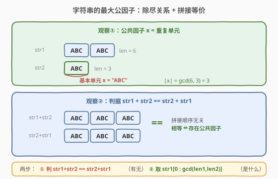
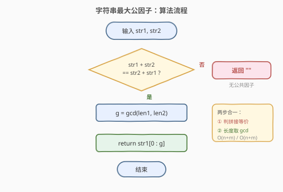
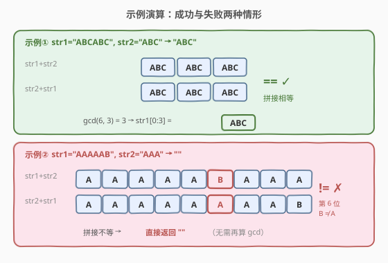

# LeetCode 字符串的最大公因子 题解

## 1. 题目概述

- **标题 / 题号**：字符串的最大公因子（#1071，easy）
- **链接**：https://leetcode.cn/problems/greatest-common-divisor-of-strings/
- **难度**：简单
- **标签**：数学、字符串、最大公约数

**题意**：对于字符串 `s` 和 `t`，只有在 `s = t + t + ... + t`（`t` 自身连接 1 次或多次）时，才认定「`t` 能除尽 `s`」。

给定两个字符串 `str1` 和 `str2`，返回**最长字符串 `x`**，要求满足 `x` 能除尽 `str1` 且 `x` 能除尽 `str2`。若不存在这样的 `x`，返回空串 `""`。

**示例 1**：

```text
输入：str1 = "ABCABC", str2 = "ABC"
输出："ABC"
解释："ABC" 除尽 "ABCABC"（ABC+ABC），也除尽 "ABC"（ABC 自身）。
```

**示例 2**：

```text
输入：str1 = "ABABAB", str2 = "ABAB"
输出："AB"
解释："AB" 除尽 "ABABAB"（AB+AB+AB），也除尽 "ABAB"（AB+AB）。
```

**示例 3**：

```text
输入：str1 = "LEET", str2 = "CODE"
输出：""
解释：不存在能同时除尽二者的字符串。
```

**示例 4**：

```text
输入：str1 = "AAAAAB", str2 = "AAA"
输出：""
解释："AAA" 虽能除尽自身，但除不尽 "AAAAAB"（5 个 A 后还有 B）。
```

**约束**：

- $1 \leq \text{str1.length}, \text{str2.length} \leq 1000$
- `str1` 和 `str2` 仅由大写英文字母组成

> 💡 关键点：「除尽」即字符串可由某个**基本单元**重复拼接得到。题目本质是在问：是否存在一个最短的公共「基本单元」，以及它的最长公共重复倍数。

## 2. 解题思路

### 2.1 暴力思路：枚举候选长度

公因子 `x` 的长度 `L` 必须同时整除 `len(str1)` 和 `len(str2)`。从大到小枚举 `L`（`L` 同时是 `len1`、`len2` 的公约数），取 `x = str1[0:L]`，验证 `x` 能否重复拼接出 `str1` 和 `str2`，命中即返回。

最坏要枚举到 $O(\min(n, m))$ 个候选长度，每次验证 $O(n + m)$，总计 $O(\min(n, m) \cdot (n + m))$。对 $n, m \leq 1000$ 可过，但**没有利用问题的代数结构**——字符串的「除尽」关系与整数的整除同构，可用 GCD 一步到位。

### 2.2 核心观察：拼接等价 + 长度取 GCD



这道题的两个关键观察把问题转化为一次 GCD 运算：

**观察一（存在性）**：存在公共因子 $x$ $\iff$ `str1 + str2 == str2 + str1`。

- **必要性**（$\Rightarrow$）：若 `x` 除尽两者，则 `str1 = x·a`、`str2 = x·b`（`a`、`b` 为重复次数），于是
  $$\text{str1} + \text{str2} = x\cdot(a+b) = x\cdot(b+a) = \text{str2} + \text{str1}$$
  即拼接顺序无关。
- **充分性**（$\Leftarrow$）：若 `str1 + str2 == str2 + str1`，则 `str1`、`str2` 必由同一基本单元重复而成（证明见第 5 节，本质是辗转相减）。

**观察二（最长长度）**：若公共因子存在，其最长长度恰为 $\gcd(\text{len1}, \text{len2})$。

- `x` 除尽 `str1` $\Rightarrow$ $L \mid \text{len1}$；除尽 `str2` $\Rightarrow$ $L \mid \text{len2}$。故 $L \mid \gcd(\text{len1}, \text{len2})$。
- 反过来，长度为 $\gcd(\text{len1}, \text{len2})$ 的前缀就是那个最长公因子（由充分性保证它确实除尽两者）。

> 💡 **一句话**：先判 `str1+str2 == str2+str1` 决定「有没有」，再取 `str1[0 : gcd(len1, len2)]` 决定「是什么」。把字符串问题映射到整数 GCD，是本题的灵魂。

### 2.3 算法流程图



```text
1. 若 str1 + str2 != str2 + str1 → 返回 ""（无公共因子）
2. g = gcd(len(str1), len(str2))
3. 返回 str1[0 : g]
```

### 2.4 示例演算



以 `str1 = "ABCABC"`, `str2 = "ABC"` 为例：

| 步骤 | 操作 | 结果 | 说明 |
|------|------|------|------|
| ① | `str1 + str2` | `"ABCABCABC"` | 拼接顺序 1 |
| ② | `str2 + str1` | `"ABCABCABC"` | 拼接顺序 2，与 ① 相等 → 有公共因子 |
| ③ | `gcd(6, 3)` | `3` | 长度的最大公约数 |
| ④ | `str1[0:3]` | `"ABC"` | 取前缀即为答案 |

再看反例 `str1 = "AAAAAB"`, `str2 = "AAA"`：

- `str1 + str2 = "AAAAABAAA"`，`str2 + str1 = "AAAAAAAAB"`，二者**不等** → 直接返回 `""`，无需再算 GCD。

> ⚠️ 第 ④ 步取 `str1` 还是 `str2` 的前缀都一样：公共因子存在时，两者前 `g` 个字符必然相同（都是 `x`）。取 `str1` 仅因写法简洁。

## 3. 参考代码

### C++

```cpp
class Solution {
public:
    string gcdOfStrings(string str1, string str2) {
        if (str1 + str2 != str2 + str1) return "";        // 无公共因子
        int g = gcd((int)str1.size(), (int)str2.size());  // C++17 <numeric> 的 std::gcd
        return str1.substr(0, g);
    }
};
```

### Python

```python
class Solution:
    def gcdOfStrings(self, str1: str, str2: str) -> str:
        if str1 + str2 != str2 + str1:
            return ""
        from math import gcd
        g = gcd(len(str1), len(str2))
        return str1[:g]
```

> 💡 代码要点：① 拼接判等放在 GCD **之前**——不相等时直接返回空串，避免无意义的 GCD 计算；② `gcd` 是 C++17 `<numeric>` 与 Python `math` 的标准库函数，时间复杂度 $O(\log \min(n, m))$；③ 字符串拼接判等本身是 $O(n + m)$，是整个算法的瓶颈，但已是最优。

## 4. 复杂度分析

| 维度 | 复杂度 | 说明 |
|------|--------|------|
| **时间** | $O(n + m)$ | 拼接两个长度为 $n+m$ 的字符串并判等，各 $O(n + m)$；GCD 仅 $O(\log \min(n, m))$，被前者主导 |
| **空间** | $O(n + m)$ | 拼接产生的临时字符串 `str1 + str2` 与 `str2 + str1`，各长 $n + m$ |

> 💡 若需 $O(1)$ 额外空间，可不实际拼接，用下标 `i` 在 `(str1+str2)` 与 `(str2+str1)` 的逻辑拼接上逐一比较（取模访问原串）。但实现复杂、收益有限，本题 $n, m \leq 1000$，直接拼接最清晰。

## 5. 扩展：为什么「拼接相等」就能保证存在公共因子？

充分性的证明本质是**字符串版的辗转相减法**（Euclidean algorithm）。

**引理**：若 `str1 + str2 == str2 + str1`，则 `str1` 与 `str2` 都由同一基本单元 `x` 重复而成，且 $|x| = \gcd(|\text{str1}|, |\text{str2}|)$。

**证明**（对 $\max(n, m)$ 归纳，不失一般性设 $n \geq m$，$n = |\text{str1}|$，$m = |\text{str2}|$）：

1. **基准**：$m = 0$ 时 `str2` 为空，`x = str1`，$\gcd(n, 0) = n$，成立。
2. **归约**：$n \geq m > 0$ 时，比较 `str1 + str2` 与 `str2 + str1` 的**前 $m$ 个字符**：左边是 `str1[0:m]`，右边是 `str2`，故 `str1[0:m] == str2`。于是可写 `str1 = str2 + str1'`（其中 $|\text{str1}'| = n - m$）。
   代回原等式：`str2 + str1' + str2 == str2 + str2 + str1'`，消去公共前缀 `str2` 得 `str1' + str2 == str2 + str1'`。
   这正是**规模更小**的同一问题（长度 $n - m$ 与 $m$），由归纳假设，`str1'` 与 `str2` 共享基本单元 `x`，$|x| = \gcd(n - m, m) = \gcd(n, m)$。而 `str1 = str2 + str1'` 也是 `x` 的重复，证毕。

> 💡 这与整数 GCD 的「大数减小数」完全同构：`gcd(a, b) = gcd(a - b, b)`。字符串的「比较前缀」对应整数的「作差」，每一步把问题规模缩减，直到一方为空。所以 `str1[0 : gcd(n, m)]` 必然是那个最短基本单元。

## 6. 面试要点

**Q1：为什么 `str1 + str2 == str2 + str1` 是公共因子存在的充要条件？**

> 必要性：公共因子 `x` 使 `str1 = x·a`、`str2 = x·b`，拼接结果都是 `x·(a+b)`，与顺序无关。充分性见第 5 节，用「前缀即 str2 + 辗转相减」归纳证明：等式迫使 `str1` 以 `str2` 为前缀，剥离后归约为更小子问题，最终退到 gcd。

**Q2：为什么最长公因子的长度恰是 $\gcd(\text{len1}, \text{len2})$？**

> 公因子长度 $L$ 必须同时整除 `len1` 和 `len2`，故 $L$ 是二者公约数，$L \leq \gcd(\text{len1}, \text{len2})$。又由充分性，长度为 $\gcd$ 的前缀确实除尽两者，故它就是最大值。

**Q3：只算 GCD 不做拼接判等，行不行？**

> 不行。`str1 = "AAAAAB"`、`str2 = "AAA"` 时 $\gcd(6, 3) = 3$，但 `"AAA"` 并不能除尽 `"AAAAAB"`。GCD 只给出「候选长度」，拼接判等才确认「该长度的前缀真的能除尽两者」。二者缺一不可。

**Q4：拼接判等为什么是 $O(n + m)$，而不是 $O(n \cdot m)$？**

> 字符串相等比较是逐字符、**线性**的，最多比 $n + m$ 个字符即停止（一旦不等即可提前返回）。不是二维匹配问题，无需 KMP 之类的复杂算法。

**Q5：本题与「重复的子字符串」（459 题）有何联系？**

> 459 题问「字符串是否由子串重复而成」，是**单串**的除尽判定；本题是**双串**的公因子。459 的经典解法 `s in (s+s)[1:-1]` 与本题的 `str1+str2 == str2+str1` 异曲同工——都用「拼接后比较」揭示周期性，本质都源于字符串的周期 = GCD 性质。

## 同类练习题

| # | 题目 | 与本题的关联 |
|---|------|-------------|
| 459 | [重复的子字符串](https://leetcode.cn/problems/repeated-substring-pattern/) | 单串的除尽判定，`s in (s+s)[1:-1]` 与本题拼接判等同源，周期 = GCD 的经典应用 |
| 914 | [卡牌分组](https://leetcode.cn/problems/x-of-a-kind-in-a-deck-of-cards/) | 统计各点数张数后求张数的 GCD，GCD ≥ 2 即可分组，同为「公约数」思想 |
| 1979 | [找出数组的最大公约数](https://leetcode.cn/problems/find-greatest-common-divisor-of-array/) | 求数组最小值与最大值的 GCD，GCD 模板练手 |
| 365 | [水壶问题](https://leetcode.cn/problems/water-and-jug-problem/) | 用 GCD 判定能否量出目标水量，数学建模中 GCD 的判定作用 |
| 899 | [有序队列](https://leetcode.cn/problems/orderly-queue/) | $k \geq 2$ 时字符串可任意重排，$k=1$ 时求最小循环节，字符串周期性与本题呼应 |
