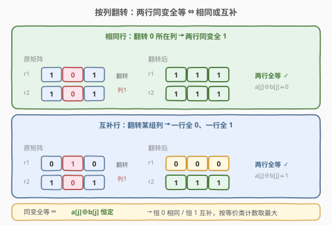
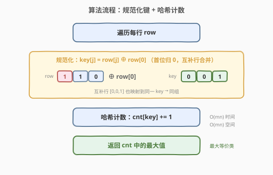
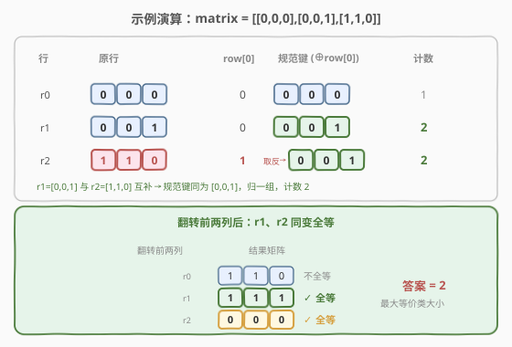

# LeetCode 按列翻转得到最大值等行数 题解

## 1. 题目概述

- **标题 / 题号**：按列翻转得到最大值等行数（#1072，medium）
- **链接**：https://leetcode.cn/problems/flip-columns-for-maximum-number-of-equal-rows/
- **难度**：中等
- **标签**：数组、哈希表、位运算

**题意**：给定 `m x n` 的 0-1 矩阵 `matrix`。你可以选出**任意数量的列**，并翻转这些列上的每个单元格（`0`→`1`，`1`→`0`）。一次翻转作用于选中列的**所有行**。返回经过若干次翻转后，**行内所有值都相等**的行的最大数量。

**示例 1**：

```text
输入：matrix = [[0,1],[1,1]]
输出：1
解释：不翻转时，第 2 行 [1,1] 已全等；任何翻转都无法让两行同时全等。
```

**示例 2**：

```text
输入：matrix = [[0,1],[1,0]]
输出：2
解释：翻转第 1 列后矩阵变为 [[0,0],[1,1]]，两行均全等。
```

**示例 3**：

```text
输入：matrix = [[0,0,0],[0,0,1],[1,1,0]]
输出：2
解释：翻转前两列后矩阵变为 [[1,1,0],[1,1,1],[0,0,0]]，后两行全等。
```

**约束**：

- `m == matrix.length`，`n == matrix[i].length`
- $1 \leq m, n \leq 300$
- `matrix[i][j]` 为 `0` 或 `1`

> 💡 关键点：翻转是「按列」操作，一次翻转同时改变所有行在该列的值。因此哪些行能**同时**变全等，取决于行与行之间的相对关系，而非各行自身——这是本题的破题眼。

## 2. 解题思路

### 2.1 暴力思路：枚举列翻转组合

最直白的暴力：枚举所有 $2^n$ 种列翻转组合，对每种组合扫描全等行数取最大。$n \leq 300$ 时 $2^{300}$ 完全不可行。

稍聪明的暴力：固定某一行 $i$ 为「要变全等」的基准，使其全等的翻转集合被唯一确定（翻转 $i$ 中 $0$ 所在列 → 全 $1$）；再统计该翻转下还有多少行也全等，即对每个 $i$ 扫描所有行 $k$ 判定能否共存，$O(m^2 n)$。对 $m, n \leq 300$ 约 $2.7 \times 10^7$ 可过，但**同一组行被反复统计**——这暴露出更强的结构：行之间的「能否共存」其实是一个等价关系，可一次性分组。

### 2.2 核心观察：同变全等 ⇔ 行相同或互补



设翻转集合为 $S$（$j \in S$ 表示翻转第 $j$ 列）。行 $r$ 翻转后全等，意味着 $r[j] \oplus [j \in S]$ 对所有 $j$ 为常数 $c_r \in \{0, 1\}$。

若两行 $a, b$ 在**同一**翻转 $S$ 下都变全等，则：

$$a[j] \oplus b[j] = \bigl(a[j] \oplus [j \in S]\bigr) \oplus \bigl(b[j] \oplus [j \in S]\bigr) = c_a \oplus c_b$$

对一切 $j$ 恒定。故 $a[j] \oplus b[j]$ 要么**恒为 0**（$a = b$，**相同行**），要么**恒为 1**（$a = \bar b$，**互补行**）。

反之亦然：相同行翻转其 $0$ 所在列可同变全 $1$；互补行翻转后一行全 $0$、一行全 $1$。因此：

> 💡 **结论**：两行能同变全等 $\iff$ 二者**相同或互补**。把「相同或互补」视作等价关系，答案就是**最大等价类**的大小。

### 2.3 规范化哈希计数

把每行映射到一个**规范键**，使「相同或互补」的行落到同一键：令 `key[j] = row[j] ^ row[0]`。这样规范键首位必为 $0$，行 $r$ 与其互补 $\bar r$（首位相反）恰好一个被取反、一个保持，取反后二者相同，故落到同一键。用哈希表计数，最大值即答案。



```text
1. cnt = 空哈希表
2. 对每行 row：
     key[j] = row[j] XOR row[0]      // 规范化：首位归 0，合并互补行
     cnt[key] += 1
3. 返回 cnt 中的最大值
```

### 2.4 示例演算



以示例 3 `matrix = [[0,0,0],[0,0,1],[1,1,0]]` 为例：

| 行 | 原行 | `row[0]` | 规范键 `key[j]=row[j]^row[0]` | 计数 |
|----|------|----------|-------------------------------|------|
| r0 | `[0,0,0]` | 0 | `[0,0,0]` | 1 |
| r1 | `[0,0,1]` | 0 | `[0,0,1]` | 2 |
| r2 | `[1,1,0]` | 1 | `[0,0,1]`（整行取反） | 2 |

第 r1、r2 行互为互补（`[0,0,1]` 与 `[1,1,0]`），规范键同为 `[0,0,1]`，可同变全等 → 答案 2。翻转前两列后，r1 变 `[1,1,1]`、r2 变 `[0,0,0]`，确实同时全等。

> ⚠️ 全 $0$ 行与全 $1$ 行也归同一组：全 $0$ 行键为全 $0$；全 $1$ 行首位为 $1$ 取反得全 $0$，键同为全 $0$。二者本就互补，可同变全等，归组正确。

## 3. 参考代码

### C++

```cpp
class Solution {
public:
    int maxEqualRowsAfterFlips(vector<vector<int>>& matrix) {
        unordered_map<string, int> cnt;
        int ans = 0;
        for (const auto& row : matrix) {
            string key;
            for (int x : row)
                key.push_back((x ^ row[0]) ? '1' : '0');
            ans = max(ans, ++cnt[key]);
        }
        return ans;
    }
};
```

### Python

```python
from collections import Counter
from typing import List

class Solution:
    def maxEqualRowsAfterFlips(self, matrix: List[List[int]]) -> int:
        cnt = Counter()
        for row in matrix:
            key = tuple(x ^ row[0] for x in row)
            cnt[key] += 1
        return max(cnt.values())
```

> 💡 代码要点：① 规范化用 `x ^ row[0]` 一行完成——首位必为 $0$，行与其互补自然合并为同一键；② C++ 用字符串键避免手写 `vector` 的哈希函数；③ 边计数边维护最大值，无需二次遍历哈希表。

## 4. 复杂度分析

| 维度 | 复杂度 | 说明 |
|------|--------|------|
| **时间** | $O(mn)$ | 遍历 $m$ 行，每行构造长度 $n$ 的键 |
| **空间** | $O(mn)$ | 哈希表存储 $m$ 个长度 $n$ 的键 |

> 💡 本解已是最优：每行至少要读一遍（$O(mn)$），构造键 unavoidable，故时间下界即 $O(mn)$。

## 5. 扩展：等价关系与不变量视角

「相同或互补」是一个真正的**等价关系**（自反、对称、传递），矩阵的行被划分成若干等价类：类内行可同变全等，类间不能共存。规范化相当于为每个等价类选定一个**规范代表**（首位为 $0$ 的那个）。

更本质地，行 $r$ 的「翻转不变量」是 $r[j] \oplus r[0]$——它消去了「整体取反」这一对称自由度。两个翻转集合若能使同一行全等，则二者互补（差集为全集），所以每个等价类恰对应一个不变量取值。这种「**消去对称自由度 → 哈希归类**」的思路，与「字母异位词分组」按排序键归类同构，是处理「带对称性的等价类计数」的通用范式。

## 6. 面试要点

**Q1：为什么「相同或互补」是两行同变全等的充要条件？**

> 必要性：同翻转 $S$ 下两行都全等，则 $a[j] \oplus b[j] = c_a \oplus c_b$ 恒定，故相同（恒 $0$）或互补（恒 $1$）。充分性：相同行翻转其 $0$ 所在列同变全 $1$；互补行翻转后一全 $0$ 一全 $1$，均全等。

**Q2：为什么 `x ^ row[0]` 就能合并互补行？**

> 行 $r$ 与 $\bar r$ 首位相反，恰一个被取反、一个保持，取反后二者相同，落到同一键；首位归 $0$ 还保证键唯一（每个等价类只有一种首位为 $0$ 的代表）。

**Q3：全 $0$ 行和全 $1$ 行会分到一组吗？**

> 会。全 $0$ 行键为全 $0$；全 $1$ 行首位为 $1$ 取反得全 $0$，键同为全 $0$。二者互补，可同变全等（一个全 $0$ 一个全 $1$），归组正确。

**Q4：能否不用哈希表、两两比较做到 $O(m^2 n)$？**

> 能：对每行 $i$ 算出使其全等的翻转集合，再统计同时全等的行数。$m, n \leq 300$ 时 $2.7 \times 10^7$ 可过，但哈希表 $O(mn)$ 更优且更简洁，且天然避免重复统计。

**Q5：为什么不能按行独立贪心「让尽量多的行全等」？**

> 翻转是**全局列**操作，让某行全等会约束翻转集合，进而影响其他行。各行并非独立，必须按等价类整体考虑——这正是本题最易踩的坑。

## 同类练习题

| # | 题目 | 与本题的关联 |
|---|------|-------------|
| 49 | [字母异位词分组](https://leetcode.cn/problems/group-anagrams/) | 排序/计数得规范键后归类，与本题「消去对称自由度 → 哈希分组」同构 |
| 1007 | [行相等的最少多米诺旋转](https://leetcode.cn/problems/min-domino-rotations-for-equal-row/) | 同样追求让一行全等，但用旋转而非翻转，约束不同，对照理解 |
| 318 | [最大单词长度乘积](https://leetcode.cn/problems/maximum-product-of-word-lengths/) | 用位掩码刻画每词特征，与本题键可二进制编码呼应 |
| 242 | [有效的字母异位词](https://leetcode.cn/problems/valid-anagram/) | 规范化（频次计数）后判定两对象是否等价，本题等价类判定的「单对」版 |
