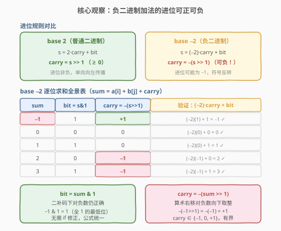
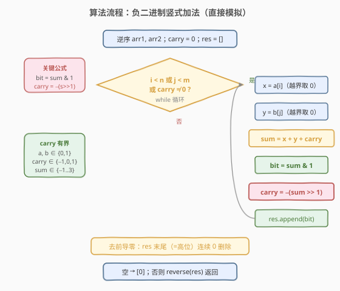
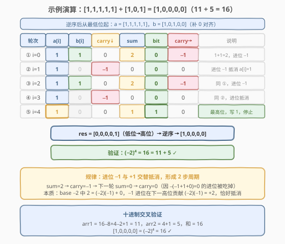

# LeetCode 负二进制数相加 题解

## 1. 题目概述

- **标题 / 题号**：负二进制数相加（#1073，medium）
- **链接**：https://leetcode.cn/problems/adding-two-negabinary-numbers/
- **难度**：中等
- **标签**：数学、数组、位运算

**题意**：给出基数为 $-2$ 的两个数 `arr1` 和 `arr2`，返回两数相加的结果。数字以数组形式给出：数组由若干 0 和 1 组成，按**最高有效位到最低有效位**的顺序排列。例如，`arr = [1,1,0,1]` 表示数字 $(-2)^3 + (-2)^2 + (-2)^0 = -3$。数组不含前导零（`arr == [0]` 或 `arr[0] == 1`）。返回相同表示形式的相加结果。

**示例 1**：

```text
输入：arr1 = [1,1,1,1,1], arr2 = [1,0,1]
输出：[1,0,0,0,0]
解释：arr1 表示 11，arr2 表示 5，输出表示 16。
      arr1 = (−2)⁴ + (−2)³ + (−2)² + (−2)¹ + (−2)⁰ = 16 − 8 + 4 − 2 + 1 = 11
      arr2 = (−2)² + (−2)⁰ = 4 + 1 = 5
      输出 = (−2)⁴ = 16
```

**示例 2**：

```text
输入：arr1 = [0], arr2 = [0]
输出：[0]
```

**示例 3**：

```text
输入：arr1 = [0], arr2 = [1]
输出：[1]
```

**约束**：

- $1 \leq \text{arr1.length}, \text{arr2.length} \leq 1000$
- `arr1[i]` 和 `arr2[i]` 都是 `0` 或 `1`
- `arr1` 和 `arr2` 都没有前导零

> 💡 **与 1017 的关系**：[1017. 负二进制转换](https://leetcode.cn/problems/convert-to-base-neg-2/) 解决的是「十进制 → base $-2$」的单向转换；本题是「base $-2$ + base $-2$ → base $-2$」的加法运算。一个自然的思路是：先转十进制、相加、再转回——但数组长度可达 1000，对应的十进制数远超 64 位整数范围，C++ 无法直接处理。因此需要**直接在 base $-2$ 下模拟加法**。

## 2. 解题思路

### 2.1 暴力思路：转十进制 → 相加 → 转回

最直觉的方案：

1. 将 `arr1`、`arr2` 分别转换为十进制整数 $n_1$、$n_2$（用 Horner 法：$n = -2 \cdot n + \text{bit}$）。
2. 相加得 $n = n_1 + n_2$。
3. 用 1017 题的「除 $-2$ 取余」将 $n$ 转回 base $-2$ 数组。

**Python 可行**（整数无限精度），但 **C++ 不可行**：数组长度达 1000 意味着数值可达 $2^{1000}$，远超 `long long` 范围，需要手写大整数。即便在 Python 中，转换也引入了不必要的 $O(n)$ 额外空间和两次完整遍历。

> 💡 转机在于：**加法的本质是逐位运算 + 进位传播**。无论是 base 2、base 10 还是 base $-2$，竖式加法的模板完全一样——从最低位起，逐位求和，处理进位。区别仅在于**进位的计算公式**因基数不同而异。

### 2.2 核心观察：直接模拟 + 进位可负



**关键性质**：在 base $-2$ 中，相邻位的权值比为 $-2$（即第 $i+1$ 位权值 $(-2)^{i+1} = -2 \cdot (-2)^i$）。设某位的原始和为 $s = a_i + b_j + \text{carry}$，需要将其分解为：

$$s = (-2) \cdot \text{carry}_{\text{new}} + \text{bit}, \quad \text{bit} \in \{0, 1\}$$

由此解出：

$$\text{bit} = s \mathbin{\&} 1, \qquad \text{carry}_{\text{new}} = -(s \gg 1)$$

**与 base 2 的核心区别**：base 2 中 $\text{carry} = s \gg 1$（恒非负）；base $-2$ 中 $\text{carry} = -(s \gg 1)$，**可以为负**！

| $s$ | $\text{bit} = s \mathbin{\&} 1$ | $\text{carry} = -(s \gg 1)$ | 验证 $(-2)\cdot\text{carry} + \text{bit}$ |
|-----|------|------|------|
| $-1$ | $1$ | $+1$ | $(-2)(1) + 1 = -1$ ✓ |
| $0$ | $0$ | $0$ | $0$ ✓ |
| $1$ | $1$ | $0$ | $1$ ✓ |
| $2$ | $0$ | $-1$ | $(-2)(-1) + 0 = 2$ ✓ |
| $3$ | $1$ | $-1$ | $(-2)(-1) + 1 = 3$ ✓ |

> ⚠️ **为什么 `s & 1` 对负数也正确？** 在二补码表示下，$-1$ 的二进制为全 $1$（`...11111111`），故 $-1 \mathbin{\&} 1 = 1$。`-(s >> 1)` 中，算术右移对负数向下取整（$-1 \gg 1 = -1$），故 $-(-1) = +1$。公式在 Python 和 C++（C++20 起保证算术右移）中均正确，**无需任何 if 修正**。

> 💡 **carry 有界**：$a_i, b_j \in \{0, 1\}$，$\text{carry} \in \{-1, 0, 1\}$，故 $s \in \{-1, 0, 1, 2, 3\}$，carry 始终保持在 $\{-1, 0, 1\}$ 范围内——状态极简，无需处理大进位。

### 2.3 算法流程图



```text
1. 逆序 arr1, arr2（从最低位起扫描）；carry = 0; res = []
2. while i < len(a) 或 j < len(b) 或 carry != 0:
     x = a[i]（越界取 0）
     y = b[j]（越界取 0）
     s = x + y + carry
     bit = s & 1
     carry = -(s >> 1)
     res.append(bit)
     i++; j++
3. 去前导零：从 res 末尾（=高位）起删除连续 0
4. 若 res 为空 → 返回 [0]；否则逆序 res 返回
```

> ⚠️ **循环条件**必须包含 `carry != 0`：即使两个数组都扫完，残留的 carry 仍需写入。特别注意 carry $= -1$ 时，`-(−1 ≫ 1) = −(−1) = 1`，下一轮 $s = 0 + 0 + 1 = 1$，写 1、carry 归 0——**最多多走 2 步**即可收敛。

### 2.4 示例演算

以 `arr1 = [1,1,1,1,1]`、`arr2 = [1,0,1]` 为例（$11 + 5 = 16$）：



逆序后从最低位起：$a = [1,1,1,1,1]$，$b = [1,0,1,0,0]$（补 0 对齐）

| 轮次 | $a[i]$ | $b[i]$ | carry↓ | $s$ | bit | carry→ | 说明 |
|------|--------|--------|--------|-----|-----|--------|------|
| ① $i=0$ | 1 | 1 | 0 | 2 | 0 | $-1$ | $1+1=2$，进位 $-1$ |
| ② $i=1$ | 1 | 0 | $-1$ | 0 | 0 | 0 | 进位 $-1$ 抵消 $a[i]=1$ |
| ③ $i=2$ | 1 | 1 | 0 | 2 | 0 | $-1$ | 同 ① |
| ④ $i=3$ | 1 | 0 | $-1$ | 0 | 0 | 0 | 同 ② |
| ⑤ $i=4$ | 1 | 0 | 0 | 1 | 1 | 0 | 最高位，写 1，停止 |

$\text{res} = [0,0,0,0,1]$（低位→高位）→ 逆序 → $[1,0,0,0,0]$

验证：$(-2)^4 = 16 = 11 + 5$ ✓

> 💡 **进位抵消规律**：$s=2$ 产生 carry $= -1$，下一轮该 carry 贡献 $-1$ 到 $s$，使 $s = 1 + 0 + (-1) = 0$，carry 归 0。本质是 base $-2$ 中 $2 = (-2)(-1) + 0$，$-1$ 进位在下一高位贡献 $(-2)(-1) = +2$，恰好与当前的 $+2$ 抵消——**进位 −1 与下一位的 +1 形成两步自抵消周期**。

## 3. 参考代码

### C++

```cpp
class Solution {
public:
    vector<int> addNegabinary(vector<int>& arr1, vector<int>& arr2) {
        reverse(arr1.begin(), arr1.end());
        reverse(arr2.begin(), arr2.end());
        int n = arr1.size(), m = arr2.size();
        vector<int> res;
        int carry = 0;
        for (int i = 0; i < n || i < m || carry != 0; i++) {
            int x = (i < n) ? arr1[i] : 0;
            int y = (i < m) ? arr2[i] : 0;
            int s = x + y + carry;
            int bit = s & 1;
            carry = -(s >> 1);
            res.push_back(bit);
        }
        while (res.size() > 1 && res.back() == 0) {
            res.pop_back();
        }
        reverse(res.begin(), res.end());
        return res;
    }
};
```

> ⚠️ **C++ 注意**：`s >> 1` 对负数是算术右移（符号扩展），在 C++20 标准下是良定义的，在 C++11/14/17 中虽为实现定义但主流编译器（GCC/Clang/MSVC）均做算术右移。`s & 1` 对负数取最低位，在二补码下恒 $\in \{0, 1\}$。若需严格可移植，可用 `((s % 2) + 2) % 2` 替代 `s & 1`，用 `-(s / 2)` 替代 `-(s >> 1)`（C++ 截断除法对负数向零取整，需验证）。

### Python

```python
class Solution:
    def addNegabinary(self, arr1: List[int], arr2: List[int]) -> List[int]:
        a, b = arr1[::-1], arr2[::-1]
        n, m = len(a), len(b)
        res = []
        carry = 0
        for i in range(max(n, m) + 1):
            if i >= n and i >= m and carry == 0:
                break
            x = a[i] if i < n else 0
            y = b[i] if i < m else 0
            s = x + y + carry
            res.append(s & 1)
            carry = -(s >> 1)
        while len(res) > 1 and res[-1] == 0:
            res.pop()
        return res[::-1]
```

> 💡 **Python 优势**：整数无限精度，`s >> 1` 对负数做算术右移（向负无穷取整），`-(s >> 1)` 等价于「除以 $-2$ 并自动修正余数」。`s & 1` 对负数也正确（二补码语义）。无需处理溢出或语言差异。
>
> **循环上界**：`range(max(n, m) + 1)` 保证至少多走 1 步处理可能的残留 carry。由于 carry $= -1$ 最多再传播 1 步（$-1 \to +1 \to 0$），`+1` 足够；更安全的写法是用 `while` 循环配合 `carry != 0` 条件。

## 4. 复杂度分析

| 维度 | 复杂度 | 说明 |
|------|--------|------|
| 时间复杂度 | $O(n + m)$ | 遍历两个数组的每一位。循环次数 $\leq \max(n, m) + 2$（carry 残留最多多 2 步），每步 $O(1)$ |
| 空间复杂度 | $O(n + m)$ | 结果数组长度 $\leq \max(n, m) + 2$。逆序操作可在原数组上进行（C++ `reverse` 原地），但结果数组本身需额外空间 |

> 💡 与「转十进制」方案对比：转十进制方案在 Python 中也是 $O(n + m)$ 时间，但需要 $O(n)$ 额外空间存储中间大整数，且两次进制转换各有常数开销。直接模拟方案只需一次遍历，常数更优，且在 C++ 中也适用。

## 5. 扩展：进位传播的终止性

> **问题**：carry 可以为 $-1$，而 $-1$ 进位会产生新的 $+1$ carry（$-(-1 \gg 1) = 1$），$+1$ carry 又可能产生 $-1$……进位是否会无限传播？

**结论**：不会。carry 始终在 $\{-1, 0, 1\}$ 中有界，且在两数组扫完后最多传播 2 步即归零。

**证明**：两数组扫完后（$a_i = b_j = 0$），状态转移仅依赖 carry：

| carry | $s = 0 + 0 + \text{carry}$ | bit | 新 carry |
|-------|-----|------|------|
| $0$ | $0$ | $0$ | $0$（终止） |
| $1$ | $1$ | $1$ | $0$（终止） |
| $-1$ | $-1$ | $1$ | $+1$ |

- carry $= 0$ 或 $+1$：一步内归零。
- carry $= -1$：第一步产生 $+1$，第二步 $+1$ 归零。

故两数组扫完后**最多多走 2 步**，算法必然终止。结果长度 $\leq \max(n, m) + 2$。

> 💡 这与 base 2 加法中「最高位进位最多多走 1 步」类似，只是 base $-2$ 因 carry 可负，最坏多走 2 步。

## 6. 面试要点

1. **base $-2$ 加法与 base 2 加法的核心区别是什么？**

   - base 2 中 $\text{carry} = s \gg 1$（恒非负），进位单向向左传播。base $-2$ 中 $\text{carry} = -(s \gg 1)$，**可以为负**。当 $s \geq 2$ 时 carry $= -1$（而非 $+1$），因为 $(-2)(-1) = +2$ 补偿了当前位的溢出。这使得进位方向「反转」——正溢出产生负进位，负进位在下一高位贡献正值。

2. **为什么 `bit = s & 1` 和 `carry = -(s >> 1)` 对负数也正确？**

   - 二补码下 $-1$ 表示为全 $1$（`...11111111`），故 $-1 \mathbin{\&} 1 = 1$。算术右移 $-1 \gg 1 = -1$（向下取整），故 $-(-1) = +1$。这两个操作在 Python 和 C++（C++20 保证）中均给出正确结果，无需 if 分支修正。

3. **为什么不能直接转十进制相加再转回？**

   - 数组长度可达 1000，对应数值可达 $2^{1000}$，远超 64 位整数范围。Python 有无限精度可以这样做，但 C++ 需要手写大整数，不实际。直接在 base $-2$ 下模拟加法只需 $O(1)$ 的 carry 状态，适用于所有语言。

4. **循环条件为什么需要 `carry != 0`？**

   - 两数组扫完后，残留的 carry 仍需写入结果。carry $= 1$ 时多写一位 1；carry $= -1$ 时先写 1（carry 变 $+1$），再写 1（carry 归 0），共多 2 步。若漏掉此条件，会丢失最高位。

5. **去前导零时从哪端删？为什么？**

   - res 是**低位在前**的（因为从最低位起append），所以 res 的**末尾是高位**。前导零出现在高位 = res 末尾的连续 0。故从 `res.back()` 起向前删除。若删到只剩一个元素，保留 `[0]`（表示数值 0）。

## 同类练习题

| # | 题目 | 与本题的关联 |
|---|------|-------------|
| 1017 | [负二进制转换](https://leetcode.cn/problems/convert-to-base-neg-2/)（[题解](../1001-1100/1017_负二进制转换.md)） | 十进制 → base $-2$ 的单向转换，本题的逆运算基础。掌握了 1017 的「除 $-2$ 取余 + 位运算捷径」，本题的 `carry = -(s >> 1)` 公式即为其自然延伸 |
| 67 | [二进制求和](https://leetcode.cn/problems/add-binary/) | base 2 的竖式加法模板（`carry = s >> 1`），与本题对比可清晰看到正基数与负基数进位公式的差异——仅差一个负号 |
| 415 | [字符串相加](https://leetcode.cn/problems/add-strings/) | base 10 的竖式加法，进位 `carry = s / 10`、`bit = s % 10`。三道题构成「不同基数下的竖式加法」系列，核心模板一致，仅基数不同 |
| 2 | [两数相加](https://leetcode.cn/problems/add-two-numbers/) | 链表形式的 base 10 加法（每位 0–9），与本题同为「逐位相加 + 进位传播」范式，但数据结构和基数不同 |
| 504 | [七进制数](https://leetcode.cn/problems/base-7/) | 正基数进制转换，与 1017 对比理解正基数与负基数的转换差异，进而在本题中理解为什么负基数的加法进位也会变号 |
