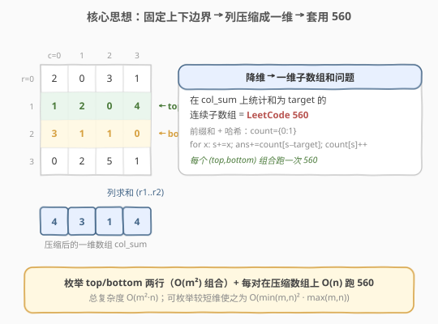
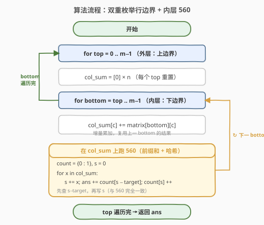
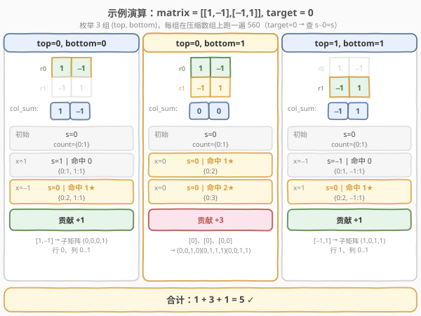

# LeetCode 元素和为目标值的子矩阵数量 题解

## 1. 题目概述

- **标题 / 题号**：元素和为目标值的子矩阵数量（#1074，hard）
- **链接**：https://leetcode.cn/problems/number-of-submatrices-that-sum-to-target/
- **难度**：困难
- **标签**：数组、哈希表、矩阵、前缀和

**题意**：给定一个 `m × n` 的整数矩阵 `matrix` 和一个整数 `target`，返回元素之和等于 `target` 的**非空子矩阵的数量**。

子矩阵 `(x1, y1, x2, y2)` 是由所有满足 `x1 <= x <= x2` 且 `y1 <= y <= y2` 的格子 `matrix[x][y]` 组成的矩形区域。

**示例 1**：

```text
输入：matrix = [[0,1,0],[1,1,1],[0,1,0]], target = 0
输出：4
解释：四个 1×1 的子矩阵（四个角上的 0）元素和为 0。
```

**示例 2**：

```text
输入：matrix = [[1,-1],[-1,1]], target = 0
输出：5
解释：和为 0 的子矩阵共有 5 个：
  (0,0,0,1): 1 + (−1) = 0
  (1,0,1,1): −1 + 1 = 0
  (0,0,1,0): 1 + (−1) = 0
  (0,1,1,1): −1 + 1 = 0
  (0,0,1,1): 整个 2×2 = 1−1−1+1 = 0
```

**示例 3**：

```text
输入：matrix = [[904]], target = 0
输出：0
```

**约束**：

- `1 <= matrix.length <= 100`
- `1 <= matrix[i].length <= 100`
- `-1000 <= matrix[i][j] <= 1000`
- `-10^8 <= target <= 10^8`

> ⚠️ 注意：矩阵元素可能为**负数**，子矩阵和不具有单调性，因此不能像全正数那样用滑动窗口收缩；需要借助**前缀和 + 哈希**的思路，把二维问题降维成一维经典题。

## 2. 解题思路

### 2.1 暴力思路：枚举四个角 + 二维前缀和

一个子矩阵由「上、下、左、右」四条边界确定。朴素做法是四重循环枚举 `(top, bottom, left, right)`，再用 [二维前缀和](../0301-0400/304_二维区域和检索 - 数组不可变.md) 在 $O(1)$ 内算出该子矩阵的和，总复杂度 $O(m^2 n^2)$。当 $m = n = 100$ 时约 $10^8$ 次操作，会超时。

> 💡 关键瓶颈：四条边界都自由枚举，组合数太多。需要**固定其中两条边界**，把问题降成一维。

### 2.2 核心观察：固定上下边界 → 列压缩成一维 → 套用 560



**两步降维**：

1. **固定上下边界** `top` 和 `bottom`（$O(m^2)$ 对组合）。对每一列 `c`，把 `top..bottom` 行该列的元素累加，得到一个长度为 `n` 的一维数组 `col_sum`。

   $$
   \text{col\_sum}[c] = \sum_{r=\text{top}}^{\text{bottom}} \text{matrix}[r][c]
   $$

2. 此时，**任何一个左右边界 `[left, right]` 对应的子矩阵和，就等于 `col_sum` 中子数组 `col_sum[left..right]` 的和**。于是「在固定上下边界下数和为 `target` 的子矩阵」完全等价于「在一维数组 `col_sum` 上数和为 `target` 的子数组」——这正是 [560. 和为 K 的子数组](../0501-0600/560_和为K的子数组.md)。

> 💡 **关键转化**：把四维枚举 $(\text{top}, \text{bottom}, \text{left}, \text{right})$ 拆成「二维枚举行边界 + 一维哈希查列边界」。行边界仍枚举（$O(m^2)$），但列边界交给 560 的前缀和 + 哈希在 $O(n)$ 内一次性统计完，避免了 $O(n^2)$ 的列枚举。

**增量优化**：固定 `top` 后，让 `bottom` 从 `top` 递增延伸，每次只需把新行 `matrix[bottom][c]` 累加进 `col_sum[c]`，无需为每对 `(top, bottom)` 重新求和。这样每对组合的列压缩是 $O(n)$（摊到每行增量 $O(n)$）。

### 2.3 算法流程图



内层那段「在 `col_sum` 上跑 560」与 [560](../0501-0600/560_和为K的子数组.md) 逐字一致：

- 哈希表 `count` 初始化 `{0: 1}`（空前缀，对应 `left = 0` 起的子数组）；
- 维护前缀和 `s`，每读入 `col_sum` 的一个元素：先 `ans += count[s - target]`，再 `count[s]++`（**先查再写**）。

### 2.4 示例演算

以示例 2 `matrix = [[1,-1],[-1,1]], target = 0` 为例，共 3 组 `(top, bottom)`：



| (top, bottom) | col_sum | 560 命中（target=0 → 查 `s−0=s`） | 贡献 | 对应子矩阵 |
|---------------|---------|-----------------------------------|------|-----------|
| (0, 0) | `[1, −1]` | 扫到 `s=0` 时命中 `count[0]=1` | 1 | (0,0,0,1)：行 0 全列 |
| (0, 1) | `[0, 0]` | 第 1 个 0 命中 1，第 2 个 0 命中 2 | 3 | (0,0,1,0)、(0,1,1,1)、(0,0,1,1) |
| (1, 1) | `[−1, 1]` | 扫到 `s=0` 时命中 `count[0]=1` | 1 | (1,0,1,1)：行 1 全列 |

合计 $1 + 3 + 1 = 5$，与示例 2 一致。✓

> 💡 注意 `(0,1)` 这组：`col_sum = [0, 0]`，两个 0 各自构成一个和为 0 的子数组（对应单列的 2×1 子矩阵），合起来又构成一个和为 0 的 2×2 子矩阵，共 3 个——这正是 560 里「同一前缀和出现多次」带来的组合计数。

## 3. 参考代码

### C++

```cpp
class Solution {
  public:
    int numSubmatrixSumTarget(vector<vector<int>>& matrix, int target) {
        int m = matrix.size(), n = matrix[0].size();
        int ans = 0;
        for (int top = 0; top < m; ++top) {
            vector<int> col_sum(n, 0); // 每个 top 重置
            for (int bottom = top; bottom < m; ++bottom) {
                // 增量累加新行，复用上一 bottom 的结果
                for (int c = 0; c < n; ++c)
                    col_sum[c] += matrix[bottom][c];
                // 在一维 col_sum 上数和为 target 的子数组（即 560）
                unordered_map<int, int> cnt;
                cnt[0] = 1;
                int s = 0;
                for (int x : col_sum) {
                    s += x;
                    if (cnt.count(s - target))
                        ans += cnt[s - target];
                    cnt[s]++;
                }
            }
        }
        return ans;
    }
};
```

### Python（枚举较短维以进一步优化）

```python
class Solution:
    def numSubmatrixSumTarget(self, matrix: List[List[int]], target: int) -> int:
        m, n = len(matrix), len(matrix[0])
        # 枚举较短维作"上下边界"，压缩较长维 → O(min(m,n)^2 * max(m,n))
        # 转置不改变子矩阵计数，答案不变
        if m > n:
            matrix = [list(col) for col in zip(*matrix)]
            m, n = n, m

        ans = 0
        for top in range(m):
            col_sum = [0] * n  # 每个 top 重置
            for bottom in range(top, m):
                # 增量累加新行
                for c in range(n):
                    col_sum[c] += matrix[bottom][c]
                # 在一维 col_sum 上数和为 target 的子数组（即 560）
                count = {0: 1}
                s = 0
                for x in col_sum:
                    s += x
                    ans += count.get(s - target, 0)
                    count[s] = count.get(s, 0) + 1
        return ans
```

> 💡 **转置优化**：子矩阵计数对转置不变（原矩阵的一个子矩阵转置后仍是转置矩阵的一个子矩阵），所以当 $m > n$ 时先把矩阵转置，让「上下边界」枚举落在较短维上，复杂度从 $O(m^2 n)$ 降到 $O(\min(m,n)^2 \cdot \max(m,n))$。对 $100 \times 100$ 的方阵无差别，但对长方矩阵收益明显。

## 4. 复杂度分析

| 维度 | 复杂度 | 说明 |
|------|--------|------|
| 时间复杂度 | $O(m^2 \cdot n)$ | 枚举 `(top, bottom)` 共 $O(m^2)$ 对；每对增量列累加 $O(n)$ + 内层 560 一次 $O(n)$ |
| 时间复杂度（转置后） | $O(\min(m,n)^2 \cdot \max(m,n))$ | 让较短维承担平方枚举 |
| 空间复杂度 | $O(n)$ | `col_sum` 数组 $O(n)$ + 哈希表最坏 $O(n)$ 个键（转置后取较长维） |

> ⚠️ 内层 560 的哈希表每对 `(top, bottom)` 都新建一次，但生命周期仅在该对内，峰值空间仍是 $O(n)$。若要进一步压常数，C++ 可在 `top` 循环外复用同一哈希表并每对 `clear()`，但需注意 `clear()` 不缩容——通常直接新建更省心。

## 5. 扩展：与一维 560 / 二维前缀和的关系

本题是 [560](../0501-0600/560_和为K的子数组.md) 在二维的自然推广，也是 [304. 二维前缀和](../0301-0400/304_二维区域和检索 - 数组不可变.md) 的「计数」变体：

- **304**：矩阵不可变 + **单次**查询子矩阵和 → 二维前缀和 $O(1)$ 查询。
- **560**：一维数组 + **计数**和为 `k` 的子数组 → 前缀和 + 哈希 $O(n)$。
- **1074（本题）**：二维矩阵 + **计数**和为 `target` 的子矩阵 → 固定行边界降成一维，再套 560。

> 💡 **降维套路**：「固定一维边界 + 在另一维跑一维算法」是矩阵题的通用武器。同类还有 [363. 矩阵区域和不超过 K 的最大值](https://leetcode.cn/problems/max-sum-of-rectangle-no-larger-than-k/)（固定行边界 + 一维「和不超过 K 的最大子数组和」，用有序集合前驱查询），把 560 的「等于」换成「不超过」即可对照学习。

## 6. 面试要点

1. **为什么固定上下边界而不是左右边界？**
   - 二者等价。习惯上固定「行边界」、压缩「列」成一维数组。若 $m > n$，可先转置让较短维当行边界，降低平方项。

2. **为什么不能直接用二维前缀和 + 四重循环？**
   - 四重枚举 $(\text{top}, \text{bottom}, \text{left}, \text{right})$ 是 $O(m^2 n^2)$，$100 \times 100$ 时约 $10^8$，会超时。固定行边界后，列边界交给 560 的哈希在 $O(n)$ 内统计，总复杂度降到 $O(m^2 n) \approx 10^6$。

3. **`col_sum` 为什么用增量累加而不是每对重新求和？**
   - 固定 `top` 后 `bottom` 递增，新 `col_sum` 只比旧的多一行，增量累加是 $O(n)$；若每对重新双重循环求和则 $O(n \cdot (\text{bottom}-\text{top}))$，常数更大。增量法让「枚举行对 + 列压缩」整体仍为 $O(m^2 n)$。

4. **内层 560 为什么要 `{0: 1}` 初始化且「先查再写」？**
   - `{0: 1}` 表示「空前缀和为 0」出现过一次，用于匹配从 `left = 0` 起的子数组；「先查 `s − target` 再写 `s`」保证起点严格在终点之前，避免把空子数组计入。与 [560](../0501-0600/560_和为K的子数组.md) 完全一致。

5. **转置为什么不改变答案？**
   - 原矩阵中和为 `target` 的子矩阵 `(r1,r2,c1,c2)` 转置后变成 `(c1,c2,r1,r2)`，仍是一个和为 `target` 的子矩阵，一一对应，计数不变。

## 同类练习题

| # | 题目 | 与本题的关联 |
|---|------|-------------|
| 560 | [和为 K 的子数组](https://leetcode.cn/problems/subarray-sum-equals-k/)（[题解](../0501-0600/560_和为K的子数组.md)） | 一维母题，本题内层那段 560 的来源 |
| 304 | [二维区域和检索 - 数组不可变](https://leetcode.cn/problems/range-sum-query-2d-immutable/)（[题解](../0301-0400/304_二维区域和检索 - 数组不可变.md)） | 二维前缀和基础，对照「单次查询」与「计数」的取舍 |
| 974 | [和可被 K 整除的子数组](https://leetcode.cn/problems/subarray-sums-divisible-by-k/)（[题解](../0901-1000/974_和可被K整除的子数组.md)） | 一维前缀和 + 哈希的变体（同余代替相等），可照搬到本题内层 |
| 363 | [矩阵区域和不超过 K 的最大值](https://leetcode.cn/problems/max-sum-of-rectangle-no-larger-than-k/) | 同样「固定行边界降维」，内层换成「不超过 K 的最大子数组和」（有序集合前驱查询） |
| 1292 | [元素和小于等于阈值的正方形边长](https://leetcode.cn/problems/maximum-side-length-of-a-square-with-sum-less-than-or-equal-to-threshold/) | 二维前缀和 + 二分边长，降维与阈值判定的另一组合 |
