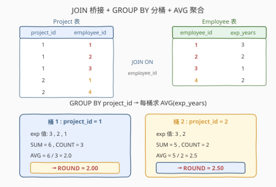
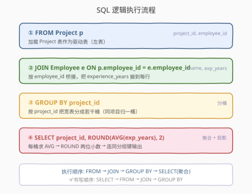
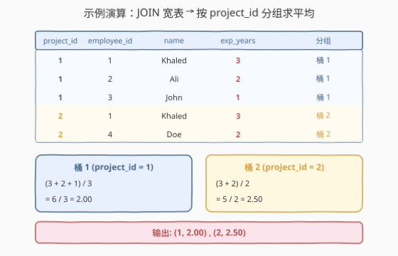

# LeetCode 项目员工 I 题解

## 1. 题目概述

- **标题 / 题号**：项目员工 I（#1075，easy）
- **链接**：https://leetcode.cn/problems/project-employees-i/
- **难度**：简单
- **标签**：SQL、数据库、JOIN、GROUP BY、聚合函数、AVG、ROUND

**题意**：给定 `Project` 表（项目-员工关系）与 `Employee` 表（员工信息），编写 SQL 查询，返回**每一个项目中员工的平均工作年限**，精确到小数点后两位。结果顺序不限。

**表结构**：

```text
表：Project
+-------------+---------+
| 列名        | 类型    |
+-------------+---------+
| project_id  | int     |
| employee_id | int     |  ← 外键 → Employee.employee_id
+-------------+---------+
(project_id, employee_id) 是该表的主键（唯一值组合）。
employee_id 是关联到 Employee 表的外键。
每行表示某 employee_id 的员工正在 project_id 的项目上工作。

表：Employee
+------------------+---------+
| 列名             | 类型    |
+------------------+---------+
| employee_id      | int     |  ← 主键
| name             | varchar |
| experience_years | int     |
+------------------+---------+
employee_id 是该表的主键。数据保证 experience_years 非空。
每行包含一个员工的信息。
```

**示例 1**：

```text
输入：
Project 表
+-------------+-------------+
| project_id  | employee_id |
+-------------+-------------+
| 1           | 1           |
| 1           | 2           |
| 1           | 3           |
| 2           | 1           |
| 2           | 4           |
+-------------+-------------+
Employee 表
+-------------+--------+------------------+
| employee_id | name   | experience_years |
+-------------+--------+------------------+
| 1           | Khaled | 3                |
| 2           | Ali    | 2                |
| 3           | John   | 1                |
| 4           | Doe    | 2                |
+-------------+--------+------------------+
输出：
+-------------+---------------+
| project_id  | average_years |
+-------------+---------------+
| 1           | 2.00          |
| 2           | 2.50          |
+-------------+---------------+
解释：项目 1 中员工平均工作年限 = (3 + 2 + 1) / 3 = 2.00；
      项目 2 中员工平均工作年限 = (3 + 2) / 2 = 2.50。
```

**约束**：

- `(project_id, employee_id)` 为 `Project` 表主键
- `employee_id` 为 `Employee` 表主键，`Project.employee_id` 为指向 `Employee` 的外键
- `experience_years` 保证非空
- 平均年限精确到小数点后两位（即 `ROUND(x, 2)`）
- 结果列须为 `project_id`、`average_years`，顺序不限

> 💡 本题是 SQL **「JOIN + GROUP BY + 聚合」母题**——把分散在两张表的信息先拼到一起（JOIN），再按某个维度分桶（GROUP BY），最后对每桶算一个统计值（AVG）。所有"分组求平均/求和/求最值"的报表需求都从这一题衍生。

## 2. 解题思路

### 2.1 暴力思路：按项目手工累加

最直觉的过程式思路是：把 `Project` 与 `Employee` 按 `employee_id` 拼起来，得到一张带 `experience_years` 的宽表；然后**按 `project_id` 排序**，顺序扫描，维护每个项目的「年限之和」与「人数」两个累加器，扫完一组就做一次除法并保留两位小数输出。这是**分组聚合的手工模拟**，时间复杂度 $O(m \log m)$（排序主导，$m$ = Project 行数）。

这能解决问题，但把分组逻辑写成了命令式循环——SQL 的哲学是**声明式**：你只需描述"按什么分组"和"每组算什么"，引擎自己选最优执行计划（流式聚合、哈希分组、排序分组等）。

### 2.2 核心观察：JOIN 桥接 + GROUP BY 分桶 + AVG 聚合



这道题拆成三步，每一步对应一个 SQL 子句：

**第一步：JOIN —— 把 `experience_years` 搬到 Project 行**

`experience_years` 只存在于 `Employee` 表，而 `project_id` 只存在于 `Project` 表——要把它们拼到同一行，必须找到两表共有的列作为"桥"。`employee_id` 正是这座桥：

- `Project.employee_id`（外键）→ 指向 `Employee.employee_id`（主键）
- 拼接条件：`p.employee_id = e.employee_id`

> 因为 `Project.employee_id` 是外键，每条 Project 行一定能匹配到一个 Employee，`INNER JOIN` 与 `LEFT JOIN` 结果相同（不会有 NULL 丢失）。

**第二步：GROUP BY project_id —— 按项目分桶**

JOIN 后的宽表每行是"某员工参与某项目一年"。我们要的是**每个项目**的平均，于是按 `project_id` 把行分成若干"桶"——同一 `project_id` 的所有行归入一桶。

> ⚠️ 注意：同一个员工（如 employee_id=1 的 Khaled）可同时出现在多个项目中。在**每个项目内部**他被独立计数一次——这正是我们想要的，而非"全局去重"。

**第三步：AVG + ROUND —— 每桶算平均并保留两位小数**

对每桶的 `experience_years` 求平均：$\text{AVG} = \frac{\sum \text{experience\_years}}{\text{桶内行数}}$，再用 `ROUND(x, 2)` 截到两位小数。

> 💡 `AVG()` 自动忽略 `NULL`（分母 = 非空值个数）。本题约束保证 `experience_years` 非空，故分母恰为桶内行数；若允许 `NULL`，需想清楚"忽略 NULL 求平均"是否符合业务预期。

### 2.3 算法流程图



SQL 的**逻辑执行顺序**与书写顺序不同：

```text
书写顺序：SELECT → FROM → JOIN → GROUP BY
执行顺序：FROM → JOIN ON → GROUP BY → SELECT(聚合)
```

1. **FROM Project p**：加载 Project 表作为驱动表。
2. **JOIN Employee e ON p.employee_id = e.employee_id**：按 `employee_id` 匹配，把 `experience_years`、`name` 拼到每条 Project 行。得到宽表行：`project_id, employee_id, name, experience_years`。
3. **GROUP BY project_id**：按 `project_id` 把宽表分成若干桶（项目 1 一桶、项目 2 一桶……）。
4. **SELECT project_id, ROUND(AVG(experience_years), 2)**：对每桶的 `experience_years` 求 `AVG`，再 `ROUND` 到两位小数，连同分组键 `project_id` 一起输出。

> 💡 `SELECT` 里出现的列分两类：要么是**分组键**（`project_id`，每桶单值），要么是**对桶内多值的聚合**（`AVG(experience_years)`）。非分组键又未聚合的裸列（如 `name`）无法出现在 `SELECT`——这是 SQL 的"分组一致性"约束。

### 2.4 示例演算



以示例数据为例，JOIN 后的宽表按 `project_id` 分两组：

| project_id | employee_id | name | experience_years | 分组 |
|------------|-------------|--------|------------------|------|
| 1 | 1 | Khaled | 3 | 桶 1 |
| 1 | 2 | Ali | 2 | 桶 1 |
| 1 | 3 | John | 1 | 桶 1 |
| 2 | 1 | Khaled | 3 | 桶 2 |
| 2 | 4 | Doe | 2 | 桶 2 |

每桶计算：

| 桶（project_id） | 年限求和 | 人数 | AVG | ROUND(,2) | 输出 |
|------------------|----------|------|-----|-----------|------|
| 1 | 3 + 2 + 1 = 6 | 3 | 6 / 3 = 2.0 | 2.00 | `1, 2.00` |
| 2 | 3 + 2 = 5 | 2 | 5 / 2 = 2.5 | 2.50 | `2, 2.50` |

> ⚠️ 注意 employee_id=1（Khaled，3 年）**同时出现在两个桶**中——他在项目 1 和项目 2 各被计数一次。这是正确的：我们算的是"每个项目里员工的平均资历"，而非"全局每个员工的平均资历"。

## 3. 参考代码

### SQL

```sql
SELECT project_id,
       ROUND(AVG(experience_years), 2) AS average_years
FROM Project p
JOIN Employee e ON p.employee_id = e.employee_id
GROUP BY project_id;
```

> 💡 **写法要点**：
> - `JOIN` 默认即 `INNER JOIN`，可省略 `INNER`。连接条件 `ON p.employee_id = e.employee_id` 用共有列桥接两表。
> - `GROUP BY project_id` 按项目分桶；`SELECT` 中的 `project_id` 是分组键，`AVG(...)` 是桶内聚合，二者都满足分组一致性约束。
> - `ROUND(AVG(...), 2)` 先聚合后取整：`AVG` 先算出平均（可能是多位小数），`ROUND` 再截到两位。注意顺序——不能先 `ROUND` 每个值再 `AVG`，那会改变结果。
> - 别名 `average_years` 必须与题目要求的输出列名一致。

### SQL（显式前缀写法，更严谨）

```sql
SELECT p.project_id,
       ROUND(AVG(e.experience_years), 2) AS average_years
FROM Project p
JOIN Employee e ON p.employee_id = e.employee_id
GROUP BY p.project_id;
```

> 💡 面试中推荐显式写前缀——`experience_years` 虽只在 Employee 表，但加 `e.` 前缀可一眼看出来源，避免后续表结构变更引入同名列时的隐蔽 bug。`GROUP BY p.project_id` 与 `SELECT p.project_id` 须保持一致（部分严格 SQL 模式下 `SELECT` 的分组键前缀必须与 `GROUP BY` 对应）。

### Python（pandas）

```python
import pandas as pd

def project_employees_i(project: pd.DataFrame, employee: pd.DataFrame) -> pd.DataFrame:
    merged = project.merge(employee, on='employee_id')
    avg = merged.groupby('project_id', as_index=False)['experience_years'].mean()
    avg['experience_years'] = avg['experience_years'].round(2)
    return avg.rename(columns={'experience_years': 'average_years'})
```

> 💡 **pandas 对照**：`merge(employee, on='employee_id')` 对应 SQL 的 `JOIN ... ON employee_id`（默认 `how='inner'`）；`groupby('project_id')['experience_years'].mean()` 对应 `GROUP BY project_id` + `AVG(experience_years)`；`.round(2)` 对应 `ROUND(, 2)`。注意 `groupby` 后用 `as_index=False` 让 `project_id` 保持为普通列而非索引，便于 `rename` 与输出。

## 4. 复杂度分析

| 维度 | 复杂度 | 说明 |
|------|--------|------|
| 时间复杂度 | $O(m + n)$ ~ $O(m \log m)$ | $m$ = Project 行数，$n$ = Employee 行数。JOIN 走索引嵌套循环 $O(m \log n)$（主键默认有索引）；`GROUP BY` 可走哈希分组 $O(m)$ 或排序分组 $O(m \log m)$，取决于优化器与数据量 |
| 空间复杂度 | $O(m + n)$ | JOIN 中间宽表 $O(m)$ 行 + Employee 哈希表/索引 $O(n)$；分组聚合的哈希桶 $O(\text{项目数})$ |
| 结果行数 | $O(\text{项目数})$ | 每个 `project_id` 恰产出一行，与项目数相等 |

> 💡 本题 $m, n$ 规模小（LeetCode 数据库题通常 $\leq 10^4$），任何合理执行计划都瞬间完成。考点不在性能，而在**正确组合 JOIN / GROUP BY / AVG / ROUND** 四件套。

## 5. 扩展：GROUP BY 的执行机理与 AVG 的 NULL 语义

### 5.1 GROUP BY 是怎么"分桶"的

逻辑上 `GROUP BY project_id` 把 JOIN 后的宽表按 `project_id` 重排成若干桶，每桶内所有行的 `project_id` 相同。引擎有两种主流实现：

| 实现 | 做法 | 复杂度 | 适用场景 |
|------|------|--------|----------|
| **哈希分组** | 扫一遍数据，按 `project_id` 哈希到桶里，桶内累加 `SUM` 与 `COUNT` | $O(m)$ | 内存够装哈希表，无需排序 |
| **排序分组** | 先按 `project_id` 排序，相同键连续，再一遍扫描分组聚合 | $O(m \log m)$ | 数据已有序、或内存不够、或需 `ORDER BY` 顺带复用排序结果 |

> 💡 对 `AVG`，引擎并不真的存下桶内所有值再除——而是维护两个累加器 `SUM` 和 `COUNT`，扫完一桶后 `AVG = SUM / COUNT`。所以 `AVG` 的代价与 `SUM`、`COUNT` 相同，都是 $O(m)$。

### 5.2 AVG 的 NULL 语义

`AVG()` **自动忽略 `NULL`**：分子只累加非空值，分母只数非空值个数。即 $\text{AVG} = \frac{\sum \text{非空值}}{\text{非空值个数}}$，而非"除以总行数"。

- 本题约束 `experience_years` 非空，故分母 = 桶内行数，无需操心。
- 若 `experience_years` 可空，且业务要求"按总人数求平均"（缺省年限按 0 计），则需改写为 `ROUND(SUM(experience_years) / COUNT(*), 2)`——用 `COUNT(*)`（数所有行）而非 `COUNT(experience_years)`（数非空值），并用 `SUM` 显式累加。

> ⚠️ 这是面试高频陷阱：**`AVG` / `SUM` / `COUNT(列)` 忽略 NULL，`COUNT(*)` 不忽略**。被问到"某列有 NULL 时 AVG 怎么算"时，务必答出"分子分母都只算非空值"。

### 5.3 为什么同一个员工在多项目中被分别计数

`Project` 表是"项目-员工"的多对多关系表：一个员工可参与多个项目，一个项目也有多个员工。JOIN 后，员工 `e` 会在他参与的每个项目里各占一行。`GROUP BY project_id` 按项目分桶时，员工 `e` 出现在他参与的每个桶里——这正确地反映"该员工是该项目成员之一"。

> 💡 这与"全局去重"（`DISTINCT`）相反：若误在 `SELECT` 加 `DISTINCT employee_id`，会把同一员工跨项目合并，破坏分组语义。`GROUP BY` 的分组键是 `project_id`，桶内不应再对员工去重。

## 6. 面试要点

1. **为什么用 INNER JOIN 而非 LEFT JOIN？**

   - `Project.employee_id` 是指向 `Employee.employee_id` 的外键，引用完整性保证每条 Project 行一定能匹配到 Employee，不存在无匹配行。因此 `LEFT JOIN` 的 NULL 补齐机制永不触发，与 `INNER JOIN` 结果完全等价。用 `INNER JOIN` 语义更直接。

2. **GROUP BY 的分组键为什么是 project_id？**

   - 题目要求"每一个项目"的平均，分组键就是"项目"这个维度，即 `project_id`。`SELECT` 中只能出现分组键或对桶内多值的聚合——`project_id` 是分组键（每桶单值），`AVG(experience_years)` 是聚合，二者合法。

3. **AVG 和 ROUND 的顺序能换吗？**

   - 不能。必须 `ROUND(AVG(...), 2)`——先对桶内所有值求平均，再截到两位小数。若写成 `AVG(ROUND(..., 2))`，会先把每个值截到两位再求平均，虽然本题整数输入结果常相同，但语义错误且在带小数输入时会产生偏差。

4. **如果 experience_years 可以为 NULL，结果会怎样？**

   - `AVG()` 会忽略 NULL 行：分子分母都只算非空值，相当于"有年限记录的员工的平均"。若业务要求"按总人数求平均（缺省按 0）"，需改用 `ROUND(SUM(experience_years) / COUNT(*), 2)`。

5. **同一个员工在多个项目中会被重复计算吗？**

   - 会在**每个项目内**各计一次，这是正确的——算的是"该项目成员的平均资历"。不会全局去重，因为分组键是 `project_id`，桶内对员工不去重。若误加 `DISTINCT` 反而会出错。

> 💡 **一句话总结**：1075 是 SQL **「JOIN + GROUP BY + AVG + ROUND」四件套母题**——`JOIN` 搬列、`GROUP BY` 分桶、`AVG` 聚合、`ROUND` 定精度。考点不在语法难度，而在理解"分组聚合"的声明式本质与 `AVG` 的 NULL 语义。

## 同类练习题

| # | 题目 | 与本题的关联 |
|---|------|-------------|
| 1076 | [项目员工 II](https://leetcode.cn/problems/project-employees-ii/) | 同系列进阶——`GROUP BY project_id` + `COUNT(employee_id)` 找员工最多的项目，在聚合维度上延伸 |
| 1069 | [产品销售分析 II](https://leetcode.cn/problems/product-sales-analysis-ii/) | `JOIN` + `GROUP BY` + `SUM` 聚合，同套路换聚合函数，巩固分组统计 |
| 1070 | [产品销售分析 III](https://leetcode.cn/problems/product-sales-analysis-iii/) | `JOIN` + `GROUP BY` + `MIN/MAX` 分组最值，延伸聚合维度 |
| 570 | [至少有 5 名直接下属的经理](https://leetcode.cn/problems/managers-with-at-least-5-direct-reports/) | 自连接 `JOIN` + `GROUP BY` + `HAVING COUNT >= 5`，在分组聚合之上叠加分组后筛选 |
| 1174 | [即时食物配送 II](https://leetcode.cn/problems/immediate-food-delivery-ii/) | `JOIN` + `GROUP BY` + `AVG` 算首次订单即时配送比例，AVG 配合条件表达式的进阶应用 |
