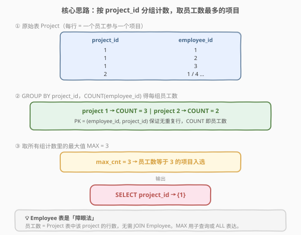
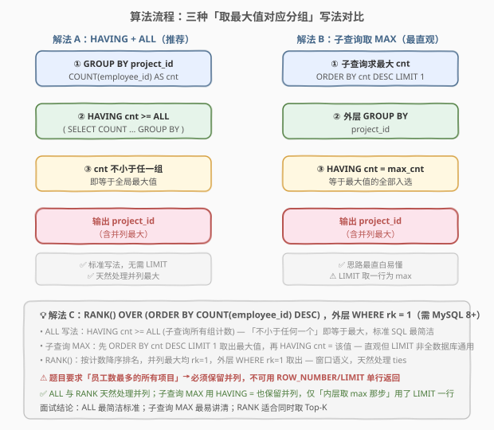
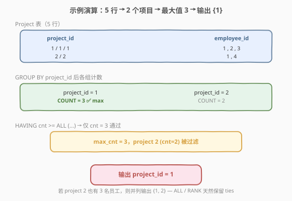

# 项目员工 II

- **题目名称**：项目员工 II
- **链接**：[1076. 项目员工 II](https://leetcode.cn/problems/project-employees-ii/)
- **难度**：简单
- **标签**：SQL、数据库、GROUP BY、聚合、子查询、ALL、窗口函数、RANK

> ⚠️ **注意**：本题在 leetcode.cn 为 **Plus 会员专享题**，亦可在 [leetcode.com](https://leetcode.com/problems/project-employees-ii/) 提交。本文代码部分使用 SQL 而非 C++/Python。

## 1. 题目概述

给定 `Project` 表（项目—员工参与关系）与 `Employee` 表（员工信息），编写 SQL 查询，返回**员工数量最多**的所有项目 `project_id`。结果无顺序要求。

**表结构**：

```text
表：Project
+-------------+---------+
| 列名        | 类型    |
+-------------+---------+
| project_id  | int     |
| employee_id | int     |  ← 外键 → Employee.employee_id
+-------------+---------+
(employee_id, project_id) 是该表的主键（唯一值组合）。
employee_id 是关联到 Employee 表的外键。
每行表示一名员工参与一个项目。

表：Employee
+------------------+---------+
| 列名             | 类型    |
+------------------+---------+
| employee_id      | int     |  ← 主键
| name             | varchar |
| experience_years | int     |
+------------------+---------+
employee_id 是该表的主键。
每行表示一名员工的姓名与经验年数。
```

**示例 1**：

```text
输入：
Project 表：
+-------------+-------------+
| project_id  | employee_id |
+-------------+-------------+
| 1           | 1           |
| 1           | 2           |
| 1           | 3           |
| 2           | 1           |
| 2           | 4           |
+-------------+-------------+
Employee 表：
+-------------+--------+------------------+
| employee_id | name   | experience_years |
+-------------+--------+------------------+
| 1           | Khaled | 3                |
| 2           | Ali    | 2                |
| 3           | John   | 1                |
| 4           | Doe    | 2                |
+-------------+--------+------------------+
输出：
+-------------+
| project_id  |
+-------------+
| 1           |
+-------------+
解释：项目 1 有 3 名员工（1、2、3），项目 2 有 2 名员工（1、4）。
      员工数最多的项目是项目 1，故输出 1。
```

**约束条件**：

- `(employee_id, project_id)` 为 `Project` 表主键，同一员工在同一项目不会重复出现。
- `employee_id` 为 `Employee` 表主键，`Project.employee_id` 为指向 `Employee` 的外键。
- 题目要求返回**所有**员工数最多的项目——意味着存在并列最大时要全部输出。

> 💡 本题是 SQL **「取最大值对应分组」母题**——所有"找出数量最多/最少的那一组并保留并列"的需求都从这一题衍生。核心是把"哪个项目人最多"翻译成"按 `project_id` 分组后计数，再筛等于最大值的组"。

---

## 2. 解题思路

### 2.1 暴力思路：逐项目扫描计数

用应用层代码读出 `Project` 全表，用哈希表 `map<project_id, count>` 逐行累加；遍历结束后再扫一遍哈希表求最大值，最后输出计数等于最大值的所有 `project_id`。

这能解决问题，但本质是**把数据库引擎擅长的分组聚合搬到了应用层**——既低效也违背 SQL 的声明式哲学。本题在 SQL 中只需两步集合操作：**分组计数** + **筛选等于最大值**。

### 2.2 核心观察：分组计数 + 取最大值；Employee 表是障眼法



这道题有两个关键观察：

**观察一（员工数 = Project 表行数）**：`Project` 表每一行就代表"一名员工参与一个项目"。因此某项目的员工数，恰为 `Project` 表中该 `project_id` 出现的行数——`COUNT(*)` 或 `COUNT(employee_id)` 直接给出。主键 `(employee_id, project_id)` 保证无重复行，无需 `DISTINCT`。

**观察二（Employee 表是障眼法）**：题目给了 `Employee` 表（姓名、经验年数），但**本问完全用不到它**。员工数来源于参与关系表 `Project`，而非员工信息表 `Employee`。`Employee` 只在后续问（如 1077 项目员工 III，要求平均经验年数）才需要 `JOIN` 进来。

> 💡 **一句话**：`GROUP BY project_id` + `COUNT(employee_id)` 得到每组员工数，再用子查询或 `ALL` 找出"等于全局最大值"的组。**不需要 JOIN Employee**——这是本题最容易踩的"过度连接"陷阱。

### 2.3 算法流程图：三种写法对比



本题有三种主流写法，核心都是"分组计数 → 找最大值 → 保留等于最大值的组"，区别只在"如何表达最大值"：

| 维度 | 解法 A：HAVING + ALL（推荐） | 解法 B：子查询取 MAX | 解法 C：RANK() 窗口函数 |
|------|------------------------------|----------------------|-------------------------|
| **思路** | `HAVING cnt >= ALL (子查询所有组计数)` | 子查询 `ORDER BY cnt DESC LIMIT 1` 取最大值，外层 `HAVING cnt = max_cnt` | `RANK() OVER (ORDER BY cnt DESC)` 外层 `WHERE rk = 1` |
| **并列处理** | ✓ `>= ALL` 天然保留所有并列最大 | ✓ `HAVING = max_cnt` 保留并列 | ✓ 并列均 rk=1，全部保留 |
| **数据库兼容** | ✓ 标准 SQL，全数据库通用 | ⚠️ `LIMIT` 取一行为 max，MySQL/PostgreSQL 支持；SQL Server 用 `TOP 1` | ⚠️ 需 MySQL 8.0+ / PostgreSQL / SQL Server |
| **推荐度** | ✓ **首选**，最简洁标准 | 直观易讲清 | 适合同时取 Top-K 的场景 |

> ⚠️ **致命陷阱：不能用 `ORDER BY COUNT(*) DESC LIMIT 1` 直接返回**！这只能返回**一条**记录，若两个项目员工数并列最多，会**漏掉其中一个**。题目要求返回"所有"员工数最多的项目，必须用 `HAVING = max` 或 `ALL` 或 `RANK() = 1` 保留并列。`LIMIT 1` 仅可用于"求最大值那一步"（子查询内部取标量），不能用于最终输出。

### 2.4 示例演算



以示例数据跟踪解法 A 的执行过程：

| 步骤 | 操作 | 结果 |
|------|------|------|
| ① | `GROUP BY project_id` + `COUNT(employee_id)` | project 1 → cnt=3；project 2 → cnt=2 |
| ② | 子查询 `(SELECT COUNT … GROUP BY)` 得所有组计数集合 | `{3, 2}` |
| ③ | `HAVING cnt >= ALL ({3, 2})` | cnt=3 ≥ 3 且 ≥ 2 → 通过；cnt=2 不 ≥ 3 → 淘汰 |
| ④ | `SELECT project_id` | 输出 `{1}` |

> 💡 **并列如何被保留**：若 project 2 也有 3 名员工，则组计数集合为 `{3, 3}`，两个项目的 cnt=3 都满足 `>= ALL`，全部输出 `{1, 2}`。`ALL` 语义为"不小于集合中任何一个"——这恰是"等于最大值"的等价表述。

---

## 3. 参考代码

### SQL（解法 A：HAVING + ALL，推荐）

```sql
SELECT project_id
FROM Project
GROUP BY project_id
HAVING COUNT(employee_id) >= ALL (
    SELECT COUNT(employee_id)
    FROM Project
    GROUP BY project_id
);
```

> 💡 **写法要点**：
> - 外层 `GROUP BY project_id` + `COUNT(employee_id)` 得到每组员工数。
> - 子查询 `SELECT COUNT(employee_id) ... GROUP BY project_id` 返回**所有组的计数集合**（如 `{3, 2}`）。
> - `HAVING cnt >= ALL (集合)`：当前组的计数不小于集合中**任何一个**值，即等于最大值——这是标准 SQL 表达"取最大组"最简洁的写法。
> - `ALL` 是标准 SQL 关键字（与 `ANY`/`SOME` 对应），所有主流数据库均支持，无兼容性问题。

### SQL（解法 B：子查询取 MAX，最直观）

```sql
SELECT project_id
FROM Project
GROUP BY project_id
HAVING COUNT(employee_id) = (
    SELECT COUNT(employee_id) AS cnt
    FROM Project
    GROUP BY project_id
    ORDER BY cnt DESC
    LIMIT 1
);
```

> 💡 **写法要点**：
> - 子查询 `ORDER BY cnt DESC LIMIT 1` 取出**计数最大的那一行**作为标量 `max_cnt`。
> - 外层 `HAVING COUNT(employee_id) = max_cnt` 保留所有等于最大值的组——**并列最大全部保留**。
> - ⚠️ `LIMIT 1` 只用在子查询内部取标量最大值，**不**用于最终输出，故不丢并列。
> - SQL Server 无 `LIMIT`，改用 `SELECT TOP 1 COUNT(employee_id) ... ORDER BY ... DESC`。

### SQL（解法 C：RANK() 窗口函数）

```sql
SELECT project_id
FROM (
    SELECT project_id,
           RANK() OVER (ORDER BY COUNT(employee_id) DESC) AS rk
    FROM Project
    GROUP BY project_id
) t
WHERE rk = 1;
```

> 💡 **写法要点**：
> - `RANK() OVER (ORDER BY COUNT(employee_id) DESC)`：按每组计数降序排名，计数最大的组 rk=1；并列最大均 rk=1。
> - 外层 `WHERE rk = 1` 取出所有并列最大的项目。
> - 与 1070（产品销售分析 III）的 RANK 思路同源——都是"取每组排名最前对应明细行"。
> - **务必用 `RANK()` 而非 `ROW_NUMBER()`**：`ROW_NUMBER()` 强制唯一编号，并列最大时只留一条，漏数据。

### Python（pandas）

```python
import pandas as pd

def project_employees_ii(project: pd.DataFrame, employee: pd.DataFrame) -> pd.DataFrame:
    cnt = project.groupby('project_id')['employee_id'].count().reset_index(name='cnt')
    max_cnt = cnt['cnt'].max()
    return cnt[cnt['cnt'] == max_cnt][['project_id']]
```

> 💡 **pandas 对照**：`groupby('project_id')['employee_id'].count()` 对应 SQL 的 `GROUP BY project_id` + `COUNT(employee_id)`；`cnt['cnt'].max()` 对应子查询取最大值；布尔索引 `cnt['cnt'] == max_cnt` 对应 `HAVING cnt = max_cnt`。注意 `Employee` 表作参数接收但**未使用**，正映衬"障眼法"观察。

---

## 4. 复杂度分析

| 维度 | 复杂度 | 说明 |
|------|--------|------|
| **时间（解法 A/B）** | $O(n)$ | 全表扫描一次分组计数 $O(n)$；子查询再扫一次 $O(n)$；`ALL` 比较在聚合后的 $k$ 个组上做 $O(k)$。$n$ = Project 行数，$k$ = 不同 project 数 |
| **时间（解法 C）** | $O(n + k \log k)$ | 聚合 $O(n)$ + 按 cnt 排序排名 $O(k \log k)$ |
| **空间** | $O(k)$ | 聚合中间结果存储 $k$ 个组的计数 |
| **结果行数** | $O(k)$ | 最坏所有项目并列最大，结果不超过项目总数 |

> 💡 SQL 复杂度取决于**执行计划与索引**：若 `project_id` 上有索引，聚合可走索引-only 扫描；`ALL` 子查询在多数优化器中会被改写为对聚合结果的哈希/排序比较，避免 $O(k^2)$ 退化。面试中说明"两遍扫描、线性级，聚合后组数 $k$ 很小"即可。

---

## 5. 扩展：ALL / ANY / IN 与「最大值对应分组」范式

### 5.1 ALL / ANY 的语义

`ALL` 与 `ANY`（等同 `SOME`）是 SQL 对子查询结果集做**逐元素比较**的量词：

| 写法 | 语义 | 等价表述 |
|------|------|---------|
| `cnt >= ALL (集)` | cnt 不小于集合中**任何一个** | cnt = MAX(集) |
| `cnt > ALL (集)` | cnt 大于集合中**所有** | cnt 严格大于 MAX(集) |
| `cnt <= ALL (集)` | cnt 不大于集合中任何一个 | cnt = MIN(集) |
| `cnt = ANY (集)` | cnt 等于集合中**某一个** | `cnt IN (集)` |

> 💡 本题 `HAVING cnt >= ALL (...)` 正是"cnt 等于所有组计数的最大值"的标准表达。它**无需先求出 MAX 标量**，直接用一个谓词同时完成"比较 + 保留并列"。

### 5.2 「取最大值对应分组」通用范式

所有"取数量最多/最少的那一组（并保留并列）"类问题都有这三种写法：

```sql
-- 范式 A：ALL（通用，最简洁）
SELECT grp
FROM T
GROUP BY grp
HAVING COUNT(*) >= ALL (SELECT COUNT(*) FROM T GROUP BY grp);

-- 范式 B：子查询 MAX（最直观）
SELECT grp
FROM T
GROUP BY grp
HAVING COUNT(*) = (SELECT MAX(c) FROM (SELECT COUNT(*) c FROM T GROUP BY grp) t);
-- 或 ORDER BY c DESC LIMIT 1 取 max 标量

-- 范式 C：RANK 窗口（MySQL 8+，适合 Top-K）
SELECT grp FROM (
    SELECT grp, RANK() OVER (ORDER BY COUNT(*) DESC) rk FROM T GROUP BY grp
) t WHERE rk = 1;
```

> 💡 范式 A 最简洁；范式 B 最易讲清"先求 max 再筛等"；范式 C 在问题升级为"取员工数前 K 多的项目"时优势明显——`WHERE rk <= K` 一行搞定，前两者需改阈值。

### 5.3 如果题目改为"恰好员工数最多的任意一个项目"

若改为"返回员工数最多的**任意一个** `project_id`"（不要并列），则可直接：

```sql
SELECT project_id
FROM Project
GROUP BY project_id
ORDER BY COUNT(employee_id) DESC
LIMIT 1;
```

但本题明确要求**所有**最多的项目，故 `LIMIT 1` 仅可出现在求 max 的子查询中，不能用于最终输出。

---

## 6. 面试要点

1. **为什么不需要 JOIN Employee 表？**

   - 员工数 = `Project` 表中该 `project_id` 出现的行数。`Project` 表的每一行本就代表"一名员工参与一个项目"，`COUNT(*)` 直接给出员工数。`Employee` 表只提供员工姓名与经验年数，本问不涉及这些字段，故是障眼法。后续问题（如 1077 求项目平均经验年数）才需要 `JOIN Employee`。

2. **`HAVING COUNT(*) >= ALL (...)` 是什么意思？为什么等价于"等于最大值"？**

   - `ALL` 是标准 SQL 量词，`cnt >= ALL (集)` 表示 cnt 不小于集合中**任何一个**元素——即 cnt 不小于集合的最大值。又因 cnt 本身就在集合内（它是其中一组的计数），故 cnt 必等于最大值。这一句同时完成"比较"与"保留并列最大"。

3. **能不能直接 `ORDER BY COUNT(*) DESC LIMIT 1` 返回？**

   - **不能**。`LIMIT 1` 只返回一条记录，若两个项目员工数并列最多，会漏掉其中一个。题目要求返回"所有"最多的项目。`LIMIT 1` 仅可用于子查询内部取出最大值标量，外层仍需 `HAVING cnt = max_cnt` 保留并列。

4. **`COUNT(*)`、`COUNT(employee_id)`、`COUNT(DISTINCT employee_id)` 有区别吗？**

   - 本题无区别。`(employee_id, project_id)` 是主键，`employee_id` 不会 NULL 也不会在同一项目内重复，故三者结果相同。`COUNT(*)` 语义最清晰（数行数），`COUNT(employee_id)` 强调"数员工"，`COUNT(DISTINCT …)` 在主键约束下冗余。

5. **如果数据量很大（千万级参与记录），如何优化？**

   - 在 `project_id` 上建索引，聚合可走**索引-only 扫描**；组数 $k$（不同项目数）通常远小于 $n$（参与记录数），`ALL`/MAX 比较在 $k$ 上完成，开销极小。若频繁查询，可对 `(project_id, employee_id)` 建复合索引或物化"项目—员工数"汇总表。

> 💡 **一句话总结**：1076 是 SQL **「取最大值对应分组（保留并列）」母题**——核心就一句 `GROUP BY project_id HAVING COUNT(employee_id) >= ALL (子查询所有组计数)`。考点不在语法难度，而在两点：①识破 Employee 表障眼法、不盲目 JOIN；②用 `ALL` 或 `HAVING = max` 保留并列，避免 `LIMIT 1` 漏数据。

---

## 7. 同类练习题

- [1075. 项目员工 I](https://leetcode.cn/problems/project-employees-i/)：同 `Project`/`Employee` 表系列入门题，`GROUP BY` + `AVG(experience_years)` 求每个项目平均经验，是 1076 的前置题，共享表结构
- [1077. 项目员工 III](https://leetcode.cn/problems/project-employees-iii/)：同表系列进阶——求每个项目中经验最丰富的员工，`JOIN` + `RANK() OVER (PARTITION BY project_id ORDER BY experience_years DESC)`，把 1076 的"取最大组"升级为"每组取最大值对应明细行"
- [570. 至少有 5 名直接下属的经理](https://leetcode.cn/problems/managers-with-at-least-5-direct-reports/)：`GROUP BY` + `HAVING COUNT >= 5`，与 1076 共享"分组计数 + HAVING 筛选"范式，区别在阈值筛选 vs 最大值筛选
- [184. 部门工资最高的员工](https://leetcode.cn/problems/department-highest-salary/)：`JOIN` + `GROUP BY` + `MAX` 取每组最高工资对应员工，与 1077 同为"每组取最大值对应明细行"，是 1076 取最大组的明细版
- [620. 有趣的电影](https://leetcode.cn/problems/not-boring-movies/)：SQL `WHERE` 过滤 + `ORDER BY` 排序，对比 `WHERE`（逐行）与 `HAVING`（聚合）的使用边界，巩固 SQL 执行顺序理解
