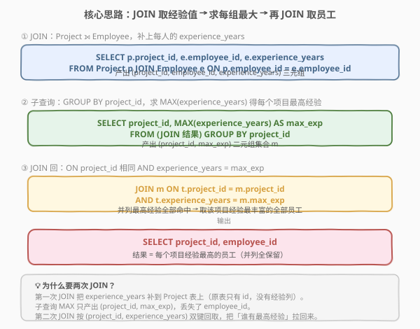
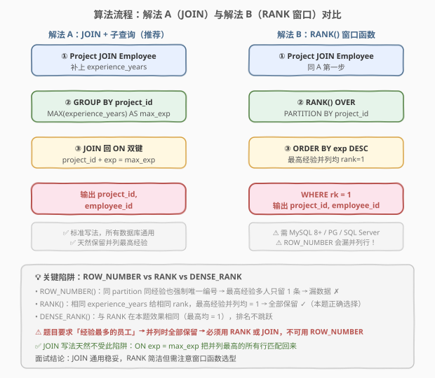
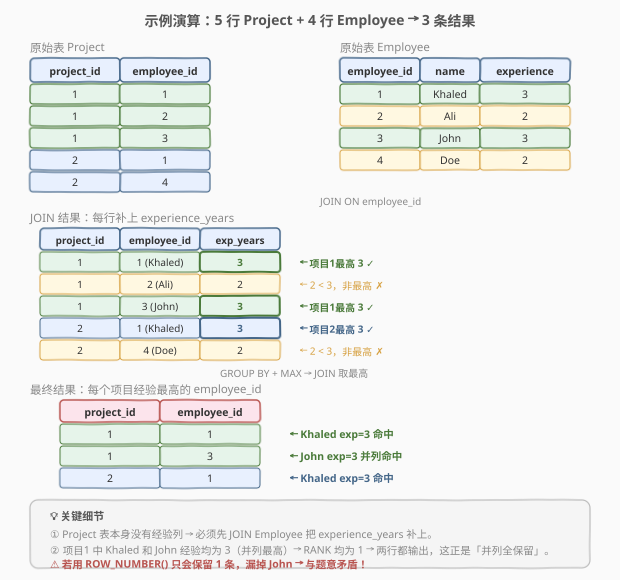

# 项目员工 III

- **题目名称**：项目员工 III
- **链接**：[1077. 项目员工 III](https://leetcode.cn/problems/project-employees-iii/)
- **难度**：中等
- **标签**：SQL、数据库、JOIN、GROUP BY、MAX、子查询、窗口函数、RANK

## 1. 题目概述

给定项目表 `Project` 和员工表 `Employee`，编写 SQL 查询，选出**每个项目中经验年限最高的员工**的 `project_id` 和 `employee_id`。若一个项目有多名员工并列最高经验，则**全部返回**。

**关键要求**：

- 对每个 `project_id`，找到该项目中所有员工的最高 `experience_years`。
- **返回所有达到该最高经验值的员工**（并列时全部保留，不去重）。

**表结构**：

```text
表：Project
+-------------+---------+
| 列名        | 类型    |
+-------------+---------+
| project_id  | int     |
| employee_id | int     |
+-------------+---------+
(employee_id, project_id) 是这张表的主键（具有唯一值的列的组合）。
employee_id 是关联到 Employee 表的外键。
这张表的每一行都表示 employee_id 正在参与 project_id 项目。

表：Employee
+------------------+---------+
| 列名             | 类型    |
+------------------+---------+
| employee_id      | int     |
| name             | varchar |
| experience_years | int     |
+------------------+---------+
employee_id 是这张表的主键（具有唯一值的列）。
这张表的每一行都包含一个员工的信息。
```

> 💡 **关键约束**：`Project` 表只有 `project_id` 和 `employee_id`，**没有经验列**——经验信息在 `Employee` 表中。因此必须先 JOIN 两表把 `experience_years` 补到项目维度上，再做分组聚合。这决定了本题需要**两次 JOIN**：第一次补列、第二次取最高经验对应的员工。

**示例 1**：

```text
输入：
Project 表：
+-------------+-------------+
| project_id  | employee_id |
+-------------+-------------+
| 1           | 1           |
| 1           | 2           |
| 1           | 3           |
| 2           | 1           |
| 2           | 4           |
+-------------+-------------+

Employee 表：
+-------------+--------+------------------+
| employee_id | name   | experience_years |
+-------------+--------+------------------+
| 1           | Khaled | 3                |
| 2           | Ali    | 2                |
| 3           | John   | 3                |
| 4           | Doe    | 2                |
+-------------+--------+------------------+

输出：
+-------------+-------------+
| project_id  | employee_id |
+-------------+-------------+
| 1           | 1           |
| 1           | 3           |
| 2           | 1           |
+-------------+-------------+

解释：项目 1 的员工为 Khaled(3)、Ali(2)、John(3)，最高经验 3 年，Khaled 和 John 并列 → 两行都输出。
      项目 2 的员工为 Khaled(3)、Doe(2)，最高经验 3 年，仅 Khaled → 输出 1 行。
```

**约束条件**：

- `(employee_id, project_id)` 为 `Project` 表主键（组合唯一）。
- 同一 `employee_id` 可参与多个不同项目。
- 结果列名为 `project_id`、`employee_id`，顺序任意。
- 并列最高经验时全部返回。

---

## 2. 解题思路

### 2.1 暴力思路：逐项目扫描

用应用层代码读出 `Project` 和 `Employee` 两表，对每个 `project_id` 维护一个「已见过的最大经验值」；遍历结束后再扫一遍，挑出 `experience_years == 最大经验值` 的所有行输出。

这能解决问题，但本质是**把数据库引擎擅长的分组聚合与连接搬到了应用层**——既低效也违背 SQL 的声明式哲学。本题在 SQL 中只需两步集合操作：**JOIN 补列 + 分组取最大**，再 **JOIN 取明细**。

### 2.2 核心观察：先 JOIN 补经验列，再求每组最大值，再 JOIN 取员工



本题分三步：

| 步骤 | 操作 | 产出 |
|------|------|------|
| ① JOIN 补列 | `Project JOIN Employee ON employee_id` | `(project_id, employee_id, experience_years)` |
| ② 求最高经验 | `GROUP BY project_id` + `MAX(experience_years)` | 每个项目的 `(project_id, max_exp)` |
| ③ 取最高员工 | `JOIN` ON `project_id` 相同且 `experience_years = max_exp` | 最高经验的全部员工 |

> 💡 **为什么需要两次 JOIN？** `Project` 表本身只有 `employee_id`，没有 `experience_years`——第一次 JOIN 是把经验列从 `Employee` 表「搬运」过来。子查询 `MAX(experience_years)` 只产出 `(project_id, max_exp)` 两列，**丢掉了 `employee_id`**。第二次 JOIN 按 `(project_id, experience_years)` 双键回取，把「谁有最高经验」拉回来。

> ⚠️ **JOIN 条件是双键**：`ON t.project_id = m.project_id AND t.experience_years = m.max_exp`。两个条件缺一不可——`project_id` 防止串项目，`experience_years` 锁定最高值。若只按 `project_id` JOIN 会把该项目所有员工都拉回来，失去「最高」语义。

### 2.3 算法流程图：两种解法对比



本题有两种主流写法：

| 维度 | 解法 A：JOIN + 子查询（推荐） | 解法 B：RANK() 窗口函数 |
|------|------------------------------|-------------------------|
| **思路** | JOIN 补列 → GROUP BY MAX → JOIN 取员工 | JOIN 补列 → 按 `project_id` 分区按经验降序排名，取 rank=1 |
| **写法** | `JOIN (SELECT project_id, MAX(exp) ... ) m` | `RANK() OVER (PARTITION BY project_id ORDER BY exp DESC)` 外层 `WHERE rk = 1` |
| **并列最高** | ✓ JOIN 不去重，并列最高全保留 | ✓ 同经验并列均 rank=1，全部保留 |
| **数据库兼容** | ✓ 全部数据库通用 | ⚠️ 需 MySQL 8.0+ / PostgreSQL / SQL Server |
| **推荐度** | ✓ **首选**，稳妥通用 | 简洁，但需注意窗口函数选型 |

> ⚠️ **致命陷阱：不能用 `ROW_NUMBER()`**！`ROW_NUMBER()` 在同一分区内**强制唯一编号**，即使两名员工的 `experience_years` 相同，也会被分配不同的序号（1、2……）。若最高经验有多人并列，`ROW_NUMBER()` 只会保留第一名，**漏掉其余并列员工**——与题目「全部返回」的要求矛盾。
>
> | 窗口函数 | 并列最高行为 | 本题是否正确 |
> |----------|-------------|-------------|
> | `ROW_NUMBER()` | 强制唯一，并列最高只留 1 人 | ✗ 漏数据 |
> | `RANK()` | 相同经验给相同 rank，并列最高均 = 1 | ✓ 正确 |
> | `DENSE_RANK()` | 与 RANK 在本题效果相同 | ✓ 正确 |
>
> `JOIN` 写法天然不受此陷阱影响——`ON experience_years = max_exp` 把并列最高的所有行都匹配回来，无需关心排名。

### 2.4 示例演算



以示例数据跟踪解法 A 的执行过程：

| 步骤 | 操作 | 结果 |
|------|------|------|
| ① | `Project JOIN Employee ON employee_id` | 5 行：(1,1,3)(1,2,2)(1,3,3)(2,1,3)(2,4,2) |
| ② | `GROUP BY project_id` + `MAX(experience_years)` | 项目 1 → max_exp=3；项目 2 → max_exp=3 |
| ③ | `JOIN ON project_id 相同 AND experience_years = max_exp` | (1,1,3)命中；(1,3,3)命中；(1,2,2)未命中；(2,1,3)命中；(2,4,2)未命中 |
| ④ | `SELECT project_id, employee_id` | 输出 `(1,1)`、`(1,3)`、`(2,1)` |

> 💡 **并列最高如何被保留**：项目 1 中 Khaled(3) 和 John(3) 经验均为 3（最高），`JOIN ON experience_years = 3` 会**同时命中**这两行，两行都输出——这正是「并列全保留」的体现。`JOIN` 不做去重，并列最高有几个人就返回几条。

---

## 3. 参考代码

### SQL（解法 A：JOIN + 子查询，推荐）

```sql
SELECT p.project_id, e.employee_id
FROM Project p
JOIN Employee e ON p.employee_id = e.employee_id
JOIN (
    SELECT p2.project_id, MAX(e2.experience_years) AS max_exp
    FROM Project p2
    JOIN Employee e2 ON p2.employee_id = e2.employee_id
    GROUP BY p2.project_id
) m ON p.project_id = m.project_id
   AND e.experience_years = m.max_exp;
```

> 💡 **写法要点**：
> - 第一个 `JOIN Employee e ON p.employee_id = e.employee_id` 把 `experience_years` 补到 `Project` 表上——`Project` 原表没有经验列，这一步不可省。
> - 子查询 `m` 在 JOIN 结果上按 `project_id` 分组，`MAX(experience_years)` 求每个项目的最高经验，产出 `(project_id, max_exp)`。
> - 第二个 `JOIN ... ON p.project_id = m.project_id AND e.experience_years = m.max_exp` 双键连接：`project_id` 配对项目、`experience_years` 锁定最高值。
> - 用 `JOIN`（INNER JOIN）而非 `LEFT JOIN`：子查询的每个 `project_id` 都来自 `Project`，必定能匹配回原行。

### SQL（解法 B：RANK() 窗口函数）

```sql
SELECT project_id, employee_id
FROM (
    SELECT p.project_id, e.employee_id,
           RANK() OVER (PARTITION BY p.project_id ORDER BY e.experience_years DESC) AS rk
    FROM Project p
    JOIN Employee e ON p.employee_id = e.employee_id
) t
WHERE rk = 1;
```

> 💡 **写法要点**：
> - `RANK() OVER (PARTITION BY p.project_id ORDER BY e.experience_years DESC)`：按 `project_id` 分区，区内按 `experience_years` **降序**排名。经验最高的 rank=1；并列最高均 rank=1。
> - 外层 `WHERE rk = 1` 筛出每个项目的最高经验**全部**员工。
> - **务必用 `RANK()` 而非 `ROW_NUMBER()`**：见 2.3 的陷阱说明。
> - `ORDER BY ... DESC` 是关键——降序排列让最高经验排在 rank=1。若误写升序，rank=1 会变成经验最少的员工。

### SQL（解法 C：IN 相关子查询，不推荐）

```sql
SELECT p.project_id, e.employee_id
FROM Project p
JOIN Employee e ON p.employee_id = e.employee_id
WHERE (p.project_id, e.experience_years) IN (
    SELECT p2.project_id, MAX(e2.experience_years)
    FROM Project p2
    JOIN Employee e2 ON p2.employee_id = e2.employee_id
    GROUP BY p2.project_id
);
```

> 💡 **写法要点**：用元组 `(project_id, experience_years)` 与子查询结果集做 `IN` 匹配，语义与 JOIN 等价。某些数据库（如 SQL Server 旧版）不支持元组 `IN`，可改写为 `WHERE e.experience_years = (SELECT MAX(e2.experience_years) FROM Project p2 JOIN Employee e2 ON p2.employee_id = e2.employee_id WHERE p2.project_id = p.project_id)` 的相关子查询形式，但效率较低（每行触发一次子查询）。

### Python（pandas）

```python
import pandas as pd

def project_employees_iii(project: pd.DataFrame, employee: pd.DataFrame) -> pd.DataFrame:
    merged = project.merge(employee, on='employee_id', how='left')
    max_exp = merged.groupby('project_id')['experience_years'].transform('max')
    result = merged[merged['experience_years'] == max_exp]
    return result[['project_id', 'employee_id']]
```

> 💡 **pandas 对照**：`merge` 对应 SQL 的 `JOIN`；`groupby('project_id')['experience_years'].transform('max')` 对应 `GROUP BY` + `MAX`，`transform` 把聚合结果广播回每一行（与 `RANK() OVER (PARTITION BY ...)` 的窗口语义一致）；布尔索引 `merged['experience_years'] == max_exp` 对应 `JOIN ON exp = max_exp`。

---

## 4. 复杂度分析

| 维度 | 复杂度 | 说明 |
|------|--------|------|
| **时间（解法 A）** | $O(n + m)$ | 第一次 JOIN 扫描 `Project`(n 行) 和 `Employee`(m 行)；子查询在 JOIN 结果上分组聚合 $O(n)$；第二次 JOIN 扫描 JOIN 结果，整体线性 |
| **时间（解法 B）** | $O(n \log n)$ | 窗口函数需按 `(project_id, experience_years)` 排序，排序开销 $O(n \log n)$；分区后排名线性 |
| **时间（解法 C）** | $O(n \cdot k)$ ~ $O(n)$ | 相关子查询每行触发一次；无索引时最坏 $O(n^2)$，有索引或被优化器改写为半连接后接近线性 |
| **空间** | $O(n)$ | 子查询物化中间结果 / 窗口函数排序缓冲区 |
| **结果行数** | $O(n)$ | 最坏情况每个项目所有员工并列最高，结果不超过 `Project` 行数 |

> ⚠️ SQL 复杂度取决于**执行计划与索引**：解法 A 的 JOIN + 聚合扫描稳定高效；解法 B 的窗口函数需排序，常数略大但语义简洁；解法 C 的相关子查询在无索引时易退化。面试中说明「首选 JOIN 写法，稳定通用；RANK 简洁但需 8.0+ 且注意选型」即可。

---

## 5. 扩展：窗口函数选型与 GROUP BY 的边界

### 5.1 ROW_NUMBER / RANK / DENSE_RANK 的本质区别

三者都做「分区内排名」，区别在于对**并列值**的处理：

| 函数 | 并列处理 | 下一排名 | 示例（值 3,3,2 降序） |
|------|---------|---------|----------------------|
| `ROW_NUMBER()` | 强制唯一 1,2,3 | — | 1, 2, 3 |
| `RANK()` | 相同值同 rank，下一 rank 跳过 | 跳跃 | 1, 1, 3 |
| `DENSE_RANK()` | 相同值同 rank，下一 rank 不跳 | 连续 | 1, 1, 2 |

> 💡 本题只取 rank=1（最高经验），`RANK` 与 `DENSE_RANK` 效果完全相同——因为它们对最大值的排名都是 1。差异体现在 rank≥2 的行，但本题不关心。`ROW_NUMBER` 则会破坏并列，**绝对不能用**。

### 5.2 「聚合 + JOIN」 vs 「窗口函数」的通用范式

所有「取每组最大/最小值对应的明细行」类问题都有这两种写法：

```sql
-- 范式 A：聚合 + JOIN（通用）
SELECT t.*
FROM T t
JOIN (SELECT grp, MAX(val) AS max_val FROM T GROUP BY grp) m
  ON t.grp = m.grp AND t.val = m.max_val;

-- 范式 B：窗口函数（需 8.0+）
SELECT *
FROM (
    SELECT *, RANK() OVER (PARTITION BY grp ORDER BY val DESC) AS rk
    FROM T
) t WHERE rk = 1;
```

> 💡 范式 A 适用于**所有数据库**，是稳妥的面试默认写法；范式 B 更简洁且只需扫一次表，但依赖窗口函数支持。若问题改为「每组取 Top-K」（K>1），范式 B 用 `WHERE rk <= K` 一行搞定，范式 A 则需额外处理，此时窗口函数更优。

### 5.3 与 1070 的镜像关系

本题与 [1070. 产品销售分析 III](https://leetcode.cn/problems/product-sales-analysis-iii/) 是**镜像题**：

| 维度 | 1070（取最小） | 1077（取最大） |
|------|---------------|---------------|
| 聚合函数 | `MIN(year)` | `MAX(experience_years)` |
| JOIN 排序 | `ORDER BY year`（升序，最早 = rank 1） | `ORDER BY experience_years DESC`（降序，最高 = rank 1） |
| 表结构 | 单表 `Sales`（已有明细列） | 双表 `Project` + `Employee`（需 JOIN 补列） |

> 💡 1070 的单表直接有 `quantity`/`price` 列，只需一次 JOIN 回表；1077 的 `Project` 表没有经验列，需先 JOIN `Employee` 补列再做聚合——多了一次 JOIN。两题的**核心范式完全相同**（聚合 + JOIN 取明细 / RANK 取 rank=1），只是聚合方向和表连接复杂度不同。

---

## 6. 面试要点

1. **为什么需要两次 JOIN，而不是直接 GROUP BY？**

   - `Project` 表只有 `project_id` 和 `employee_id`，**没有 `experience_years` 列**。第一次 JOIN `Employee` 是把经验列从员工表「搬运」到项目维度。之后 `GROUP BY project_id` + `MAX(experience_years)` 只产出 `(project_id, max_exp)`，**丢失了 `employee_id`**——题目要求输出的是员工 ID，必须第二次 JOIN 按 `(project_id, experience_years)` 双键回取，把「谁有最高经验」拉回来。

2. **JOIN 条件为什么必须写两个 `ON`？**

   - `ON p.project_id = m.project_id AND e.experience_years = m.max_exp`：`project_id` 确保不串项目，`experience_years` 确保只取最高值。若只写 `project_id`，会把该项目**所有员工**都匹配回来；若只写 `experience_years`，会把不同项目同经验值的员工混进来。双键缺一不可。

3. **能用 `ROW_NUMBER()` 代替 `RANK()` 吗？为什么？**

   - **不能**。`ROW_NUMBER()` 在同一分区内强制唯一编号，即使两名员工的 `experience_years` 相同也会分配不同序号。若最高经验有多人并列，`ROW_NUMBER()` 只保留 rank=1 的那一位，**漏掉其余并列员工**。`RANK()` 对相同 `experience_years` 给相同 rank，并列最高均 rank=1，全部保留，符合题目「全部返回」的要求。

4. **RANK 窗口函数中为什么要 `ORDER BY experience_years DESC`？**

   - 降序排列让经验值最高的行排在 rank=1。若误写升序 `ORDER BY experience_years ASC`，rank=1 会变成经验**最少**的员工，完全搞反。对照 1070（取最小值）用的是升序 `ORDER BY year`——升序让最小值 rank=1。取最大值必须降序，取最小值必须升序，方向不可搞错。

5. **`GROUP BY` + `MAX` 和窗口函数 `RANK` 哪个更好？**

   - 语义等价。`GROUP BY` + `JOIN` 写法**通用稳妥**（所有数据库支持），但需多写一次 JOIN；`RANK()` 窗口函数**简洁**且只需扫一次表，但需 MySQL 8.0+ 等支持窗口函数的数据库，且必须注意不能用 `ROW_NUMBER`。面试答「首选 JOIN 写法因通用，RANK 简洁但需选对函数」。

> 💡 **一句话总结**：1077 是 SQL **「分组取最大值对应明细行」母题**——核心就两次 JOIN：第一次把经验列从 `Employee` 补到 `Project` 上，第二次按 `(project_id, MAX(experience_years))` 双键回取 `employee_id`。考点不在语法难度，而在理解「Project 表没有经验列需先 JOIN 补列」以及并列最高时**绝不能用 `ROW_NUMBER`** 的陷阱。与 1070（取最小）互为镜像，记住这条范式，所有「每组最早/最晚/最高/最低记录」类 SQL 题都能套用。

---

## 7. 同类练习题

- [1070. 产品销售分析 III](https://leetcode.cn/problems/product-sales-analysis-iii/)：`GROUP BY product_id` + `MIN(year)` 求首年再 JOIN 回取明细，与 1077 **完全同模板**（分组取极值对应行），是「最小值镜像题」
- [184. 部门工资最高的员工](https://leetcode.cn/problems/department-highest-salary/)：`JOIN` + `GROUP BY department` + `MAX(salary)` 取每组最高工资对应员工，与 1077 是**同范式题**（取最大值对应行），表结构更经典
- [1174. 即时食物配送 II](https://leetcode.cn/problems/immediate-food-delivery-ii/)：`GROUP BY customer_id` + `MIN(order_date)` 求首单再 JOIN 回取即时率，与 1077 共享「分组取极值 + JOIN 取明细」范式，区别在取最小值且叠加比率计算
- [550. 游戏玩法分析 IV](https://leetcode.cn/problems/game-play-analysis-iv/)：`GROUP BY player_id` + `MIN(event_date)` 求首次登录日，再算次日留存率，在 1077 的「取首日/极值」基础上叠加日期差判断，难度递进
- [570. 至少有5名直接下属的经理](https://leetcode.cn/problems/managers-with-at-least-5-direct-reports/)：`GROUP BY managerId` + `COUNT` 过滤后再 JOIN 取经理信息，与 1077 共享「分组聚合 + JOIN 回取明细」范式，区别在聚合函数（COUNT vs MAX）
