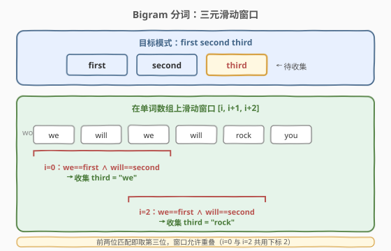
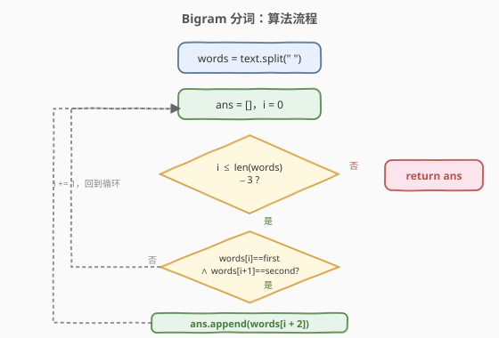
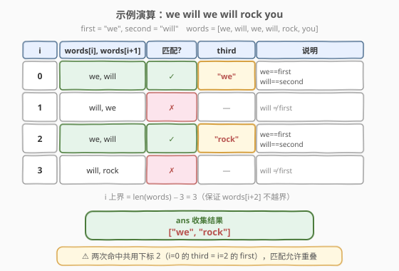

# LeetCode Bigram 分词 题解

## 1. 题目概述

- **标题 / 题号**：Bigram 分词（#1078，easy）
- **链接**：https://leetcode.cn/problems/occurrences-after-bigram/
- **难度**：简单
- **标签**：字符串、模拟

**题意**：给出第一个词 `first` 和第二个词 `second`，考虑在某些文本 `text` 中可能以 `"first second third"` 形式出现的情况，其中 `second` 紧随 `first` 出现，`third` 紧随 `second` 出现。

对于每种这样的情况，将第三个词 `third` 添加到答案中，并返回答案。

**示例 1**：

```text
输入：text = "alice is a good girl she is a good student", first = "a", second = "good"
输出：["girl","student"]
解释：
  "...a good girl..."   → third = "girl"
  "...a good student"   → third = "student"
```

**示例 2**：

```text
输入：text = "we will we will rock you", first = "we", second = "will"
输出：["we","rock"]
解释：
  "we will we ..."      → third = "we"
  "we will rock ..."    → third = "rock"
  ⚠ 两次命中共用下标 2 的 "we"（既是前一次的 third，又是后一次的 first），匹配允许重叠
```

**约束**：

- $1 \leq \text{text.length} \leq 1000$
- `text` 由小写英文字母和空格组成
- `text` 中的所有单词之间都由**单个空格字符**分隔
- $1 \leq \text{first.length}, \text{second.length} \leq 10$
- `first` 和 `second` 由小写英文字母组成
- `text` 不包含任何前缀或尾随空格

> 💡 关键点：题目已保证单词间**单空格分隔**且**无前后导空格**，因此直接按空格切分即可得到干净的单词数组，无需处理多空格或边界。

## 2. 解题思路

### 2.1 暴力思路：逐字符扫描拼接

不切分单词，直接在原始 `text` 上做字符串匹配——对每个起点 `i`，检查 `text[i : i+len(first)+1+len(second)+1+len(third)]` 是否以 `"first second "` 开头。但 `third` 长度未知、单词边界还需对齐空格，实现繁琐且易错。

更自然的做法是**先按空格切分成单词数组**，把字符串问题降维成数组遍历问题。

### 2.2 核心观察：三元滑动窗口



切分得到单词数组 `words` 后，问题等价于：

> 在 `words` 上滑动一个**长度为 3 的窗口** $[i, i+1, i+2]$，若 `words[i] == first` **且** `words[i+1] == second`，则收集 `words[i+2]`。

**三个要点**：

- **窗口长度固定为 3**：因为题目要求 `second` 紧随 `first`、`third` 紧随 `second`，三者必须连续相邻。
- **前两位判定、第三位收集**：只关心前两位是否分别等于 `first`/`second`，命中即取第三位，无需对 `third` 做任何约束。
- **匹配允许重叠**：例 2 中 $i=0$ 的窗口 `[we, will, we]` 与 $i=2$ 的窗口 `[we, will, rock]` 共用下标 2。因此窗口步进固定为 1，不因命中而跳过——每个位置都独立判定。

> 💡 **一句话**：切分 → 遍历 $i \in [0, n-3]$ → 前两位匹配就收第三位。本质是「定长滑窗 + 条件收集」，是字符串模拟题的最朴素形态。

### 2.3 算法流程图



```text
1. words = text.split(" ")
2. ans = [], i = 0
3. 当 i <= len(words) - 3:
     若 words[i] == first 且 words[i+1] == second:
         ans.append(words[i+2])
     i += 1
4. 返回 ans
```

### 2.4 示例演算



以 `text = "we will we will rock you"`, `first = "we"`, `second = "will"` 为例：

`words = [we, will, we, will, rock, you]`，$n = 6$，$i$ 上界 $= 6 - 3 = 3$。

| i | words[i], words[i+1] | 匹配? | third | 说明 |
|---|----------------------|-------|-------|------|
| 0 | we, will | ✓ | "we" | we==first ∧ will==second |
| 1 | will, we | ✗ | — | will ≠ first |
| 2 | we, will | ✓ | "rock" | we==first ∧ will==second |
| 3 | will, rock | ✗ | — | will ≠ first |

最终 `ans = ["we", "rock"]`，与示例 2 一致。

> ⚠️ 注意 $i=0$ 命中后窗口**不跳过 3 格**，而是继续步进到 $i=1$、$i=2$。$i=0$ 的第三位 `we`（下标 2）正是 $i=2$ 的首位——若命中后跳过，会漏掉 $i=2$ 的 `"rock"`。**步进恒为 1** 是处理重叠匹配的关键。

## 3. 参考代码

### C++

```cpp
class Solution {
public:
    vector<string> findOcurrences(string text, string first, string second) {
        vector<string> words;
        stringstream ss(text);
        string w;
        while (ss >> w) words.push_back(w);

        vector<string> ans;
        int n = words.size();
        for (int i = 0; i + 2 < n; i++) {
            if (words[i] == first && words[i + 1] == second)
                ans.push_back(words[i + 2]);
        }
        return ans;
    }
};
```

### Python

```python
class Solution:
    def findOcurrences(self, text: str, first: str, second: str) -> List[str]:
        words = text.split(" ")
        ans = []
        for i in range(len(words) - 2):
            if words[i] == first and words[i + 1] == second:
                ans.append(words[i + 2])
        return ans
```

> 💡 代码要点：① Python 直接 `split(" ")` 即得单词数组（题目保证单空格分隔）；C++ 用 `stringstream >>` 自动按空白切分，更稳健；② 循环上界写 `i + 2 < n`（C++）/ `range(len(words) - 2)`（Python），保证访问 `words[i+2]` 不越界，无需额外判断；③ 步进恒为 1，不因命中而跳过，正确处理重叠匹配。

## 4. 复杂度分析

| 维度 | 复杂度 | 说明 |
|------|--------|------|
| **时间** | $O(n)$ | 切分 $O(n)$ + 遍历 $O(n)$，$n$ 为 `text` 长度（单词数与 $n$ 同阶） |
| **空间** | $O(n)$ | 存储切分后的单词数组 `words` |

> 💡 若不显式切分、改为双指针在原串上抽取单词边走边比，可做到 $O(1)$ 额外空间，但代码复杂度上升、收益有限。本题 $n \leq 1000$，切分方案最清晰。

## 5. 扩展：不切分原位扫描（$O(1)$ 额外空间）

若面试官要求 $O(1)$ 额外空间，可不显式建 `words` 数组，用双指针在原串上抽取当前单词：

```python
class Solution:
    def findOcurrences(self, text: str, first: str, second: str) -> List[str]:
        ans = []
        n = len(text)
        prev_prev = prev = None      # 前两个单词
        i = 0
        while i < n:
            j = i
            while j < n and text[j] != ' ':
                j += 1
            cur = text[i:j]          # 当前单词
            if prev_prev == first and prev == second:
                ans.append(cur)
            prev_prev, prev = prev, cur
            i = j + 1                # 跳过空格
        return ans
```

- **思路**：维护「上上一个单词」`prev_prev` 与「上一个单词」`prev`。每抽取一个新单词 `cur`，就检查 `prev_prev == first and prev == second`，命中则收集 `cur`，然后整体向前滚动。
- **对比**：等价于把窗口 $[i, i+1, i+2]$ 改为「延迟两步」的流式判定——读到 `third` 时才回看前两位，避免数组存储。

> ⚠️ 本法等价于「流式处理」，适合 `text` 极长或无法一次性载入的场景；本题约束小，切分法更直观。

## 6. 面试要点

**Q1：为什么窗口步进恒为 1，命中后不跳过？**

> 因为匹配允许重叠。例 2 中 $i=0$ 命中后，其 `third`（下标 2 的 `we`）正是 $i=2$ 窗口的 `first`。若命中后跳 3 格到 $i=3$，会漏掉 $i=2$ 的 `"rock"`。每个起点独立判定，步进固定为 1 才能覆盖所有可能的 bigram 出现位置。

**Q2：循环上界为什么是 `len(words) - 3`（即 `i + 2 < n`）？**

> 窗口需要访问 `words[i+2]`，要保证 $i+2 \leq n-1$，即 $i \leq n-3$。写成 `i + 2 < n` 或 `range(len(words) - 2)` 可天然防越界，无需在循环体内额外判空。

**Q3：题目保证「单空格分隔、无前后导空格」对解法有什么影响？**

> 这意味着 `text.split(" ")` 直接得到干净的单词数组，无需处理多空格、前导/尾随空格产生的空串元素。若无此保证，Python 应改用 `text.split()`（无参，按任意空白切分并自动去空），C++ 的 `stringstream >>` 天然按空白切分不受影响。

**Q4：如果 `first`/`second` 可能含空格（即 bigram 跨多词）怎么办？**

> 本题约束 `first`/`second` 仅由小写字母组成，不含空格，故单词级匹配即可。若 `first` 本身是多词短语，需回到字符串级匹配：在 `text` 中找子串 `"first second "` 的所有出现位置，再取其后到下一个空格的子串——本质退化为 KMP/字符串查找。

**Q5：本题与「模式匹配」类问题有何联系？**

> 本题是**最朴素的定长模式匹配**——模式长度固定为 3（两个锚点 + 一个待收集位）。当模式变长或带通配符时，需升级为 KMP（单模式）、AC 自动机（多模式）或正则。本题规模小、模式固定，一次线性扫描足矣。

## 同类练习题

| # | 题目 | 与本题的关联 |
|---|------|-------------|
| 28 | [找出字符串中第一个匹配项的下标](https://leetcode.cn/problems/find-the-index-of-the-first-occurrence-in-a-string/)（[题解](../0001-0100/28_找出字符串中第一个匹配项的下标.md)） | 单模式字符串匹配母题，KMP 入门，对比本题的单词级朴素匹配 |
| 8 | [字符串转换整数 (atoi)](https://leetcode.cn/problems/string-to-integer-atoi/)（[题解](../0001-0100/8_字符串转换整数atoi.md)） | 字符串模拟 + 边界处理，同为「扫描 + 状态收集」范式 |
| 58 | [最后一个单词的长度](https://leetcode.cn/problems/length-of-last-word/)（[题解](../0001-0100/58_最后一个单词的长度.md)） | 从右向左扫描跳过尾随空格 + 数单词，单词级遍历的对照练习 |
| 2109 | [向字符串添加空格](https://leetcode.cn/problems/adding-spaces-to-a-string/) | 在指定位置插入空格，字符串切分/拼接的逆向操作 |
| 1816 | [截断句子](https://leetcode.cn/problems/truncate-sentence/) | 按空格切分取前 k 个单词重组，单词数组操作的基础练手 |
