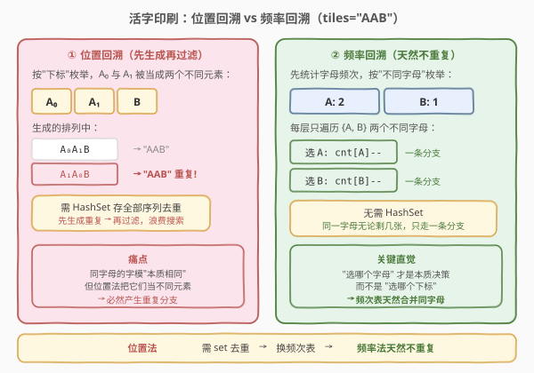
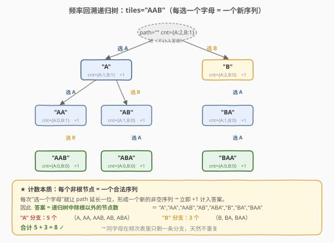

# 活字印刷

- **题目名称**：活字印刷
- **链接**：[1079. 活字印刷](https://leetcode.cn/problems/letter-tile-possibilities/)
- **难度**：中等
- **标签**：字符串、回溯、计数

## 1. 题目概述

你有一套活字字模 `tiles`，其中每个字模上都刻有一个字母 `tiles[i]`。返回你可以印出的**非空字母序列的数目**。

注意：本题中，每个活字字模只能使用一次。

**示例 1**：

```text
输入："AAB"
输出：8
解释：可能的序列为 "A", "B", "AA", "AB", "BA", "AAB", "ABA", "BAA"。
```

**示例 2**：

```text
输入："AAABBC"
输出：188
```

**示例 3**：

```text
输入："V"
输出：1
```

**约束条件**：

- $1 \leq \text{tiles.length} \leq 7$
- `tiles` 由大写英文字母组成

> 💡 关键点：字模上刻的是**字母**，同字母的字模在组成序列时**不可区分**（两个 `A` 字模无论用哪个，印出的字母都是 `A`）。题目问的是**不同序列的数目**，而非排列方式数——这是去重的根源。

---

## 2. 解题思路

### 2.1 暴力思路：枚举所有位置的排列 + 去重集合

最直白的做法：把 `tiles` 当作「带下标的位置数组」，套用 [46. 全排列](../0001-0100/46_全排列.md) 的回溯模板，枚举**所有长度**（1 到 $n$）的所有排列，然后用 `HashSet` 过滤重复序列。

以 `"AAB"` 为例，位置法会把 `A₀`、`A₁` 当成两个不同元素，于是 `A₀A₁B` 与 `A₁A₀B` 都会被生成，最后都映射到 `"AAB"`，靠集合去重。这是「**先生成重复、再过滤**」的浪费，且要存储全部序列，空间开销大。

> ⚠️ 这种做法虽能通过（$n \leq 7$），但面试官会追问：「能不能在生成阶段就跳过重复分支？」这就引出了下面的**频率回溯**方案。

### 2.2 核心观察：频率回溯（天然不重复）



重复的根源在于「**按位置/下标枚举**」——同字母的不同字模被当成不同候选。换个视角：**真正影响序列内容的决策是「下一个选哪个字母」，而非「选哪个下标」**。

于是把 `tiles` 转成一个**字母频次表** `count`（如 `"AAB"` → `{A:2, B:1}`），回溯时每层只遍历**当前剩余频次 > 0 的不同字母**：

- 选某个字母 `ch`：`count[ch] -= 1`（消耗一张字模），递归探索更长的序列，再 `count[ch] += 1`（撤销，回溯）。
- 同一字母无论还剩几张，在某一层**只产生一条分支**——重复在决策结构上就被消除了，**无需任何去重集合**。

**计数技巧**：每次「选一个字母」就让当前 `path` 延长一位，形成**一个新的非空序列**，立即 `+1` 计入答案；再 `+ backtrack()` 累加该序列向后续延展能产生的更长序列数。即：

$$\text{total} = \sum_{\text{可选 } ch} \big(1 + \text{backtrack}()\big)$$

> 💡 **一句话**：把「位置数组」换成「字母频次表」，遍历不同字母而非下标，同字母天然合并成一条分支；每选一个字母就 `+1`，递归累加更长序列。无 set、无排序、无剪枝条件。

### 2.3 算法流程图


```text
numTilePossibilities(tiles):
  count = 字母频次表
  return backtrack()

backtrack():
  total = 0
  for ch in count 中每个不同字母:
      若 count[ch] > 0:
          count[ch] -= 1              # ① 选
          total += 1 + backtrack()    # ② 计：+1 是当前序列，backtrack() 是更长序列
          count[ch] += 1              # ③ 撤销
  return total
```

> 💡 三步模板「选-计-撤」与经典回溯一致，区别仅在于：候选集是「频次表里 `>0` 的字母」而非「下标」，且每次选完立刻 `+1`（因为非空序列本身就要计数），而非只在叶子节点收集。

### 2.4 示例演算



以 `tiles = "AAB"`（`count = {A:2, B:1}`）为例，递归树如下，**每个非根节点对应一个合法序列**：

- **选 `A` 分支**（`count` 变为 `{A:1, B:1}`）→ 产生 `A`、`AA`、`AAB`、`AB`、`ABA`，共 5 个
  - 再选 `A`（`{A:0, B:1}`）→ `AA`；再选 `B` → `AAB`
  - 再选 `B`（`{A:1, B:0}`）→ `AB`；再选 `A` → `ABA`
- **选 `B` 分支**（`count` 变为 `{A:2, B:0}`）→ 产生 `B`、`BA`、`BAA`，共 3 个
  - 再选 `A`（`{A:1, B:0}`）→ `BA`；再选 `A` → `BAA`

| 步骤 | 动作 | count 状态 | 本步新增序列 | 累计 |
|------|------|-----------|-------------|------|
| ① | 选 A | {A:1, B:1} | `"A"` | 1 |
| ② | 选 A | {A:0, B:1} | `"AA"` | 2 |
| ③ | 选 B | {A:0, B:0} | `"AAB"` | 3 |
| ④ | 撤销回 ①，选 B | {A:1, B:0} | `"AB"` | 4 |
| ⑤ | 选 A | {A:0, B:0} | `"ABA"` | 5 |
| ⑥ | 撤销回根，选 B | {A:2, B:0} | `"B"` | 6 |
| ⑦ | 选 A | {A:1, B:0} | `"BA"` | 7 |
| ⑧ | 选 A | {A:0, B:0} | `"BAA"` | 8 |

> ⚠️ 注意步骤 ⑥ 撤销回根后选 `B`：此时 `count={A:2, B:1}`，`B` 仍是不同字母之一，产生独立分支——这与位置法中「跳过 `B₁`」的去重逻辑完全不同，频率法根本不会生成重复，自然也无需判断。

最终答案 $5 + 3 = 8$，与示例一致。验证 `"AAABBC"` → 188、`"V"` → 1 同理。

---

## 3. 参考代码

### C++（频次数组回溯）

```cpp
class Solution {
  public:
    int numTilePossibilities(string tiles) {
        vector<int> count(26, 0);
        for (char c : tiles) count[c - 'A']++;
        return backtrack(count);
    }

  private:
    int backtrack(vector<int>& count) {
        int total = 0;
        for (int i = 0; i < 26; i++) {
            if (count[i] > 0) {
                count[i]--;                          // ① 选
                total += 1 + backtrack(count);       // ② 计
                count[i]++;                          // ③ 撤销
            }
        }
        return total;
    }
};
```

### Python（Counter 回溯）

```python
class Solution:
    def numTilePossibilities(self, tiles: str) -> int:
        count = collections.Counter(tiles)

        def backtrack() -> int:
            total = 0
            for ch in count:                # 遍历"不同字母"
                if count[ch] > 0:
                    count[ch] -= 1          # ① 选
                    total += 1 + backtrack()  # ② 计
                    count[ch] += 1          # ③ 撤销
            return total

        return backtrack()
```

> 💡 代码要点：① 遍历的是「不同字母」（C++ 固定 26 个字母表，Python 直接遍历 `Counter` 的键），同字母无论剩几张只走一条分支；② `total += 1 + backtrack()` 中 `1` 是当前序列（非空，立即计数），`backtrack()` 是它向更长的延展；③ 只修改频次值、不增删键，故 `for ch in count` 在迭代中安全。

---

## 4. 复杂度分析

| 维度 | 复杂度 | 说明 |
|------|--------|------|
| **时间** | $O\big(\sum_{k=1}^{n} \frac{n!}{(n-k)!}\big)$ | 即「所有不同序列的总数」$N$；每个节点遍历 26 个字母，总工作量 $O(26 \cdot N)$。$n \leq 7$ 且全不同时 $N \leq 13699$，常数极小 |
| **空间** | $O(n)$ | 递归栈深 $\leq n=7$；频次表 $O(26)=O(1)$（不计输入） |

> 💡 当 `tiles` 全不同时序列数最大，为 $\sum_{k=1}^{7} P(7,k) = 7+42+210+840+2520+5040+5040 = 13699$；有重复字母时分支更少（如 `"AAAAAAA"` 仅 7 个序列）。频率法天然跳过重复分支，实际搜索量 = 不同序列数，无任何冗余。

---

## 5. 扩展：排序 + 同层剪枝去重版（位置法）

频率法并非唯一解。若坚持「位置数组」视角，可套用 [47. 全排列 II](../0001-0100/47_全排列II.md) 的**排序 + 同层剪枝**套路：先排序让同字母相邻，回溯时用 `used` 数组配合剪枝条件 `tiles[i]==tiles[i-1] && !used[i-1]` 跳过同层重复。区别于 47 题只收集满长排列，本题要对**所有长度**计数，故每次选入即 `+1`：

```cpp
class Solution {
  public:
    int numTilePossibilities(string tiles) {
        sort(tiles.begin(), tiles.end());
        vector<bool> used(tiles.size(), false);
        return backtrack(tiles, used);
    }

  private:
    int backtrack(const string& tiles, vector<bool>& used) {
        int total = 0;
        for (int i = 0; i < (int)tiles.size(); i++) {
            if (used[i]) continue;
            // 同层剪枝：同值且前一个已回溯 → 跳过，避免重复分支
            if (i > 0 && tiles[i] == tiles[i - 1] && !used[i - 1]) continue;
            used[i] = true;
            total += 1 + backtrack(tiles, used);
            used[i] = false;
        }
        return total;
    }
};
```

**两种解法对照**：

| 维度 | 频率回溯（主解） | 排序 + 剪枝（扩展） |
|------|----------------|-------------------|
| 候选集 | 不同字母（频次表键） | 下标（排序后数组） |
| 去重机制 | 天然去重（同字母合并一条分支） | 排序 + `!used[i-1]` 剪枝 |
| 额外结构 | 频次数组 / `Counter` | `used` 数组 + 排序 |
| 单步开销 | 遍历 26 个字母 | 遍历 $n$ 个下标 |

> 💡 频率法把「同字母不可区分」直接编码进数据结构（频次表），去重是**结构性的**；排序剪枝法在「同字母可区分的位置」上靠**规则**去重。理解这层对照，就掌握了「含重复元素的回溯计数」的两种范式——前者更简洁，后者与 47/40/90 等经典去重题一脉相承。

**组合数学视角**（了解即可）：答案也可用多项式系数直接算。对每种字母 $a$ 设原始张数为 $c_a$，枚举每个长度 $L$ 与一组用量 $\{c'_a\}$（$0 \le c'_a \le c_a$，$\sum c'_a = L$），该用量对应的序列数为 $\dfrac{L!}{\prod_a c'_a!}$，求和即得：

$$\text{ans} = \sum_{L=1}^{n} \ \sum_{\substack{0 \le c'_a \le c_a \\ \sum c'_a = L}} \frac{L!}{\prod_a c'_a!}$$

如 `"AAB"`：$L=1$ 得 $1+1=2$，$L=2$ 得 $1+2=3$，$L=3$ 得 $3$，合计 $8$。此法无需回溯，但实现上仍要枚举用量组合，对 $n \le 7$ 收益有限，作为思路对照即可。

---

## 6. 面试要点

**Q1：为什么频率回溯天然不产生重复？**

> 因为每层只遍历「**不同字母**」而非「下标」。同一字母无论还剩几张字模，在某一层只产生一条分支；而序列的内容只取决于「选了哪些字母、各几张」，与具体用了哪张字模无关。重复的根源（同字母的不同下标）在数据结构层面就被合并了。

**Q2：`total += 1 + backtrack()` 里的 `1` 代表什么？为什么不是只在叶子节点计数？**

> `1` 代表「当前选入这个字母后，`path` 形成的新非空序列」——它本身就是答案的一部分（如选了 `A`，`"A"` 就是一个合法序列）。本题要统计**所有长度**（1 到 $n$）的序列，所以每个节点（除根）都要计数；若只在叶子节点计数，就只能得到满长度排列数，会漏掉短序列。

**Q3：频率法和排序+剪枝法，面试推荐哪种？**

> 推荐频率法。它更简洁（无排序、无 `used` 数组、无剪枝条件），且把「同字母不可区分」直接编码进频次表，去重是结构性的、不易写错。排序+剪枝法适合作为对照，展示你理解 [47. 全排列 II](../0001-0100/47_全排列II.md) 的去重原理——面试中能讲清二者的等价与差异是加分项。

**Q4：Python 中 `for ch in count` 时修改 `count[ch]` 会不会出错？**

> 不会。这里只修改值（`-= 1` / `+= 1`），从不增删字典的键，迭代器（键视图）在迭代中保持稳定。若担心，可改为 `for ch in list(count)` 拷贝一份键再遍历，但本题无必要。

**Q5：时间复杂度为什么不是 $O(n!)$？**

> 严格说是 $O(26 \cdot N)$，其中 $N$ 是「不同序列总数」。$N \le \sum_{k=1}^{n} P(n,k)$，全不同时 $n=7$ 约 $13699$，远小于 $7! = 5040$ 的若干倍但同量级。粗略记 $O(\text{序列数})$ 即可；有重复字母时 $N$ 更小。每节点遍历 26 个字母是常数开销，不影响整体量级。

---

## 7. 同类练习题

- [47. 全排列 II](https://leetcode.cn/problems/permutations-ii/)（[题解](../0001-0100/47_全排列II.md)）：含重复元素的全排列，排序 + 同层剪枝去重——本题「位置法」的直接母题，对照理解两种去重范式
- [40. 组合总和 II](https://leetcode.cn/problems/combination-sum-ii/)（[题解](../0001-0100/40_组合总和II.md)）：每个数字只能用一次 + 含重复元素，同样的排序 + 剪枝套路，可改写为计数版
- [90. 子集 II](https://leetcode.cn/problems/subsets-ii/)（[题解](../0001-0100/90_子集II.md)）：含重复元素的子集枚举，去重逻辑与 47 完全一致，子集计数与本题「所有长度」呼应
- [526. 优美的排列](https://leetcode.cn/problems/beautiful-arrangement/)（[题解](../0501-0600/526_优美的排列.md)）：同为「回溯数方案数」的计数型回溯，可用状态压缩优化，对照「计数 vs 枚举」
- [357. 统计各位数字都不同的数字个数](https://leetcode.cn/problems/count-numbers-with-unique-digits/)：计数问题，可用组合数学公式或回溯，对照本题第 5 节的组合视角
