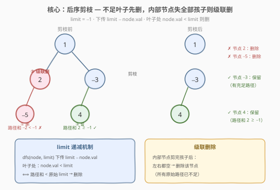
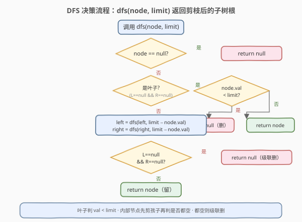
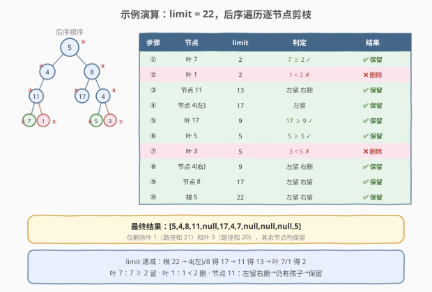

# 根到叶路径上的不足节点

- **题目名称**：根到叶路径上的不足节点
- **链接**：[1080. 根到叶路径上的不足节点](https://leetcode.cn/problems/insufficient-nodes-in-root-to-leaf-paths/)
- **难度**：中等
- **标签**：树、二叉树、深度优先搜索、后序遍历

## 1. 题目概述

给定二叉树的根节点 `root` 和一个整数 `limit`，同时删除树中所有**不足节点**，返回最终二叉树的根节点。

> **不足节点**：如果通过节点 `node` 的**每一种**可能的「根到叶」路径上值的总和**全都严格小于** `limit`，则该节点为不足节点，需要被删除。

> 💡 **叶子节点**：没有子节点的节点。注意：一个内部节点在子节点被删完后也会「变成」叶子，此时仍需按不足节点定义判定是否继续删除——这就是**级联删除**的来源。

**示例 1**：

```text
输入：root = [1,2,3,4,-99,-99,7,8,9,-99,-99,12,13,-99,14], limit = 1
输出：[1,2,3,4,null,null,7,8,9,null,14]

原树（-99 为极小哨兵值，非 null）：
                              1
                           /     \
                          2       3
                         / \     / \
                        4  -99 -99   7
                       / \         / \
                      8   9      -99  14
                     / \  / \
                   12 13 -99 -99

路径和 ≥ 1 的叶：8(15)、9(16)、14(25) → 保留
路径和 < 1 的叶：-99×4(−195/−88)、12(−83)、13(−82) → 删除
级联：-99(2的右子)和-99(3的左子)孩子全删→变叶→路径和 −96/−95 < 1 → 删除
```

**示例 2**：

```text
输入：root = [5,4,8,11,null,17,4,7,1,null,null,5,3], limit = 22
输出：[5,4,8,11,null,17,4,7,null,null,null,5]

              5                    5
           /     \              /     \
          4       8            4       8
         /       / \     →    /       / \
        11      17  4        11      17  4
       / \         / \       /         /
      7   1       5   3     7         5

路径和：7→27✓ 1→21✗ 17→30✓ 5→22✓ 3→20✗
删除叶 1 和叶 3，其余保留
```

**示例 3**：

```text
输入：root = [1,2,-3,-5,null,4,null], limit = -1
输出：[1,null,-3,4]

          1                  1
         / \                  \
        2   -3      →         -3
       /   /                  /
     -5   4                  4

路径和：1+2+(-5)=-2 < -1 ✗  ｜  1+(-3)+4=2 ≥ -1 ✓
删叶 -5 → 节点 2 变叶 → 原始路径已全不足 → 级联删
```

**约束条件**：

- 树中节点数目在范围 `[1, 5000]` 内
- $-10^5 \leq \text{Node.val} \leq 10^5$
- $-10^9 \leq \text{limit} \leq 10^9$

> 💡 本题是「**后序遍历 + 原地剪枝**」家族的招牌题。一棵子树是否需要保留，取决于「它的子树中是否存在至少一条充足的根到叶路径」——这是天然的后序（自底向上）结构。与 [250. 统计同值子树](../0201-0300/250_统计同值子树.md)（后序传递布尔同值性）和 [1325. 删除给定值的叶节点](https://leetcode.cn/problems/delete-leaves-with-a-given-value/)（后序删除叶子+级联）同构，区别在于本题的删除判据是**路径和 vs limit**，而非节点值匹配。

---

## 2. 解题思路

### 2.1 暴力思路：逐节点独立检查所有路径

最直观的做法：对每个节点，独立地在它的子树中找出所有「根到叶」路径并计算路径和，若**所有**路径和都 $< \text{limit}$，则标记该节点为不足，最后统一删除。

> ⚠️ **问题：$O(n^2)$ 重复扫描**。每个节点的路径检查都要重新遍历其子树，父子之间信息无法复用——父节点的判定完全重复了子节点已经做过的扫描。更糟的是，删除节点后父节点可能变叶，需要多轮迭代直到稳定，最坏 $O(n \cdot h)$ 轮，每轮 $O(n)$。

> 💡 **关键观察**：一个子节点被删除，**等价于**「通过该子节点的所有路径都不足」这一结论已经确定。父节点只需知道哪些子节点被删了，就能判断自己是否所有路径都不足——无需重新扫描。这正是**后序传递**的切入点。

### 2.2 核心观察：后序剪枝 + limit 递减



关键洞察有两层：

**第一层：limit 递减下传**。与其自顶向下累积路径和再与 `limit` 比较，不如把 `limit` 本身作为参数**递减下传**——每经过一个节点，`limit -= node.val`。这样在叶子处，只需比较 `node.val < limit`（剩余阈值）即可判定路径是否不足，等价于「路径和 $<$ 原始 limit」。

> 💡 **等价性证明**：设原始 limit 为 $L$，从根到叶子的路径和为 $S = v_0 + v_1 + \dots + v_k$。递归到叶子时，传入的 limit 已被沿途节点值递减为 $L' = L - (v_0 + v_1 + \dots + v_{k-1})$。叶子处判定 `node.val < limit` 即 $v_k < L'$，等价于 $v_k < L - (v_0 + \dots + v_{k-1})$，即 $S < L$。✓

**第二层：级联删除**。内部节点在递归剪完左右子树后，如果**两个孩子都变成了 `null`**（被删除），说明通过该节点的**所有原始根到叶路径都已不足**（因为每条路径必然经过某个被删的子树），该节点本身也是不足节点，应当删除。

> ⚠️ **为什么不检查「变叶后的路径和」？** 因为不足节点的定义基于**原始树**的根到叶路径。内部节点 2 在原始树中的唯一叶路径经过 -5（路径和 $-2 < -1$），所以 2 是不足节点——即使删掉 -5 后 2「看起来」变成了路径和为 3 的叶子，那也不是原始路径。算法中 `!left && !right → return null` 恰好实现了这一点：**孩子全删 = 所有原始路径已不足 = 该节点也删**。

> 💡 **与 [1325. 删除给定值的叶节点](https://leetcode.cn/problems/delete-leaves-with-a-given-value/) 的对照**：1325 删除值为 `target` 的叶子，删后变叶的内部节点若值也为 `target` 则继续删——级联逻辑完全相同。区别在于 1325 的删除判据是「节点值 == target」（与路径无关），而 1080 的判据是「路径和 < limit」（需要 limit 递减下传来计算）。

### 2.3 算法流程图



**DFS 递归逻辑**（函数 `dfs(node, limit)` 返回剪枝后的子树根节点）：

| 情况 | 处理 | 返回值 |
|------|------|--------|
| `node == null` | 空子树 | `null` |
| 叶子（`L==null && R==null`） | `node.val < limit`？是→不足；否→充足 | 不足→`null`；充足→`node` |
| 内部节点 | 先递归剪枝：`left = dfs(L, limit - val)`，`right = dfs(R, limit - val)` | ↓ |
| 剪枝后 `L==null && R==null` | 孩子全删→所有原始路径已不足→级联删 | `null` |
| 剪枝后仍有孩子 | 至少一条充足路径存在 | `node` |

> ⚠️ **必须先递归再判定**：内部节点的剪枝顺序是「先剪左右子树，再判自身」。如果在递归前就判定，会漏掉子树内部的不足节点。这是后序遍历的核心——**先处理子问题，再用子问题的结论解决父问题**。

> 💡 **原地修改**：算法直接修改 `node.left` 和 `node.right` 指针（赋值为递归返回值），不需要额外空间记录删除标记。递归返回值即剪枝后的子树根——可能是 `node` 本身（保留），也可能是 `null`（删除）。调用方（父节点）直接用返回值更新自己的子指针，天然完成「断链」。

### 2.4 示例演算

以示例 2（`root = [5,4,8,11,null,17,4,7,1,null,null,5,3]`, `limit = 22`）为例，后序遍历逐节点剪枝：



| 步骤 | 节点 | limit（递减后） | 判定 | 结果 |
|------|------|----------------|------|------|
| ① | 叶 7 | $22 - 5 - 4 - 11 = 2$ | $7 \geq 2$ ✓ | ✅ 保留 |
| ② | 叶 1 | $2$ | $1 < 2$ ✗ | ❌ 删除 |
| ③ | 节点 11 | $22 - 5 - 4 = 13$ | 左留右删，仍有孩子 | ✅ 保留 |
| ④ | 节点 4(左) | $22 - 5 = 17$ | 左留 | ✅ 保留 |
| ⑤ | 叶 17 | $22 - 5 - 8 = 9$ | $17 \geq 9$ ✓ | ✅ 保留 |
| ⑥ | 叶 5 | $22 - 5 - 8 - 4 = 5$ | $5 \geq 5$ ✓ | ✅ 保留 |
| ⑦ | 叶 3 | $5$ | $3 < 5$ ✗ | ❌ 删除 |
| ⑧ | 节点 4(右) | $22 - 5 - 8 = 9$ | 左留右删，仍有孩子 | ✅ 保留 |
| ⑨ | 节点 8 | $17$ | 左留右留 | ✅ 保留 |
| ⑩ | 根 5 | $22$ | 左留右留 | ✅ 保留 |

> 💡 **limit 递减追踪**：根 5 处 limit = 22。每往下一层减去节点值：到 4(左)/8 得 17，到 11 得 13，到叶 7/1 得 2。叶 7 处 $7 \geq 2$（路径和 $27 \geq 22$）保留；叶 1 处 $1 < 2$（路径和 $21 < 22$）删除。节点 11 的右孩子被删，但左孩子 7 保留 → 仍有孩子 → 不级联 → 保留。

> 💡 **关键对比 ② vs ③**：叶 1 因路径和不足被删（②），但它的父节点 11 并未被删（③）——因为 11 还有另一个孩子 7（路径充足）。只有当**所有**孩子都被删时，内部节点才会级联删除。这与 [250](../0201-0300/250_统计同值子树.md) 中「一假即传递 false」不同——250 是**判定**问题（任一子树不同值则父不同值），1080 是**剪枝**问题（任一子树充足则父保留）。

---

## 3. 参考代码

### C++

```cpp
/**
 * Definition for a binary tree node.
 * struct TreeNode {
 *     int val;
 *     TreeNode *left;
 *     TreeNode *right;
 *     TreeNode() : val(0), left(nullptr), right(nullptr) {}
 *     TreeNode(int x) : val(x), left(nullptr), right(nullptr) {}
 *     TreeNode(int x, TreeNode *left, TreeNode *right) : val(x), left(left), right(right) {}
 * };
 */
class Solution {
  public:
    TreeNode* sufficientSubset(TreeNode* root, int limit) {
        if (root == nullptr) return nullptr;
        if (root->left == nullptr && root->right == nullptr)        // 叶子
            return root->val < limit ? nullptr : root;              // 不足→删；充足→留
        root->left  = sufficientSubset(root->left,  limit - root->val);  // 先剪左
        root->right = sufficientSubset(root->right, limit - root->val);  // 再剪右
        if (root->left == nullptr && root->right == nullptr)        // 孩子全删→级联删
            return nullptr;
        return root;                                                // 仍有孩子→保留
    }
};
```

### Python

```python
class Solution:
    def sufficientSubset(self, root: Optional[TreeNode], limit: int) -> Optional[TreeNode]:
        if not root:
            return None
        if not root.left and not root.right:                        # 叶子
            return None if root.val < limit else root               # 不足→删；充足→留
        root.left  = self.sufficientSubset(root.left,  limit - root.val)  # 先剪左
        root.right = self.sufficientSubset(root.right, limit - root.val)  # 再剪右
        if not root.left and not root.right:                        # 孩子全删→级联删
            return None
        return root                                                 # 仍有孩子→保留
```

> 💡 **代码极简的秘密**：递归返回值直接赋给 `root->left` / `root->right`，一步完成「剪枝 + 断链」。返回 `nullptr` 即删除该子树，返回 `node` 即保留。无需额外标记数组、无需后处理删除——**递归返回值即剪枝结果**。

> 💡 **叶子判定在前**：必须先判 `!left && !right`（是否叶子），再据此分支。不能在 `node == nullptr` 时判定路径和——因为一个叶子有两个 `null` 孩子，会在 `null` 处重复累加。正确做法是在**叶子本身**处判定 `val < limit`，`null` 只返回 `null`。

---

## 4. 复杂度分析

| 维度 | 复杂度 | 说明 |
|------|--------|------|
| **时间复杂度** | $O(n)$ | 每个节点恰好访问一次，每次做 $O(1)$ 的减法与比较；剪枝在递归返回时原地完成 |
| **空间复杂度** | $O(h)$ | 递归调用栈深度 = 树高 $h$。平衡树 $h = O(\log n)$；链状树 $h = O(n)$ |

> ⚠️ 暴力法 $O(n^2)$ 的浪费在于：每个节点独立检查路径时重复扫描子树，且多轮迭代直到稳定。后序剪枝法把「子树是否存在充足路径」这一结论压缩成「子节点是否被删」一个布尔信号向上传递，避免了所有重复扫描——本质上和 [250](../0201-0300/250_统计同值子树.md) 用布尔返回值传递同值性是同一种**自底向上信息复用**思想。

> 💡 **溢出分析**：`limit` 递减后范围为 $[-10^9 - 5 \times 10^8, 10^9 + 5 \times 10^8] = [-1.5 \times 10^9, 1.5 \times 10^9]$（极端情况：5000 个节点全为 $\pm 10^5$），仍在 32 位 `int` 范围内（$[-2.1 \times 10^9, 2.1 \times 10^9]$），无需 `long long`。

---

## 5. 扩展：累积和写法

limit 递减并非唯一写法。也可以自顶向下**累积路径和**，在叶子处比较 `sum + node.val < limit`：

```python
class Solution:
    def sufficientSubset(self, root: Optional[TreeNode], limit: int) -> Optional[TreeNode]:
        def dfs(node: Optional[TreeNode], acc: int) -> Optional[TreeNode]:
            if not node:
                return None
            acc += node.val
            if not node.left and not node.right:          # 叶子
                return None if acc < limit else node       # 路径和 < limit → 删
            node.left  = dfs(node.left, acc)               # 累积下传
            node.right = dfs(node.right, acc)
            if not node.left and not node.right:           # 孩子全删→级联删
                return None
            return node

        return dfs(root, 0)
```

> 💡 **两种写法等价**：`limit 递减`在叶子处判 `node.val < limit - acc`；`累积和`在叶子处判 `acc + node.val < limit`。两者是同一不等式的两种变形。limit 递减版更简洁（少一个参数，叶子判定只需 `val < limit`），累积和版更直观（路径和显式可见，便于调试）。面试时两种都提一句更显功底。

> ⚠️ 累积和版需多传一个 `acc` 参数，但 Python `int` 无溢出问题；C++ 版需注意 `acc` 用 `long long` 防极端溢出（5000 个 $10^5$ 累加达 $5 \times 10^8$，加 limit $10^9$ 后接近 `int` 上限，保险起见用 `long long`）。limit 递减版则天然规避此问题——`limit` 始终在 `int` 范围内。

---

## 6. 面试要点

1. **为什么用后序遍历而不是前序或自顶向下？**

   > 一个节点是否不足，取决于其子树中**是否存在**充足的路径——这需要先知道子树的剪枝结果。后序（先递归左右，再处理根）天然满足「先获取子问题结论，再解决父问题」。前序/自顶向下在处理父节点时尚未知道子树哪些路径会被剪掉，无法一次完成。

2. **内部节点变叶后为什么直接删除，不检查路径和？**

   > 不足节点的定义基于**原始树**的根到叶路径。内部节点在原始树中不是叶子，其所有路径都经过某个子树。如果所有子树都被删除（孩子全删），意味着所有原始路径都已不足，该节点必然是不足节点。即使删后「看起来」路径和充足，那也不是原始路径——算法中 `!left && !right → return null` 精确实现了这一逻辑。

3. **limit 递减和累积和两种写法有何区别？**

   > 完全等价。limit 递减：`dfs(node, limit - val)`，叶子判 `val < limit`；累积和：`dfs(node, acc + val)`，叶子判 `acc < limit`。两者是同一不等式的变形。limit 递减版少一个参数更简洁，累积和版路径和显式更易调试。C++ 中 limit 递减版天然规避溢出（limit 始终在 int 范围），累积和版建议用 `long long`。

4. **需要担心溢出吗？**

   > limit 递减版不需要。极端情况（5000 节点全 $\pm 10^5$），递减后 limit 范围 $[-1.5 \times 10^9, 1.5 \times 10^9]$，在 32 位 `int` 范围内。累积和版中 `acc` 最大 $5 \times 10^8$，加 limit $10^9$ 后接近 `int` 上限，保险起见用 `long long`。

5. **暴力 $O(n^2)$ 和最优 $O(n)$ 的本质区别是什么？**

   > 暴力法对每个节点独立扫描子树检查路径和，且可能需多轮迭代直到稳定——父子之间信息无法复用。最优法把「子树是否存在充足路径」压缩成「子节点是否被删」一个信号向上传递，父节点直接读取孩子的剪枝结果，一次遍历完成。这与 [250](../0201-0300/250_统计同值子树.md) 用布尔返回值传递同值性、[124. 二叉树中的最大路径和](../0101-0200/124_二叉树中的最大路径和.md) 用返回值传递子树最大贡献是同一种「自底向上信息复用」范式。

> 💡 **一句话总结**：1080 的灵魂是「**后序剪枝 + limit 递减 + 级联删除**」三件套——递归下传 `limit - val`，叶子判 `val < limit`，内部节点剪完孩子后若全空则级联删。它和 [1325](https://leetcode.cn/problems/delete-leaves-with-a-given-value/)（后序删叶+级联，判据为值匹配）共享级联骨架，和 [250](../0201-0300/250_统计同值子树.md)（后序布尔传递）共享自底向上信息复用思想，区别只在删除判据从「值」升级为「路径和 vs limit」。

---

## 7. 同类练习题

- [1325. 删除给定值的叶节点](https://leetcode.cn/problems/delete-leaves-with-a-given-value/)：后序删除叶子 + 级联删除的简化版，判据从「路径和 < limit」降为「节点值 == target」，对照学习级联骨架
- [250. 统计同值子树](https://leetcode.cn/problems/count-univalue-subtrees/)（[题解](../0201-0300/250_统计同值子树.md)）：后序遍历 + 布尔返回值传递子结构结论，同套「自底向上信息复用」模板
- [112. 路径总和](https://leetcode.cn/problems/path-sum/)（[题解](../0101-0200/112_路径总和.md)）：树 DFS 路径和判定的基础题，`cur + val` 下传 + 叶子判等，1080 的路径和计算即由此延伸
- [124. 二叉树中的最大路径和](https://leetcode.cn/problems/binary-tree-maximum-path-sum/)（[题解](../0101-0200/124_二叉树中的最大路径和.md)）：后序传递子树最大贡献值，在节点处聚合路径和，同套「后序 + 返回值传递」模板
- [236. 二叉树的最近公共祖先](https://leetcode.cn/problems/lowest-common-ancestor-of-a-binary-tree/)（[题解](../0101-0200/236_二叉树最近公共祖先.md)）：后序传递「子树是否含 p/q」，在节点处聚合判定 LCA，同套后序布尔传递骨架
