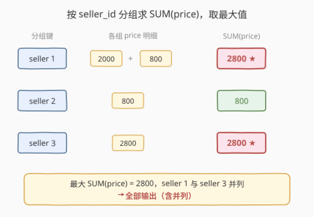
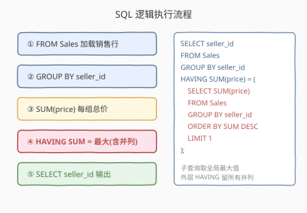
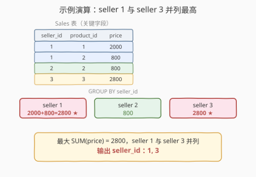

# LeetCode 销售分析 I 题解

> ⚠️ **注意**：本题是 LeetCode 数据库（SQL）类题目，在 leetcode.cn 上为 **Plus 会员专享题**，[leetcode.com](https://leetcode.com/problems/sales-analysis-i/) 可免费练习。本文代码部分使用 SQL（及 pandas 对照）而非 C++/Python。

## 1. 题目概述

- **标题 / 题号**：销售分析 I（#1082，easy）
- **链接**：https://leetcode.cn/problems/sales-analysis-i/
- **难度**：简单
- **标签**：SQL、数据库、GROUP BY、聚合、子查询、MAX/HAVING

**题意**：给定 `Product` 表（产品信息）与 `Sales` 表（销售记录），编写 SQL 查询，报告**最佳卖家**——即销售**总价最高**的卖家。若存在并列，则**全部报告**（顺序不限）。

> 💡 「销售总价」指某卖家所有销售记录的 `price` 之和（`price` 已是该笔销售的成交总价，无需再乘 `quantity`）。

**表结构**：

```text
表：Product
+--------------+---------+
| 列名         | 类型    |
+--------------+---------+
| product_id   | int     |  ← 主键
| product_name | varchar |
| unit_price   | int     |
+--------------+---------+
product_id 是该表的主键。
每行表示一种产品的名称与单价。

表：Sales
+-------------+---------+
| 列名        | 类型    |
+-------------+---------+
| seller_id   | int     |
| product_id  | int     |  ← 外键 → Product.product_id
| buyer_id    | int     |
| sale_date   | date    |
| quantity    | int     |
| price       | int     |
+-------------+---------+
该表无主键，行可重复。
product_id 是关联到 Product 表的外键。
每行记录一笔销售：卖家、产品、买家、日期、数量与成交总价 price。
```

**示例 1**：

```text
输入：
Product 表
+------------+--------------+------------+
| product_id | product_name | unit_price |
+------------+--------------+------------+
| 1          | S8           | 1000       |
| 2          | G4           | 800        |
| 3          | iPhone       | 1400       |
+------------+--------------+------------+
Sales 表
+-----------+------------+----------+------------+----------+-------+
| seller_id | product_id | buyer_id | sale_date  | quantity | price |
+-----------+------------+----------+------------+----------+-------+
| 1         | 1          | 1        | 2019-01-21 | 2        | 2000  |
| 1         | 2          | 2        | 2019-02-17 | 1        | 800   |
| 2         | 2          | 3        | 2019-06-02 | 1        | 800   |
| 3         | 3          | 4        | 2019-05-13 | 2        | 2800  |
+-----------+------------+----------+------------+----------+-------+
输出：
+-----------+
| seller_id |
+-----------+
| 1         |
| 3         |
+-----------+
解释：按 seller_id 求 SUM(price)：
      seller 1 = 2000 + 800 = 2800
      seller 2 = 800
      seller 3 = 2800
      最高总价 2800，seller 1 与 seller 3 并列 → 全部输出。
```

**约束**：

- `Sales` 表无主键，行可重复；`product_id` 为指向 `Product` 的外键
- `price` 为该笔销售的成交总价（已含数量），无需 `× quantity`
- 结果只含 `seller_id` 一列；并列时全部返回，顺序不限

> 💡 本题是 SQL「**分组求最值 + 并列全输出**」的招牌题。考点不在语法复杂度，而在两点：① 把「最佳卖家」翻译成 `GROUP BY seller_id` + `SUM(price)`；② 处理并列——不能用 `ORDER BY ... LIMIT 1`（会丢并列），必须用子查询取「全局最大值」再用 `HAVING` 筛回所有命中者。

## 2. 解题思路

### 2.1 暴力思路：ORDER BY + LIMIT（陷阱写法）

最直觉的写法是分组后按总价降序取第一条：

```sql
SELECT seller_id
FROM Sales
GROUP BY seller_id
ORDER BY SUM(price) DESC
LIMIT 1;
```

> ⚠️ **这会漏掉并列**！`LIMIT 1` 只返回一行，若两个卖家总价相同且都是最高，只会输出其中一个。本题明确要求「并列全部报告」，所以必须先算出「全局最大值」，再筛出所有等于该最大值的卖家。

另一种暴力是把全表读入应用层，用哈希表 `map<seller_id, sum>` 逐行累加，再扫一遍找最大并收集所有命中者。这能做对，但把本该由数据库引擎高效完成的聚合搬到应用层，违背 SQL 的声明式哲学。

### 2.2 核心观察：GROUP BY + SUM + HAVING = 全局最大



本题可拆成两个子问题：

| 子问题 | SQL 手段 |
|--------|----------|
| ① 每个卖家的销售总价 | `GROUP BY seller_id` + `SUM(price)` |
| ② 找出最高总价，并把所有命中者留下 | 子查询算全局最大值，外层 `HAVING SUM(price) = 最大值` |

**关键陷阱与对策**：

- **「最高」要用「等于全局最大」表达**，而非 `ORDER BY ... LIMIT 1`。后者无法处理并列。
- **全局最大值怎么取**？子查询 `SELECT SUM(price) FROM Sales GROUP BY seller_id ORDER BY SUM(price) DESC LIMIT 1`——它本身只取一行，但拿到的是「那个最大数值」；外层 `HAVING SUM(price) = (该数值)` 会把所有等于它的组都留下，并列自然全部返回。

> 💡 **为什么外层用 HAVING 而非 WHERE？** `WHERE` 在分组前逐行过滤，不能使用聚合函数（`SUM`）；`HAVING` 在分组后对「组」过滤，可以引用 `SUM(price)`。本题筛选条件是对「每组的总价」做判断，必须用 `HAVING`。承接 [1050. 合作过至少三次的演员和导演](../1001-1100/1050_合作过至少三次的演员和导演.md) 的 `HAVING COUNT(*) >= 3`——同样是「对聚合结果筛选」。

> 💡 **`price` vs `quantity × unit_price`**：`Sales` 表里 `price` 已经是该笔销售的成交总价（= `quantity × unit_price`，如 seller 1 卖 2 件 S8、单价 1000 → price = 2000）。因此求总价直接 `SUM(price)`，**不要再乘 quantity**。`Product.unit_price` 在本题中是干扰信息，无需 JOIN。

### 2.3 算法流程图



SQL 的**逻辑执行顺序**与书写顺序不同：

```text
书写顺序：SELECT → FROM → GROUP BY → HAVING
执行顺序：FROM → GROUP BY → HAVING → SELECT
```

1. **FROM Sales**：加载销售记录。
2. **GROUP BY seller_id**：按卖家分组成若干组。
3. **SUM(price)**：每组计算总价（聚合）。
4. **HAVING SUM(price) = (子查询全局最大值)**：只留总价等于最大值的组——并列者全部保留。
5. **SELECT seller_id**：投影输出卖家 id。

> 💡 子查询 `(SELECT SUM(price) ... LIMIT 1)` 只执行一次，返回一个标量（最大数值）。外层主查询对每个分组用 `HAVING` 与该标量比较，等价于「留所有并列最高」。这与「先排序再截断」的思路本质不同——它是「先定阈值，再筛命中」，天然支持并列。

### 2.4 示例演算



以示例数据为例，4 条 Sales 记录按 `seller_id` 分成 3 组：

| 分组 | seller_id | 各笔 price | SUM(price) | 是否最大？ |
|------|-----------|-----------|-----------|-----------|
| A    | 1         | 2000, 800 | 2800      | ✅ YES     |
| B    | 2         | 800       | 800       | ❌ NO      |
| C    | 3         | 2800      | 2800      | ✅ YES     |

子查询算出全局最大值 = 2800，外层 `HAVING SUM(price) = 2800` 留下分组 A 和 C，输出 `seller_id = 1, 3`。

> ⚠️ **若误用 `ORDER BY ... LIMIT 1`**：分组 A、C 总价同为 2800，排序后谁排第一取决于引擎稳定性，只会输出一个（1 或 3），漏掉另一个并列者。这正是本题设置并列用例的目的——考察「并列全输出」的处理。

## 3. 参考代码

### SQL（子查询取最大值，推荐）

```sql
SELECT seller_id
FROM Sales
GROUP BY seller_id
HAVING SUM(price) = (
    SELECT SUM(price)
    FROM Sales
    GROUP BY seller_id
    ORDER BY SUM(price) DESC
    LIMIT 1
);
```

> 💡 **写法要点**：
> - 子查询 `GROUP BY seller_id` + `ORDER BY SUM(price) DESC` + `LIMIT 1` 取到「最高总价的数值」（标量）。
> - 外层 `HAVING SUM(price) = (标量)` 把所有等于该数值的卖家留下，并列全部返回。
> - 无需 `JOIN Product`——`product_name`、`unit_price` 在本题是干扰信息，`price` 已含总价。

### SQL（ALL 写法，免排序）

```sql
SELECT seller_id
FROM Sales
GROUP BY seller_id
HAVING SUM(price) >= ALL (
    SELECT SUM(price)
    FROM Sales
    GROUP BY seller_id
);
```

> 💡 `>= ALL (...)` 表示「大于等于子查询结果中的每一个」，等价于「等于最大值」。优点是无需 `ORDER BY ... LIMIT`，语义直观；缺点是部分老旧引擎对 `ALL` 优化不佳。本题数据量小，两种写法均可。

### SQL（窗口函数 RANK，MySQL 8+）

```sql
SELECT seller_id
FROM (
    SELECT seller_id,
           RANK() OVER (ORDER BY SUM(price) DESC) AS rnk
    FROM Sales
    GROUP BY seller_id
) t
WHERE rnk = 1;
```

> 💡 窗口函数在 `GROUP BY` 之后执行：先按 `seller_id` 分组得到每组的 `SUM(price)`，再对其用 `RANK() OVER (ORDER BY SUM(price) DESC)` 排名。`RANK` 对并列赋予相同名次（1,1,3），外层 `WHERE rnk = 1` 取所有第一名——天然处理并列。注意用 `RANK` 而非 `ROW_NUMBER`（后者强制造异，会丢并列）。

### Python（pandas）

```python
import pandas as pd

def sales_analysis(sales: pd.DataFrame, product: pd.DataFrame) -> pd.DataFrame:
    total = sales.groupby('seller_id')['price'].sum()
    return total[total == total.max()].reset_index()[['seller_id']]
```

> 💡 **pandas 对照**：`groupby('seller_id')['price'].sum()` 对应 `GROUP BY seller_id` + `SUM(price)`；`total.max()` 对应子查询取全局最大值；`total == total.max()` 布尔索引对应 `HAVING SUM = 最大`，并列者全部保留。`reset_index()` 把 `seller_id` 从索引变回列。

## 4. 复杂度分析

| 维度 | 复杂度 | 说明 |
|------|--------|------|
| 时间复杂度 | $O(n)$ | 全表扫描两次（主查询 + 子查询各一次）；`GROUP BY` 走哈希聚合 $O(n)$，子查询排序取最大 $O(k \log k)$（$k$ 为不同卖家数，$k \ll n$） |
| 空间复杂度 | $O(k)$ | 聚合中间结果存储每个卖家的总价，$k$ = 不同 `seller_id` 数量 |
| 结果行数 | $O(k)$ | 最坏全部并列时返回 $k$ 行 |

> 💡 **`ALL` 写法 vs 子查询写法**：`ALL` 版只需一次扫描算出所有组总价，再两两比较，理论 $O(n + k^2)$ 比较；现代优化器常把 `>= ALL` 重写为 `>= MAX(...)`，实际仍 $O(n)$。子查询版需扫描两次但语义最清晰。数据量大时可在 `seller_id` 上建索引加速聚合。

## 5. 扩展：求最值的四种 SQL 范式

「分组求最值并取所有并列」是高频考点，至少有四种等价写法：

| 写法 | 核心 | 并列处理 | 备注 |
|------|------|---------|------|
| **子查询 + HAVING** | `HAVING SUM = (SELECT ... LIMIT 1)` | ✅ 全保留 | 最通用，兼容所有引擎 |
| **ALL** | `HAVING SUM >= ALL (SELECT ...)` | ✅ 全保留 | 免排序，语义直观 |
| **窗口函数 RANK** | `RANK() OVER (ORDER BY SUM DESC)` → `WHERE rnk=1` | ✅ 全保留 | 需 MySQL 8+ / PG / SQL Server |
| **自连接** | 分组表自连，筛「没有别人比我大」的组 | ✅ 全保存 | $O(k^2)$，仅作教学理解 |

### 5.1 RANK vs DENSE_RANK vs ROW_NUMBER

| 函数 | 并列名次 | 下一名 | 本题适用？ |
|------|---------|--------|-----------|
| `ROW_NUMBER` | 强制造异（1,2,3） | — | ❌ 会丢并列 |
| `RANK` | 同名次（1,1,3） | 跳过 | ✅ `WHERE rnk=1` 取全部第一 |
| `DENSE_RANK` | 同名次（1,1,2） | 不跳 | ✅ 同样可行 |

> 💡 本题只需「是不是第一名」，`RANK` 和 `DENSE_RANK` 都对（`rnk=1` 命中所有并列最高）。区别在「第二名」的语义：`RANK` 下 2800 之后 800 是第 3 名，`DENSE_RANK` 下是第 2 名。若题目改为「取前 2 名总价」，两者结果不同——这是面试常考的辨析点。

### 5.2 自连接写法（理解用）

```sql
SELECT s1.seller_id
FROM Sales s1
GROUP BY s1.seller_id
HAVING SUM(s1.price) >= ALL (
    SELECT SUM(s2.price) FROM Sales s2 GROUP BY s2.seller_id
);
```

> 💡 这其实就是 `ALL` 写法。真正的「自连接」版本是 `LEFT JOIN ... ON 子总价 > 父总价 WHERE 子.id IS NULL`（即「不存在比我大的」），但写法冗长且 $O(k^2)$，仅用于理解「最大 = 没有别人更大」的逻辑本质。

## 6. 面试要点

1. **为什么不能用 `ORDER BY SUM(price) DESC LIMIT 1`？**

   > `LIMIT 1` 只返回一行，若多个卖家总价并列最高，会丢失其余并列者。本题要求「并列全部报告」，必须先用子查询或 `ALL`/`RANK` 求出「最大值/第一名」，再筛回所有命中者——「先定阈值，再筛命中」而非「排序截断」。

2. **`HAVING` 和 `WHERE` 的区别？**

   > `WHERE` 在 `GROUP BY` **之前**逐行过滤，不能用聚合函数；`HAVING` 在 `GROUP BY` **之后**对「组」过滤，可以引用 `SUM`/`COUNT` 等。本题筛选条件是「每组的总价 = 最大值」，是对聚合结果的判断，必须用 `HAVING`。

3. **子查询里的 `LIMIT 1` 和外层的并列处理矛盾吗？**

   > 不矛盾。子查询 `LIMIT 1` 取的是「那个最大数值」（标量），不是「那个卖家」。即使有并列，最大数值唯一（如 2800），子查询返回 2800；外层 `HAVING SUM(price) = 2800` 把所有等于 2800 的组都留下。子查询只负责「定阈值」，外层负责「筛命中」。

4. **为什么不需要 JOIN Product 表？**

   > 题目只要求输出 `seller_id`，而 `price`（成交总价）已在 `Sales` 表中。`Product.unit_price` 与 `product_name` 是干扰信息——`price` 已是 `quantity × unit_price` 的结果，无需再关联产品表计算。盲目 JOIN 反而增加 $O(m \log n)$ 连接成本且无业务必要。

5. **窗口函数版为什么用 `RANK` 而非 `ROW_NUMBER`？**

   > `ROW_NUMBER` 对并列行强制造异名次（1,2,3），`WHERE rnk=1` 只取一个，丢并列；`RANK` 对并列赋予相同名次（1,1,3），`WHERE rnk=1` 取全部第一名。本题要并列全输出，必须用 `RANK` 或 `DENSE_RANK`。

> 💡 **一句话总结**：1082 是 SQL「**分组求最值 + 并列全输出**」母题——`GROUP BY seller_id` + `SUM(price)` 算总价，子查询取全局最大，`HAVING SUM = 最大` 筛回所有命中者。灵魂在于识别「`ORDER BY LIMIT 1` 丢并列」的陷阱，改用「先定阈值再筛命中」的范式，与 [184. 部门工资最高的员工](https://leetcode.cn/problems/department-highest-salary/)（同套路 + JOIN）同构。

## 同类练习题

| # | 题目 | 与本题的关联 |
|---|------|-------------|
| 184 | [部门工资最高的员工](https://leetcode.cn/problems/department-highest-salary/) | `JOIN` + 子查询取部门最高工资 + `WHERE 工资 = 最高`，同套「分组最值 + 并列全输出」范式，叠加多表关联 |
| 1050 | [合作过至少三次的演员和导演](https://leetcode.com/problems/actors-and-directors-who-cooperate-at-least-three-times/)（[题解](../1001-1100/1050_合作过至少三次的演员和导演.md)） | `GROUP BY` + `HAVING COUNT(*) >= 3`，对照「对聚合结果筛选」时 `HAVING` 的使用 |
| 1068 | [产品销售分析 I](https://leetcode.cn/problems/product-sales-analysis-i/)（[题解](../1001-1100/1068_产品销售分析I.md)） | 同 `Sales`/`Product` 表系列的 JOIN 入门，理解 `price` 字段语义后再做本题 |
| 185 | [部门工资前三高的所有员工](https://leetcode.cn/problems/department-top-three-salaries/) | `DENSE_RANK() OVER (PARTITION BY ...)` 取前三高，本题「取第一」的进阶——辨析 `RANK` vs `DENSE_RANK` |
| 570 | [至少有 5 名直接下属的经理](https://leetcode.cn/problems/managers-with-at-least-5-direct-reports/) | 自连接 + `GROUP BY` + `HAVING COUNT >= 5`，综合连接与分组聚合筛选 |
