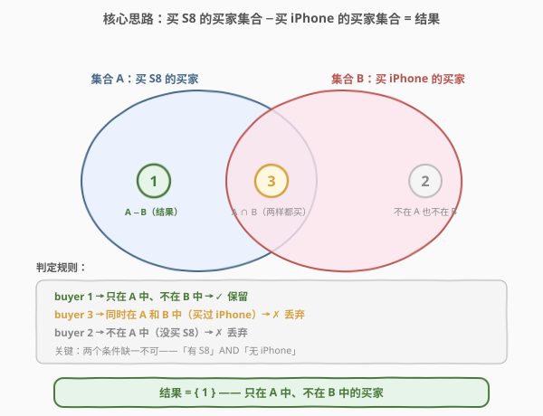
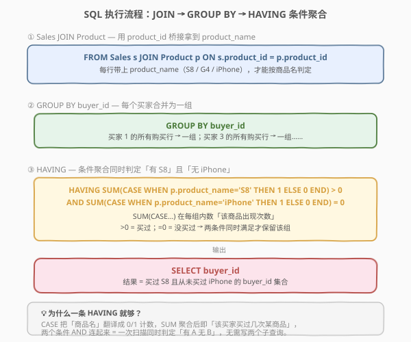
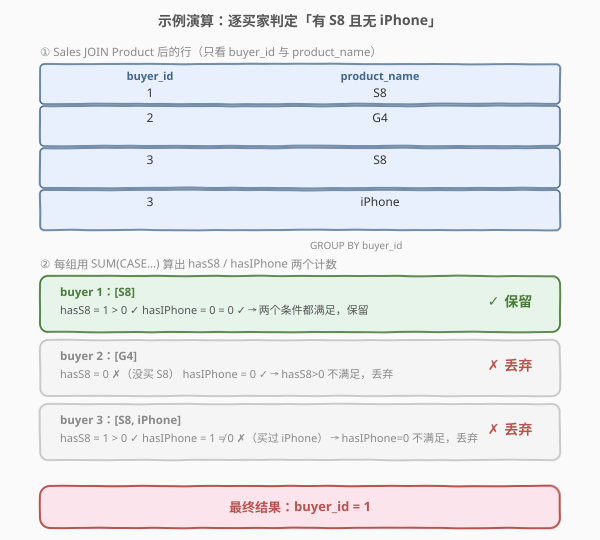

# 销售分析 II

- **题目名称**：销售分析 II
- **链接**：[1083. 销售分析 II](https://leetcode.cn/problems/sales-analysis-ii/)
- **难度**：简单
- **标签**：SQL、数据库、JOIN、GROUP BY、HAVING、条件聚合、CASE、集合差

> ⚠️ **注意**：本题是 LeetCode 数据库（SQL）类题目，在 leetcode.cn 上为 **Plus 会员专享题**，leetcode.com 上为免费题。本文代码部分使用 SQL 而非 C++/Python。

## 1. 题目概述

给定 `Product` 表（产品信息）与 `Sales` 表（销售记录），编写 SQL 查询，报告**买了 S8 但没买 iPhone 的买家**的 `buyer_id`。S8 和 iPhone 是 `Product` 表中存在的两种产品。

**表结构**：

```text
表：Product
+--------------+---------+
| 列名         | 类型    |
+--------------+---------+
| product_id   | int     |  ← 主键
| product_name | varchar |
| unit_price   | int     |
+--------------+---------+
product_id 是该表的主键。

表：Sales
+-------------+---------+
| 列名        | 类型    |
+-------------+---------+
| seller_id   | int     |
| product_id  | int     |  ← 外键 → Product.product_id
| buyer_id    | int     |
| sale_date   | date    |
| quantity    | int     |
| price       | int     |
+-------------+---------+
该表无主键，可以包含重复行。
product_id 是关联到 Product 表的外键。
```

**示例 1**：

```text
输入：
Product 表
+------------+--------------+------------+
| product_id | product_name | unit_price |
+------------+--------------+------------+
| 1          | S8           | 1000       |
| 2          | G4           | 800        |
| 3          | iPhone       | 1400       |
+------------+--------------+------------+

Sales 表
+-----------+------------+----------+------------+----------+-------+
| seller_id | product_id | buyer_id | sale_date  | quantity | price |
+-----------+------------+----------+------------+----------+-------+
| 1         | 1          | 1        | 2019-01-21 | 2        | 2000  |
| 1         | 2          | 2        | 2019-02-17 | 1        | 800   |
| 2         | 1          | 3        | 2019-06-02 | 1        | 800   |
| 3         | 3          | 3        | 2019-05-13 | 2        | 2800  |
+-----------+------------+----------+------------+----------+-------+

输出：
+-----------+
| buyer_id  |
+-----------+
| 1         |
+-----------+
解释：buyer 1 买了 S8 没买 iPhone → 符合。
     buyer 2 只买了 G4（没买 S8）→ 不符合。
     buyer 3 同时买了 S8 和 iPhone → 不符合（买了 iPhone）。
```

**约束条件**：

- `product_id` 为 `Product` 表主键，`Sales.product_id` 为指向 `Product` 的外键
- `Sales` 表无主键，同一 `buyer_id` 可出现多行（买过多个产品）
- 结果只输出 `buyer_id` 列

> 💡 本题是 SQL **集合差**母题——「有 A 无 B」是面试高频模式（买了 X 没买 Y、来过没走、选了课没退课）。核心是找到「买 S8 的买家集合」与「买 iPhone 的买家集合」，再做差集。SQL 提供条件聚合、`NOT IN`、`EXCEPT` 等多种表达方式，本解重点讲**条件聚合**这条最优雅的单次扫描路径。

---

## 2. 解题思路

### 2.1 暴力思路：两次查询在应用层做差集

最直觉的过程式思路分两步：

1. 查出「买过 S8 的所有 buyer_id」存入集合 A
2. 查出「买过 iPhone 的所有 buyer_id」存入集合 B
3. 在应用层算 $A - B$，遍历 A 踢掉出现在 B 中的元素

这能解决问题，但把**集合运算搬到了应用层**——两次查库、内存里再比对，既低效也违背 SQL 声明式哲学。应当让数据库一次性算完。

### 2.2 核心观察：条件聚合一次扫描同时判定「有 A 无 B」



这道题的本质是**集合差**：设

- 集合 $A$ = 买过 S8 的 `buyer_id` 全集
- 集合 $B$ = 买过 iPhone 的 `buyer_id` 全集

结果是 $A - B$（在 A 中但不在 B 中）。关键观察是——**不必先算两个集合再做差，可以在一次 `GROUP BY buyer_id` 中同时判定两个条件**：

| 条件 | SQL 表达 | 含义 |
|------|----------|------|
| 买过 S8 | `SUM(CASE WHEN product_name='S8' THEN 1 ELSE 0 END) > 0` | 该买家组里至少有一行是 S8 |
| 没买 iPhone | `SUM(CASE WHEN product_name='iPhone' THEN 1 ELSE 0 END) = 0` | 该买家组里没有任何一行是 iPhone |

> 💡 **`CASE` 把商品名翻译成 0/1，`SUM` 把同组多行聚成一个计数**。`SUM(CASE…)` 是 SQL 里最常用的「条件计数」惯用法：它等价于「在当前分组内数有多少行满足某条件」。`>0` 即「至少一次」，`=0` 即「从未出现」。两个条件 `AND` 起来，一条 `HAVING` 就同时表达了「有 A 无 B」。

> ⚠️ **为什么必须 JOIN Product？** `product_name`（S8 / iPhone）只存在于 `Product` 表，`Sales` 表只有 `product_id`。要在 `CASE` 里按商品名判定，必须先 `JOIN Product` 把名字拉进来。这与 [1069. 产品销售分析 II](../1001-1100/1069_产品销售分析II.md)（无需 JOIN，因为只按 `product_id` 聚合）形成对照——**是否 JOIN 取决于输出/判定所需的列在哪张表**。

### 2.3 算法流程图



完整的 SQL 逻辑执行流程如下：

```text
SELECT buyer_id                                    ← ④ 投影输出
FROM Sales s
JOIN Product p ON s.product_id = p.product_id      ← ① 桥接拿 product_name
GROUP BY buyer_id                                  ← ② 按买家分组
HAVING SUM(CASE WHEN p.product_name = 'S8'     THEN 1 ELSE 0 END) > 0
   AND SUM(CASE WHEN p.product_name = 'iPhone' THEN 1 ELSE 0 END) = 0;  ← ③ 条件筛选组
```

SQL 的逻辑执行顺序为 `FROM → JOIN ON → GROUP BY → HAVING → SELECT`：

1. **JOIN**：按 `product_id` 把 `Sales` 与 `Product` 拼接，每行带上 `product_name`。
2. **GROUP BY buyer_id**：把同一买家的所有购买行合并为一组。
3. **HAVING**：对每个分组计算两个条件计数，只保留「有 S8 且无 iPhone」的组。
4. **SELECT buyer_id**：输出通过筛选的买家。

### 2.4 示例演算



以示例数据为例，`Sales JOIN Product` 后按 `buyer_id` 分成 3 组：

| 分组（buyer_id） | 组内 product_name | hasS8 | hasIPhone | 判定 |
|------------------|-------------------|-------|-----------|------|
| 1 | S8 | 1 | 0 | ✓ 保留（有 S8、无 iPhone） |
| 2 | G4 | 0 | 0 | ✗ 丢弃（没有 S8） |
| 3 | S8, iPhone | 1 | 1 | ✗ 丢弃（买过 iPhone） |

- **buyer 1**：只买了 S8 → `hasS8=1>0 ✓` 且 `hasIPhone=0=0 ✓` → 保留。
- **buyer 2**：只买了 G4 → `hasS8=0`，第一个条件就不满足 → 丢弃（即便它也没买 iPhone，但题目要求「必须买过 S8」）。
- **buyer 3**：买了 S8 和 iPhone → `hasS8=1 ✓` 但 `hasIPhone=1≠0 ✗` → 丢弃。

最终只剩 buyer 1。

> ⚠️ **buyer 2 的陷阱**：它「没买 iPhone」为真，但「没买 S8」也为真——题目要求的是「买了 S8 但没买 iPhone」，两个条件缺一不可。这正是用 `AND` 连接两个 `HAVING` 条件而非只写一个「没买 iPhone」的原因。

---

## 3. 参考代码

### SQL（条件聚合，推荐）

```sql
SELECT buyer_id
FROM Sales s
JOIN Product p ON s.product_id = p.product_id
GROUP BY buyer_id
HAVING SUM(CASE WHEN p.product_name = 'S8'     THEN 1 ELSE 0 END) > 0
   AND SUM(CASE WHEN p.product_name = 'iPhone' THEN 1 ELSE 0 END) = 0;
```

> 💡 **写法要点**：
> - `JOIN Product` 拿到 `product_name`，是 `CASE` 判定的前提。
> - `GROUP BY buyer_id` 把同一买家所有购买行合并，`SUM(CASE…)` 在组内做条件计数。
> - `HAVING`（而非 `WHERE`）用于过滤**分组**——条件依赖聚合结果（`SUM`），必须在 `GROUP BY` 之后用 `HAVING`；`WHERE` 只能过滤单行、看不到分组聚合值。
> - 两个条件用 `AND` 连接，表达「同时满足有 S8 且无 iPhone」。

### SQL（NOT IN 子查询写法）

```sql
SELECT DISTINCT s.buyer_id
FROM Sales s
JOIN Product p ON s.product_id = p.product_id
WHERE p.product_name = 'S8'
  AND s.buyer_id NOT IN (
      SELECT s2.buyer_id
      FROM Sales s2
      JOIN Product p2 ON s2.product_id = p2.product_id
      WHERE p2.product_name = 'iPhone'
  );
```

> 💡 **两种写法对照**：
> - **条件聚合**：一次扫描 + 一次分组，逻辑集中在一条 `HAVING`，引擎只需遍历一遍 Sales。语义是「对每个买家，数它买过几次 S8、几次 iPhone」。
> - **NOT IN**：语义更直白——「先找买 S8 的，再踢掉买 iPhone 的」，对应集合差的字面定义。但需要两次访问 Sales（外层查 S8、子查询查 iPhone），且 `NOT IN` 对 `NULL` 敏感（见第 5 节）。
> - 面试中可先写 NOT IN 版本讲清思路，再优化为条件聚合版本展示 SQL 功底。

### Python（pandas）

```python
import pandas as pd

def sales_analysis(product: pd.DataFrame, sales: pd.DataFrame) -> pd.DataFrame:
    merged = sales.merge(product, on='product_id')
    buyers = (
        merged.groupby('buyer_id', as_index=False)
        .agg(
            has_s8=('product_name', lambda x: (x == 'S8').sum()),
            has_iphone=('product_name', lambda x: (x == 'iPhone').sum()),
        )
    )
    return buyers[
        (buyers['has_s8'] > 0) & (buyers['has_iphone'] == 0)
    ][['buyer_id']]
```

> 💡 **pandas 对照**：`merge(product, on='product_id')` 对应 `JOIN Product`；`groupby('buyer_id').agg(...)` 对应 `GROUP BY buyer_id` + `SUM(CASE…)`；最后的布尔筛选对应 `HAVING`。`(x == 'S8').sum()` 即「该买家组里 S8 出现的次数」，与 `SUM(CASE WHEN … THEN 1 ELSE 0 END)` 等价。

---

## 4. 复杂度分析

| 维度 | 复杂度 | 说明 |
|------|--------|------|
| 时间复杂度 | $O(n + m)$ | $n$ = Sales 行数，$m$ = Product 行数。JOIN 后单次扫描所有 Sales 行，按 `buyer_id` 哈希聚合；Product 走主键索引查找 $O(\log m)$ 每行 |
| 空间复杂度 | $O(k)$ | $k$ = 不同 `buyer_id` 的数量，聚合中间表存放每组的两个计数 |
| 扫描次数 | 1 次 | 条件聚合只需遍历一遍 Sales（JOIN 后），优于 NOT IN 写法的 2 次扫描 |

> 💡 若 `Sales.product_id` 与 `Sales.buyer_id` 上有索引，聚合可进一步加速。条件聚合相比 NOT IN 的核心优势是**单次扫描**——所有判定在一次分组中完成，无需重复访问 Sales 表。

---

## 5. 扩展：集合差的三种 SQL 写法对比

「有 A 无 B」在 SQL 里有三种经典表达，各有适用场景：

### 5.1 条件聚合（本题推荐）

```sql
GROUP BY buyer_id
HAVING SUM(CASE WHEN name='A' THEN 1 ELSE 0 END) > 0
   AND SUM(CASE WHEN name='B' THEN 1 ELSE 0 END) = 0
```

- **优点**：单次扫描、单条 `HAVING` 表达多个条件，扩展性好（加「无 C」只需再 `AND` 一行）。
- **缺点**：需要 `GROUP BY`，语义不如直白。

### 5.2 NOT IN 子查询

```sql
WHERE buyer_id IN (买 A 的集合)
  AND buyer_id NOT IN (买 B 的子查询)
```

- **优点**：语义最直白，对应集合差字面定义。
- **缺点**：⚠️ **`NOT IN` 对 `NULL` 敏感**——若子查询结果含 `NULL`，`NOT IN` 会返回空集（`x NOT IN (1, NULL)` 恒为 `UNKNOWN`）。本题 `buyer_id` 非 NULL 不受影响，但生产环境建议用 `NOT EXISTS` 规避。

### 5.3 NOT EXISTS（反连接，最安全）

```sql
SELECT DISTINCT s.buyer_id
FROM Sales s JOIN Product p ON s.product_id = p.product_id
WHERE p.product_name = 'S8'
  AND NOT EXISTS (
      SELECT 1 FROM Sales s2
      JOIN Product p2 ON s2.product_id = p2.product_id
      WHERE s2.buyer_id = s.buyer_id AND p2.product_name = 'iPhone'
  );
```

- **优点**：不受 `NULL` 影响，语义清晰「不存在买 iPhone 的行」，引擎可优化为**反连接**（Anti-Join）。
- **缺点**：相关子查询写法稍长。

### 5.4 EXCEPT（集合运算，最声明式）

```sql
SELECT buyer_id FROM Sales JOIN Product p ON ... WHERE p.product_name = 'S8'
EXCEPT
SELECT buyer_id FROM Sales JOIN Product p ON ... WHERE p.product_name = 'iPhone'
```

- **优点**：直接对应集合差 $A - B$，最声明式。
- **缺点**：MySQL 不支持 `EXCEPT`（需 8.0+ 间接模拟），PostgreSQL / SQL Server 支持。LeetCode MySQL 环境下不可用。

> 💡 **面试怎么选**：先讲 `NOT IN` / `NOT EXISTS` 说清「集合差」思路，再上条件聚合展示「单次扫描」优化。生产环境优先 `NOT EXISTS`（规避 NULL），分析型查询优先条件聚合（一次扫描 + 易扩展多条件）。

---

## 6. 面试要点

1. **HAVING 和 WHERE 的区别？为什么本题用 HAVING？**

   - `WHERE` 在 `GROUP BY` 之前过滤**单行**，看不到聚合结果；`HAVING` 在 `GROUP BY` 之后过滤**分组**，可引用聚合函数。本题要判定「该买家买过几次 S8」，依赖 `SUM(CASE…)` 的聚合结果，必须用 `HAVING`。若误用 `WHERE SUM(…)` 会直接报错（`WHERE` 不允许聚合函数）。

2. **SUM(CASE WHEN … THEN 1 ELSE 0 END) 在做什么？**

   - 这是 SQL 的**条件计数**惯用法：`CASE` 把每行按条件转成 1（满足）或 0（不满足），`SUM` 把同组所有行的 1/0 累加，结果就是「该组内满足条件的行数」。它等价于 `COUNT(过滤后的行)` 但能在同一条 `HAVING` 里表达多个不同条件（S8 计数 + iPhone 计数），无需写多个子查询。

3. **NOT IN 有什么陷阱？**

   - `NOT IN` 对 `NULL` 敏感：若子查询结果集含 `NULL`，`x NOT IN (a, NULL)` 等价于 `x<>a AND x<>NULL`，而 `x<>NULL` 恒为 `UNKNOWN`，导致整个谓词为 `UNKNOWN`，**所有行都被过滤掉、返回空集**。本题 `buyer_id` 列非 NULL 不受影响，但生产环境应改用 `NOT EXISTS` 或在子查询里加 `WHERE buyer_id IS NOT NULL`。

4. **为什么 buyer 2 不在结果里？它也没买 iPhone。**

   - 题目要求「买了 S8 **且** 没买 iPhone」，是两个条件的交集。buyer 2 只买了 G4——它确实没买 iPhone，但它也没买 S8，第一个条件「买过 S8」不满足。用 `AND` 连接两个 `HAVING` 条件正是为了保证「有 A 无 B」缺一不可，而非「只要没 B 就行」。

5. **条件聚合相比 NOT IN 写法有什么优势？**

   - **单次扫描**：条件聚合只需遍历一遍 Sales（JOIN 后），在 `GROUP BY` 中同时算出 hasS8 和 hasIPhone 两个计数；NOT IN 需要两次访问 Sales（外层查 S8、子查询查 iPhone）。此外条件聚合**易扩展**——若再加「也没买 G4」只需 `AND SUM(CASE WHEN name='G4' THEN 1 ELSE 0 END)=0`，而 NOT IN 要再加一层子查询。

> 💡 **一句话总结**：1083 是 SQL **集合差**母题——「有 A 无 B」用 `GROUP BY` + `HAVING SUM(CASE…) > 0 AND SUM(CASE…) = 0` 一条搞定。考点在理解条件计数惯用法、HAVING vs WHERE 的时机、以及 NOT IN 的 NULL 陷阱。

---

## 7. 同类练习题

- [1068. 产品销售分析 I](https://leetcode.cn/problems/product-sales-analysis-i/)（[题解](../1001-1100/1068_产品销售分析I.md)）：同 Sales/Product 表家族的 JOIN 母题——按 `product_id` 桥接两表，对照本题「JOIN 拿 product_name 做 CASE 判定」
- [1069. 产品销售分析 II](https://leetcode.cn/problems/product-sales-analysis-ii/)（[题解](../1001-1100/1069_产品销售分析II.md)）：同表家族的 `GROUP BY` + `SUM` 聚合母题——对比本题「SUM(quantity) 求和」与「SUM(CASE) 条件计数」两种 SUM 用法
- [183. 从不订购的客户](https://leetcode.cn/problems/customers-never-order/)（[题解](../0101-0200/183_从不订购的客户.md)）：`LEFT JOIN + IS NULL` 反连接——另一种「找没做过某事的人」范式，与本题 NOT EXISTS 思路同源
- [1398. 购买了产品 A 和产品 B 却没有购买产品 C 的顾客](https://leetcode.cn/problems/customers-who-bought-products-a-and-b-but-not-c/)：本题的**直接进阶**——「有 A 有 B 无 C」三条件集合运算，条件聚合写法完美迁移（多加一个 `SUM(CASE) > 0`）
- [550. 游戏玩法分析 IV](https://leetcode.cn/problems/game-play-analysis-iv/)：条件聚合 + `CASE` 判定连续登录，`SUM(CASE WHEN …)` 在窗口/分组场景的综合应用
