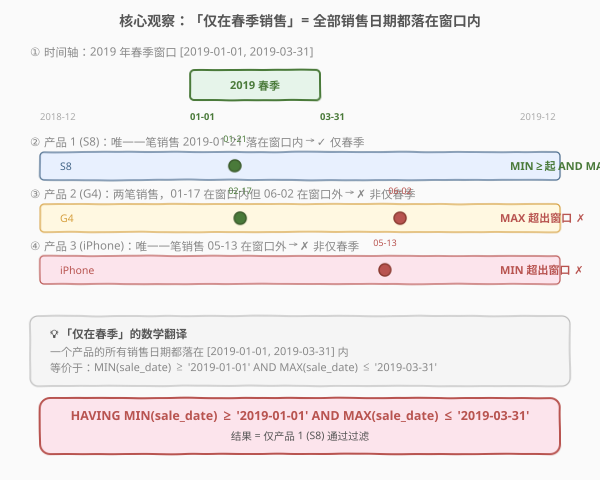

# 销售分析 III

- **题目名称**：销售分析 III
- **链接**：[1084. 销售分析 III](https://leetcode.cn/problems/sales-analysis-iii/)
- **难度**：简单
- **标签**：SQL、数据库、GROUP BY、HAVING、聚合函数、MIN、MAX、反连接

## 1. 题目概述

给定 `Product` 表（产品信息）与 `Sales` 表（销售记录），编写 SQL 查询，报告**仅在 2019 年春季**售出的产品——即所有销售记录的 `sale_date` 都落在 2019-01-01（含）至 2019-03-31（含）之间的产品。

**表结构**：

```text
表：Product
+--------------+---------+
| 列名         | 类型    |
+--------------+---------+
| product_id   | int     |  ← 主键
| product_name | varchar |
| unit_price   | int     |
+--------------+---------+
product_id 是该表的主键。
每行显示每个产品的名称和价格。

表：Sales
+-------------+---------+
| 列名        | 类型    |
+-------------+---------+
| seller_id   | int     |
| product_id  | int     |  ← 外键 → Product.product_id
| buyer_id    | int     |
| sale_date   | date    |
| quantity    | int     |
| price       | int     |
+-------------+---------+
该表可能有重复行。
product_id 是 Product 表的外键。
每行包含关于一个销售的一些信息。
```

**示例 1**：

```text
输入：
Product 表
+------------+--------------+------------+
| product_id | product_name | unit_price |
+------------+--------------+------------+
| 1          | S8           | 1000       |
| 2          | G4           | 800        |
| 3          | iPhone       | 1400       |
+------------+--------------+------------+
Sales 表
+-----------+------------+----------+------------+----------+-------+
| seller_id | product_id | buyer_id | sale_date  | quantity | price |
+-----------+------------+----------+------------+----------+-------+
| 1         | 1          | 1        | 2019-01-21 | 2        | 2000  |
| 1         | 2          | 2        | 2019-02-17 | 1        | 800   |
| 2         | 2          | 3        | 2019-06-02 | 1        | 800   |
| 3         | 3          | 4        | 2019-05-13 | 2        | 2800  |
+-----------+------------+----------+------------+----------+-------+
输出：
+-------------+--------------+
| product_id  | product_name |
+-------------+--------------+
| 1           | S8           |
+-------------+--------------+
解释：
id=1 的产品仅在 2019 春季销售 → 返回
id=2 的产品在春季销售，但也在春季之后销售 → 不返回
id=3 的产品在春季之后销售 → 不返回
```

**约束条件**：

- `product_id` 为 `Product` 表主键，`Sales.product_id` 为外键
- `Sales` 表可能有重复行（同一产品同一天多条记录）
- 结果列须为 `product_id`、`product_name`，顺序任意

> 💡 本题的题眼是「**仅**」字——不是「在春季有销售」，而是「在春季**之外没有**销售」。这决定了过滤必须基于**整组**而非逐行，是 SQL **HAVING** 子句的经典应用场景。

---

## 2. 解题思路

### 2.1 暴力思路：逐产品逐行扫描

用应用层代码读出全表，对每个 `product_id` 收集其所有 `sale_date`，然后逐条检查是否都落在 `[2019-01-01, 2019-03-31]` 内——若全部在范围内则输出该产品。

这能解决问题，但本质是**把数据库引擎擅长的分组聚合搬到了应用层**——既低效也违背 SQL 的声明式哲学。本题在 SQL 中只需一句 `GROUP BY` + `HAVING` 即可表达。

### 2.2 核心观察：「仅在春季」= MIN ≥ 起点 AND MAX ≤ 终点



关键洞察是：判断一个产品的**所有**销售日期是否都落在某个区间内，**无需逐条检查**——只需看该组销售日期的**最小值**和**最大值**：

- $\min(\text{sale\_date}) \geq \text{2019-01-01}$：最早一笔销售不早于春季起点 → 春季之前没有销售
- $\max(\text{sale\_date}) \leq \text{2019-03-31}$：最晚一笔销售不晚于春季终点 → 春季之后没有销售

两个条件**同时满足**，等价于「所有销售日期都在春季窗口内」。

> 💡 **为什么 MIN 和 MAX 两个条件缺一不可？** MIN ≥ 起点排除「春季前有销售」的产品；MAX ≤ 终点排除「春季后有销售」的产品。示例中 G4 的 MIN（02-17）在窗口内，但 MAX（06-02）超出 → 被 MAX 条件排除。iPhone 的 MAX（05-13）超出，MIN（05-13）也超出 → 被 MIN 条件排除。只看 MIN 会漏掉 G4，只看 MAX 也可能漏掉春季前有销售的产品。

> ⚠️ **这是组级过滤，不是行级过滤**。「仅在春季」是对一个产品的**全部销售记录**做判定，而非对单条记录做判定。因此必须用 `HAVING`（过滤组）而非 `WHERE`（过滤行）。若用 `WHERE sale_date BETWEEN ...` 会先逐行过滤掉窗口外的记录，再分组——此时 G4 的 06-02 记录被 WHERE 删掉，G4 看起来「只在春季销售」，**错误地通过**。

### 2.3 算法流程图


SQL 的**逻辑执行顺序**与书写顺序不同：

```text
书写顺序：SELECT → FROM → JOIN → GROUP BY → HAVING
执行顺序：FROM → JOIN → GROUP BY → HAVING → SELECT
```

1. **FROM Sales s JOIN Product p ON s.product_id = p.product_id**：关联销售记录与产品名称，拼接成宽行。
2. **GROUP BY p.product_id, p.product_name**：按产品分组，每个产品一组，组内可计算 `MIN(sale_date)` 和 `MAX(sale_date)`。
3. **HAVING MIN(s.sale_date) >= '2019-01-01' AND MAX(s.sale_date) <= '2019-03-31'**：组级过滤，只保留所有销售日期都落在春季窗口内的产品。
4. **SELECT product_id, product_name**：投影输出两列。

> 💡 **GROUP BY 为什么包含 `product_name`？** 因为 `SELECT` 中出现了 `product_name`，而 SQL 标准要求 `SELECT` 中的非聚合列必须出现在 `GROUP BY` 中。由于 `product_name` 函数依赖于 `product_id`（`product_id` 是 `Product` 主键），部分数据库（如 PostgreSQL）允许省略，但显式写出更安全通用。

### 2.4 示例演算


以示例数据跟踪 `GROUP BY` + `HAVING` 的执行过程：

| 步骤 | 产品 | 销售日期集合 | MIN | MAX | 双边界判定 | 结果 |
|------|------|-------------|-----|-----|-----------|------|
| ① | S8 (id=1) | {2019-01-21} | 01-21 | 01-21 | $01\text{-}21 \geq 01\text{-}01$ ✓ AND $01\text{-}21 \leq 03\text{-}31$ ✓ | ✅ 通过 |
| ② | G4 (id=2) | {2019-02-17, 2019-06-02} | 02-17 | 06-02 | $02\text{-}17 \geq 01\text{-}01$ ✓ AND $06\text{-}02 \leq 03\text{-}31$ ✗ | ❌ 淘汰 |
| ③ | iPhone (id=3) | {2019-05-13} | 05-13 | 05-13 | $05\text{-}13 \geq 01\text{-}01$ ✗ | ❌ 淘汰 |

> 💡 **G4 的陷阱**：G4 在春季有销售（02-17），但 06-02 的夏季销售使其 `MAX(sale_date)` 超出窗口。这正是「仅」字的含义——不是「在春季有销售」，而是「在春季**之外没有**销售」。`HAVING MAX ≤ 终点` 精确捕捉了这一约束。

---

## 3. 参考代码

### SQL（解法 A：GROUP BY + HAVING，推荐）

```sql
SELECT p.product_id, p.product_name
FROM Sales s
JOIN Product p ON s.product_id = p.product_id
GROUP BY p.product_id, p.product_name
HAVING MIN(s.sale_date) >= '2019-01-01'
   AND MAX(s.sale_date) <= '2019-03-31';
```

> 💡 **写法要点**：
> - `JOIN Product p ON s.product_id = p.product_id`：关联获取 `product_name`。由于 `Sales.product_id` 是外键，`INNER JOIN` 保证每条销售记录都能匹配到产品。
> - `GROUP BY p.product_id, p.product_name`：按产品分组。`product_name` 函数依赖于 `product_id`，显式写出满足 SQL 标准。
> - `HAVING MIN(...) >= ... AND MAX(...) <= ...`：双边界组级过滤。`MIN` 排除春季前有销售的产品，`MAX` 排除春季后有销售的产品。
> - 日期比较用字符串字面量 `'2019-01-01'`，SQL 标准的 `DATE` 类型可直接与 ISO 格式字符串比较。

### SQL（解法 B：NOT IN 反连接）

```sql
SELECT product_id, product_name
FROM Product
WHERE product_id IN (
    SELECT product_id FROM Sales
    WHERE sale_date BETWEEN '2019-01-01' AND '2019-03-31'
)
AND product_id NOT IN (
    SELECT product_id FROM Sales
    WHERE sale_date < '2019-01-01' OR sale_date > '2019-03-31'
);
```

> 💡 **写法要点**：第一个 `IN` 找出「春季有销售」的产品，第二个 `NOT IN` 排除「春季外有销售」的产品。两个条件交集即为「仅在春季销售」的产品。语义与解法 A 完全等价，但需扫表两次（两个子查询），效率略低于 `GROUP BY` + `HAVING`（一次聚合）。

### SQL（解法 C：NOT EXISTS 反连接）

```sql
SELECT p.product_id, p.product_name
FROM Product p
WHERE EXISTS (
    SELECT 1 FROM Sales s
    WHERE s.product_id = p.product_id
      AND s.sale_date BETWEEN '2019-01-01' AND '2019-03-31'
)
AND NOT EXISTS (
    SELECT 1 FROM Sales s
    WHERE s.product_id = p.product_id
      AND (s.sale_date < '2019-01-01' OR s.sale_date > '2019-03-31')
);
```

> 💡 **写法要点**：`EXISTS` 确保产品在春季有销售（排除从未售出的产品），`NOT EXISTS` 确保产品在春季外没有销售。`NOT EXISTS` 通常优于 `NOT IN`——后者在子查询结果含 `NULL` 时会产生意外行为（`NOT IN (NULL)` 恒为 `NULL` 即假），而 `NOT EXISTS` 不受 `NULL` 影响。

### Python（pandas）

```python
import pandas as pd

def sales_analysis(product: pd.DataFrame, sales: pd.DataFrame) -> pd.DataFrame:
    grouped = sales.groupby('product_id')['sale_date'].agg(['min', 'max']).reset_index()
    spring_only = grouped[
        (grouped['min'] >= '2019-01-01') & (grouped['max'] <= '2019-03-31')
    ]
    return spring_only.merge(product, on='product_id')[['product_id', 'product_name']]
```

> 💡 **pandas 对照**：`groupby('product_id')['sale_date'].agg(['min', 'max'])` 对应 SQL 的 `GROUP BY product_id` + `MIN/MAX(sale_date)`；布尔索引 `min >= '2019-01-01' & max <= '2019-03-31'` 对应 `HAVING` 双边界过滤；`merge(product, on='product_id')` 对应 `JOIN Product` 获取产品名。

---

## 4. 复杂度分析

| 维度 | 复杂度 | 说明 |
|------|--------|------|
| **时间（解法 A）** | $O(n)$ | 扫描 `Sales` 表一次做 `JOIN` + `GROUP BY` 聚合，`MIN/MAX` 在分组时线性维护；`Product` 主键索引使 JOIN 为 $O(\log m)$ 每行 |
| **时间（解法 B/C）** | $O(n)$ ~ $O(n \log n)$ | 两个子查询各扫一次表；`NOT EXISTS` 可被优化器改写为半连接/反连接，接近线性 |
| **空间** | $O(n)$ | `GROUP BY` 聚合的哈希表 / 排序缓冲区 |
| **结果行数** | $O(k)$ | $k$ = 仅在春季销售的产品数，不超过产品总数 |

> ⚠️ SQL 复杂度取决于**执行计划与索引**：`Sales.product_id` 上若有索引，`JOIN` 可走索引嵌套循环；`GROUP BY` 通常用哈希聚合 $O(n)$ 或排序聚合 $O(n \log n)$。面试中说明「首选 `GROUP BY` + `HAVING`，一次聚合即可判定，无需多次扫表」即可。

---

## 5. 扩展：WHERE vs HAVING 的本质区别

### 5.1 行级过滤 vs 组级过滤

| 维度 | `WHERE` | `HAVING` |
|------|---------|----------|
| **作用对象** | 行（逐条记录） | 组（`GROUP BY` 后的聚合结果） |
| **执行时机** | `GROUP BY` **之前** | `GROUP BY` **之后** |
| **可用列** | 原始列 | 聚合函数（`MIN`/`MAX`/`COUNT`/`SUM`/`AVG`） |
| **本题适用？** | ✗ 会先删窗口外行，导致错误 | ✓ 对整组判定 |

### 5.2 为什么不能用 WHERE？

若写成：

```sql
-- ✗ 错误写法
SELECT p.product_id, p.product_name
FROM Sales s JOIN Product p ON s.product_id = p.product_id
WHERE s.sale_date BETWEEN '2019-01-01' AND '2019-03-31'
GROUP BY p.product_id, p.product_name;
```

`WHERE` 会在 `GROUP BY` **之前**过滤掉窗口外的行。以 G4 为例，06-02 的记录被 `WHERE` 删掉后，G4 只剩 02-17 一条——看起来「只在春季销售」，**错误地通过**。正确做法是保留所有行到 `GROUP BY` 阶段，再用 `HAVING` 对整组判定。

> 💡 **口诀**：「过滤行用 WHERE，过滤组用 HAVING」。凡是对**聚合结果**（MIN/MAX/COUNT/SUM/AVG）做条件判断，必须用 `HAVING`。

### 5.3 NOT IN 的 NULL 陷阱

解法 B 中若 `Sales.product_id` 可能为 `NULL`，`NOT IN` 子查询返回含 `NULL` 的结果集时，`NOT IN (..., NULL, ...)` 恒为 `NULL`（即假），导致**所有产品都被排除**。解法 C 的 `NOT EXISTS` 不受此影响。若坚持用 `NOT IN`，可加 `WHERE product_id IS NOT NULL` 排除空值。

> ⚠️ 本题中 `Sales.product_id` 是外键（非空），故 `NOT IN` 安全。但在没有外键约束的场景下，`NOT EXISTS` 是更稳妥的选择。

---

## 6. 面试要点

1. **为什么用 HAVING 而不是 WHERE？**

   > 「仅在春季销售」是对一个产品的**全部销售记录**做组级判定，而非对单条记录做行级判定。`WHERE` 在 `GROUP BY` 之前过滤行，会先删掉窗口外的记录，导致 G4 的 06-02 被删后「看起来只在春季」——错误通过。`HAVING` 在 `GROUP BY` 之后对聚合结果判定，保留全部行到分组阶段再用 `MIN/MAX` 检验，才能正确识别「春季外有销售」的产品。

2. **MIN 和 MAX 两个条件为什么缺一不可？**

   > `MIN ≥ 起点` 排除「春季之前有销售」的产品；`MAX ≤ 终点` 排除「春季之后有销售」的产品。只看 MIN 会漏掉 G4（MIN 在窗口内但 MAX 超出）；只看 MAX 会漏掉春季前有销售的产品。两个条件合起来才等价于「所有销售日期都在窗口内」。

3. **GROUP BY + HAVING 和 NOT IN / NOT EXISTS 有什么区别？**

   > 三者语义等价。`GROUP BY` + `HAVING` 一次聚合即可判定，效率最高且写法最简洁；`NOT IN` 需两个子查询各扫一次表，且在子查询结果含 `NULL` 时有陷阱；`NOT EXISTS` 同样需两次扫描但不受 `NULL` 影响，可被优化器改写为反连接。面试中首选 `HAVING` 写法。

4. **SQL 的逻辑执行顺序是什么？**

   > `FROM → JOIN ON → WHERE → GROUP BY → HAVING → SELECT → ORDER BY → LIMIT`。先确定数据源（FROM/JOIN），再做行过滤（WHERE），然后分组聚合（GROUP BY/HAVING），最后投影输出（SELECT）。理解这个顺序是区分 WHERE 和 HAVING 的关键。

5. **如果 Sales 表有重复行（同产品同一天多条），会影响结果吗？**

   > 不会。`GROUP BY product_id` 将同一产品的所有行（含重复行）归为一组，`MIN/MAX` 在组内计算——重复行不影响最小值和最大值。结果按 `product_id` 分组，每个合格产品只输出一行，天然去重。

> 💡 **一句话总结**：1084 的灵魂是「**组级过滤**」——「仅在春季销售」翻译成 `HAVING MIN(sale_date) >= '2019-01-01' AND MAX(sale_date) <= '2019-03-31'`，一句 `GROUP BY` + `HAVING` 搞定。考点不在语法难度，而在理解 WHERE 过滤行、HAVING 过滤组的本质区别，以及 MIN/MAX 双边界缺一不可的完备性。

---

## 7. 同类练习题

- [1070. 产品销售分析 III](https://leetcode.cn/problems/product-sales-analysis-iii/)（[题解](1070_产品销售分析III.md)）：同 `Sales` 表系列的 `GROUP BY` + `MIN` 取首年记录，与 1084 共享分组聚合范式，区别在 1070 取明细行、1084 做组级过滤
- [184. 部门工资最高的员工](https://leetcode.cn/problems/department-highest-salary/)：`JOIN` + `GROUP BY` + `MAX` 取每组最大值对应行，与 1084 同为 `GROUP BY` + 聚合函数的经典应用
- [183. 从不订购的客户](https://leetcode.cn/problems/customers-never-order/)（[题解](../0101-0200/183_从不订购的客户.md)）：`LEFT JOIN + IS NULL` 反连接找「从未出现」的行，与 1084 的「仅在春季」反连接思想互补
- [197. 上升的温度](https://leetcode.cn/problems/rising-temperature/)：`JOIN` + 日期比较（`DATEDIFF`），同属 SQL 日期处理基础题，对照学习日期函数用法
- [550. 游戏玩法分析 IV](https://leetcode.cn/problems/game-play-analysis-iv/)：`GROUP BY` + `MIN(event_date)` 求首次登录日再算留存率，在 1084 的分组聚合基础上叠加日期差判断
