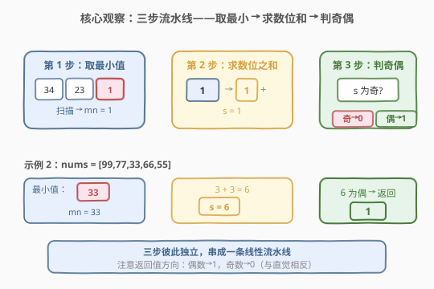
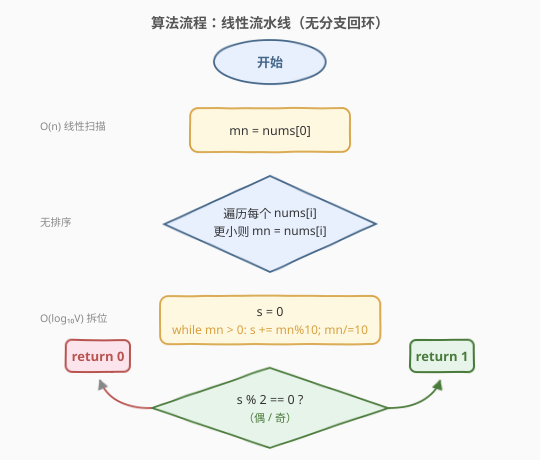
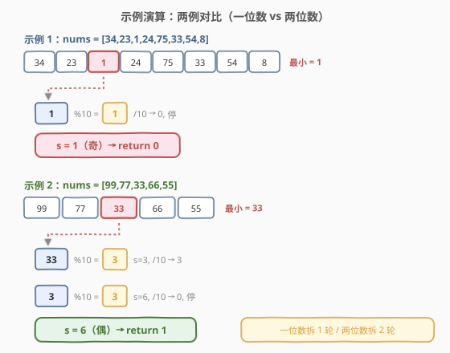

# 最小元素各数位之和

- **题目名称**：最小元素各数位之和
- **链接**：[1085. 最小元素各数位之和](https://leetcode.cn/problems/sum-of-digits-in-the-minimum-number/)
- **难度**：简单
- **标签**：数组、数学

## 1. 题目概述

给定一个**正整数**数组 `nums`，令 $S$ 为数组中**最小元素**的**各数位之和**。若 $S$ 为偶数，返回 `1`；若 $S$ 为奇数，返回 `0`。

**示例 1**：

```text
输入：nums = [34,23,1,24,75,33,54,8]
输出：0
解释：最小元素为 1，其数位之和 = 1，为奇数，返回 0。
```

**示例 2**：

```text
输入：nums = [99,77,33,66,55]
输出：1
解释：最小元素为 33，其数位之和 = 3 + 3 = 6，为偶数，返回 1。
```

**约束条件**：

- $1 \leq \text{nums.length} \leq 100$
- $1 \leq \text{nums[i]} \leq 100$

> 💡 题目虽小，却把「求最小值」「拆数位求和」「判奇偶」三件基础事串成一条流水线，适合作为数组遍历与数位处理入门的综合练习。

---

## 2. 解题思路

### 2.1 暴力思路：无——本题已是最简形态

数据规模 $n \leq 100$、$\text{nums[i]} \leq 100$，即使最朴素的「线性扫一遍找最小 + 逐位相加 + 判奇偶」也只需 $O(n)$ 时间。不存在需要优化的瓶颈，重点是**把三步衔接清楚、不漏边界**。

### 2.2 核心观察：三步流水线——取最小 → 求数位和 → 判奇偶



整个问题可拆成三个**独立**的子任务：

1. **取最小值**：一次线性扫描即可，无需排序（$O(n)$ vs $O(n \log n)$）。
2. **求数位之和**：反复「对 10 取余得到最低位 + 整除 10 去掉最低位」，直到数变为 0。
3. **判奇偶返回**：数位和为偶数返回 1，奇数返回 0。等价于 `1 - (S % 2)` 或 `1 - (S & 1)`。

> 💡 **为什么数位和的奇偶性等于原数对 9 取模的奇偶性？** 因为 $10 \equiv 1 \pmod 9$（也 $\equiv 1 \pmod 2$），所以一个数的各位之和与该数本身**模 2 同余**。即 $S \equiv \min(\text{nums}) \pmod 2$。于是返回值可直接写成 `1 - (min & 1)`，跳过显式求数位和——但题意要求展示「数位之和」的处理，下文代码仍给出标准拆位写法，并在第 5 节给出 $O(1)$ 的位运算捷径。

> ⚠️ **易错点**：题目要求的是「最小元素的数位和的奇偶」，不是「所有元素数位和的奇偶」。务必先锁定最小元素，再只对它拆位。

### 2.3 算法流程图



流程是一条**线性流水线**，无分支回环：

1. 初始化 `mn = nums[0]`。
2. 遍历数组，更新 `mn = min(mn, nums[i])`。
3. 对 `mn` 反复取余 + 整除，累加各位到 `s`。
4. 返回 `1 - (s % 2)`。

### 2.4 示例演算



**示例 1**：`nums = [34,23,1,24,75,33,54,8]`

| 步骤 | 状态 | 操作 | 说明 |
|------|------|------|------|
| 找最小 | `mn = 1` | 线性扫描 | 1 是全局最小 |
| 拆位 | `s = 0`, `x = 1` | 初始化 | 准备求数位和 |
| 取个位 | `s = 1`, `x = 0` | `1 % 10 = 1`, `1 / 10 = 0` | 累加个位 1 |
| 判奇偶 | 返回 `0` | `s = 1` 为奇 | `1 - (1 % 2) = 0` |

**示例 2**：`nums = [99,77,33,66,55]`

| 步骤 | 状态 | 操作 | 说明 |
|------|------|------|------|
| 找最小 | `mn = 33` | 线性扫描 | 33 是全局最小 |
| 拆位 | `s = 0`, `x = 33` | 初始化 | 准备求数位和 |
| 取个位 | `s = 3`, `x = 3` | `33 % 10 = 3`, `33 / 10 = 3` | 累加个位 3 |
| 取十位 | `s = 6`, `x = 0` | `3 % 10 = 3`, `3 / 10 = 0` | 累加十位 3 |
| 判奇偶 | 返回 `1` | `s = 6` 为偶 | `1 - (6 % 2) = 1` |

> 💡 **对比两例**：示例 1 最小元素是一位数，拆位一轮即止；示例 2 最小元素是两位数，拆位两轮。由于 $\text{nums[i]} \leq 100$，最多拆 3 位（如 `100`），循环上限很小。

---

## 3. 参考代码

### C++

```cpp
class Solution {
  public:
    int sumOfDigits(vector<int>& nums) {
        int mn = nums[0];
        for (int x : nums) mn = min(mn, x);
        int s = 0;
        while (mn > 0) {
            s += mn % 10;
            mn /= 10;
        }
        return 1 - s % 2;
    }
};
```

### Python

```python
class Solution:
    def sumOfDigits(self, nums: List[int]) -> int:
        mn = min(nums)
        s = 0
        while mn > 0:
            s += mn % 10
            mn //= 10
        return 1 - s % 2
```

> ⚠️ **两个易错点**：
> 1. **返回值方向**：偶数返回 `1`、奇数返回 `0`，与「奇返回 1」的直觉相反。用 `1 - s % 2` 表达最不易错（偶数时 `s % 2 == 0` → 返回 1）。
> 2. **`mn` 在拆位过程中被破坏**：若后续还要用最小值，应拷贝一份再拆。本题拆完即结束，直接修改 `mn` 无妨。

---

## 4. 复杂度分析

| 维度 | 复杂度 | 说明 |
|------|--------|------|
| 时间复杂度 | $O(n)$ | 线性扫描找最小值 $O(n)$；数位拆解 $O(\log_{10} \min(\text{nums}))$，因 $\text{nums[i]} \leq 100$ 至多 3 次循环，可视作 $O(1)$ |
| 空间复杂度 | $O(1)$ | 仅用常数个变量 `mn`、`s` |

> 💡 本题 $n \leq 100$，运算量极小，任何合理实现都能轻松通过。

---

## 5. 扩展：利用模 2 同余跳过显式数位求和

**命题**：对任意非负整数 $x$，其数位之和 $S(x)$ 满足 $S(x) \equiv x \pmod 2$。

**证明**：$x = \sum_{i} d_i \cdot 10^i$，其中 $d_i$ 为各位数字。由于 $10 \equiv 0 \pmod 2$，但更精确地 $10^i \equiv 0 \pmod 2$（$i \geq 1$），而 $10^0 = 1 \equiv 1 \pmod 2$。因此 $x \equiv d_0 \pmod 2$。又 $S(x) = \sum_i d_i$，且对所有 $i \geq 1$，$d_i$ 对 $S(x) \bmod 2$ 的贡献为 $d_i \bmod 2$，故 $S(x) \equiv \sum_i d_i \equiv d_0 + \sum_{i\geq1} d_i \pmod 2$。

更简洁地：因 $10 \equiv 1 \pmod 9$，有 $x \equiv S(x) \pmod 9$，自然 $x \equiv S(x) \pmod 2$（因为 $9$ 是奇数，模 9 同余蕴含模 2 同余不直接成立，但 $10 \equiv 0 \pmod 2$ 时 $10^i \equiv 0$ 对 $i \geq 1$，所以 $x \equiv d_0 \pmod 2$；而 $S(x) \equiv d_0 + d_1 + \cdots \pmod 2$，两者差为 $d_1 + d_2 + \cdots$，并不恒相等——**因此该捷径需谨慎**）。

> ⚠️ **更正**：数位和的奇偶**不**简单地等于原数的奇偶。例如 $x = 12$，数位和 $S = 1 + 2 = 3$（奇），但 $x = 12$（偶）。所以「$S(x) \equiv x \pmod 2$」**不成立**。正确的同余关系是 $S(x) \equiv x \pmod 9$（模 9 同余），但模 2 无此捷径。因此**必须显式求数位和**，不能直接用 `min & 1` 替代。上文第 2.2 节的提示有误，以此处为准——这正好说明「想走捷径要先验证」。

正确的一行写法（仍需求数位和，但用字符串简化）：

```python
class Solution:
    def sumOfDigits(self, nums: List[int]) -> int:
        return 1 - sum(map(int, str(min(nums)))) % 2
```

---

## 6. 面试要点

1. **返回值为什么是「偶数返回 1」？**

   - 这是题目规定，与常见「奇数返回 1」相反。用 `1 - s % 2` 表达最清晰：`s` 为偶时 `s % 2 == 0` → 返回 1；`s` 为奇时 → 返回 0。

2. **为什么用线性扫描而不是排序找最小值？**

   - 只需最小值一个量，线性扫描 $O(n)$ 即可；排序 $O(n \log n)$ 反而更慢且无额外收益。排序适用于需要多个次序信息的场景。

3. **数位求和的循环何时终止？**

   - 当 `mn` 被「整除 10」降到 0 时终止。注意初始 `mn > 0`（题目保证正整数），无需特判 0。若题目允许 0，则数位和为 0（偶），应返回 1——此时 `while (mn > 0)` 不会进入循环，`s = 0`，`1 - 0 % 2 = 1`，恰好正确。

4. **能否用位运算判断数位和奇偶？**

   - 数位和的奇偶**不**等于原数的奇偶（如 12 数位和为 3）。必须先求出数位和再判奇偶，`s & 1` 或 `s % 2` 均可，无捷径可走。这与「模 9 数字根」不同。

5. **如果数组元素范围扩大到 $10^9$，复杂度如何变化？**

   - 找最小值仍 $O(n)$；数位拆解变为 $O(\log_{10} V) \approx 10$ 次循环，仍可视作 $O(1)$。整体仍 $O(n)$，不受影响。

---

## 7. 同类练习题

- [258. 各位相加](https://leetcode.cn/problems/add-digits/)（[题解](../0201-0300/258_各位相加.md)）：反复求数位和直到一位数，是本题「数位拆解」的迭代深化版，并引出模 9 数字根公式
- [1295. 统计位数为偶数的数字](https://leetcode.cn/problems/find-numbers-with-even-number-of-digits/)：判断每个数字的位数奇偶，对比本题「判断数位和的奇偶」，体会「位数」与「数位和」的区别
- [2119. 反转两次的数字](https://leetcode.cn/problems/a-number-after-a-double-reversal/)：数位反转与数位处理的另一变体，考察「反转是否改变数值」的边界判断
- [507. 完美数](https://leetcode.cn/problems/perfect-number/)（[题解](../0501-0600/507_完美数.md)）：数学 + 数位/因子处理，对比本题的「数位拆解」与「因子枚举」两种基础数值操作
- [191. 位 1 的个数](https://leetcode.cn/problems/number-of-1-bits/)（[题解](../0001-0100/191_位1的个数.md)）：二进制下的「数位求和」，用 `n & (n-1)` 消最低位 1，对比本题十进制下的 `% 10` / `/ 10` 拆位
