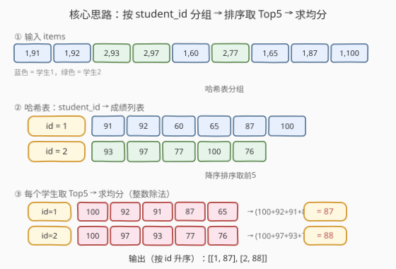
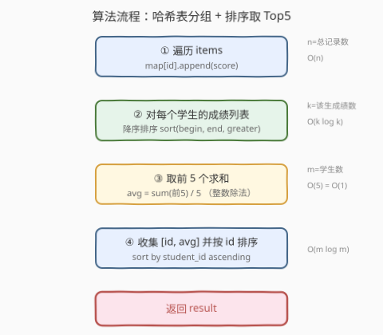
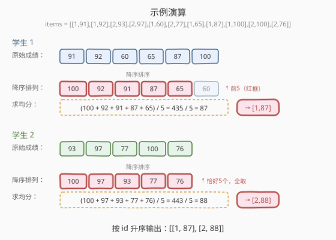

# LeetCode 前五科的均分 题解

> ⚠️ **注意**：本题是 LeetCode **Plus 会员专享题**，需升级会员才能查看完整题面与提交。核心题意见下方概述。

## 1. 题目概述

- **标题 / 题号**：前五科的均分（#1086，easy）
- **链接**：https://leetcode.cn/problems/high-five/
- **难度**：简单
- **标签**：数组、哈希表、排序、堆（优先队列）

**题意**：给定一个二维数组 `items`，其中 `items[i] = [student_id, score]`，表示某学生在某科目获得的成绩。每个学生**至少有 5 条成绩记录**。请为每个学生计算其**最高的 5 个成绩的整数平均值**，返回一个按 `student_id` **升序排列**的二维数组，每个元素为 `[student_id, average]`。

> 💡 **整数平均值**：即最高 5 个成绩之和除以 5 的**整数除法**结果（向下取整 / 截断小数部分）。例如 $443 / 5 = 88.6$，结果为 $88$。

**示例 1**：

```text
输入：items = [[1,91],[1,92],[2,93],[2,97],[1,60],[2,77],[1,65],[1,87],[1,100],[2,100],[2,76]]
输出：[[1,87],[2,88]]
解释：
学生 1 的成绩：91, 92, 60, 65, 87, 100
  → 降序排列取前 5：100, 92, 91, 87, 65
  → 均分 = (100 + 92 + 91 + 87 + 65) / 5 = 435 / 5 = 87

学生 2 的成绩：93, 97, 77, 100, 76
  → 降序排列取前 5：100, 97, 93, 77, 76
  → 均分 = (100 + 97 + 93 + 77 + 76) / 5 = 443 / 5 = 88
```

**约束**：

- $1 \leq \text{items.length} \leq 1000$
- `items[i].length == 2`
- $1 \leq \text{student\_id}, \text{score} \leq 1000$
- 每个学生**至少有 5 条成绩记录**
- 结果按 `student_id` **升序**排列

## 2. 解题思路

### 2.1 暴力思路：逐学生全量扫描

最直觉的做法：先遍历一遍 `items`，用哈希表把成绩按 `student_id` 分组收集；然后对每个学生，把他的成绩列表完整排序（降序），取前 5 个求和再除以 5；最后按 `student_id` 排序输出。

这能正确解决问题，但当某个学生成绩数 $k$ 远大于 5 时（比如 $k = 1000$），为取前 5 就做一次 $O(k \log k)$ 的全排序，有大量浪费——其实只需维护一个大小为 5 的"窗口"。不过本题 $k$ 规模小（总记录 $\leq 1000$），全排序完全可过。

### 2.2 核心观察：哈希表分组 + 降序排序取前 5



这道题的本质是**分组 Top-K**问题，拆成三步：

| 步骤 | 操作 | 产出 |
|------|------|------|
| ① 分组 | 遍历 `items`，`map[student_id].push_back(score)` | 每个学生的完整成绩列表 |
| ② 排序 | 对每个学生的成绩列表**降序排序** | 成绩从高到低排列 |
| ③ 取 Top5 | 取前 5 个求和，`sum / 5`（整数除法） | 每个学生的均分 |

> 💡 **为什么用哈希表分组？** 成绩记录是无序的，同一个学生的成绩散落在 `items` 各处。哈希表 $O(1)$ 查找让我们在 $O(n)$ 一次遍历内完成分组——这比先按 `student_id` 排序再分段扫描更简洁（排序需 $O(n \log n)$，分组只需 $O(n)$）。

> ⚠️ **整数除法**：C++ 中 `int / int` 自动截断小数（向零截断，正数等同向下取整）；Python 中 `//` 是向下取整。两者对正数结果一致。若误用浮点除法再四舍五入，$443 / 5 = 88.6$ 会得到 $89$ 而非 $88$，导致错误。

### 2.3 算法流程图



1. **遍历 items**：用 `unordered_map<int, vector<int>>`（C++）或 `defaultdict(list)`（Python）按 `student_id` 收集所有成绩。
2. **对每个学生的成绩列表降序排序**：C++ 用 `sort(scores.begin(), scores.end(), greater<int>())`；Python 用 `scores.sort(reverse=True)`。
3. **取前 5 个求和并整数除法**：`avg = (scores[0] + scores[1] + ... + scores[4]) / 5`。
4. **收集 `[student_id, avg]` 并按 `student_id` 升序排序**，返回结果。

### 2.4 示例演算



以示例数据为例：

**学生 1**（6 条成绩）：

| 步骤 | 数据 |
|------|------|
| 原始成绩 | 91, 92, 60, 65, 87, 100 |
| 降序排列 | **100**, **92**, **91**, **87**, **65**, 60 |
| Top5 求和 | $100 + 92 + 91 + 87 + 65 = 435$ |
| 均分 | $435 / 5 = \mathbf{87}$ |

**学生 2**（5 条成绩，恰好 5 个全取）：

| 步骤 | 数据 |
|------|------|
| 原始成绩 | 93, 97, 77, 100, 76 |
| 降序排列 | **100**, **97**, **93**, **77**, **76** |
| Top5 求和 | $100 + 97 + 93 + 77 + 76 = 443$ |
| 均分 | $443 / 5 = \mathbf{88}$（整数除法，截断 0.6） |

> ⚠️ 学生 2 的均分 $443 / 5 = 88.6$，整数除法截断后为 $88$，而非四舍五入的 $89$。

最终按 `student_id` 升序输出：`[[1, 87], [2, 88]]`。

## 3. 参考代码

### C++

```cpp
class Solution {
  public:
    vector<vector<int>> highFive(vector<vector<int>>& items) {
        unordered_map<int, vector<int>> scores;
        for (auto& item : items)
            scores[item[0]].push_back(item[1]);

        vector<vector<int>> result;
        for (auto& [id, list] : scores) {
            sort(list.begin(), list.end(), greater<int>());
            int sum = 0;
            for (int i = 0; i < 5; i++)
                sum += list[i];
            result.push_back({id, sum / 5});
        }

        sort(result.begin(), result.end());
        return result;
    }
};
```

> 💡 **写法要点**：
> - `unordered_map<int, vector<int>>`：以 `student_id` 为键，值为该生所有成绩的动态数组。`O(1)` 插入，$O(n)$ 一次遍历完成分组。
> - `sort(..., greater<int>())`：降序排序，最大的 5 个排在列表头部。
> - `sum / 5`：C++ 中 `int / int` 自动整数除法（截断小数），无需额外处理。
> - 最后 `sort(result.begin(), result.end())`：`vector<vector<int>>` 的默认排序按首元素（`student_id`）升序，满足题目要求。

### Python

```python
class Solution:
    def highFive(self, items: List[List[int]]) -> List[List[int]]:
        from collections import defaultdict
        scores = defaultdict(list)
        for sid, score in items:
            scores[sid].append(score)

        result = []
        for sid in sorted(scores):
            scores[sid].sort(reverse=True)
            avg = sum(scores[sid][:5]) // 5
            result.append([sid, avg])
        return result
```

> 💡 **写法要点**：
> - `defaultdict(list)`：自动为不存在的键创建空列表，省去 `if sid not in scores` 判空。
> - `sorted(scores)`：遍历时直接对键排序，省去最后再排一次结果的步骤。
> - `scores[sid][:5]`：切片取前 5 个（已降序排列），`sum(...) // 5` 用 `//` 做整数除法（向下取整）。

## 4. 复杂度分析

| 维度 | 复杂度 | 说明 |
|------|--------|------|
| 时间复杂度 | $O(n + m \cdot k \log k)$ | $n$ = 总记录数，$m$ = 学生数，$k$ = 单个学生成绩数。遍历分组 $O(n)$；每个学生排序 $O(k \log k)$，共 $m$ 个学生 |
| 空间复杂度 | $O(n)$ | 哈希表存储所有成绩 |
| 结果行数 | $O(m)$ | 每个 `student_id` 恰产出一行，与学生数相等 |

> 💡 本题 $n \leq 1000$，$k$ 通常很小（个位数到几十），$O(n + m \cdot k \log k)$ 非常快。即便 $n$ 放大到 $10^5$，只要 $k$ 不极端，排序解法依然高效。

## 5. 扩展：最小堆维护 Top-K

当每个学生的成绩数 $k$ **远大于 5** 时（比如流式数据、$k = 10^5$），全排序 $O(k \log k)$ 浪费严重——我们只需前 5 个。此时可用**大小为 5 的最小堆**逐条维护：

```cpp
class Solution {
  public:
    vector<vector<int>> highFive(vector<vector<int>>& items) {
        unordered_map<int, priority_queue<int, vector<int>, greater<int>>> pq;
        for (auto& item : items) {
            int id = item[0], score = item[1];
            pq[id].push(score);
            if (pq[id].size() > 5)
                pq[id].pop();          // 堆顶是最小的，弹出后保留 Top5
        }

        vector<vector<int>> result;
        for (auto& [id, heap] : pq) {
            int sum = 0;
            while (!heap.empty()) {
                sum += heap.top();
                heap.pop();
            }
            result.push_back({id, sum / 5});
        }

        sort(result.begin(), result.end());
        return result;
    }
};
```

| 维度 | 全排序 | 最小堆（Top-K） |
|------|--------|-----------------|
| 单学生时间 | $O(k \log k)$ | $O(k \log 5) = O(k)$ |
| 总时间 | $O(n + m \cdot k \log k)$ | $O(n \log 5) = O(n)$ |
| 适用场景 | $k$ 小（本题 $\leq$ 几十） | $k$ 大（流式 / $k \geq 10^4$） |
| 代码复杂度 | 简洁直观 | 稍多，需维护堆 |

> 💡 **最小堆维护 Top-K 的原理**：堆大小始终 $\leq 5$，堆顶是当前 5 个中的最小值。新成绩入堆后若大小超过 5，弹出堆顶（最小值）——弹掉的必然是不在 Top5 中的那个。最终堆中留下的恰好是 Top5。这是 [703. 数据流中的第 K 大元素](https://leetcode.cn/problems/kth-largest-element-in-a-stream/) 的同款套路。

## 6. 面试要点

1. **为什么用哈希表分组而不是先排序？**

   - 哈希表分组只需 $O(n)$ 一次遍历即可把成绩按学生归类；先按 `student_id` 排序再分段扫描需 $O(n \log n)$。分组后的内层排序只针对单个学生的成绩列表（长度 $k$），总量 $O(m \cdot k \log k) \leq O(n \log n)$，通常更优。

2. **整数除法和浮点除法有什么区别？**

   - 题目要求**整数除法**（截断小数）。C++ 中 `int / int` 自动截断；Python 中 `//` 是向下取整。若误用浮点除法 `443.0 / 5 = 88.6` 再四舍五入得到 $89$，与正确答案 $88$ 不符。正数场景下截断与向下取整等价。

3. **如果某个学生成绩不足 5 条怎么办？**

   - 题目保证每个学生至少 5 条成绩。若去除该保证，需与面试官确认策略：是报错、取全部成绩求平均，还是补 0 分。通常回答"题目约束保证至少 5 条，若需处理可加 `min(5, len)` 保护"。

4. **最小堆和全排序各适合什么场景？**

   - 全排序简单直观，适合 $k$ 小的场景（如本题 $k \leq$ 几十）；最小堆维护 Top-K 适合 $k$ 大或数据流式到达（逐条插入、随时查询 Top5），每次操作 $O(\log 5) = O(1)$，总 $O(n)$。面试中先说全排序解法，再主动提堆优化，展示对数据规模与复杂度的判断。

5. **最后为什么要对结果按 student_id 排序？**

   - `unordered_map` 不保证遍历顺序，结果可能乱序。题目要求按 `student_id` 升序输出，故需额外排序。若用 `map`（C++ 有序映射）或 Python 中遍历 `sorted(scores)`，可省去最后一次排序。

> 💡 **一句话总结**：1086 是**分组 Top-K 母题**——核心就三步：哈希表分组 $O(n)$、降序排序取前 5、整数除法求均分。考点不在难度，而在理解"分组 + 取最值"的拆解思路，以及整数除法的细节陷阱。进阶可引出最小堆维护 Top-K 的通用范式。

## 同类练习题

| # | 题目 | 与本题的关联 |
|---|------|-------------|
| 703 | [数据流中的第 K 大元素](https://leetcode.cn/problems/kth-largest-element-in-a-stream/) | 最小堆维护大小为 K 的堆，动态取第 K 大，与本题堆解法**完全同模板**，是 Top-K 堆范式的标准题 |
| 215 | [数组中的第 K 个最大元素](https://leetcode.cn/problems/kth-largest-element-in-an-array/)（[题解](../0201-0300/215_数组中的第K个最大元素.md)） | 堆或快速选择求第 K 大，对比堆与分治取最值的不同策略 |
| 347 | [前 K 个高频元素](https://leetcode.cn/problems/top-k-frequent-elements/) | 频率统计 + Top-K 堆，在"分组统计"之上叠加"取最高 K"，与本题"分组取 Top5"结构相似 |
| 1046 | [最后一块石头的重量](https://leetcode.cn/problems/last-stone-weight/)（[题解](../1001-1100/1046_最后一块石头的重量.md)） | 最大堆模拟动态取最值，对比堆在"取最值后放回"与"取最值后丢弃"两种场景的用法 |
| 23 | [合并 K 个升序链表](https://leetcode.cn/problems/merge-k-sorted-lists/) | 最小堆 K 路归并，堆在"动态维护最值"场景的经典扩展 |
