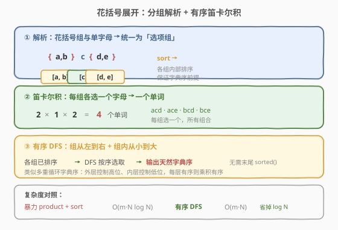
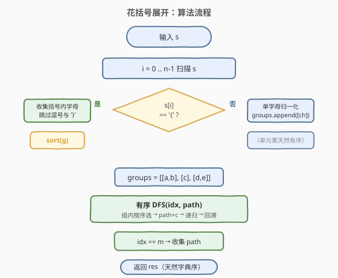
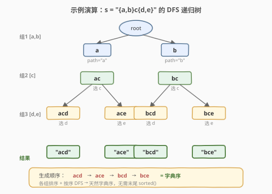

# LeetCode 花括号展开 题解

## 1. 题目概述

- **标题 / 题号**：花括号展开（#1087，medium）
- **链接**：https://leetcode.cn/problems/brace-expansion/
- **难度**：中等
- **标签**：字符串、回溯、深度优先搜索

**题意**：给定一个字符串 `s`，表示一个单词中每个字母位置的选项：

- 若某位置**只有一个**选项，直接写该字母（如 `c`）。
- 若某位置有**多个**选项，用花括号 `{}` 包裹、逗号分隔（如 `{a,b}`）。

返回**所有能组成的单词**，按**字典序**排列。

**示例 1**：

```text
输入：s = "{a,b}c{d,e}"
输出：["acd","ace","bcd","bce"]
解释：第 1 位选 a/b，第 2 位固定 c，第 3 位选 d/e，共 2×1×2 = 4 个单词。
```

**示例 2**：

```text
输入：s = "abcd"
输出：["abcd"]
解释：每个位置都只有一个选项，结果仅 "abcd" 一个。
```

**示例 3**：

```text
输入：s = "a{b,c}"
输出：["ab","ac"]
```

**约束**：

- $1 \leq \text{s.length} \leq 25$
- `s` 由小写英文字母、花括号 `{` `}` 与逗号 `,` 组成
- `s` 是合法输入：花括号不嵌套，括号内字母以逗号分隔，无连续逗号

> 💡 关键点：每个花括号组（或单个字母）是一个**独立的「选项组」**，各组之间是**笛卡尔积**关系——从每组各选一个字母拼成一个单词。题目要求输出字典序，这决定了我们需要对每组选项排序。

## 2. 解题思路

### 2.1 暴力思路：解析 + 笛卡尔积 + 末尾排序

最直白的做法分三步：

1. **解析**：扫描 `s`，把花括号组与单个字母都收集成「选项组」列表。
2. **枚举**：对各组做笛卡尔积（Python 可直接 `itertools.product(*groups)`），得到所有组合。
3. **排序**：把组合拼成字符串后 `sorted()` 一次，满足字典序要求。

```python
from itertools import product
return sorted(''.join(p) for p in product(*groups))
```

这能通过（$|s| \leq 25$，单词数很少），但**最后一步排序是 $O(N \log N)$**（$N$ 为单词总数），且没有利用「各组排序后乘积天然有序」的结构。

> ⚠️ 面试官会追问：「能不能在生成阶段就保证字典序，省掉最后的排序？」这就引出了下面的**有序 DFS** 方案。

### 2.2 核心观察：分组排序 + 有序 DFS（生成即有序）



关键观察有两层：

**观察一（问题结构）**：字符串是一串**独立的选项组**——花括号组或单个字母。从每组各取一个字母拼起来就是一个单词，因此本质是**笛卡尔积**，用回溯（DFS）逐组选取即可枚举全部。

**观察二（生成即有序）**：若每个选项组内部**预先排序**，且 DFS 按「组从左到右、组内从小到大」的顺序选取，则生成的单词**天然字典序排列**，无需末尾再排。

这与「多重循环的字典序」同理：外层循环控制高位、内层控制低位——只要每层有序，乘积就有序。形式上，设各组排序后为 $G_1 \leq G_2 \leq \dots \leq G_m$，先固定 $G_1$ 的较小元素再去枚举后续组，较小的高位一定先被生成。

> 💡 **一句话**：解析成排序好的选项组，DFS 从左到右按序选取——**生成顺序即字典序**，省掉末尾 $O(N \log N)$ 排序。

### 2.3 算法流程图



```text
expand(s):
  1. 解析 s → groups（每组为字符列表）
     for i in 0..n-1:
       if s[i] == '{':
         收集括号内字母（跳过逗号）到 g
         跳过 '}'
         sort(g)          # ← 关键：组内排序
         groups.append(g)
       else:
         groups.append([s[i]])   # 单字母也当作一组
  2. DFS(groups, idx=0, path=""):
     if idx == len(groups):
       res.append(path)     # 收集完整单词
       return
     for c in groups[idx]:   # 组内按序选取
       DFS(groups, idx+1, path + c)
  3. return res
```

> 💡 解析与 DFS 解耦：解析阶段保证「每组有序」，DFS 阶段保证「按序选取」，两者合力使输出天然有序。单字母也归一化为单元素组，统一了处理逻辑。

### 2.4 示例演算



以 `s = "{a,b}c{d,e}"` 为例，解析得到三组 `[a,b]`、`[c]`、`[d,e]`（均已排序），DFS 递归树如下，**每个叶子是一个完整单词**：

| 步骤 | 当前组 | 选取 | path | 说明 |
|------|--------|------|------|------|
| ① | 组1 [a,b] | a | `"a"` | 选较小字母 a |
| ② | 组2 [c] | c | `"ac"` | 组2 只有一个选项 |
| ③ | 组3 [d,e] | d | `"acd"` | 叶子，收集 |
| ④ | 回溯组3 | e | `"ace"` | 叶子，收集 |
| ⑤ | 回溯组1 | b | `"b"` | 选较大字母 b |
| ⑥ | 组2 [c] | c | `"bc"` | |
| ⑦ | 组3 [d,e] | d | `"bcd"` | 叶子，收集 |
| ⑧ | 回溯组3 | e | `"bce"` | 叶子，收集 |

最终结果 `["acd","ace","bcd","bce"]`，与示例一致——**生成顺序恰好就是字典序**，无需排序。

> ⚠️ 若组3未排序（如输入 `{e,d}`），直接按原序选取会先生成 `ace` 再 `acd`，破坏字典序。因此**组内排序是「生成即有序」的前提**。

## 3. 参考代码

### C++（解析 + 回溯）

```cpp
class Solution {
public:
    vector<string> expand(string s) {
        // 1. 解析：花括号组与单字母统一为选项组
        vector<vector<char>> groups;
        int i = 0, n = s.size();
        while (i < n) {
            if (s[i] == '{') {
                i++;                              // 跳过 '{'
                vector<char> g;
                while (i < n && s[i] != '}') {
                    if (s[i] != ',') g.push_back(s[i]);
                    i++;
                }
                i++;                              // 跳过 '}'
                sort(g.begin(), g.end());         // ← 组内排序，保证字典序
                groups.push_back(std::move(g));
            } else {
                groups.push_back({s[i++]});       // 单字母也归一化为一组
            }
        }
        // 2. 有序 DFS
        vector<string> res;
        string path;
        dfs(groups, 0, path, res);
        return res;
    }

private:
    void dfs(const vector<vector<char>>& groups, int idx,
             string& path, vector<string>& res) {
        if (idx == (int)groups.size()) {
            res.push_back(path);                  // 收集完整单词
            return;
        }
        for (char c : groups[idx]) {              // 组内按序选取
            path.push_back(c);
            dfs(groups, idx + 1, path, res);
            path.pop_back();                      // 回溯
        }
    }
};
```

### Python（解析 + DFS）

```python
class Solution:
    def expand(self, s: str) -> List[str]:
        # 1. 解析
        groups = []
        i, n = 0, len(s)
        while i < n:
            if s[i] == '{':
                i += 1                            # 跳过 '{'
                g = []
                while s[i] != '}':
                    if s[i] != ',':
                        g.append(s[i])
                    i += 1
                i += 1                            # 跳过 '}'
                groups.append(sorted(g))          # ← 组内排序
            else:
                groups.append([s[i]])             # 单字母归一化为一组
                i += 1

        # 2. 有序 DFS
        res = []
        def dfs(idx: int, path: str) -> None:
            if idx == len(groups):
                res.append(path)
                return
            for c in groups[idx]:                 # 组内按序选取
                dfs(idx + 1, path + c)

        dfs(0, '')
        return res
```

> 💡 代码要点：① 解析时单字母也包成 `[ch]` 一组，让 DFS 统一遍历所有组，无需区分「固定字母」与「选项组」；② `sorted(g)` 是「生成即有序」的关键——排序放在解析阶段，DFS 只需按序遍历；③ Python 用 `path + c` 产生新字符串（不可变），C++ 用 `path.push_back / pop_back` 原地修改，两种回溯写法等价。

## 4. 复杂度分析

设共有 $m$ 个选项组，各组大小为 $g_1, g_2, \dots, g_m$，单词总数 $N = g_1 \times g_2 \times \dots \times g_m$，每个单词长度为 $m$。

| 维度 | 复杂度 | 说明 |
|------|--------|------|
| **时间** | $O\big(|s| \log g_{\max} + m \cdot N\big)$ | 解析扫描 $O(|s|)$ + 各组排序 $O(\sum g_i \log g_i) \leq O(|s| \log g_{\max})$；DFS 生成 $N$ 个长度 $m$ 的单词，内部节点总数 $\leq 2N$（等比收敛），故 $O(m \cdot N)$ |
| **空间** | $O(m \cdot N)$ | 输出 $N$ 个单词各长 $m$；递归栈深 $O(m)$，选项组 $O(|s|)$，均被输出主导 |

> 💡 与暴力法对照：暴力「笛卡尔积 + 末尾排序」为 $O(m \cdot N \log N)$，有序 DFS 省掉最后的 $\log N$ 因子，降为 $O(m \cdot N)$，即「与输出同阶」的最优生成复杂度。$|s| \leq 25$ 时 $N$ 至多约 $2^5 = 32$（5 个二元组），实测极快。

## 5. 扩展：嵌套花括号（1096. 花括号展开 II）

本题保证花括号**不嵌套**，解析只需线性扫描。若允许嵌套（如 `{a,b}{c,{d,e}}`），则变成 [1096. 花括号展开 II](https://leetcode.cn/problems/brace-expansion-ii/)，需要用**递归下降解析**或**栈**处理嵌套结构：

- 遇到 `{` 压栈，遇到 `}` 弹栈并计算当前层的笛卡尔积。
- 嵌套层的计算结果作为一个「选项集」参与外层的笛卡尔积。
- 还需处理「并集」（逗号在顶层表示集合合并，而非同一组的多选项）。

```python
# 1096 栈解法骨架（仅示意思路）
def braceExpansionII(self, s: str) -> List[str]:
    stack = []
    for ch in s:
        if ch != '}':
            stack.append(ch)
        else:
            # 弹出到 '{'，计算当前层的笛卡尔积 / 并集
            ...
    # 末尾再计算一次，去重排序
    return sorted(set(...))
```

> 💡 1087 与 1096 的区别：1087 的逗号**只在花括号内**分隔同组选项，结构是纯笛卡尔积；1096 的逗号还可在花括号外表示集合并集，且支持嵌套，需要区分「乘」（相邻）与「加」（逗号）两种运算。

## 6. 面试要点

**Q1：为什么各组排序后 DFS 的输出天然字典序？**

> DFS 按组从左到右、组内从小到大选取。字典序的比较规则正是「从左到右逐位比较，先出现较小字母者为先」。先固定高位（第 1 组）的较小字母、再枚举低位（后续组）的所有组合，保证较小高位对应的单词先被生成。这与「多重嵌套循环按字典序遍历」完全同理——每层有序，乘积就有序。

**Q2：单字母为什么要也包成一组？**

> 统一处理逻辑。若把单字母和花括号组分开处理，DFS 需要区分「追加固定字母」与「枚举多选项」两种分支，代码更复杂。将单字母归一化为单元素组 `[ch]` 后，DFS 只需一种循环 `for c in groups[idx]`，简洁且不易出错。

**Q3：暴力 `product + sort` 和有序 DFS 哪种更优？**

> 有序 DFS 更优。两者枚举量相同（都是 $N$ 个单词），但暴力法末尾需 $O(N \log N)$ 排序，而有序 DFS 利用「各组排序 + 按序选取」使生成顺序即字典序，省掉排序，总时间 $O(m \cdot N)$。本题 $N$ 很小差别不大，但「生成即有序」是更通用的工程原则——当输出量大时（如百万级），省掉 $\log$ 因子收益显著。

**Q4：花括号内字母可能未排序吗？需要排序吗？**

> 可能。题目只保证输入合法，不保证花括号内字母有序（如 `{b,a}`）。若不排序直接按原序 DFS，输出可能非字典序（如 `ba` 先于 `aa`）。因此解析时对每组 `sort` 是必须的——这正是「生成即有序」的前提。

**Q5：解析时如何保证不越界？**

> 花括号组内扫描用 `while (i < n && s[i] != '}')`，先判下界再判字符；遇到 `}` 后 `i++` 跳过。由于输入保证合法（括号配对、无嵌套），`}` 一定存在，不会越界。Python 版 `while s[i] != '}'` 同理依赖输入合法性。

## 同类练习题

| # | 题目 | 与本题的关联 |
|---|------|-------------|
| 17 | [电话号码的字母组合](https://leetcode.cn/problems/letter-combinations-of-a-phone-number/)（[题解](../0001-0100/17_电话号码的字母组合.md)） | 每个数字对应多个字母 → 逐位 DFS 选取，与本题的「分组笛卡尔积 + 回溯」完全同构，是本题的最佳对照 |
| 1096 | [花括号展开 II](https://leetcode.cn/problems/brace-expansion-ii/) | 允许花括号嵌套与顶层并集，需递归下降 / 栈解析，是本题的结构升级版（见第 5 节扩展） |
| 78 | [子集](https://leetcode.cn/problems/subsets/)（[题解](../0001-0100/78_子集.md)） | 回溯枚举的母题，对照「选 / 不选」与本题「每组必选一个」的回溯框架差异 |
| 22 | [括号生成](https://leetcode.cn/problems/generate-parentheses/)（[题解](../0001-0100/22_括号生成.md)） | 回溯 + 剪枝生成合法串，对照「带约束的回溯生成」与本题「无约束的笛卡尔积生成」 |
| 39 | [组合总和](https://leetcode.cn/problems/combination-sum/)（[题解](../0001-0100/39_组合总和.md)） | 回溯枚举组合，对照「可重复选取」与本题「每组恰好选一个」的候选集设计 |
