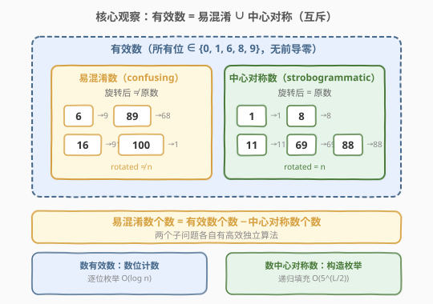
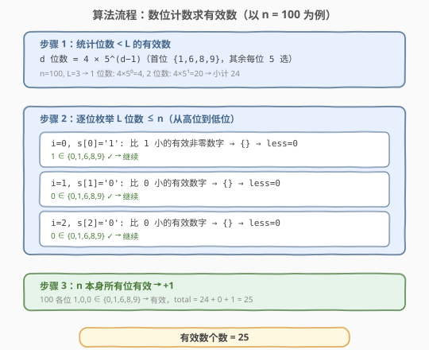
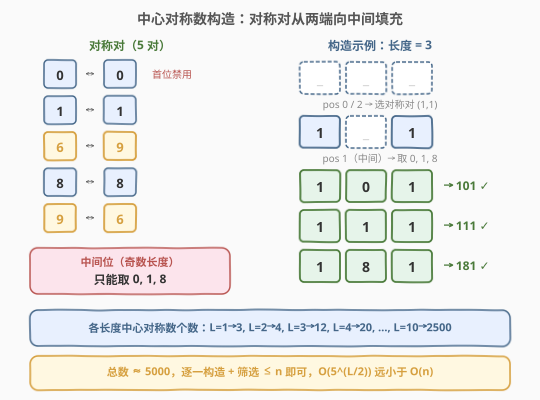
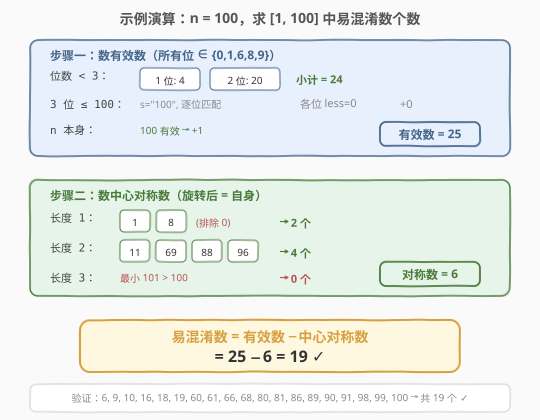

# 易混淆数 II

- **题目名称**：易混淆数 II
- **链接**：[1088. 易混淆数 II](https://leetcode.cn/problems/confusing-number-ii/)
- **难度**：困难
- **标签**：数学、数位 DP、回溯

## 1. 题目概述

给定一个正整数 `n`，返回区间 $[1, n]$ 内**易混淆数**（confusing number）的个数。

一个数是易混淆数，当且仅当把它**旋转 180°** 后得到一个**与原数不同**的新数，且每一位数字旋转后仍然合法。这与 [1056. 易混淆数](1056_易混淆数.md) 的判定规则完全相同，区别在于本题要求**统计个数**而非判定单个数。

| 原数字 | 旋转后 | 说明 |
|--------|--------|------|
| `0` | `0` | 合法（不变） |
| `1` | `1` | 合法（不变） |
| `6` | `9` | 合法（互换） |
| `8` | `8` | 合法（不变） |
| `9` | `6` | 合法（互换） |
| `2` `3` `4` `5` `7` | — | **非法** |

**示例 1**：

```text
输入：n = 20
输出：6
解释：[1, 20] 中的易混淆数为 6, 9, 10, 16, 18, 19，共 6 个。
```

**示例 2**：

```text
输入：n = 100
输出：19
解释：[1, 100] 中有 19 个易混淆数。
```

**约束条件**：

- $1 \le n \le 10^9$

> ⚠️ **规模关键**：$n$ 可达 $10^9$（10 位数字），暴力逐个检查 $O(n \log n)$ 必然超时，必须利用旋转映射的结构性质将搜索空间压缩到 $O(\log n)$ 级别。

---

## 2. 解题思路

### 2.1 暴力思路：逐个检查

最直观的做法是复用 [1056](1056_易混淆数.md) 的判定逻辑，遍历 $[1, n]$ 中每个数逐个检查：

```python
count = 0
for i in range(1, n + 1):
    if is_confusing(i):
        count += 1
```

但 $n \le 10^9$，即使每次判定 $O(\log n)$，总复杂度 $O(n \log n) \approx 10^{10}$，必然超时。**关键瓶颈**在于：绝大多数数（含 `2/3/4/5/7` 的数）根本不可能是易混淆数，却被逐一检查。

### 2.2 核心观察：容斥分解 — 有效数 = 易混淆 + 中心对称



一个数能成为易混淆数的前提是**所有位都属于 $\{0, 1, 6, 8, 9\}$**——我们称这类数为**有效数**（valid number）。对于有效数，旋转后的结果一定也合法。此时只有两种可能：

1. **旋转后 $\neq$ 原数** → 易混淆数（confusing）
2. **旋转后 $=$ 原数** → 中心对称数（strobogrammatic），如 `69`、`88`、`101`

两者**互斥**且**并集 = 全部有效数**。因此：

$$\text{易混淆数个数} = \text{有效数个数} - \text{中心对称数个数}$$

> 💡 **为什么这个分解有效？** 直接数易混淆数需要对每个有效数做旋转比较，而数有效数和数中心对称数各自有高效的独立算法——前者用**数位计数**，后者用**构造枚举**。两个子问题都比原问题更结构化。

**两个子问题的规模**：

| 子问题 | 方法 | 规模 |
|--------|------|------|
| 数有效数 $\le n$ | 数位计数（逐位枚举） | $O(\log n)$，只需遍历 $n$ 的各位 |
| 数中心对称数 $\le n$ | 构造枚举（递归填充对称对） | $O(5^{L/2})$，$L \le 10$ 时仅约 $2500$ 个 |

### 2.3 子问题一：数位计数求有效数



设 $n$ 的字符串表示为 $s$，长度为 $L$。有效数的每一位只能取 $\{0, 1, 6, 8, 9\}$，且首位不能为 $0$。

**计数策略**：逐位确定，对每一位枚举「比 $s[i]$ 小的有效数字」，剩余位自由取值。

1. **位数 $< L$ 的有效数**：$d$ 位数有 $4 \times 5^{d-1}$ 个（首位 4 选 $\{1,6,8,9\}$，其余每位 5 选）。对 $d = 1, \ldots, L-1$ 求和。

2. **位数 $= L$ 且 $\le n$ 的有效数**：从高位到低位逐位处理。对于第 $i$ 位：
   - 统计有效数字中**严格小于** $s[i]$ 的个数 `less`（首位排除 $0$）；
   - 这些选择的剩余 $L - i - 1$ 位可任取有效数字，贡献 `less * 5^(L-i-1)`；
   - 若 $s[i]$ 本身不是有效数字（或首位为 $0$），后续无法继续匹配，直接返回当前累计值。

3. **$n$ 本身有效**：若所有位都通过检查，$n$ 本身也是有效数，加 1。

> 💡 **与数位 DP 的关系**：这本质上是数位 DP 的「逐位累加」写法，省去了记忆化表。因为有效数字集合固定且小（5 个），逐位枚举即可，无需状态压缩。

### 2.4 子问题二：构造枚举中心对称数



中心对称数（strobogrammatic number）旋转 180° 后与自身相同。它的结构天然对称：第 $i$ 位与第 $L - 1 - i$ 位构成**对称对**，中间位（若长度为奇数）必须取不变数字 $\{0, 1, 8\}$。

**构造方法**：递归地从两端向中间填充。

- **对称对**：`0-0`、`1-1`、`6-9`、`8-8`、`9-6`（共 5 对）
- **中间位**（仅奇数长度）：`0`、`1`、`8`（必须旋转不变）
- **首位非零**：长度 $> 1$ 时，最外层对称对不能是 `0-0`

```text
长度 3 的构造过程：
  第 0 位 / 第 2 位：取对称对 (1,1) → 1 _ 1
  第 1 位（中间）：取 0 → 101  ✓
                  取 1 → 111  ✓
                  取 8 → 181  ✓
  对称对 (6,9) → 6 _ 9
  中间取 0 → 609, 取 1 → 619, 取 8 → 689  ...
```

对所有长度 $1 \sim L$ 的中心对称数构造完毕后，转换为整数，统计 $\le n$ 的个数即可。

> ⚠️ **效率保证**：$L \le 10$ 时，中心对称数总数约 $5000$ 个，构造 + 筛选的代价可忽略不计。

### 2.5 示例演算



以 $n = 100$ 为例，$s = \texttt{"100"}$，$L = 3$。

**步骤一：数有效数**

| 阶段 | 计算 | 小计 |
|------|------|------|
| 1 位数 | $4 \times 5^0 = 4$（`1, 6, 8, 9`） | 4 |
| 2 位数 | $4 \times 5^1 = 20$（首位 4 选，个位 5 选） | 20 |
| 3 位数 $\le 100$ | 第 0 位 $s[0]=1$：比 1 小的有效非零数字 → 无 → $0 \times 5^2 = 0$；1 有效，继续。第 1 位 $s[1]=0$：比 0 小的有效数字 → 无 → $0 \times 5^1 = 0$；0 有效，继续。第 2 位 $s[2]=0$：比 0 小 → 无 → $0 \times 5^0 = 0$；0 有效，继续。 | 0 |
| $n$ 本身 | `100` 各位均在 $\{0,1,6,8,9\}$ → 有效，+1 | 1 |
| **合计** | | **25** |

**步骤二：数中心对称数 $\le 100$**

| 长度 | 构造结果 | $\le 100$ 的个数 |
|------|----------|-------------------|
| 1 | `0, 1, 8` | 2（排除 0） |
| 2 | `11, 69, 88, 96` | 4 |
| 3 | `101, 111, 181, 609, ...` | 0（最小 101 > 100） |
| **合计** | | **6** |

**步骤三：相减**

$$\text{易混淆数} = 25 - 6 = 19$$

与示例 2 的预期输出一致 ✓

---

## 3. 参考代码

### C++

```cpp
class Solution {
  public:
    int confusingNumberII(int n) {
        return countValid(n) - countStrobogrammatic(n);
    }

  private:
    int countValid(int n) {
        string s = to_string(n);
        int L = s.size();
        int validDigits[] = {0, 1, 6, 8, 9};

        int total = 0;
        for (int d = 1; d < L; d++) {
            total += 4 * (int)pow(5, d - 1);
        }

        for (int i = 0; i < L; i++) {
            int digit = s[i] - '0';
            int less = 0;
            for (int d : validDigits) {
                if (d < digit && (i > 0 || d > 0))
                    less++;
            }
            total += less * (int)pow(5, L - i - 1);

            bool isValid = (digit == 0 || digit == 1 || digit == 6 ||
                            digit == 8 || digit == 9);
            if (!isValid || (i == 0 && digit == 0))
                return total;
        }
        return total + 1;
    }

    int countStrobogrammatic(int n) {
        int L = to_string(n).size();
        int count = 0;
        for (int len = 1; len <= L; len++) {
            string s(len, ' ');
            dfs(0, len - 1, s, n, len, count);
        }
        return count;
    }

    void dfs(int left, int right, string& s, int n, int len, int& count) {
        if (left > right) {
            long long val = stoll(s);
            if (val >= 1 && val <= n)
                count++;
            return;
        }
        vector<pair<char, char>> pairs = {
            {'0', '0'}, {'1', '1'}, {'6', '9'}, {'8', '8'}, {'9', '6'}};
        for (auto& [a, b] : pairs) {
            if (left == right && a != b)
                continue;
            if (left == 0 && a == '0' && len > 1)
                continue;
            s[left] = a;
            s[right] = b;
            dfs(left + 1, right - 1, s, n, len, count);
        }
    }
};
```

> ⚠️ **`stoll` 而非 `stoi`**：$n \le 10^9$，中心对称数可达 $9999999999$（10 位，超过 `INT_MAX`），用 `long long` + `stoll` 避免溢出。

### Python

```python
class Solution:
    def confusingNumberII(self, n: int) -> int:
        return self._count_valid(n) - self._count_strobogrammatic(n)

    def _count_valid(self, n: int) -> int:
        s = str(n)
        L = len(s)
        valid = [0, 1, 6, 8, 9]

        total = 0
        for d in range(1, L):
            total += 4 * (5 ** (d - 1))

        for i in range(L):
            digit = int(s[i])
            less = sum(1 for d in valid if d < digit and (i > 0 or d > 0))
            total += less * (5 ** (L - i - 1))
            if digit not in valid or (i == 0 and digit == 0):
                return total

        return total + 1

    def _count_strobogrammatic(self, n: int) -> int:
        L = len(str(n))
        count = 0
        pairs = [('0', '0'), ('1', '1'), ('6', '9'), ('8', '8'), ('9', '6')]

        def dfs(left: int, right: int, s: list) -> None:
            nonlocal count
            if left > right:
                val = int(''.join(s))
                if 1 <= val <= n:
                    count += 1
                return
            for a, b in pairs:
                if left == right and a != b:
                    continue
                if left == 0 and a == '0' and len(s) > 1:
                    continue
                s[left] = a
                s[right] = b
                dfs(left + 1, right - 1, s)

        for length in range(1, L + 1):
            dfs(0, length - 1, [''] * length)

        return count
```

> 💡 **Python 无溢出问题**：整数无限精度，`int(''.join(s))` 直接得到任意大整数。`nonlocal count` 在嵌套函数中修改外层变量。

---

## 4. 复杂度分析

| 维度 | 复杂度 | 说明 |
|------|--------|------|
| 时间复杂度 | $O(\log n + 5^{L/2})$ | 数位计数 $O(L) = O(\log n)$；中心对称数构造 $O(5^{L/2})$，$L \le 10$ 时约 $2500$ 个 |
| 空间复杂度 | $O(L)$ | 数位计数用 $O(L)$ 存字符串；中心对称数 DFS 递归深度 $O(L/2)$ |

> 💡 **与暴力法的对比**：暴力法 $O(n \log n) \approx 10^{10}$；本方法 $O(\log n + 5^5) \approx O(3125)$，快了 $6$ 个数量级。即使 $n = 10^9$，也能在毫秒级完成。

---

## 5. 扩展：DFS 直接枚举法

另一种思路是**直接 DFS 枚举所有有效数**（数字只从 $\{0, 1, 6, 8, 9\}$ 中选取），对每个数检查是否易混淆：

```python
class Solution:
    def confusingNumberII(self, n: int) -> int:
        m = {0: 0, 1: 1, 6: 9, 8: 8, 9: 6}

        def dfs(current: int) -> int:
            if current > n:
                return 0
            count = 0
            if current > 0:
                rotated, temp = 0, current
                while temp > 0:
                    rotated = rotated * 10 + m[temp % 10]
                    temp //= 10
                if rotated != current:
                    count += 1
            for d in (0, 1, 6, 8, 9):
                if current == 0 and d == 0:
                    continue
                count += dfs(current * 10 + d)
            return count

        return dfs(0)
```

- **优点**：代码简洁直观，无需分拆为两个子问题。
- **缺点**：搜索空间 $5^{10} \approx 10^7$，Python 下可能超时；C++ 可通过（约 100ms）。
- **适用场景**：$n$ 较小或语言执行速度快时优先考虑。

> 💡 **本题为何选择容斥分解**：分解后两个子问题各自只有 $O(\log n)$ 和 $O(5^{L/2})$ 的复杂度，远优于 DFS 的 $O(5^L)$，且 Python / C++ 均可轻松通过。

---

## 6. 面试要点

1. **为什么要用容斥分解而不是直接 DFS 枚举？**

   - 直接 DFS 枚举所有有效数的时间复杂度为 $O(5^L) \approx 10^7$（$L = 10$），Python 下可能超时。容斥分解后，数有效数只需 $O(L)$ 的数位计数，数中心对称数只需 $O(5^{L/2}) \approx 3125$，总复杂度降至 $O(\log n)$ 级别，快了约 $4$ 个数量级。

2. **「有效数 = 易混淆 + 中心对称」这个等式为什么成立？**

   - 有效数要求所有位在 $\{0, 1, 6, 8, 9\}$ 中，旋转后一定合法。旋转结果只有两种：等于原数（中心对称）或不等于原数（易混淆）。两者互斥且覆盖全部有效数，故可直接相减。

3. **数位计数中如何处理「首位不能为零」？**

   - 在统计比 $s[i]$ 小的有效数字时，若 $i = 0$（首位），排除 $d = 0$。这保证了 $L$ 位数没有前导零。对于位数 $< L$ 的有效数，首位固定从 $\{1, 6, 8, 9\}$ 中选（4 个），天然不含零。

4. **中心对称数的构造为什么从两端向中间填充？**

   - 中心对称数要求第 $i$ 位与第 $L - 1 - i$ 位构成旋转对称对。从两端向中间填充时，外层选对称对 `(a, b)`，内层递归处理剩余子串。奇数长度的中间位必须取旋转不变的 $\{0, 1, 8\}$。这种结构保证了构造出的数天然是中心对称的。

5. **C++ 中为什么用 `long long` 和 `stoll`？**

   - $n \le 10^9$（10 位数），中心对称数可达 $9999999999$（超过 `INT_MAX` $\approx 2.1 \times 10^9$）。用 `long long` 接收 `stoll` 的结果避免溢出。Python 无此问题。

---

## 7. 同类练习题

- [1056. 易混淆数](https://leetcode.cn/problems/confusing-number/)（[题解](1056_易混淆数.md)）：本题的基础版，判定单个数是否易混淆，逐位映射 + 反序比较
- [246. 中心对称数](https://leetcode.cn/problems/strobogrammatic-number/)：判定单个数是否中心对称，与 1056 共享映射表但判定方向相反（`rotated == n`）
- [247. 中心对称数 II](https://leetcode.cn/problems/strobogrammatic-number-ii/)：构造所有长度为 $n$ 的中心对称数，本题中心对称数枚举的直接来源
- [248. 中心对称数 III](https://leetcode.cn/problems/strobogrammatic-number-iii/)：统计区间 $[low, high]$ 内的中心对称数个数，可视为本题中「数中心对称数」子问题的推广
- [1012. 至少有 1 位重复的数字](https://leetcode.cn/problems/numbers-at-most-n-given-digit-set/)（[题解](1012_至少有1位重复的数字.md)）：同为「统计 $[1, n]$ 中满足数字约束的数」的数位 DP 问题，容斥思路与本题一致
