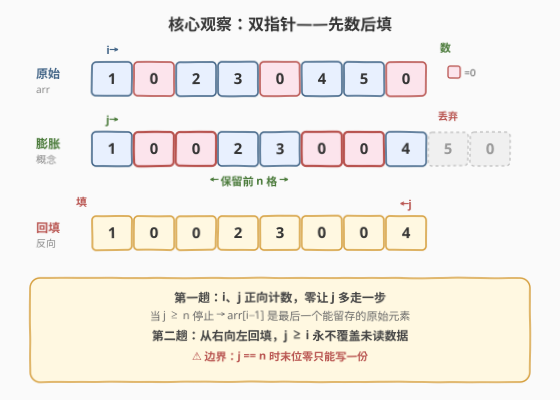
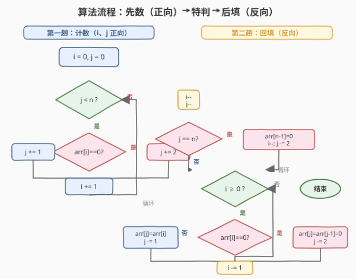

# LeetCode 复写零 题解

## 1. 题目概述

- **标题 / 题号**：复写零（#1089，easy）
- **链接**：https://leetcode.cn/problems/duplicate-zeros/
- **难度**：简单
- **标签**：数组、双指针

**题意**：给定一个**定长**整数数组 `arr`，请你**原地**修改它：从左到右遍历，遇到每个 `0` 就**复写一遍**（即在该位置插入一个额外的 `0`），后续元素因此向右移动。由于数组长度固定，**被挤出右端界的元素直接丢弃**。函数无需返回值。

**示例 1**：

```text
输入：arr = [1,0,2,3,0,4,5,0]
输出：[1,0,0,2,3,0,0,4]
解释：
原数组:  1  0  2  3  0  4  5  0
复写 0:  1  0 [0] 2  3  0 [0] 4 | 5  0 ← 丢弃
结果:    1  0  0  2  3  0  0  4
```

**示例 2**：

```text
输入：arr = [1,2,3]
输出：[1,2,3]
解释：没有 0，数组不变。
```

**约束**：

- $1 \leq \text{arr.length} \leq 10^4$
- $0 \leq \text{arr}[i] \leq 9$

> 💡 **关键直觉**：复写 `0` 会让数组「膨胀」，但定长限制要求我们**只保留前 $n$ 个**。难点在于：若从左向右就地插入，每次插入都会覆盖尚未处理的元素，导致数据丢失。因此需要**先数清哪些元素能留在最终数组里，再从右向左回填**。

## 2. 解题思路

### 2.1 暴力思路

用一个**辅助数组** `result`：遍历 `arr`，非零元素往 `result` 追加一次，零元素追加两次；当 `result` 长度达到 $n$ 即停。最后把 `result` 拷回 `arr`。

- 时间 $O(n)$，空间 $O(n)$（额外数组）。

> 💡 暴力法正确且简单，但题目要求**原地**修改。能否做到 $O(1)$ 额外空间？难点是「正向插入会覆盖未读数据」。突破口是**反向填充**：先确定最终保留哪些原始元素，再从右端开始写，这样写的位置永远在被读位置的右侧，不会破坏未读数据。

### 2.2 核心观察：双指针——先数后填



用两个「计数指针」模拟膨胀过程，**不真正写入**，只统计：

- `i`：在**原始**数组中走过的下标（读指针）。
- `j`：在**膨胀后**数组中走过的下标（写指针的预期位置）。

**第一趟（数）**：`i`、`j` 都从 `0` 出发。遇到非零，`j` 走 `1` 步；遇到零，`j` 走 `2` 步（复写占两格）。`i` 每次都走 `1` 步。当 `j` 首次达到 $\geq n$ 时停止——此时 `arr[i-1]` 是**最后一个能完整留在结果中的原始元素**。

> ⚠️ **边界陷阱**：若 `j` 因复写零而**恰好超出 1 格**（`j == n`，即第二个零的副本被挤出），则该零只能写入一份。此时需特判：把最后一个位置填 `0`，并让 `i`、`j` 各退回该零之前继续回填。

**第二趟（填）**：`i`、`j` 各减 `1` 指向各自末位，**从右向左**回填：

- `arr[i] == 0`：在 `j` 和 `j-1` 两处各写一个 `0`，`j -= 2`。
- 否则：`arr[j] = arr[i]`，`j -= 1`。
- `i` 每步减 `1`，直到 `i < 0`。

由于写入位置 `j` 始终 $\geq$ 读取位置 `i`（膨胀只会让位置变大），**回填不会覆盖未读数据**，原地安全。

### 2.3 算法流程图



**第一趟——计数**：

```
i = 0, j = 0
while j < n:
    if arr[i] == 0:  j += 2     # 零占两格
    else:            j += 1     # 非零占一格
    i += 1
# 循环结束时 i 指向"最后一个被消费的原始元素"的下一个位置
```

**边界特判**：

```
i -= 1                  # i 指向最后一个原始元素
j -= 1                  # j 指向最后一个写位置（n-1 或 n）
if j == n:              # 最后一个零的副本被挤出，只能写一份
    arr[n-1] = 0
    i -= 1
    j -= 2
```

**第二趟——回填**：

```
while i >= 0:
    if arr[i] == 0:
        arr[j] = 0; arr[j-1] = 0
        j -= 2
    else:
        arr[j] = arr[i]
        j -= 1
    i -= 1
```

### 2.4 示例演算

![示例演算：arr=[1,0,2,3,0,4,5,0]，先数出 i=6/j=8，再从右向左回填](../images/dupzeros_example_walkthrough.svg)

以 `arr = [1,0,2,3,0,4,5,0]`，$n = 8$ 为例。

**第一趟——计数**：

| 步 | i | j | arr[i] | j 增量 | 新 j | 说明 |
|----|---|---|--------|--------|------|------|
| 0 | 0 | 0 | 1 | +1 | 1 | 非零，j 走 1 |
| 1 | 1 | 1 | 0 | +2 | 3 | 零，j 走 2 |
| 2 | 2 | 3 | 2 | +1 | 4 | 非零 |
| 3 | 3 | 4 | 3 | +1 | 5 | 非零 |
| 4 | 4 | 5 | 0 | +2 | 7 | 零，j 走 2 |
| 5 | 5 | 7 | 4 | +1 | 8 | 非零，j 到 8 ≥ n，停 |

循环结束 `i = 6, j = 8`。回退后 `i = 5, j = 7`，`j == n`? `7 ≠ 8`，无特判。

**第二趟——从右向左回填**（`j ≥ i` 恒成立，回填不破坏未读数据）：

| 步 | i | j | arr[i] | 操作 | 数组状态 | 新 j |
|----|---|---|--------|------|----------|------|
| 1 | 5 | 7 | 4 | 写 4 | [1,0,2,3,0,4,5,**4**] | 6 |
| 2 | 4 | 6 | 0 | 写两个 0 | [1,0,2,3,0,**0,0**,4] | 4 |
| 3 | 3 | 4 | 3 | 写 3 | [1,0,2,3,**3**,0,0,4] | 3 |
| 4 | 2 | 3 | 2 | 写 2 | [1,0,2,**2**,3,0,0,4] | 2 |
| 5 | 1 | 2 | 0 | 写两个 0 | [1,**0,0**,2,3,0,0,4] | 0 |
| 6 | 0 | 0 | 1 | 写 1 | [**1**,0,0,2,3,0,0,4] | −1 |

最终 `arr = [1,0,0,2,3,0,0,4]`，与示例一致。

## 3. 参考代码

### C++

```cpp
class Solution {
  public:
    void duplicateZeros(vector<int>& arr) {
        int n = arr.size();
        int i = 0, j = 0;
        // 第一趟：数清哪些原始元素能留在前 n 格
        while (j < n) {
            if (arr[i] == 0) j += 2;  // 零占两格
            else             j += 1;  // 非零占一格
            ++i;
        }
        --i;  // 最后一个被消费的原始元素
        --j;  // 最后一个写位置
        // 边界：最后一个零的副本被挤出，只能写一份
        if (j == n) {
            arr[n - 1] = 0;
            --i;
            j -= 2;
        }
        // 第二趟：从右向左回填
        while (i >= 0) {
            if (arr[i] == 0) {
                arr[j--] = 0;
                arr[j--] = 0;
            } else {
                arr[j--] = arr[i];
            }
            --i;
        }
    }
};
```

### Python

```python
class Solution:
    def duplicateZeros(self, arr: List[int]) -> None:
        n = len(arr)
        i = j = 0
        while j < n:
            if arr[i] == 0:
                j += 2
            else:
                j += 1
            i += 1
        i -= 1
        j -= 1
        if j == n:            # 末位零的副本被挤出
            arr[n - 1] = 0
            i -= 1
            j -= 2
        while i >= 0:
            if arr[i] == 0:
                arr[j] = 0
                arr[j - 1] = 0
                j -= 2
            else:
                arr[j] = arr[i]
                j -= 1
            i -= 1
```

## 4. 复杂度分析

| 维度 | 复杂度 | 说明 |
|------|--------|------|
| 时间复杂度 | $O(n)$ | 两趟线性扫描，每趟最多走 $n$ 步 |
| 空间复杂度 | $O(1)$ | 仅用 `i`、`j` 两个整型变量，原地修改 |

## 5. 扩展：辅助数组法（O(n) 空间，面试快速 AC）

若面试不强调原地，可用辅助数组一趟完成，逻辑更简单、不易出 bug：

```cpp
class Solution {
  public:
    void duplicateZeros(vector<int>& arr) {
        int n = arr.size();
        vector<int> res;
        res.reserve(n);
        for (int x : arr) {
            if (res.size() >= n) break;
            res.push_back(x);
            if (x == 0 && res.size() < n) res.push_back(0);
        }
        arr = res;
    }
};
```

| 维度 | 双指针原地 | 辅助数组 |
|------|-----------|---------|
| 时间 | $O(n)$ | $O(n)$ |
| 空间 | $O(1)$ | $O(n)$ |
| 代码量 | 稍多，需处理边界 | 简洁直观 |
| 适用 | 题目明确要求原地 | 快速 AC、对拍验证 |

> 💡 **面试策略**：先讲辅助数组法确保正确性，再优化到双指针原地法展示对边界与原地操作的理解。

## 6. 面试要点

1. **为什么不能从左向右就地插入？**
   - 从左向右插入 `0` 会把右侧尚未处理的元素覆盖掉，造成数据丢失。除非每次插入后整体右移（$O(n^2)$），否则无法保证正确。

2. **为什么从右向左回填是安全的？**
   - 膨胀只会让写位置 `j` $\geq$ 读位置 `i`。从右向左写时，被覆盖的位置都在 `i` 右侧，而我们从 `i` 读数据，因此不会破坏未读数据。

3. **第一趟计数循环结束条件为什么是 `j < n`？**
   - `j` 模拟膨胀后的写位置。当 `j` 首次达到 $\geq n$，说明前 $n$ 格已被填满，之后的原始元素都会被挤出，无需再考虑。此时 `arr[i-1]` 是最后一个能留存的原始元素。

4. **`j == n` 的边界特判在处理什么情况？**
   - 当最后一个被消费的是 `0`，其第二个副本会让 `j` 恰好等于 $n$（超出 1 格）。该副本放不下，只能在末位写一个 `0`，然后跳过这个零继续回填前面的元素。

5. **双指针法中 `i` 和 `j` 的关系是什么？**
   - `i` 是原始数组的读游标，`j` 是膨胀后数组的写游标。两者同步前进但步长不同（零让 `j` 多走一步）。回填时 `j` 永远不落后于 `i`，保证了原地写入的安全性。

## 同类练习题

| # | 题目 | 与本题的关联 |
|---|------|-------------|
| 27 | [移除元素](https://leetcode.cn/problems/remove-element/) | 快慢双指针原地删除，同样是「读/写分离」的双指针范式，方向相反（本题正向数、反向填） |
| 88 | [合并两个有序数组](https://leetcode.cn/problems/merge-sorted-array/) | 从右向左回填避免覆盖，与本题第二趟反向填充思想一致 |
| 977 | [有序数组的平方](https://leetcode.cn/problems/squares-of-a-sorted-array/) | 对撞双指针从两端向中间/反向填结果，反向填充的另一种形态 |
| 283 | [移动零](https://leetcode.cn/problems/move-zeroes/) | 快慢双指针保持相对顺序处理零元素，对照本题的「复写零」（一个删除零、一个复制零） |
