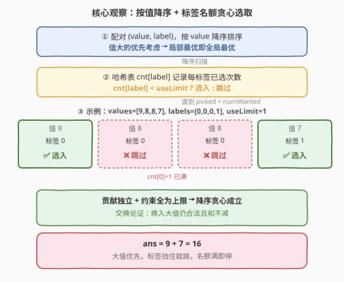
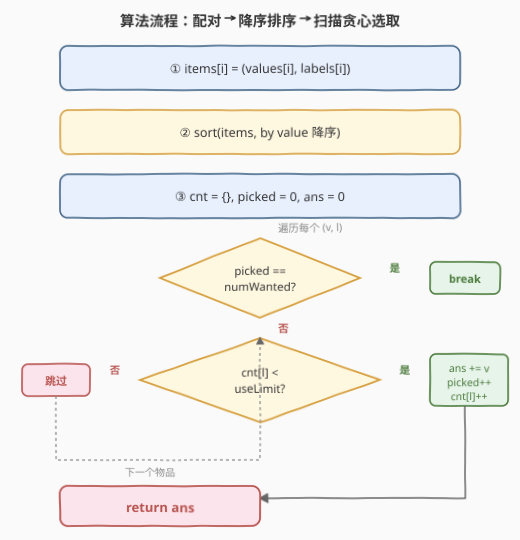
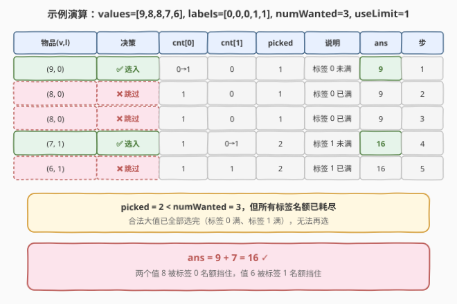

# 受标签影响的最大值

- **题目名称**：受标签影响的最大值
- **链接**：[1090. 受标签影响的最大值](https://leetcode.cn/problems/largest-values-from-labels/)
- **难度**：中等
- **标签**：贪心、数组、排序、哈希表

## 1. 题目概述

给定两个等长整数数组 `values` 和 `labels`（长度均为 $n$），以及两个整数 `numWanted` 和 `useLimit`。`values[i]` 与 `labels[i]` 共同描述第 $i$ 个物品的**值**与**标签**。需要从中选出一个子集，使值的和最大，且满足：

- 子集大小**至多**为 `numWanted`；
- **同一标签**的物品在子集中出现的次数**至多**为 `useLimit`。

返回最大可能的和。

**示例 1**：

```text
输入：values = [5,4,3,2,1], labels = [1,1,2,2,3], numWanted = 3, useLimit = 1
输出：9
解释：选第 1、3、5 个物品（值 5、3、1），标签 1、2、3 各出现一次，和 = 9。
```

**示例 2**：

```text
输入：values = [5,4,3,2,1], labels = [1,3,3,3,2], numWanted = 3, useLimit = 2
输出：12
解释：选第 1、2、3 个物品（值 5、4、3），标签 1 出现一次、标签 3 出现两次（=useLimit），和 = 12。
```

**示例 3**：

```text
输入：values = [9,8,8,7,6], labels = [0,0,0,1,1], numWanted = 3, useLimit = 1
输出：16
解释：选第 1、4 个物品（值 9、7），标签 0、1 各一次；第 2、3 个值虽大但标签 0 已满，和 = 16。
```

**约束条件**：

- $n == \text{values.length} == \text{labels.length}$
- $1 \le n \le 2 \times 10^4$
- $0 \le \text{values[i]},\ \text{labels[i]} \le 2 \times 10^4$
- $1 \le \text{numWanted},\ \text{useLimit} \le n$

> 💡 **关键直觉**：两个约束都是**上限**（至多 `numWanted` 个、同标签至多 `useLimit` 个），且每个物品的值**独立**、不随选择顺序变化。这正是「**按值降序贪心选取**」的信号——优先拿大值，被同标签名额挡住就跳过。

---

## 2. 解题思路

### 2.1 暴力思路：枚举子集

从 $n$ 个物品中枚举所有大小 $\le \text{numWanted}$ 的子集，逐一检查同标签计数是否 $\le \text{useLimit}$，取合法子集的最大和。$n = 2 \times 10^4$ 时子集数达组合级，完全不可行。

> 💡 暴力的浪费在于：**物品之间没有耦合**——选不选某物品只取决于「它是不是剩余可用名额中值最大的」。把选择顺序按值排好，贪心一趟即可。

### 2.2 核心观察：按值降序 + 标签名额贪心



两个约束都只是上限，且**每个物品的贡献（值）独立于其他物品**。这意味着：

1. **值大的应优先选**：若一个值大的物品合法（其标签名额未满、总名额未满），不选它而去选一个值小的，必然不优——交换二者立刻得到更大的和。
2. **标签名额是唯一障碍**：按值降序扫描时，唯一可能跳过一个物品的原因是「它的标签已经用满 `useLimit` 次」。

因此贪心策略成立：

> **将物品按** `values` **降序排序**，依次扫描；维护一个哈希表 `cnt[label]` 记录每个标签已选次数。对每个物品，若 `cnt[label] < useLimit` 且已选数 `< numWanted`，则选入（累加值、计数自增、标签计数自增）；否则跳过。

> ⚠️ **为什么贪心一定最优？** 可用**交换论证**：设最优解 $O$ 选了物品集合 $S_O$，贪心解 $G$ 选了 $S_G$。若两者不同，设 $S_G$ 中第一个与 $S_O$ 不同的选择是贪心选了值 $v_g$、最优未选；而最优在后续选了某个 $v_o \le v_g$（因为贪心按降序扫描，$v_g$ 先出现且合法）。把 $O$ 中的 $v_o$ 换成 $v_g$ 仍合法（标签名额不超，因为贪心选 $v_g$ 时其标签合法），且和不变小。反复交换可将 $O$ 转化为 $G$ 而和不减，故贪心最优。

### 2.3 算法流程图



流程要点：

- **第一步**：将 `values[i]` 与 `labels[i]` 配成 $(value, label)$ 二元组。
- **第二步**：按 `value` **降序**排序（值大的在前，优先被考虑）。
- **第三步**：初始化哈希表 `cnt`（标签→已选次数）、计数器 `picked = 0`、答案 `ans = 0`。
- **第四步**：遍历排序后的二元组，对每个 $(v, l)$：
  - 若 `picked == numWanted`：提前终止（名额已满）。
  - 若 `cnt[l] < useLimit`：选入 → `ans += v`、`picked += 1`、`cnt[l] += 1`。
  - 否则：跳过（该标签名额已满）。

> 💡 **提前终止**：一旦 `picked` 达到 `numWanted` 即可 `break`，无需扫描剩余物品。最坏情况（所有大值都被标签挡住）仍遍历全表，但 $O(n)$ 线性扫描代价远低于排序。

### 2.4 示例演算

以示例 3 `values = [9,8,8,7,6], labels = [0,0,0,1,1], numWanted = 3, useLimit = 1` 为例：



| 步骤 | 物品 (值,标签) | cnt[0] | cnt[1] | picked | 决策 | ans |
|------|---------------|--------|--------|--------|------|-----|
| 1 | (9, 0) | 0→1 | 0 | 1 | ✅ 选入（标签 0 未满） | 9 |
| 2 | (8, 0) | 1 | 0 | 1 | ❌ 跳过（标签 0 已满 1） | 9 |
| 3 | (8, 0) | 1 | 0 | 1 | ❌ 跳过（标签 0 已满 1） | 9 |
| 4 | (7, 1) | 1 | 0→1 | 2 | ✅ 选入（标签 1 未满） | 16 |
| 5 | (6, 1) | 1 | 1 | 2 | ❌ 跳过（标签 1 已满 1） | 16 |

最终 `picked = 2 < numWanted = 3`，但所有合法名额已耗尽，答案 $= 16$。

> 💡 **对照示例 2**：`useLimit = 2` 时标签 3 可选两次，故 (4,3)、(3,3) 都入选，答案 $= 5+4+3 = 12$。可见 `useLimit` 越大，越能「吃下」同标签的大值。

---

## 3. 参考代码

### C++

```cpp
class Solution {
  public:
    int largestValsFromLabels(vector<int>& values, vector<int>& labels,
                              int numWanted, int useLimit) {
        int n = values.size();
        vector<pair<int, int>> items;
        items.reserve(n);
        for (int i = 0; i < n; ++i)
            items.emplace_back(values[i], labels[i]);
        // 按值降序排序
        sort(items.begin(), items.end(),
             [](const pair<int, int>& a, const pair<int, int>& b) {
                 return a.first > b.first;
             });
        unordered_map<int, int> cnt;
        int ans = 0, picked = 0;
        for (auto& [v, l] : items) {
            if (picked == numWanted) break;
            if (cnt[l] < useLimit) {
                cnt[l]++;
                ans += v;
                picked++;
            }
        }
        return ans;
    }
};
```

### Python

```python
class Solution:
    def largestValsFromLabels(self, values: List[int], labels: List[int],
                              numWanted: int, useLimit: int) -> int:
        items = sorted(zip(values, labels), key=lambda x: -x[0])
        cnt = defaultdict(int)
        ans = picked = 0
        for v, l in items:
            if picked == numWanted:
                break
            if cnt[l] < useLimit:
                cnt[l] += 1
                ans += v
                picked += 1
        return ans
```

> ⚠️ **易错点**：排序必须按 `value` **降序**。若误写成升序，会优先选小值、把大值留给后面却可能被标签名额挡掉，得到错误答案。C++ 中用 `a.first > b.first`（`sort` 第三参数返回 `true` 表示 `a` 应排在 `b` 前），Python 用 `key=lambda x: -x[0]` 或 `reverse=True`。

---

## 4. 复杂度分析

| 维度 | 复杂度 | 说明 |
|------|--------|------|
| 时间复杂度 | $O(n \log n)$ | 排序主导；后续线性扫描 $O(n)$ |
| 空间复杂度 | $O(n)$ | 配对数组 $O(n)$ + 哈希表最坏 $O(n)$ 个不同标签 |

> 💡 $n \le 2 \times 10^4$，$n \log n \approx 2 \times 10^4 \times 15 \approx 3 \times 10^5$，非常快。哈希表标签数最坏 $n$ 个不同值，但每个只存一个 `int`，内存开销可忽略。

---

## 5. 扩展：标签带权重时的失效边界

本题贪心成立的前提是**每个物品的贡献独立**——值是固定常数，不受「同标签已选多少」影响。若把题意改为「同一标签选第 $k$ 个时值打折扣（如 $v / k$）」，则物品贡献**依赖于已选同标签数**，贪心的交换论证失效（换入一个大值可能压低同组后续折扣），需上 DP 或带权二分图匹配。

另一个变体是**标签互斥**（同标签至多选一个、或部分标签两两不能共存），此时退化为带冲突的选最大 $k$ 问题，贪心不再够用，需最大权独立集等图算法。

> 💡 **贪心识别信号**：约束全是「**至多**」型上限 + 物品贡献**独立**常数 → 降序贪心选取 + 名额哈希。一旦贡献与已选状态耦合，立刻切换到 DP。

---

## 6. 面试要点

1. **为什么按值降序贪心选取一定最优？**

   - 交换论证：设最优解 $O$ 与贪心解 $G$ 在某处不同——贪心选了 $v_g$、最优选了更靠后的 $v_o \le v_g$。把 $O$ 中的 $v_o$ 换成 $v_g$ 仍合法（贪心选 $v_g$ 时其标签名额未满，故 $O$ 换入后也不超限），且和不减。反复交换将 $O$ 转化为 $G$，故 $G$ 最优。

2. **为什么不需要关心同值物品的相对顺序？**

   - 值相同的物品无论谁先被扫描，只要其标签名额未满都会被选入；若名额已满则都被跳过。同值物品互换不改变总和，排序稳定性无关。

3. **`useLimit` 与 `numWanted` 谁更紧？**

   - 二者独立起作用：`numWanted` 限制总选取数（提前终止条件），`useLimit` 限制单标签选取数（跳过条件）。最终 `picked` 可能小于 `numWanted`（如示例 3，标签名额先耗尽），此时答案仍正确——所有合法大值已选完。

4. **哈希表能否换成数组？**

   - 可以。约束 `labels[i] <= 2*10^4`，故可用 `int cnt[20001]` 定长数组代替 `unordered_map`，常数更小。但哈希表写法更通用，能应对标签为任意大整数或字符串的情形。

5. **若 `numWanted >= n` 会怎样？**

   - 等价于「无总数限制」，只受 `useLimit` 约束。贪心会一直扫描到表尾，把所有标签名额未满的物品都选入，答案 $= \sum_{l} \sum_{\text{该标签前 } \text{useLimit} \text{ 大值}} v$。

---

## 7. 同类练习题

- [455. 分发饼干](https://leetcode.cn/problems/assign-cookies/)（[题解](../0401-0500/455_分发饼干.md)）：双排序 + 贪心匹配，经典「排序后线性决策」入门题
- [1029. 两地调度](https://leetcode.cn/problems/two-city-scheduling/)（[题解](./1029_两地调度.md)）：差值排序 + 贪心分派，同样利用排序消除选择耦合
- [621. 任务调度器](https://leetcode.cn/problems/task-scheduler/)（[题解](../0601-0700/621_任务调度器.md)）：贪心调度 + 名额计数，构造贪心的另一形态（标签=任务类型，名额=冷却窗口）
- [502. IPO](https://leetcode.cn/problems/ipo/)（[题解](../0501-0600/502_IPO.md)）：排序解锁 + 大顶堆贪心取最大利润，进阶版「按值降序选取」但选取集动态变化
- [1481. 不同整数的最少数目](https://leetcode.cn/problems/least-number-of-unique-integers-after-k-removals/)：按频率升序贪心删除，对照本题「按值降序贪心选取」的镜像（选 vs 删）
